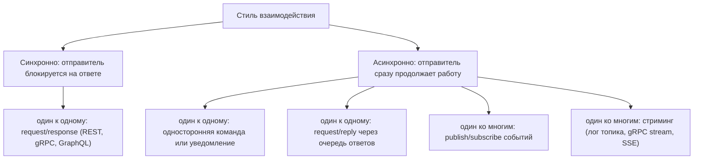
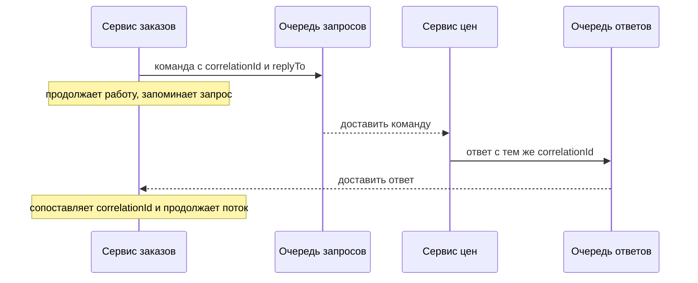
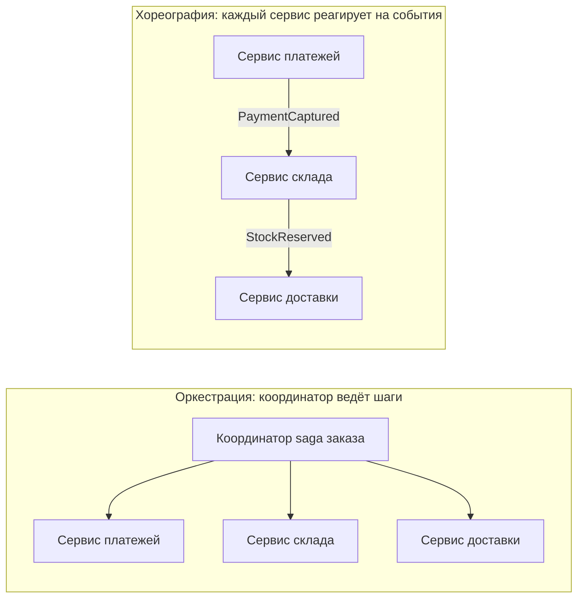

# Типы взаимодействия между микросервисами

Внутри монолита один модуль общается с другим вызовом метода: мгновенно, надёжно, один получатель, одна транзакция. Как только модули становятся отдельными сервисами, этот единственный механизм распадается на целое семейство стилей взаимодействия, и неверный выбор — одна из самых дорогих ошибок в распределённой системе.

Правильный способ ответить на этот вопрос на собеседовании — не перечислять протоколы, а классифицировать взаимодействия по **двум независимым осям**:

1. **Ждёт ли отправитель ответ?** — синхронно или асинхронно.
2. **Сколько получателей у сообщения?** — один к одному или один ко многим.

Всё остальное (REST, gRPC, Kafka, AMQP, WebSocket) — это выбор *транспорта*, сделанный внутри одной из этих ячеек.

Обратите внимание на асимметрию: естественной ячейки «синхронно один ко многим» нет. Вызывающая сторона не может блокироваться на множестве независимых ответов, не изобретя агрегатор scatter-gather, а это по сути композиция вызовов «один к одному».

## 1. Синхронный request/response (один к одному)

Сервис A отправляет запрос и блокирует свой поток выполнения, пока сервис B не ответит. С этого начинают большинство команд: REST по HTTP с JSON, gRPC с protobuf, GraphQL для чтения под форму клиента, а также более старые стеки SOAP/RPC.

Это правильный выбор, когда вызывающая сторона действительно не может продолжать без ответа: проверить токен, прочитать профиль для отрисовки страницы, проверить наличие товара до подтверждения заказа.

Цена — **временная связанность**: оба сервиса должны быть живы и быстры *в один и тот же момент*. Задержка B становится задержкой A, а недоступность B — недоступностью A, если не защитить границу таймаутами, бюджетами повторов, bulkhead и circuit breaker; см. [Таймауты, fallback и circuit breaker](topic:service-timeouts-fallbacks). Длинные синхронные цепочки (A ждёт B, B ждёт C) умножают этот риск и являются классическим способом построить распределённый монолит.

## 2. Асинхронная односторонняя команда или уведомление (один к одному)

Сервис A кладёт сообщение в очередь, адресованное одному логическому потребителю, и идёт дальше. Ответ не ожидается: «отправь это письмо», «сформируй этот отчёт», «переиндексируй этот документ». Брокер держит сообщение, пока потребитель занят или перезапускается, поэтому взаимодействие переживает его временную недоступность.

Каждое сообщение обрабатывает ровно один *экземпляр* потребителя, даже если потребитель развёрнут в десяти репликах — именно это делает взаимодействие «один к одному». Очередь также работает как амортизатор: производители могут выдавать пики, а потребители разбирать их ровным темпом.

Так как доставка обычно at-least-once, потребитель должен быть идемпотентным. Чтобы надёжно опубликовать сообщение вместе с локальным изменением базы, нужен [Outbox pattern](topic:outbox-pattern), а чтобы отбросить повторно доставленное сообщение — [Inbox pattern](topic:inbox-pattern).

## 3. Асинхронный request/reply (один к одному)

Иногда ответ всё же нужен, но держать поток и соединение открытыми в ожидании не хочется. Отправитель публикует запрос с `correlationId` и адресом `replyTo`, запоминает незавершённую работу и продолжает. Ответ приходит позже в очередь ответов и сопоставляется по `correlationId`. Webhook или callback-URL — это тот же приём в HTTP-исполнении.

Так взаимодействие остаётся неблокирующим, но ответ не теряется. Цена — учёт состояния: хранение корреляций, таймауты для ответов, которые так и не пришли, и трассировки, которые теперь охватывают два сообщения вместо одного вызова.

## 4. Publish/subscribe событий (один ко многим)

Публикующий сервис объявляет **факт** — `OrderPlaced`, `PaymentCaptured`, `UserDeleted` — и не знает и не хочет знать, кто его прочитает. Ноль, один или семь сервисов-подписчиков реагируют, каждый со своей копией сообщения. Добавление восьмого потребителя не требует изменений у публикующей стороны — это самая сильная развязка из всех перечисленных стилей.

На собеседовании важны две разновидности:

- **Event notification** — «тонкое» сообщение («заказ 42 изменился»); потребители сами дозапрашивают детали. Маленькая полезная нагрузка, но возвращается синхронный трафик чтения.
- **Event-carrying state transfer** — сообщение содержит данные, нужные потребителям, поэтому они могут работать без обратных вызовов и строить локальную модель чтения. Больше данных и дублирование, зато настоящая независимость по доступности.

Обратная сторона pub/sub в том, что публикующая сторона теряет видимость результата. Никто не сообщит ей, что подписчик упал; это становится эксплуатационной задачей dead-letter очередей, дашбордов лага и алертов.

## 5. Стриминг и долгоживущие каналы

Не каждое взаимодействие — это одно сообщение с одним результатом. Некоторые представляют непрерывный поток: группа потребителей читает лог топика Kafka в своём темпе и может перечитать историю; серверные, клиентские и двунаправленные потоки gRPC; WebSocket или Server-Sent Events, которые пушат обновления подписчику.

Стриминг — естественный стиль для телеметрии, потока цен, обновлений прогресса, change data capture и аналитических конвейеров. Его отличительное свойство — *позиция*: потребитель владеет своим offset, поэтому может отставать, перезапускаться или переобрабатывать прошлое. Выбор брокера здесь очень важен: перечитываемый лог ведёт себя совсем не так, как очередь, удаляющая сообщение после подтверждения; сравнение — в [Kafka vs RabbitMQ](topic:kafka-vs-rabbitmq).

## 6. Косвенное взаимодействие через данные

Два сервиса могут взаимодействовать и вообще не отправляя друг другу сообщений.

- **Общая база данных** — несколько сервисов читают и пишут одни и те же таблицы. Это самый быстрый способ интеграции и почти всегда неправильный: схема становится необъявленным публичным API, её никто не может миграцией изменить, а блокировка или долгая транзакция одного сервиса бьёт по остальным. Это антипаттерн, а не стиль, который стоит предлагать.
- **Общий кэш или общее объектное хранилище** — допустимо в узких случаях (прогретый read-through кэш, большой файл, передаваемый по ссылке, а не в теле сообщения), но это всё равно точка связанности, у которой должен быть владелец.
- **Репликация данных / CDC** — данными владеет один сервис и стримит изменения, чтобы другие строили локальные копии только для чтения. Это дисциплинированная версия «общих данных»: писатель по-прежнему один, а копия явно eventually consistent.
- **Пакетная передача / файлы** — ночные экспорты, ETL-задачи, файлы сверки. Немодно, но вполне живо для отчётности, финансов и интеграции с внешними системами.

## Кто ведёт процесс: оркестрация против хореографии

Как только в процессе участвуют больше двух сервисов, возникает второй вопрос — *кто знает бизнес-процесс?*

**Оркестрация** держит процесс в одном месте: он читаем, его легко наблюдать и менять — ценой компонента, который знает про всех и может стать узким местом. **Хореография** размазывает процесс по подпискам на события: максимальная развязка, но сквозной поток существует только в голове читающего, если не вложиться в трассировку.

И то и другое — способы реально реализовать бизнес-транзакцию через несколько сервисов, потому что межсервисной [ACID](topic:acid-principles)-транзакции не существует: вместо неё получается saga из локальных транзакций плюс компенсирующие действия. Родственная форма композиции — **API composition**: gateway или BFF расходится по нескольким сервисам и собирает один ответ для клиента, что убирает «болтливую» агрегацию из самих доменных сервисов.

## Что означает сообщение: команда, событие, запрос

Ортогонально времени и количеству получателей полезно называть *намерение* сообщения, потому что оно определяет имена и владение:

- **Команда** — «сделай это» (`ReserveStock`). Один предполагаемый обработчик; отправитель ожидает эффекта.
- **Событие** — «это произошло» (`StockReserved`). Неизменяемое прошедшее время, любое число потребителей, отправитель ничего не ожидает.
- **Запрос/документ** — «дай мне это» или «вот данные». Только чтение, без изменения состояния.

Путаница между ними даёт типичный запах: «событие», которое на самом деле замаскированная команда, адресованная одному конкретному сервису. То же разделение чтения и записи встречается и внутри API одного сервиса; см. [REST и разделение ответственности](topic:employee-api-rest-cqrs).

## Ответ на собеседовании за 60 секунд

> Я классифицирую взаимодействия сервисов по двум осям. Первая — **время**: синхронный request/response, где вызывающая сторона ждёт (REST, gRPC, GraphQL), против асинхронного обмена сообщениями, где отправитель передаёт работу и продолжает. Вторая — **количество получателей**: один к одному против один ко многим. Их комбинация даёт практический набор: синхронный request/response; асинхронные односторонние команды в очередь; асинхронный request/reply через очередь ответов и `correlationId`; publish/subscribe доменных событий для многих потребителей; и стриминг через перечитываемый лог или долгоживущий канал. Есть также косвенное взаимодействие через данные — репликация данных или пакетная передача файлов, плюс антипаттерн общей базы. Поверх этого лежит координация: оркестрация, где один координатор ведёт saga, или хореография, где сервисы реагируют на события друг друга. Я выбираю синхронный вариант, когда без ответа нельзя продолжать, и асинхронный — когда работа может завершиться позже, когда нужна рассылка неизвестным заранее потребителям или когда я хочу пережить недоступность другого сервиса.

## Значение на продакшене

**Стиль определяет ваши режимы отказа.** Синхронные взаимодействия падают громко и сразу — таймауты, 5xx, каскадные задержки, — поэтому им нужны таймауты и circuit breaker. Асинхронные падают тихо и позже: рост глубины очереди, лаг потребителя, dead-letter очереди, дубликаты. В зависимости от выбранного стиля вы обязаны следить за совершенно разными сигналами.

**Большинство реальных систем гибридны, и это правильно.** Поток оформления заказа обычно синхронно читает наличие товара, публикует `OrderPlaced` как событие, отправляет письмо-подтверждение односторонней командой и стримит клиенту обновления статуса заказа. Мастерство не в том, чтобы выбрать один стиль, а в том, чтобы провести границу между ними; критерии этого выбора — в [Выборе синхронного или асинхронного взаимодействия](topic:service-communication-choice), а более глубокий разбор компромисса — в [Синхронной и асинхронной коммуникации](topic:sync-vs-async-communication).

**Контракты живут дольше кода.** Каким бы ни был стиль, схема сообщения или эндпоинта — это опубликованный API: ей нужны версионирование, обратно совместимая эволюция и стратегия тестов со стороны потребителя. Асинхронность делает это сложнее, а не проще, потому что сломанная полезная нагрузка проявится у потребителя, которым вы, возможно, не владеете.

**Каждый стиль покупает свой вид развязки.** Асинхронность покупает развязку по *времени* (сосед может быть недоступен). Pub/sub покупает развязку по *идентичности* (вы не знаете своих потребителей). Event-carrying state transfer покупает развязку по *доступности* (не нужно делать обратный вызов). Ни один из них не убирает связанность по схеме и смыслу — это хорошая фраза, которую стоит держать наготове, и тот же тезис звучит в [Зачем нужны микросервисы](topic:why-microservices).

## Частые заблуждения

- **«Sync против async — это и есть вся классификация».** Это только одна ось. Количество получателей — та ось, которая отличает команду от события, и она влияет на владение сильнее, чем время.
- **«REST синхронный, а Kafka асинхронная, значит протокол *и есть* тип взаимодействия».** Транспорт и стиль взаимодействия — разные решения. Асинхронный request/reply можно сделать по HTTP с callback-URL, а по брокеру сообщений можно построить блокирующий псевдо-RPC — обычно это плохая идея, но так делают.
- **«События и команды — одно и то же под разными именами».** Команда называет действие и ожидает одного обработчика; событие называет факт и не ожидает никого конкретно. Отправка `ReserveStock` в виде «события» скрыто связывает публикующую сторону с одним потребителем.
- **«Publish/subscribe означает, что потребители конкурируют за сообщение».** Нет: в pub/sub каждый подписчик получает свою копию, а в рабочей очереди экземпляры конкурируют и побеждает один. Путаница здесь приводит к задачам, выполненным семь раз, или к событиям, которые увидел лишь один сервис.
- **«Асинхронность гарантирует доставку, значит обработку ошибок можно не писать».** Брокеры обычно дают at-least-once, то есть дубликаты, а без outbox — ещё и потерянные публикации, когда локальный commit прошёл, а отправка нет. Надёжность строится через [Outbox pattern](topic:outbox-pattern), [Inbox pattern](topic:inbox-pattern) и идемпотентных потребителей.
- **«Общая база данных — законный стиль взаимодействия, если сервисы маленькие».** Так получается монолит без единого преимущества монолита: нет локальной транзакции на весь поток, нет независимых деплоев, нет владения схемой. Что при этом реально строится, см. в [Типах монолитных архитектур](topic:monolithic-architecture-types).
- **«Хореография — современный выбор, оркестрация — легаси».** Хореография развязывает, но скрывает процесс; оркестрация централизует, зато делает процесс явным и отлаживаемым. Длинные потоки с компенсациями часто гораздо безопаснее оркестровать.
