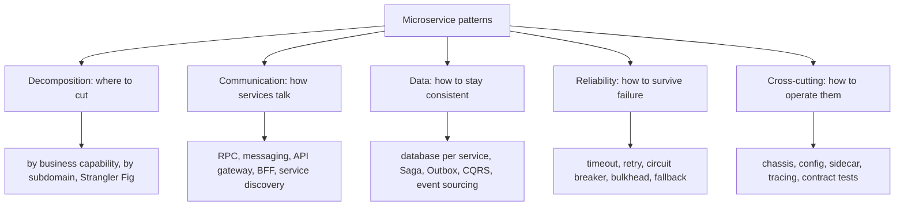
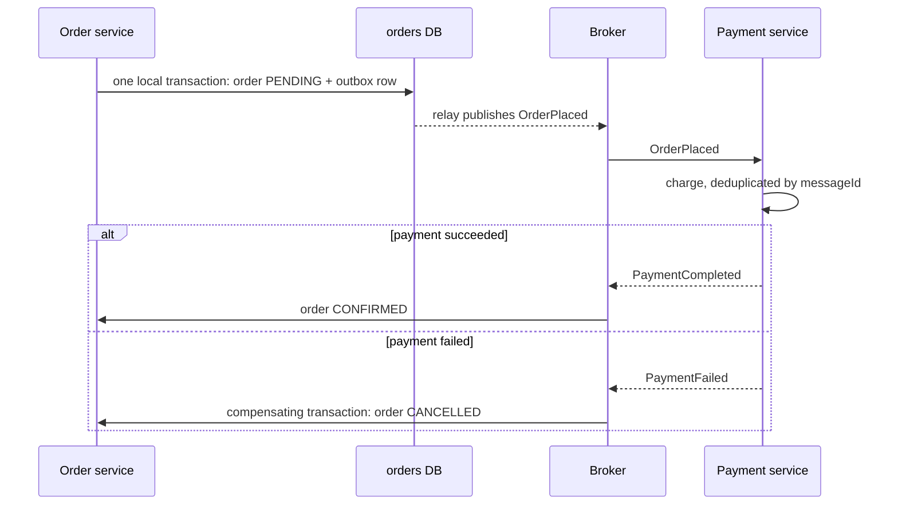
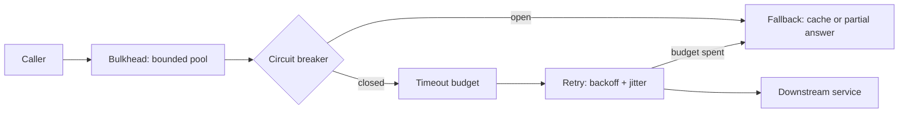

# What Microservice Patterns Exist

"Microservice patterns" is a different family from the [GoF design patterns](topic:design-patterns-overview). GoF patterns arrange classes inside one process. Microservice patterns arrange **services, data and failure** across a network — they are the recurring answers to the problems that appear the moment a system stops being one deployable with one database (see [Why Microservices Are Used](topic:why-microservices)).

Listing forty pattern names is a weak interview answer. The strong one is a **map**: group them by the question each group answers, then name two or three from the group that matters for the case in front of you.

## 1. Decomposition — where to cut the system

- **Decompose by business capability.** One service per thing the business does: ordering, payment, delivery. Boundaries follow the org chart and change slowly.
- **Decompose by subdomain (DDD bounded context).** One service per bounded context, each with its own model of the same word. "Customer" means something different to billing and to support, and a bounded context lets both be right instead of forcing one bloated shared model.
- **Strangler Fig.** How you get there from a monolith: route traffic through a façade, move one capability out at a time, and let the old system shrink until it can be deleted. The alternative — a big-bang rewrite — is the single most reliable way to fail this migration. The staging ground for it is usually a modular monolith, covered in [Modular Architecture: Options](topic:modular-architecture-options) and [Types of Monolithic Architectures](topic:monolithic-architecture-types).
- **Self-contained service.** A service that can answer a request without a synchronous call to anyone else, because it keeps a local replica of the data it needs. Expensive in consistency, excellent for availability.
- **Service per team.** Ownership is a design constraint, not an afterthought: a boundary that two teams must edit together is the wrong boundary.

Two decompositions are wrong by construction: **by technical layer** (a "controller service", a "DAO service" — every feature then touches every service) and **nanoservices** (a service per entity or per endpoint, where the coordination cost dwarfs the code).

## 2. Communication — how services talk

- **Remote Procedure Invocation.** Synchronous REST or gRPC: simple, immediate answer, and it couples the caller's availability to the callee's.
- **Messaging.** Asynchronous commands and events over a broker: the sender does not wait, the receiver may be down, and the buffer absorbs bursts. The trade-off matrix is in [Synchronous vs Asynchronous Communication](topic:sync-vs-async-communication) and [Choosing Sync or Async Service Communication](topic:service-communication-choice); the broker choice itself in [Kafka vs RabbitMQ](topic:kafka-vs-rabbitmq).
- **Domain event / publish-subscribe.** The producer states a fact ("OrderPlaced") and does not know who reacts. This is what lets you add a new consumer without touching the producer.
- **API Gateway and Backend for Frontend.** One entry point for external traffic, edge policy in one place, per-client shaping — see [Why an API Gateway Is Needed](topic:api-gateway).
- **Service discovery.** A registry plus either **client-side discovery** (the caller picks an instance) or **server-side discovery** (a load balancer or platform DNS does), with **self-registration** or **third-party registration** filling the registry. On Kubernetes this pattern is mostly implemented for you by Services and DNS.
- **Sidecar / service mesh / ambassador.** Move retries, mTLS, timeouts and telemetry out of the application into a proxy deployed next to it. Structurally this is the [Proxy pattern](topic:decorator-vs-proxy) at deployment scale, and an **anti-corruption layer** in front of a legacy system is the [Adapter pattern](topic:adapter) at service scale.

The concrete mechanics of these choices are in [Types of Interaction Between Microservices](topic:microservice-interaction-types) and [Options for Configuring Inter-Service Communication](topic:inter-service-communication-options).

## 3. Data — the patterns that exist because you lost the transaction

This is the group interviewers actually care about, because it is where distribution hurts.

**Database per service** is the foundational rule: a service owns its schema and nobody else reads it. That is what makes independent deployment real — and it immediately removes two things you used to get for free: a cross-entity [ACID](topic:acid-principles) transaction, and a join across all your data. Every pattern below is compensation for one of those two losses.

**Saga** replaces the distributed transaction. A business operation becomes a sequence of local transactions, each publishing an event that triggers the next; if step *n* fails, previously completed steps are undone by **compensating transactions** (refund the payment, release the reservation) — not by rollback, because those transactions already committed.

- **Choreography**: services react to each other's events. No coordinator, low coupling, and the flow is nowhere written down — debugging is archaeology across five logs.
- **Orchestration**: a saga orchestrator holds the state machine and tells each participant what to do. The flow is explicit and testable; the orchestrator is one more component and must not accumulate business rules that belong to participants.
- A saga is not atomic and not isolated: intermediate states are visible. You handle that with **semantic locks** (`PENDING` states), commutative updates, or by re-reading before acting — the classic bug is a customer seeing an order that is about to be cancelled.

**Transactional Outbox** solves the dual-write problem: you cannot atomically write to your database and publish to a broker. Instead, write the message into an `outbox` table **in the same local transaction** as the state change, and let a relay (polling publisher, or transaction log tailing / CDC) publish it afterwards. Details in [Outbox Pattern](topic:outbox-pattern); the Spring-level relative is [@TransactionalEventListener](topic:spring-transactional-event-listener).

**Idempotent Consumer / Inbox.** Because the outbox relay guarantees *at-least-once* delivery, every consumer must tolerate duplicates — record processed message ids and skip repeats. See [Inbox Pattern](topic:inbox-pattern). "Exactly-once delivery" does not exist; exactly-once *effect* is what you build, and idempotency is how.

**Querying across services** has two answers. **API Composition** — the caller queries several services and joins in memory — is simple and fine for small result sets, but it cannot sort, filter or paginate efficiently across services. **CQRS** — maintain a denormalised read model, updated from events — makes such queries fast at the cost of eventual consistency and a second store to keep correct. The command/query split itself is discussed in [REST and Separation of Concerns](topic:employee-api-rest-cqrs).

**Event sourcing** stores the sequence of state-changing events as the source of truth and derives current state by replaying them. You get a perfect audit log and a natural event stream to publish, and you pay with schema-evolution pain, snapshotting and queries that are unnatural without a projection. It pairs with CQRS; it is not required by microservices, and adopting both at once on a first system is a common way to stall.

## 4. Reliability — surviving a partner's bad day

In one process a slow method is a slow method. Across a network a slow service exhausts the caller's threads, and the caller's caller then fails too — that is a **cascading failure**, and these patterns exist to stop it.

- **Timeout** — no call is allowed to wait forever. This is the one non-negotiable pattern; a missing timeout is how one incident becomes an outage.
- **Retry with exponential backoff and jitter** — for transient faults only, on idempotent operations only, with a bounded budget. Naive immediate retries turn a struggling service into a dead one.
- **Circuit breaker** — after N failures, fail fast for a while instead of queueing doomed calls, then probe with a half-open trial.
- **Bulkhead** — separate connection/thread pools per dependency, so exhausting one cannot starve unrelated work.
- **Fallback / graceful degradation** — a cached value, a partial response, a default; the recommendations panel disappears but the checkout button works.
- **Rate limiting and load shedding** — reject excess work at the edge rather than collapsing under it.

The implementation view is in [Service Timeouts, Fallbacks, and Circuit Breakers](topic:service-timeouts-fallbacks).

## 5. Cross-cutting: operating dozens of services

- **Externalized configuration.** Config comes from the environment or a config server, never from the artefact; the same image runs in every environment.
- **Microservice chassis / service template.** A shared baseline — logging, metrics, tracing, health, security, error handling — so a new service starts correct instead of starting empty. In Spring this is exactly a custom starter, see [Spring Boot Starter Web and Custom Starters](topic:spring-boot-starter-web).
- **Observability set.** **Health Check API** (liveness/readiness, used by the platform to restart or drain), **log aggregation**, **application metrics**, **distributed tracing** with a correlation id propagated across every hop, **exception tracking**, **audit logging**. In a distributed system these are not "nice to have" — without a trace id you cannot answer *where* a request spent its time.
- **Deployment patterns.** Service per container, one service per host/pod, sidecar, serverless; plus **blue-green** and **canary** releases and **feature flags**, which are what make "deploy independently" true in practice.
- **Security patterns.** An **access token** (JWT) minted at the edge and relayed on internal calls so every service knows the caller, plus **mTLS** between services. A gateway is not a security boundary by itself.
- **Testing patterns.** **Consumer-driven contract tests** (Pact / Spring Cloud Contract) verify that a producer still satisfies each consumer's expectations without running the whole system; **service component tests** run one service against test doubles and a real containerised database. This is the pattern that replaces the end-to-end suite that no longer fits.

## 60-second interview answer

> Microservice patterns aren't GoF patterns — they're recurring solutions to distributed-system problems, and I'd group them by the question each answers. **Decomposition**: decompose by business capability or by DDD subdomain, and migrate from a monolith with the Strangler Fig, avoiding decomposition by technical layer. **Communication**: synchronous RPC versus asynchronous messaging and domain events, an API gateway or BFF at the edge, service discovery, and a sidecar or service mesh for cross-cutting network concerns. **Data** is the important group, because database-per-service costs you distributed transactions and joins: a Saga — choreographed or orchestrated — replaces the transaction with local transactions plus compensating actions; the Transactional Outbox solves the dual-write problem of updating the database and publishing an event atomically; consumers must be idempotent, usually via an inbox of processed message ids, because delivery is at-least-once; and cross-service queries use API Composition for small cases or CQRS read models for real ones, with event sourcing when the event log itself should be the source of truth. **Reliability**: timeouts, bounded retries with exponential backoff and jitter, circuit breakers, bulkheads, fallbacks and rate limiting, to stop a cascading failure. **Cross-cutting**: externalized configuration, a microservice chassis, health check APIs, distributed tracing with a correlation id, and consumer-driven contract tests. The through-line is that almost every one of them buys back a guarantee a single database and a single process gave for free — so you apply them when a concrete problem shows up, not all at once.

## Production relevance

**Patterns are a menu, not a checklist.** A team that adopts sagas, CQRS, event sourcing, a mesh and a gateway before it has three services has bought all the complexity and none of the benefit. Adopt in the order the pain arrives: timeouts and health checks on day one, the outbox the first time you dual-write, CQRS the first time a composition query cannot paginate.

**Almost every data pattern is really about eventual consistency.** Once you accept a saga, the UI has to show `PENDING`, support has to understand it, and the business has to agree that "cancelled two seconds after confirmation" is legal. That is a product conversation, not only a technical one — and it is the part candidates most often skip.

**Idempotency is not optional.** At-least-once delivery, retried HTTP calls and re-run saga steps all mean the same message may arrive twice. Design the operation to be safe on replay — natural business keys, conditional updates, a processed-ids table — instead of trying to prevent duplicates. Within a single database, [optimistic locking](topic:optimistic-vs-pessimistic-locking) covers the concurrent-update half of the same problem.

**The patterns you skip become incidents.** A missing timeout, a retry storm without jitter, no correlation id, no readiness probe — each is a familiar production outage with a known name and a known fix.

**A pattern applied at the wrong boundary makes things worse.** An orchestrator that grows every rule becomes a central monolith the services obey; a mesh added to hide chatty synchronous calls hides the real problem, which is the decomposition.

## Common misconceptions

- **"Microservice patterns are just GoF patterns applied to services."** They answer different questions. GoF is about coupling between classes in one process; these are about consistency, failure and topology across a network. Strategy has no opinion on what happens when the network partitions.
- **"A saga is a distributed transaction."** It is the opposite: a saga exists precisely because there is no distributed transaction. Each step commits immediately, so intermediate states are visible and rollback is replaced by compensation — which may be impossible (you cannot un-send an email; you send an apology).
- **"Choreography is simpler, so it is better."** It is simpler to write and much harder to operate: no single place describes the flow, cyclic event chains appear, and a five-service saga becomes an archaeology exercise. Orchestrate anything with more than a few steps or with real compensation logic.
- **"Two-phase commit would solve this properly."** 2PC exists, but it needs XA support everywhere, blocks resources while the coordinator decides, and makes availability the product of all participants' availability — the reason the industry chose sagas.
- **"The outbox is only needed for exotic cases."** Any handler that writes to the database and then publishes an event has a dual-write bug: a crash between the two silently loses the event or emits one for a state change that rolled back. That is the normal case, not an exotic one.
- **"Exactly-once delivery makes idempotency unnecessary."** Brokers deliver at-least-once; "exactly-once" in a broker's marketing usually means exactly-once processing inside that broker's own boundary, not across your database and its API calls. Idempotent consumers are what actually produce exactly-once *effects*.
- **"CQRS means two databases and event sourcing."** CQRS is the separation of the write model from the read model. That can be as small as a different query object over the same schema; a separate store and event sourcing are options, not the definition.
- **"A circuit breaker prevents failure."** It contains failure. It converts slow, thread-consuming failures into fast, cheap ones and gives the downstream room to recover — the caller still needs a fallback and the user still sees degradation.
- **"Retries make the system more reliable."** Unbounded or synchronised retries are a load amplifier: the exact moment a service is struggling, its traffic triples. Retries need a budget, backoff with jitter, and an idempotent target — otherwise a retried payment is a second charge.
- **"Service discovery and a gateway are the same pattern."** Discovery answers "which instances of `orders` are alive right now"; a gateway answers "what should happen to this external request". The gateway is a *consumer* of discovery.
- **"Shared database is always an anti-pattern."** It is the default answer to "we skipped decomposition", and it does destroy independent deployment. But a deliberate, read-only, versioned view for a reporting consumer is an engineering trade-off, not a sin — what matters is that the schema stays owned by one service.
- **"You need all of them to call it microservices."** You need database per service, independent deployability, and enough observability to debug. The rest are answers to specific problems — apply the ones whose problem you actually have.
