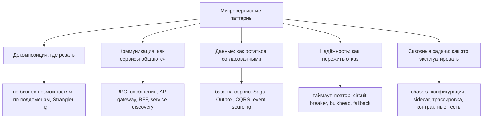
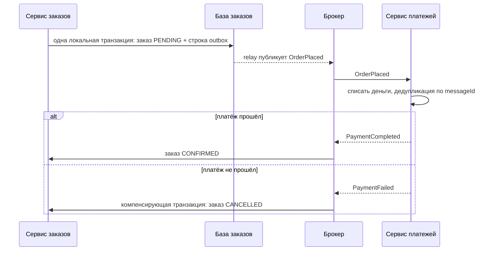
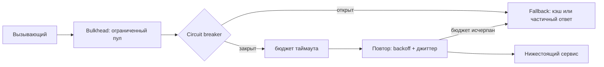

# Какие существуют микросервисные паттерны

«Микросервисные паттерны» - это другое семейство, не [паттерны GoF](topic:design-patterns-overview). Паттерны GoF расставляют классы внутри одного процесса. Микросервисные паттерны расставляют **сервисы, данные и отказы** по сети - это повторяющиеся ответы на проблемы, которые появляются в момент, когда система перестаёт быть одним развёртываемым артефактом с одной базой (см. [Зачем нужны микросервисы](topic:why-microservices)).

Перечислить сорок названий - слабый ответ на собеседовании. Сильный - это **карта**: сгруппировать паттерны по вопросу, на который отвечает каждая группа, а затем назвать два-три из той группы, которая важна для конкретного случая.

## 1. Декомпозиция - где резать систему

- **Декомпозиция по бизнес-возможностям.** Один сервис на одно дело, которое делает бизнес: оформление заказа, платёж, доставка. Границы следуют за структурой организации и меняются медленно.
- **Декомпозиция по поддомену (bounded context из DDD).** Один сервис на один ограниченный контекст, у каждого своя модель одного и того же слова. «Клиент» для биллинга и для поддержки означает разное, и ограниченный контекст позволяет обоим быть правыми, а не навязывает одну раздутую общую модель.
- **Strangler Fig.** Так из монолита приходят к сервисам: пустить трафик через фасад, выносить по одной возможности за раз и дать старой системе съёживаться, пока её не станет можно удалить. Альтернатива - переписывание «одним прыжком» - самый надёжный способ провалить такую миграцию. Плацдармом для неё обычно служит модульный монолит, о нём - в темах [Варианты модульной архитектуры](topic:modular-architecture-options) и [Виды монолитных архитектур](topic:monolithic-architecture-types).
- **Самодостаточный сервис (self-contained service).** Сервис, который отвечает на запрос без синхронного вызова к кому-либо ещё, потому что хранит локальную реплику нужных данных. Дорого по согласованности, отлично по доступности.
- **Сервис на команду.** Владение - это проектное ограничение, а не мелочь напоследок: граница, которую двум командам приходится править совместно, - неправильная граница.

Две декомпозиции ошибочны по построению: **по техническим слоям** («сервис контроллеров», «сервис DAO» - тогда любая фича задевает все сервисы) и **наносервисы** (сервис на сущность или на эндпоинт, где стоимость координации многократно превышает объём кода).

## 2. Коммуникация - как сервисы общаются

- **Удалённый вызов процедуры (RPC).** Синхронный REST или gRPC: просто, ответ сразу - и доступность вызывающего оказывается привязана к доступности вызываемого.
- **Обмен сообщениями.** Асинхронные команды и события через брокер: отправитель не ждёт, получатель может лежать, а буфер поглощает всплески. Матрица компромиссов - в темах [Синхронное и асинхронное взаимодействие](topic:sync-vs-async-communication) и [Выбор синхронного или асинхронного взаимодействия](topic:service-communication-choice); сам выбор брокера - в [Kafka vs RabbitMQ](topic:kafka-vs-rabbitmq).
- **Доменное событие / publish-subscribe.** Производитель сообщает факт («OrderPlaced») и не знает, кто на него отреагирует. Именно это позволяет добавить нового потребителя, не трогая производителя.
- **API Gateway и Backend for Frontend.** Единая точка входа для внешнего трафика, политика периметра в одном месте, форма ответа под конкретного клиента - см. [Зачем нужен API Gateway](topic:api-gateway).
- **Service discovery.** Реестр плюс либо **клиентское обнаружение** (экземпляр выбирает вызывающий), либо **серверное обнаружение** (это делает балансировщик или DNS платформы), а наполняют реестр **саморегистрация** или **регистрация третьей стороной**. В Kubernetes этот паттерн по большей части уже реализован за вас через Service и DNS.
- **Sidecar / service mesh / ambassador.** Вынести повторы, mTLS, таймауты и телеметрию из приложения в прокси, развёрнутый рядом с ним. Структурно это [паттерн Proxy](topic:decorator-vs-proxy) в масштабе развёртывания, а **anti-corruption layer** перед legacy-системой - это [паттерн Adapter](topic:adapter) в масштабе сервисов.

Конкретная механика этих решений - в темах [Виды взаимодействия между микросервисами](topic:microservice-interaction-types) и [Варианты настройки взаимодействия между сервисами](topic:inter-service-communication-options).

## 3. Данные - паттерны, которые существуют, потому что вы потеряли транзакцию

Именно эта группа интересует интервьюеров по-настоящему, потому что здесь распределённость болит сильнее всего.

**База на сервис (database per service)** - фундаментальное правило: сервис владеет своей схемой, и никто больше в неё не читает. Только это делает независимое развёртывание настоящим - и сразу же отнимает две вещи, которые раньше давались бесплатно: [ACID](topic:acid-principles)-транзакцию поверх нескольких сущностей и join по всем вашим данным. Каждый паттерн ниже - компенсация одной из этих двух потерь.

**Saga** заменяет распределённую транзакцию. Бизнес-операция становится последовательностью локальных транзакций, каждая из которых публикует событие, запускающее следующую; если шаг *n* упал, ранее выполненные шаги отменяются **компенсирующими транзакциями** (вернуть платёж, снять резерв) - не откатом, потому что те транзакции уже зафиксированы.

- **Хореография**: сервисы реагируют на события друг друга. Координатора нет, связанность низкая, а поток нигде не записан - отладка превращается в раскопки по пяти логам.
- **Оркестрация**: оркестратор саги держит конечный автомат и говорит каждому участнику, что делать. Поток явный и тестируемый; оркестратор - ещё один компонент, и в нём не должны накапливаться бизнес-правила участников.
- Saga не атомарна и не изолирована: промежуточные состояния видны. С этим справляются **семантические блокировки** (состояния `PENDING`), коммутативные обновления или перечитывание перед действием - классическая ошибка здесь в том, что клиент видит заказ, который вот-вот будет отменён.

**Transactional Outbox** решает проблему двойной записи: нельзя атомарно записать в свою базу и опубликовать в брокер. Вместо этого сообщение пишется в таблицу `outbox` **в той же локальной транзакции**, что и изменение состояния, а публикует его потом relay (опрос таблицы или чтение журнала транзакций / CDC). Подробности - в теме [Паттерн Outbox](topic:outbox-pattern); ближайший родственник на уровне Spring - [@TransactionalEventListener](topic:spring-transactional-event-listener).

**Идемпотентный потребитель / Inbox.** Поскольку relay гарантирует доставку *не менее одного раза*, каждый потребитель обязан терпеть дубликаты - запоминать обработанные id сообщений и пропускать повторы. См. [Паттерн Inbox](topic:inbox-pattern). «Доставки ровно один раз» не существует; вы строите ровно однократный *эффект*, и идемпотентность - способ это сделать.

**Запросы поверх нескольких сервисов** имеют два ответа. **API Composition** - вызывающий опрашивает несколько сервисов и соединяет данные в памяти - прост и годится для небольших выборок, но не умеет эффективно сортировать, фильтровать и разбивать на страницы по нескольким сервисам. **CQRS** - поддерживать денормализованную модель чтения, обновляемую из событий - делает такие запросы быстрыми ценой согласованности в конечном счёте и второго хранилища, которое надо держать корректным. Само разделение команд и запросов разбирается в теме [REST и разделение ответственности](topic:employee-api-rest-cqrs).

**Event sourcing** хранит источником истины последовательность событий изменения состояния и получает текущее состояние их проигрыванием. Вы получаете идеальный аудит и естественный поток событий для публикации, а платите болью эволюции схемы, снапшотами и запросами, которые без проекции неудобны. Он хорошо сочетается с CQRS; микросервисы его не требуют, и взять оба сразу на первой же системе - распространённый способ увязнуть.

## 4. Надёжность - пережить плохой день у соседа

Внутри одного процесса медленный метод - это просто медленный метод. По сети медленный сервис исчерпывает потоки вызывающего, после чего падает и тот, кто вызвал его самого, - это **каскадный отказ**, и перечисленные паттерны существуют, чтобы его остановить.

- **Таймаут** - ни одному вызову не разрешено ждать вечно. Это единственный паттерн, по которому нет переговоров; отсутствующий таймаут - это то, как один инцидент превращается в отказ всей системы.
- **Повтор с экспоненциальной выдержкой и джиттером** - только для временных сбоев, только для идемпотентных операций и только с ограниченным бюджетом. Наивные немедленные повторы превращают задыхающийся сервис в мёртвый.
- **Circuit breaker** - после N отказов какое-то время падать сразу, вместо того чтобы копить обречённые вызовы, а затем пробовать снова в полуоткрытом состоянии.
- **Bulkhead** - отдельные пулы соединений и потоков на каждую зависимость, чтобы исчерпание одного не заморило работу, к нему не относящуюся.
- **Fallback / деградация с достоинством** - закэшированное значение, частичный ответ, значение по умолчанию; блок рекомендаций исчезает, но кнопка оформления заказа работает.
- **Ограничение частоты и сброс нагрузки** - отказывать в лишней работе на периметре, а не разваливаться под ней.

Взгляд со стороны реализации - в теме [Таймауты, fallback и circuit breaker](topic:service-timeouts-fallbacks).

## 5. Сквозные задачи: как эксплуатировать десятки сервисов

- **Внешняя конфигурация.** Конфигурация приходит из окружения или сервера конфигураций, а не из артефакта; один и тот же образ работает во всех средах.
- **Microservice chassis / шаблон сервиса.** Общая база - логирование, метрики, трассировка, health, безопасность, обработка ошибок, - чтобы новый сервис начинался правильным, а не пустым. В Spring это ровно свой стартер, см. [Spring Boot Starter Web и свои стартеры](topic:spring-boot-starter-web).
- **Набор наблюдаемости.** **Health Check API** (liveness/readiness, по которым платформа перезапускает или выводит инстанс из ротации), **агрегация логов**, **метрики приложения**, **распределённая трассировка** с correlation id, протянутым через каждый переход, **отслеживание исключений**, **аудит-логи**. В распределённой системе это не «приятное дополнение»: без trace id вы не ответите, *где* запрос провёл своё время.
- **Паттерны развёртывания.** Сервис в контейнере, один сервис на хост/под, sidecar, serverless; плюс **blue-green** и **canary**-выкладки и **feature flags**, которые и делают фразу «разворачиваем независимо» правдой на практике.
- **Паттерны безопасности.** **Access token** (JWT), выпущенный на периметре и передаваемый дальше по внутренним вызовам, чтобы каждый сервис знал вызывающего, плюс **mTLS** между сервисами. Gateway сам по себе границей безопасности не является.
- **Паттерны тестирования.** **Контрактные тесты со стороны потребителя** (Pact / Spring Cloud Contract) проверяют, что производитель по-прежнему удовлетворяет ожиданиям каждого потребителя, не поднимая всю систему; **компонентные тесты сервиса** гоняют один сервис против тестовых заглушек и настоящей базы в контейнере. Именно этот паттерн заменяет сквозной набор тестов, который больше не помещается.

## Ответ на собеседовании за 60 секунд

> Микросервисные паттерны - это не паттерны GoF, а повторяющиеся решения проблем распределённых систем, и я бы группировал их по вопросу, на который каждая группа отвечает. **Декомпозиция**: резать по бизнес-возможностям или по поддоменам DDD, а из монолита переезжать через Strangler Fig, избегая декомпозиции по техническим слоям. **Коммуникация**: синхронный RPC против асинхронных сообщений и доменных событий, API gateway или BFF на периметре, service discovery, а также sidecar или service mesh для сетевых сквозных задач. **Данные** - главная группа, потому что база на сервис отнимает распределённые транзакции и join: Saga - хореографией или оркестрацией - заменяет транзакцию локальными транзакциями и компенсирующими действиями; Transactional Outbox решает проблему двойной записи, когда надо атомарно и обновить базу, и опубликовать событие; потребители обязаны быть идемпотентными, обычно через inbox обработанных id, потому что доставка гарантируется не менее одного раза; а межсервисные запросы решаются API Composition для мелких случаев или моделями чтения CQRS для настоящих, с event sourcing тогда, когда журнал событий и должен быть источником истины. **Надёжность**: таймауты, ограниченные повторы с экспоненциальной выдержкой и джиттером, circuit breaker, bulkhead, fallback и ограничение частоты - чтобы остановить каскадный отказ. **Сквозные задачи**: внешняя конфигурация, microservice chassis, health check API, распределённая трассировка с correlation id и контрактные тесты со стороны потребителя. Общая нить в том, что почти каждый из них выкупает обратно гарантию, которую одна база и один процесс давали бесплатно, - поэтому применять их надо, когда появилась конкретная проблема, а не все сразу.

## Как это выглядит в продакшене

**Паттерны - это меню, а не чек-лист.** Команда, которая берёт саги, CQRS, event sourcing, mesh и gateway, ещё не имея трёх сервисов, купила всю сложность и ни одной выгоды. Внедряйте в том порядке, в каком приходит боль: таймауты и health check - в первый же день, outbox - при первой же двойной записи, CQRS - когда композиционный запрос впервые не сможет разбить результат на страницы.

**Почти каждый паттерн данных на самом деле про согласованность в конечном счёте.** Как только вы приняли сагу, интерфейс обязан показывать `PENDING`, поддержка обязана это понимать, а бизнес - согласиться, что «отменён через две секунды после подтверждения» допустимо. Это продуктовый разговор, а не только технический, - и именно эту часть кандидаты чаще всего пропускают.

**Идемпотентность не опциональна.** Доставка не менее одного раза, повторённые HTTP-вызовы и переигранные шаги саги означают одно и то же: сообщение может прийти дважды. Проектируйте операцию безопасной при повторе - естественные бизнес-ключи, условные обновления, таблица обработанных id, - вместо попыток запретить дубликаты. Внутри одной базы половину той же проблемы, про конкурентное обновление, закрывает [оптимистичная блокировка](topic:optimistic-vs-pessimistic-locking).

**Пропущенные паттерны становятся инцидентами.** Отсутствующий таймаут, шторм повторов без джиттера, нет correlation id, нет readiness-пробы - у каждого из этих отказов есть знакомое имя и известное лечение.

**Паттерн, применённый на неверной границе, делает хуже.** Оркестратор, в который стекаются все правила, становится центральным монолитом, которому сервисы подчиняются; mesh, добавленный, чтобы спрятать болтливые синхронные вызовы, прячет настоящую проблему - декомпозицию.

## Частые заблуждения

- **«Микросервисные паттерны - это паттерны GoF, применённые к сервисам».** Они отвечают на разные вопросы. GoF - про связанность классов в одном процессе; эти - про согласованность, отказы и топологию по сети. У Strategy нет мнения о том, что делать при сетевом разделении.
- **«Saga - это распределённая транзакция».** Ровно наоборот: saga существует именно потому, что распределённой транзакции нет. Каждый шаг фиксируется сразу, поэтому промежуточные состояния видны, а откат заменён компенсацией - которая может быть невозможной (нельзя «отправить назад» письмо; вы отправляете извинение).
- **«Хореография проще, значит лучше».** Её проще написать и намного тяжелее эксплуатировать: ни в одном месте не описан поток, появляются циклы событий, а сага из пяти сервисов превращается в археологию. Оркеструйте всё, где больше нескольких шагов или где есть настоящая компенсирующая логика.
- **«Двухфазный коммит решил бы это правильно».** 2PC существует, но требует поддержки XA везде, блокирует ресурсы, пока координатор принимает решение, и делает доступность произведением доступностей всех участников - поэтому индустрия и выбрала саги.
- **«Outbox нужен только в экзотических случаях».** Любой обработчик, который пишет в базу, а затем публикует событие, содержит баг двойной записи: падение между этими шагами тихо теряет событие или выпускает его для изменения, которое откатилось. Это обычный случай, а не экзотический.
- **«Доставка ровно один раз делает идемпотентность ненужной».** Брокеры доставляют не менее одного раза; «ровно один раз» в маркетинге брокера обычно означает однократную обработку внутри его собственной границы, а не поверх вашей базы и её вызовов наружу. Ровно однократный *эффект* дают именно идемпотентные потребители.
- **«CQRS - это две базы и event sourcing».** CQRS - это разделение модели записи и модели чтения. Оно может быть настолько маленьким, как отдельный объект запроса поверх той же схемы; отдельное хранилище и event sourcing - опции, а не определение.
- **«Circuit breaker предотвращает отказ».** Он его локализует. Он превращает медленные отказы, съедающие потоки, в быстрые и дешёвые и даёт нижестоящему сервису место для восстановления - вызывающему всё ещё нужен fallback, а пользователь всё ещё видит деградацию.
- **«Повторы делают систему надёжнее».** Неограниченные или синхронные повторы - усилитель нагрузки: ровно в момент, когда сервису плохо, его трафик утраивается. Повторам нужен бюджет, выдержка с джиттером и идемпотентная цель - иначе повторённый платёж становится вторым списанием.
- **«Service discovery и gateway - один и тот же паттерн».** Discovery отвечает на вопрос «какие экземпляры `orders` сейчас живы»; gateway - на вопрос «что должно произойти с этим внешним запросом». Gateway является *потребителем* discovery.
- **«Общая база - всегда антипаттерн».** Это дежурный ответ на «мы пропустили декомпозицию», и она действительно разрушает независимое развёртывание. Но осознанное, только для чтения, версионированное представление для потребителя-отчётности - инженерный компромисс, а не грех; важно, чтобы схемой по-прежнему владел один сервис.
- **«Чтобы это называлось микросервисами, нужны все паттерны».** Нужны база на сервис, независимая развёртываемость и достаточно наблюдаемости, чтобы отлаживаться. Остальное - ответы на конкретные проблемы; применяйте те, чья проблема у вас действительно есть.
