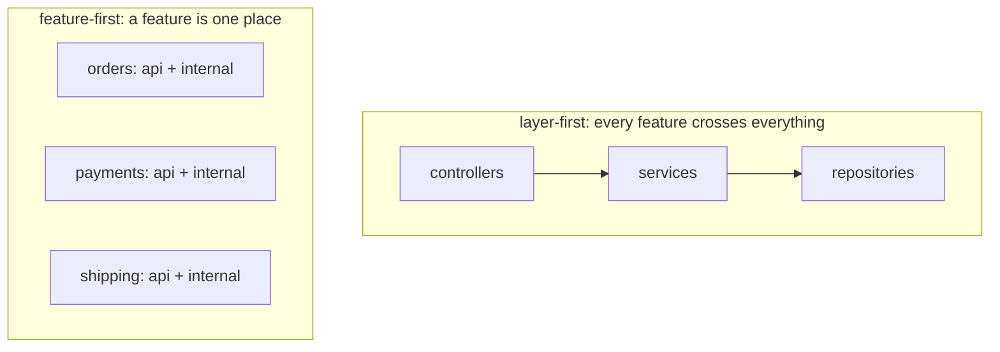
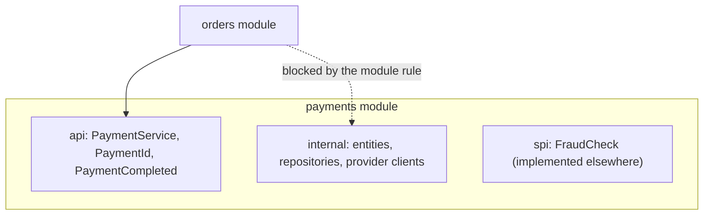
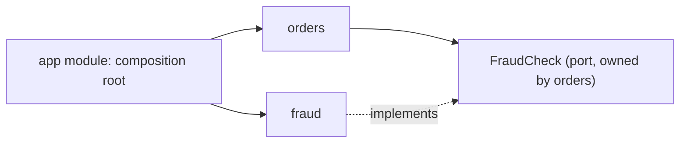

# Modular Architecture: Options and How to Organize Modules

The question hides two separate decisions, and answering only one of them is the classic interview stumble.

1. **Mechanism** — what physically holds a module boundary in place? A naming convention, the compiler, the build tool, the JVM, a classloader, or the network?
2. **Criterion** — along which lines is the system cut into modules in the first place?

Strong enforcement around the wrong boundaries is worse than no boundaries at all: you get all the friction of modularity and none of the independence. So the mechanism is the cheap half of the answer, and the criterion is the half that decides whether the architecture survives three years.

## What actually makes something a module

A folder is not a module. A module has three properties:

- **A deliberately small public API** — the only surface the rest of the system is allowed to call.
- **Hidden internals** — entities, tables, helpers, algorithms that nobody outside can reach, and can therefore change without a negotiation.
- **Explicitly declared dependencies** — you can list what it needs, and something checks that list.

Two useful consequences follow: a module can be built and tested on its own, and it can be owned by one team. Modularity is [encapsulation](topic:oop-principles) applied one level above the class, and the same [SOLID](topic:solid-principles) forces apply — a module should have one reason to change, and depend on abstractions rather than on someone else's internals.

The decisive question about any modularity option is therefore: **when a developer violates a boundary, what happens, and how soon do they find out?**

## The options: a ladder of enforcement

Each option below is stronger than the one before it, and costs more. Left to right: cheaper and weaker, toward costlier and stricter.


### 1. Packages and visibility (convention only)

Split the code into packages such as `orders`, `payments`, `shipping`, and use **package-private** as the default: only the few types meant to be an API are `public`. Cheapest possible option, zero build complexity, and it is the right starting point for a small system.

The weakness is that Java's access model does not match the shape you want. `public` is all-or-nothing across the whole application, and there is no "public to the `orders` module, invisible to everyone else" (see [default vs protected access](topic:default-vs-protected)). The moment a class needs to be visible to a sibling package inside the same module, it becomes visible to the entire codebase. An `internal` package is internal only because of its name, and nothing stops `import com.shop.payments.internal.CardCharger;` from compiling. Enforcement is code review, which means enforcement is "if someone notices".

### 2. Architecture tests (ArchUnit, Spring Modulith)

Same code layout as option 1, but the rules become executable. An ArchUnit test states them and the build fails when they break:

```java
@Test
void modulesDoNotReachIntoEachOthersInternals() {
    ArchRule rule = noClasses().that().resideOutsideOfPackage("com.shop.payments..")
        .should().accessClassesThat().resideInAPackage("com.shop.payments.internal..");
    rule.check(new ClassFileImporter().importPackages("com.shop"));
}
```

Spring Modulith formalises the same idea for Spring applications: a top-level package is a module, its nested packages are internal by default, `ApplicationModules.of(App.class).verify()` fails on illegal access and on cycles, and it can generate documentation of the module graph.

This is the best value-for-money option in a typical Spring codebase. You get compile-adjacent enforcement (it fails in CI, on the offending commit, with a message naming the rule) without splitting the build. The limitation is that it is a test — someone can `@Disabled` it, and it only sees what the static analysis can see, not reflection or configuration.

### 3. Build modules (Gradle / Maven multi-module)

Each module becomes its own subproject with its own dependency declarations. Now the **compiler** enforces the boundary: if `orders` does not declare `payments` on its compile classpath, `import com.shop.payments.*` does not compile. Circular dependencies fail the build because the build tool cannot even order the compilation. Gradle's `api` versus `implementation` distinction adds a second level: a dependency declared `implementation` does not leak onto your consumers' compile classpath.

This is the strongest boundary you can get without changing how the application is deployed, and it is what most people mean by a **modular monolith** — one deployable artifact assembled from independently compiled modules (compare the variants in [Types of Monolithic Architectures](topic:monolithic-architecture-types)).

The costs are real: slower and more complex builds, more ceremony to move a class, and a genuine design decision every time two modules need the same type. It also does not restrict reflection, and `public` is still `public` inside a module.

### 4. JPMS — the Java Platform Module System

Since Java 9, `module-info.java` declares a module to the compiler *and* to the JVM:

```java
module com.shop.payments {
    requires com.shop.shared.money;
    exports com.shop.payments.api;
    provides PaymentProvider with StripeProvider;   // ServiceLoader binding
}
```

`exports` makes a package readable to others; everything else is inaccessible even to reflection unless the module `opens` it. Dependencies are checked at startup, so a missing module is an error at launch rather than a `NoClassDefFoundError` on some unlucky code path, and split packages are forbidden.

The honest interview answer is that JPMS is excellent for **libraries and the JDK** and rare in **application code**. Frameworks want deep reflective access, many third-party jars still ship without `module-info`, and mixing the classpath and the module path is a source of confusing failures. Knowing why it is not the default answer scores better than reciting its syntax.

### 5. Runtime modules and plugins (OSGi, ServiceLoader, microkernel)

Here modules are units you can install, upgrade, start and stop while the application runs. OSGi gives each bundle its own [classloader](topic:classloader) with explicitly imported and exported packages, so two bundles can even use different versions of the same library. `ServiceLoader` is the lightweight version: an interface plus implementations discovered from the classpath, which is how a plugin can be added by dropping in a jar. A Spring Boot starter is the same idea expressed as auto-configuration — see [Spring Boot Starter Web and Custom Starters](topic:spring-boot-starter-web).

This is the right shape when third parties extend your product, or when the feature set genuinely differs per installation: IDEs, CI servers, CMS platforms, on-premise business tools. The extension points are usually [Strategy](topic:strategy) interfaces the core calls without knowing the implementations. The price is a much harder runtime model — classloader leaks, versioning, lifecycle bugs — for something most business applications never need.

### 6. Separate services

The final rung: a module boundary becomes a process boundary and a network hop. Isolation is now absolute — a different language and a different database are possible, and no compiler trick lets one service read another's fields. In exchange, every in-process call turns into a distributed one, with partial failure, latency, serialisation, versioning and eventual consistency ([Why Microservices Are Used](topic:why-microservices), [Types of Interaction Between Microservices](topic:microservice-interaction-types)).

Note where the enforcement really comes from: the network stops *accidental* coupling, not deliberate coupling. Services that must be released together are a distributed monolith with extra latency.

| Mechanism | Boundary enforced by | You find out | Isolation | Cost |
| --- | --- | --- | --- | --- |
| Packages + visibility | convention, review | maybe never | weak | none |
| Architecture tests | a test in CI | on the commit | medium | one test module |
| Build modules | the compiler | on every build | strong (compile) | build complexity |
| JPMS | compiler + JVM | at compile and startup | strong (+ reflection) | tooling friction |
| Runtime plugins | classloaders | at install time | strong, dynamic | high runtime complexity |
| Services | the network | at runtime, in production | total | distribution |

A sane default for a Java business system: **packages + architecture tests**, promoted to **build modules** when the codebase or the number of teams grows, and to **services** only for the specific modules with a real reason (independent scaling, independent release cadence, separate ownership, isolation of risk).

## How to organize modules

The mechanism above is the enforcement. Everything below is the design, and it applies at *every* rung — the same rules decide package boundaries in a small monolith and service boundaries in a large system.

### Cut by business capability, not by technical layer

The single highest-value rule. Compare the two layouts:



In the layer-first tree, `controllers` holds every controller in the product. Adding one feature touches all three packages, every package is shared ownership, and no part of it can be deleted, extracted or reasoned about alone — the tree tells you what the code *is*, never what the application *does*. Layers are a fine internal structure **inside** a module; they are a poor top-level decomposition.

Feature-first modules are the same thing DDD calls a **bounded context**: a slice of the business with its own vocabulary and its own model. The useful test is *deletability* — if the product dropped loyalty points tomorrow, could you delete one directory and fix only the compile errors at its declared API?

### Give every module an API and hidden internals



Convention that works everywhere: a module is `com.shop.payments` with a public `api` package (a few interfaces, DTOs and events) and everything else nested and unreachable. Keep the API in *the module's own* types — the second an `orders` method takes a `payments` JPA entity, the two share a database schema and a transaction, whatever the folder layout says. Prefer an [interface](topic:interface-vs-abstract-class) for the API and let the implementation stay internal.

### Keep the dependency graph acyclic

Two modules that depend on each other are one module wearing two names: neither can be built, tested, understood or extracted alone. This is the Acyclic Dependency Principle, and it is the one rule worth failing the build over. Build modules and JPMS enforce it for free; ArchUnit and Spring Modulith check it explicitly.

Prefer dependencies that point toward the **stable** and the **general**: many modules may depend on `shared.money`; nothing should depend on `reporting`.

### Invert the arrow when it points the wrong way

`orders` must run a fraud check, but `orders` depending on `fraud` (which depends on `customers`, which depends on `orders`) creates a cycle. Do not add a "helper" module — invert the dependency, exactly as [Dependency Inversion](topic:solid-principles) prescribes. `orders` declares the port it needs (`FraudCheck`) in its own API; `fraud` implements it; a composition root wires the two together, using [dependency injection](topic:spring-ioc-di) rather than a direct constructor call.



One `app` (or `bootstrap`) module knows every module and wires them; nobody depends on `app`. That is also where the Spring configuration, the web layer and the transaction boundaries usually live.

### Call for queries, publish events for reactions

A direct call to another module's API is fine when you need an answer now: `inventory.isAvailable(sku)`. It is the wrong tool when the other module merely needs to *react* — because "on checkout, also award loyalty points, also send a receipt, also update analytics" turns `orders` into a module that imports the whole application.

Publish `OrderPlaced` instead and let interested modules subscribe. In-process this is Spring's `ApplicationEventPublisher`, ideally with [@TransactionalEventListener](topic:spring-transactional-event-listener) so subscribers run after the commit rather than inside someone else's transaction. The dependency direction reverses: subscribers depend on the publisher's event type, the publisher depends on nothing.

This also happens to be the design that survives extraction. When a module later becomes a service, an in-process event becomes a message, and the same code needs the [Outbox pattern](topic:outbox-pattern) to publish it reliably and the [Inbox pattern](topic:inbox-pattern) to consume it idempotently — the *shape* of the code does not change, only the transport (compare the menu in [Options for Configuring Inter-Service Communication](topic:inter-service-communication-options)).

### Let each module own its data

The boundary that decides whether extraction is ever possible is not in the Java code, it is in the database. Each module owns its tables; other modules reach them only through its API. In one database, a **schema per module** makes this visible and grantable; foreign keys and joins across module schemas are the thing to forbid, because each one welds two modules together at the storage level. Cross-module consistency then becomes a design decision — an event and a compensating action instead of one big transaction.

A module with a clean API but shared tables is not modular. It just has a polite front door and an unlocked back door.

### Keep the shared module tiny, or do not have one

Every codebase grows a `common` / `core` / `utils` module, and it is the most reliable way to destroy a module graph: everything depends on it, so it can never change, and because everything depends on it, everything ends up in it — including the domain types of whichever module got there first.

Rules that hold: a shared module contains only stable, dependency-free, domain-agnostic types (`Money`, `PageRequest`, a validation helper). If a type belongs to one module's domain, it lives there and is exported. And **a little duplication beats a wrong shared abstraction** — two modules that both have a `Customer` with different fields usually have two different concepts, not one shared one.

### Size the module to a team and a capability

Conway's law is not a warning, it is a design input: the module graph and the team graph converge whether you plan it or not. A module should be something one team can own end to end and one person can hold in their head — usually thousands of lines, not hundreds and not hundreds of thousands. A module per class produces a dependency graph nobody can navigate; a module per department produces the tangle you were escaping.

### Enforce it mechanically

A rule that nothing checks is a suggestion, and every documented architecture decays to whatever the compiler allows. Pick at least one: ArchUnit tests, `ApplicationModules.verify()`, separate build modules, `CODEOWNERS` on module directories. Run it in CI, on every commit, and treat a failure as a build failure rather than a discussion.

## 60-second interview answer

> There are two questions here. The mechanisms form a ladder of increasing enforcement and cost. At the bottom, packages plus package-private visibility — free, but Java has no "public only within my module", so it is enforced only by review. Next, architecture tests: ArchUnit or Spring Modulith express the rules as an executable test that fails the build on illegal access or a cycle; this is the best value in a typical Spring codebase. Above that, Gradle or Maven build modules, where the compiler enforces the dependency direction because a module simply is not on the classpath — that is the modular monolith. Then JPMS with `module-info.java`, which adds runtime and reflective encapsulation; great for libraries, rare in applications because frameworks need reflection and the tooling fights you. Then runtime plugin systems, OSGi or `ServiceLoader`, where modules are installed and versioned at runtime — right for extensible products, overkill otherwise. Finally separate services, where the boundary is a process and the network. As for organizing them: cut by business capability, not by technical layer, so a feature lives in one place and can be deleted or extracted; give every module a narrow api package and hidden internals; keep the dependency graph acyclic and invert an arrow through a port when it points the wrong way; call directly when you need an answer and publish events when others merely react; give each module its own tables with no cross-module joins; keep the shared module tiny; size modules to teams; and enforce all of it in CI, because an unchecked boundary is a suggestion. My default is packages plus architecture tests, build modules when the codebase or team count grows, services only where there is a concrete reason.

## Production relevance

**Modularity is what makes a monolith extractable.** Nobody migrates a mud ball to microservices successfully. Teams that succeed did the modular work first, inside one process where refactoring is cheap and a mistake costs a rename rather than a schema migration and a deprecation cycle. If module boundaries cannot be held with the compiler on your side, adding the network will expose the coupling, not remove it.

**The enforcement level should follow the pain, not the fashion.** Splitting a five-person codebase into fifteen Gradle modules buys slow builds and constant `build.gradle` edits. Leaving a forty-developer codebase on package conventions buys a boundary that erodes silently for two years. Start at the cheapest rung that hurts, and move up one rung when it stops working.

**Build times and IDE experience are architecture concerns.** Build modules give you incremental compilation and parallel builds at large sizes, but at small sizes they add overhead to every change. Measure before splitting; a modularity decision that makes the edit-compile-test loop slower will lose to developer behaviour eventually.

**The shared module is where architectures die.** Watch its dependency count in code review. When `common` starts importing a domain type or a framework, the graph has already collapsed — every module now transitively depends on that framework and that domain.

**Module boundaries need owners, not just rules.** `CODEOWNERS` per module directory turns a boundary into a review conversation with the team that owns it. Without ownership, whoever is under deadline pressure erodes the boundary and no one is accountable for it.

## Common misconceptions

- **"Modular means microservices."** Microservices are one mechanism — the most expensive one. A well-modularised monolith has the same boundaries with in-process calls, no partial failure and no distributed transactions. Modularity is about coupling; microservices are about independent deployment.
- **"Layers are modules."** Layers separate technical concerns; modules separate business capabilities. A three-layer application with one shared database is one module with three internal levels, and every feature still crosses all of them. Layer *inside* a module, not above it.
- **"A package structure is a module structure."** Only if something enforces it. Without visibility discipline plus a test or a build boundary, `orders.internal` is a naming convention, and the first deadline turns it into an import.
- **"JPMS is how you do modules in Java now."** JPMS is the strongest in-process mechanism and is genuinely rare in application code. Most production Java modularity is build modules plus architecture tests. Claiming otherwise in an interview signals theory over practice.
- **"Extract shared code into a common module."** Only if it is stable, small and domain-agnostic. Otherwise you have built a hub that couples every module to every other and can never be changed. Duplication is cheaper than the wrong abstraction.
- **"More modules means better architecture."** A hundred tiny modules with a dense dependency graph is worse than ten coherent ones: the coupling did not go away, it just became harder to see. Judge the graph, not the count.
- **"A shared database is fine as long as the code is modular."** It is the coupling that ends the discussion. Two modules writing the same tables share a schema, a migration, a lock and a deployment, and neither can be extracted without a data split. Data ownership is the real boundary.
- **"Modules should not talk to each other."** They must — otherwise there is no system. The rule is *how*: through a declared API and events, in one direction, never into internals.
- **"We will modularise later, when it hurts."** Boundaries are cheap to draw and expensive to retrofit, because by then the entities, the transactions and the tables are entangled. The cheap version — a feature-first package layout and one ArchUnit test — costs an afternoon on day one.
- **"An API gateway or a service mesh gives us modularity."** Those manage traffic between things that are already split (see [Why an API Gateway Is Needed](topic:api-gateway)). Nothing at the network layer creates a boundary that does not exist in the code and the schema.
