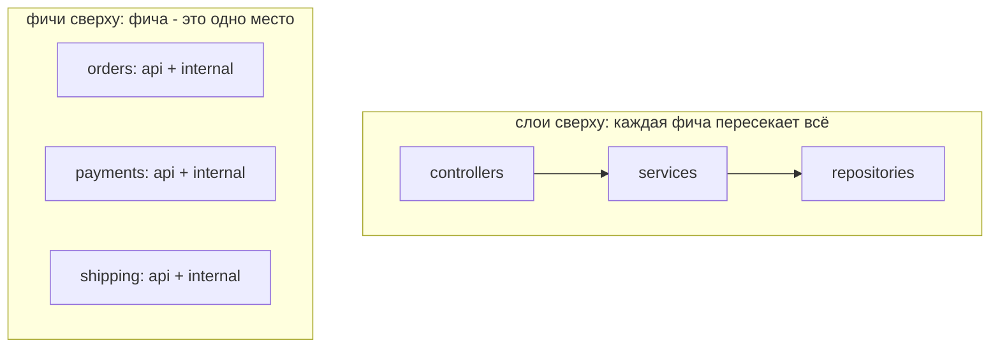
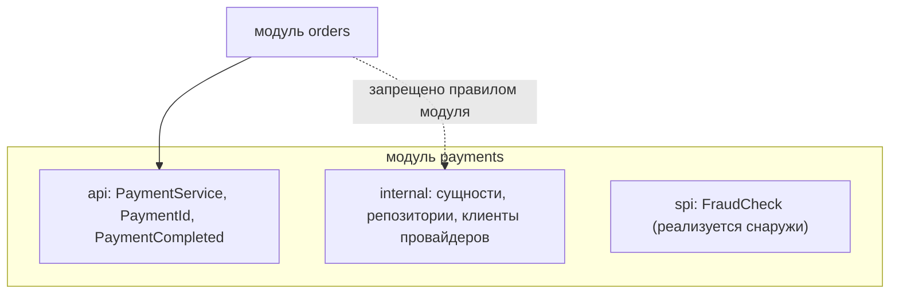
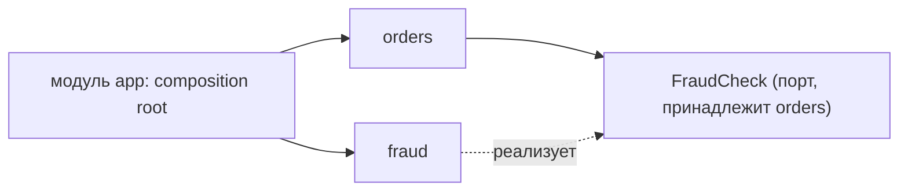

# Модульная архитектура: варианты и как организовать модули

В вопросе спрятаны два разных решения, и ответ только на одно из них - классическая ошибка на собеседовании.

1. **Механизм** - что физически удерживает границу модуля на месте? Соглашение об именовании, компилятор, система сборки, JVM, classloader или сеть?
2. **Критерий** - по каким линиям система вообще разрезана на модули?

Строгое соблюдение неправильных границ хуже, чем отсутствие границ: вы получаете всё трение модульности и никакой независимости. Поэтому механизм - дешёвая половина ответа, а критерий - та половина, от которой зависит, переживёт ли архитектура три года.

## Что на самом деле делает код модулем

Папка - это не модуль. У модуля есть три свойства:

- **Намеренно маленький публичный API** - единственная поверхность, которую остальной системе разрешено вызывать.
- **Скрытые внутренности** - сущности, таблицы, вспомогательные классы, алгоритмы, до которых снаружи не добраться и которые поэтому можно менять без согласований.
- **Явно объявленные зависимости** - вы можете перечислить, что модулю нужно, и что-то этот перечень проверяет.

Отсюда следуют два полезных свойства: модуль можно собрать и протестировать отдельно, и им может владеть одна команда. Модульность - это [инкапсуляция](topic:oop-principles) на уровень выше класса, и здесь действуют те же силы [SOLID](topic:solid-principles): у модуля должна быть одна причина для изменения, и зависеть он должен от абстракций, а не от чужих внутренностей.

Поэтому решающий вопрос к любому варианту модульности такой: **когда разработчик нарушает границу, что происходит и как быстро он об этом узнаёт?**

## Варианты: лестница строгости

Каждый следующий вариант строже предыдущего и дороже его. Слева направо: от дешевле и слабее к дороже и жёстче.


### 1. Пакеты и видимость (только соглашение)

Разложить код по пакетам вроде `orders`, `payments`, `shipping` и использовать **package-private** как значение по умолчанию: `public` остаются только те немногие типы, которые задуманы как API. Самый дешёвый из возможных вариантов, нулевая сложность сборки, и для небольшой системы это правильная стартовая точка.

Слабость в том, что модель доступа Java не совпадает с нужной вам формой. `public` - это «всё или ничего» в масштабе всего приложения, и нет способа сказать «публично для модуля `orders`, невидимо для всех остальных» (см. [default и protected](topic:default-vs-protected)). Как только класс должен стать видимым соседнему пакету внутри того же модуля, он становится видимым всей кодовой базе. Пакет `internal` является внутренним только из-за своего имени, и ничто не мешает `import com.shop.payments.internal.CardCharger;` скомпилироваться. Контроль здесь - code review, то есть контроль в режиме «если кто-нибудь заметит».

### 2. Архитектурные тесты (ArchUnit, Spring Modulith)

Раскладка кода та же, что в варианте 1, но правила становятся исполняемыми. Тест ArchUnit формулирует их, и сборка падает, когда они нарушены:

```java
@Test
void modulesDoNotReachIntoEachOthersInternals() {
    ArchRule rule = noClasses().that().resideOutsideOfPackage("com.shop.payments..")
        .should().accessClassesThat().resideInAPackage("com.shop.payments.internal..");
    rule.check(new ClassFileImporter().importPackages("com.shop"));
}
```

Spring Modulith формализует ту же идею для Spring-приложений: пакет верхнего уровня - это модуль, вложенные пакеты по умолчанию внутренние, `ApplicationModules.of(App.class).verify()` падает на недопустимом доступе и на циклах, а ещё умеет генерировать документацию по графу модулей.

В типичной Spring-кодовой базе это лучший вариант по соотношению цены и пользы. Вы получаете почти компиляторную строгость (падает в CI, на том самом коммите, с сообщением, называющим правило) без разделения сборки. Ограничение в том, что это тест - его можно пометить `@Disabled`, и он видит только то, что видит статический анализ, но не рефлексию и не конфигурацию.

### 3. Модули сборки (Gradle / Maven multi-module)

Каждый модуль становится отдельным подпроектом со своими объявленными зависимостями. Теперь границу соблюдает **компилятор**: если `orders` не объявил `payments` в своём compile classpath, `import com.shop.payments.*` просто не скомпилируется. Циклические зависимости роняют сборку, потому что система сборки не может даже упорядочить компиляцию. Различие Gradle между `api` и `implementation` добавляет второй уровень: зависимость, объявленная как `implementation`, не протекает в compile classpath ваших потребителей.

Это самая прочная граница, которую можно получить, не меняя способ развёртывания приложения, и именно это большинство называет **modular monolith** - один разворачиваемый артефакт, собранный из независимо компилируемых модулей (сравните варианты в теме [Виды монолитных архитектур](topic:monolithic-architecture-types)).

Цена вполне реальная: более медленные и сложные сборки, больше церемоний при переносе класса и настоящее проектное решение каждый раз, когда двум модулям нужен один и тот же тип. При этом рефлексию это не ограничивает, а `public` внутри модуля остаётся `public`.

### 4. JPMS - Java Platform Module System

Начиная с Java 9 файл `module-info.java` объявляет модуль компилятору *и* JVM:

```java
module com.shop.payments {
    requires com.shop.shared.money;
    exports com.shop.payments.api;
    provides PaymentProvider with StripeProvider;   // ServiceLoader binding
}
```

`exports` делает пакет доступным другим; всё остальное недоступно даже через рефлексию, если модуль не сделал `opens`. Зависимости проверяются при старте, поэтому отсутствующий модуль - это ошибка при запуске, а не `NoClassDefFoundError` на каком-нибудь невезучем пути выполнения; split packages запрещены.

Честный ответ на собеседовании: JPMS отлично подходит для **библиотек и самого JDK** и редко встречается в **прикладном коде**. Фреймворкам нужен глубокий рефлексивный доступ, многие сторонние jar до сих пор поставляются без `module-info`, а смешение classpath и module path - источник запутанных отказов. Понимание, почему это не ответ по умолчанию, ценится выше, чем пересказ синтаксиса.

### 5. Runtime-модули и плагины (OSGi, ServiceLoader, микроядро)

Здесь модули - это единицы, которые можно установить, обновить, запустить и остановить прямо во время работы приложения. OSGi даёт каждому bundle собственный [classloader](topic:classloader) с явно импортируемыми и экспортируемыми пакетами, так что два bundle могут использовать даже разные версии одной библиотеки. `ServiceLoader` - облегчённая версия: интерфейс плюс реализации, обнаруживаемые в classpath, благодаря чему плагин добавляется подкладыванием jar. Spring Boot starter - та же идея, выраженная через автоконфигурацию, см. [Spring Boot Starter Web и свои starter'ы](topic:spring-boot-starter-web).

Это правильная форма, когда ваш продукт расширяют сторонние разработчики или когда набор функций действительно различается от установки к установке: IDE, CI-серверы, CMS-платформы, коробочные бизнес-инструменты. Точки расширения обычно оформляются как интерфейсы [Strategy](topic:strategy), которые ядро вызывает, ничего не зная о реализациях. Плата - гораздо более сложная модель выполнения: утечки classloader, версионирование, ошибки жизненного цикла, - ради того, что большинству бизнес-приложений никогда не понадобится.

### 6. Отдельные сервисы

Последняя ступень: граница модуля становится границей процесса и сетевым вызовом. Изоляция теперь абсолютная - возможны другой язык и другая база данных, и никакой трюк компилятора не позволит одному сервису прочитать поля другого. Взамен каждый внутрипроцессный вызов превращается в распределённый, со всеми частичными отказами, задержками, сериализацией, версионированием и eventual consistency ([Зачем нужны микросервисы](topic:why-microservices), [Типы взаимодействия между микросервисами](topic:microservice-interaction-types)).

Обратите внимание, откуда здесь берётся строгость: сеть останавливает *случайную* связанность, а не намеренную. Сервисы, которые обязаны выпускаться вместе, - это distributed monolith с дополнительной задержкой.

| Механизм | Границу соблюдает | Вы узнаёте | Изоляция | Цена |
| --- | --- | --- | --- | --- |
| Пакеты + видимость | соглашение, review | возможно, никогда | слабая | нет |
| Архитектурные тесты | тест в CI | на коммите | средняя | один тестовый модуль |
| Модули сборки | компилятор | на каждой сборке | сильная (компиляция) | сложность сборки |
| JPMS | компилятор + JVM | при компиляции и старте | сильная (+ рефлексия) | трение инструментов |
| Runtime-плагины | classloader'ы | при установке | сильная, динамическая | высокая сложность в рантайме |
| Сервисы | сеть | в рантайме, в проде | полная | распределённость |

Разумное значение по умолчанию для Java-системы бизнес-приложения: **пакеты + архитектурные тесты**, с повышением до **модулей сборки**, когда растёт кодовая база или число команд, и до **сервисов** - только для тех конкретных модулей, где есть настоящая причина (независимое масштабирование, независимый темп релизов, отдельное владение, изоляция рисков).

## Как организовать модули

Механизм выше - это контроль. Всё, что ниже, - это проектирование, и оно применимо на *каждой* ступени: одни и те же правила определяют границы пакетов в маленьком монолите и границы сервисов в большой системе.

### Резать по бизнес-возможностям, а не по техническим слоям

Самое ценное правило. Сравните две раскладки:



В дереве «слои сверху» пакет `controllers` содержит все контроллеры продукта. Добавление одной фичи трогает все три пакета, каждый пакет находится в общем владении, и ни одну часть нельзя удалить, вынести или осмыслить отдельно: дерево рассказывает, чем код *является*, и никогда - что приложение *делает*. Слои - хорошая внутренняя структура **внутри** модуля; как декомпозиция верхнего уровня они плохи.

Модули «по фичам» - это то же самое, что DDD называет **bounded context**: срез бизнеса со своим словарём и своей моделью. Полезная проверка - *удаляемость*: если бы продукт завтра отказался от бонусных баллов, смогли бы вы удалить один каталог и починить только ошибки компиляции на его объявленном API?

### Дать каждому модулю API и скрытые внутренности



Соглашение, которое работает везде: модуль - это `com.shop.payments` с публичным пакетом `api` (несколько интерфейсов, DTO и событий), а всё остальное вложено и недостижимо. Держите API в *собственных* типах модуля: в ту секунду, когда метод в `orders` принимает JPA-сущность из `payments`, эти два модуля делят схему базы и транзакцию, что бы ни говорила раскладка папок. Для API предпочтителен [интерфейс](topic:interface-vs-abstract-class), а реализация пусть остаётся внутренней.

### Держать граф зависимостей ациклическим

Два модуля, зависящие друг от друга, - это один модуль под двумя именами: ни один из них нельзя собрать, протестировать, понять или вынести отдельно. Это Acyclic Dependency Principle, и это то единственное правило, ради которого стоит ронять сборку. Модули сборки и JPMS обеспечивают его бесплатно; ArchUnit и Spring Modulith проверяют его явно.

Предпочитайте зависимости, направленные к **стабильному** и **общему**: от `shared.money` могут зависеть многие модули; от `reporting` не должен зависеть никто.

### Инвертировать стрелку, когда она смотрит не туда

`orders` должен выполнить проверку на мошенничество, но зависимость `orders` от `fraud` (который зависит от `customers`, который зависит от `orders`) создаёт цикл. Не добавляйте «вспомогательный» модуль - инвертируйте зависимость ровно так, как предписывает [Dependency Inversion](topic:solid-principles). `orders` объявляет нужный ему порт (`FraudCheck`) в собственном API; `fraud` его реализует; composition root связывает их, используя [внедрение зависимостей](topic:spring-ioc-di), а не прямой вызов конструктора.



Один модуль `app` (или `bootstrap`) знает все модули и связывает их; от `app` не зависит никто. Обычно там же живут Spring-конфигурация, веб-слой и границы транзакций.

### Вызывать ради ответа, публиковать события ради реакций

Прямой вызов API другого модуля уместен, когда ответ нужен прямо сейчас: `inventory.isAvailable(sku)`. И он неуместен, когда другому модулю нужно всего лишь *отреагировать*, потому что «при оформлении заказа ещё начислить баллы, ещё отправить чек, ещё обновить аналитику» превращает `orders` в модуль, импортирующий всё приложение.

Вместо этого публикуйте `OrderPlaced` и позвольте заинтересованным модулям подписаться. Внутри процесса это `ApplicationEventPublisher` из Spring, желательно с [@TransactionalEventListener](topic:spring-transactional-event-listener), чтобы подписчики выполнялись после коммита, а не внутри чужой транзакции. Направление зависимости разворачивается: подписчики зависят от типа события издателя, а издатель не зависит ни от кого.

Заодно это тот дизайн, который переживает вынос в сервис. Когда модуль позже становится сервисом, внутрипроцессное событие превращается в сообщение, и тому же коду понадобятся [Outbox pattern](topic:outbox-pattern), чтобы публиковать его надёжно, и [Inbox pattern](topic:inbox-pattern), чтобы потреблять его идемпотентно, - *форма* кода не меняется, меняется только транспорт (сравните перечень в теме [Варианты настройки взаимодействия между сервисами](topic:inter-service-communication-options)).

### Отдать каждому модулю его данные

Граница, которая решает, будет ли вынос вообще возможен, находится не в Java-коде, а в базе данных. Каждый модуль владеет своими таблицами; другие модули добираются до них только через его API. В одной базе **схема на модуль** делает это видимым и управляемым через права доступа; внешние ключи и join'ы между схемами модулей - это то, что стоит запретить, потому что каждый такой join сваривает два модуля на уровне хранения. Согласованность между модулями тогда становится проектным решением - событие и компенсирующее действие вместо одной большой транзакции.

Модуль с чистым API, но общими таблицами не является модульным. У него просто вежливая парадная дверь и незапертая задняя.

### Держать общий модуль крошечным - или не иметь его вовсе

В любой кодовой базе вырастает модуль `common` / `core` / `utils`, и это самый надёжный способ разрушить граф модулей: от него зависит всё, поэтому его нельзя менять, а поскольку от него зависит всё, в нём в итоге оказывается всё - включая доменные типы того модуля, который успел первым.

Работающие правила: общий модуль содержит только стабильные, независимые от других модулей и от домена типы (`Money`, `PageRequest`, вспомогательный валидатор). Если тип принадлежит домену одного модуля, он живёт там и экспортируется. И **немного дублирования лучше неправильной общей абстракции**: два модуля, у каждого из которых есть `Customer` с разными полями, обычно имеют два разных понятия, а не одно общее.

### Соразмерять модуль с командой и возможностью

Закон Конвея - не предупреждение, а входное условие проектирования: граф модулей и граф команд сходятся, планируете вы это или нет. Модуль должен быть тем, чем одна команда может владеть от начала до конца и что один человек может удержать в голове, - обычно это тысячи строк, а не сотни и не сотни тысяч. Модуль на класс даёт граф зависимостей, в котором невозможно ориентироваться; модуль на отдел даёт тот самый клубок, от которого вы убегали.

### Обеспечивать соблюдение механически

Правило, которое никто не проверяет, - это пожелание, и любая задокументированная архитектура вырождается до того, что разрешает компилятор. Выберите хотя бы одно: тесты ArchUnit, `ApplicationModules.verify()`, отдельные модули сборки, `CODEOWNERS` на каталогах модулей. Запускайте это в CI на каждом коммите и относитесь к падению как к падению сборки, а не как к поводу для обсуждения.

## Ответ на собеседовании (60 секунд)

> Здесь два вопроса. Механизмы образуют лестницу растущей строгости и цены. Внизу - пакеты плюс package-private видимость: бесплатно, но в Java нет «public только внутри моего модуля», поэтому соблюдение обеспечивает только review. Дальше архитектурные тесты: ArchUnit или Spring Modulith выражают правила исполняемым тестом, который роняет сборку при недопустимом доступе или цикле; в типичной Spring-кодовой базе это лучший вариант по цене и пользе. Выше - модули сборки Gradle или Maven, где направление зависимостей соблюдает компилятор, потому что модуля просто нет в classpath: это и есть modular monolith. Затем JPMS с `module-info.java`, который добавляет инкапсуляцию в рантайме и от рефлексии; отлично для библиотек, редко в приложениях, потому что фреймворкам нужна рефлексия, а инструменты сопротивляются. Затем runtime-системы плагинов, OSGi или `ServiceLoader`, где модули устанавливаются и версионируются во время работы: правильно для расширяемых продуктов, избыточно в остальных случаях. И наконец отдельные сервисы, где границей становятся процесс и сеть. Что до организации: резать по бизнес-возможностям, а не по техническим слоям, чтобы фича лежала в одном месте и её можно было удалить или вынести; дать каждому модулю узкий пакет api и скрытые внутренности; держать граф ациклическим и инвертировать стрелку через порт, когда она смотрит не туда; вызывать напрямую, когда нужен ответ, и публиковать события, когда другие просто реагируют; отдать каждому модулю его таблицы без join'ов между модулями; держать общий модуль крошечным; соразмерять модули с командами; и проверять всё это в CI, потому что непроверяемая граница - это пожелание. Мой вариант по умолчанию: пакеты плюс архитектурные тесты, модули сборки при росте кодовой базы или числа команд, сервисы - только там, где есть конкретная причина.

## Практическая ценность

**Модульность - это то, что делает монолит выносимым.** Никто не мигрировал ком грязи в микросервисы успешно. Команды, у которых получилось, сначала сделали модульную работу внутри одного процесса, где рефакторинг дёшев, а ошибка стоит переименования, а не миграции схемы и цикла устаревания. Если границы модулей не держатся даже когда компилятор на вашей стороне, добавление сети обнажит связанность, а не устранит её.

**Уровень строгости должен следовать за болью, а не за модой.** Разделение кодовой базы на пятерых разработчиков на пятнадцать Gradle-модулей покупает медленные сборки и бесконечные правки `build.gradle`. Оставить кодовую базу на сорок разработчиков на пакетных соглашениях - купить границу, которая два года тихо размывается. Начинайте с самой дешёвой ступени, на которой уже больно, и поднимайтесь на одну ступень, когда она перестаёт работать.

**Время сборки и удобство в IDE - тоже архитектурные вопросы.** Модули сборки на больших размерах дают инкрементальную компиляцию и параллельные сборки, но на малых добавляют накладные расходы к каждому изменению. Измеряйте перед разделением: решение по модульности, которое замедляет цикл «правка - компиляция - тест», рано или поздно проиграет поведению разработчиков.

**Общий модуль - место, где умирают архитектуры.** Следите за числом его зависимостей на code review. Когда `common` начинает импортировать доменный тип или фреймворк, граф уже схлопнулся: теперь от этого фреймворка и этого домена транзитивно зависят все модули.

**Границам модулей нужны владельцы, а не только правила.** `CODEOWNERS` на каталог модуля превращает границу в разговор на review с владеющей командой. Без владения границу размывает тот, у кого горит срок, и отвечать за это некому.

## Частые заблуждения

- **«Модульность означает микросервисы».** Микросервисы - это один из механизмов, самый дорогой. У хорошо промодуляризованного монолита те же границы, но с внутрипроцессными вызовами, без частичных отказов и распределённых транзакций. Модульность про связанность; микросервисы про независимое развёртывание.
- **«Слои - это модули».** Слои разделяют технические заботы, модули - бизнес-возможности. Трёхслойное приложение с одной общей базой - это один модуль с тремя внутренними уровнями, и каждая фича по-прежнему пересекает их все. Слоите *внутри* модуля, а не над ним.
- **«Структура пакетов - это структура модулей».** Только если её что-то соблюдает. Без дисциплины видимости плюс теста или границы сборки `orders.internal` - это соглашение об именовании, и первый же дедлайн превращает его в import.
- **«JPMS - это как теперь делают модули в Java».** JPMS - самый сильный внутрипроцессный механизм и по-настоящему редкий в прикладном коде. Большая часть продакшен-модульности в Java - это модули сборки плюс архитектурные тесты. Утверждать обратное на собеседовании значит показать теорию вместо практики.
- **«Вынесем общий код в модуль common».** Только если он стабильный, маленький и не зависит от домена. Иначе вы построили хаб, который связывает каждый модуль с каждым и который уже нельзя изменить. Дублирование дешевле неправильной абстракции.
- **«Чем больше модулей, тем лучше архитектура».** Сотня крошечных модулей с плотным графом зависимостей хуже десяти связных: связанность никуда не делась, её просто стало труднее увидеть. Судите по графу, а не по количеству.
- **«Общая база нормальна, пока код модульный».** Именно связанность и закрывает дискуссию. Два модуля, пишущих в одни таблицы, делят схему, миграцию, блокировку и развёртывание, и ни один из них нельзя вынести без разделения данных. Владение данными и есть настоящая граница.
- **«Модули не должны общаться друг с другом».** Обязаны - иначе нет системы. Правило про *как*: через объявленный API и события, в одну сторону, никогда во внутренности.
- **«Промодуляризуем позже, когда станет больно».** Границы дёшево нарисовать и дорого достроить задним числом, потому что к тому моменту сущности, транзакции и таблицы уже переплетены. Дешёвая версия - раскладка пакетов по фичам и один тест ArchUnit - стоит одного вечера в первый день.
- **«API gateway или service mesh дадут нам модульность».** Они управляют трафиком между тем, что уже разделено (см. [Зачем нужен API Gateway](topic:api-gateway)). Ничто на сетевом уровне не создаёт границу, которой нет в коде и в схеме базы.
