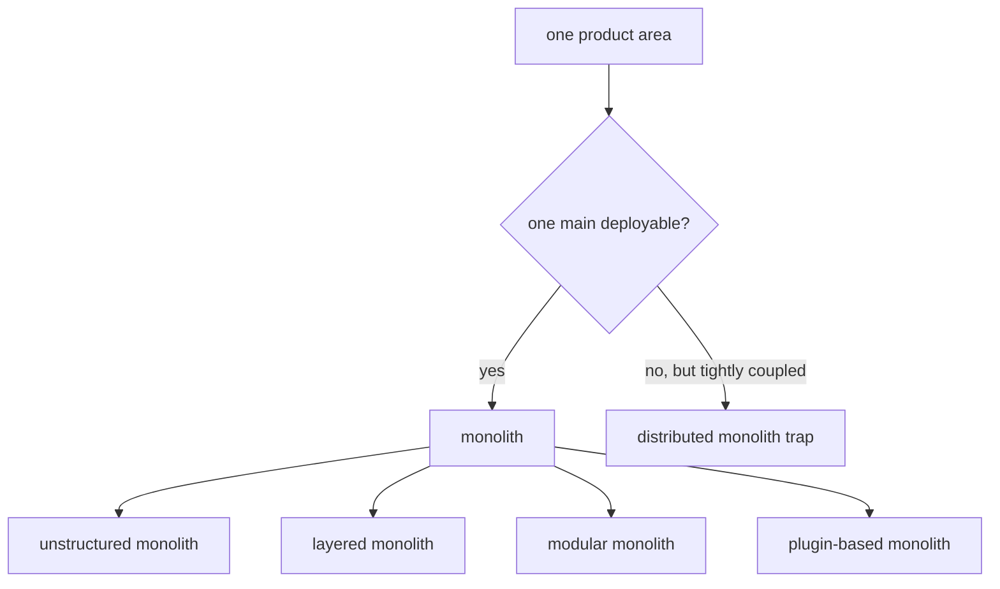
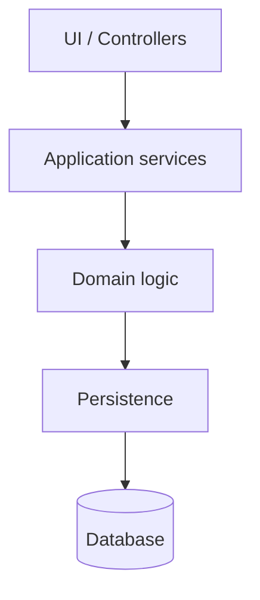
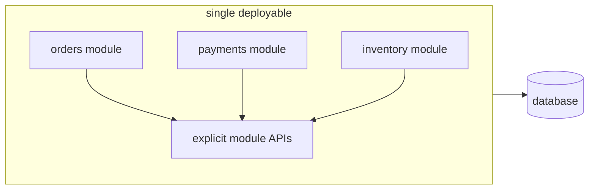

# Types of Monolithic Architectures

## Core idea

A **monolith** is an application where the business capability is delivered as one main deployable unit: one application artifact, one release train, and usually one runtime process or tightly coordinated set of tiers. It can still have clean internal design. A restaurant can have one building and one front door, but inside it may have separate stations for salads, grill, cashier, and dishes.

The useful interview distinction is not "monolith bad, microservices good." The real question is: **where are the boundaries, and what must be deployed together?** Like a post office, the building may be one place, but the counters can be chaotic, layered by function, or carefully separated by service.

## Main types

### 1. Unstructured monolith

An **unstructured monolith** is one deployable with weak boundaries: controllers call repositories directly, business rules are scattered, modules know too much about each other, and changes in one area often break another. It is still simple to deploy, but hard to change safely. In kitchen terms, everyone cooks, washes, takes payments, and rewrites the menu at the same table.

This is often what people mean when they complain about "the monolith", but the problem is not the single deployable itself. The problem is uncontrolled coupling.

### 2. Layered monolith

A **layered monolith** keeps code in horizontal layers such as UI/controllers, application services, domain logic, and persistence. Each layer has a responsibility and usually calls only the layer below it. It is like a post office line: the clerk receives the request, the sorting desk processes it, and the storage room keeps the parcels.

Layering helps separate technical responsibilities, but it does not automatically separate business domains. An `OrderService` and `BillingService` can still share the same tables, entities, and transaction scripts. Spring applications often start here, especially with clear [IoC and dependency injection](topic:spring-ioc-di).

### 3. Modular monolith

A **modular monolith** is still one deployable, but the code is split into business modules with explicit APIs and hidden internals: for example `orders`, `payments`, `inventory`, and `customers`. Each module owns its model and rules, and other modules interact through public interfaces, events, or application services rather than reaching into its tables and classes. Think of one post office building with separate windows: parcels, passports, and payments share the roof, but each counter has its own queue and rules.

This style is often the best first answer for growing systems. You get local calls, one deployment, and simpler operations, while preserving boundaries that can later become services if there is a real reason. If a module later needs independent scaling or release ownership, patterns like the [Outbox pattern](topic:outbox-pattern) and [Inbox pattern](topic:inbox-pattern) become relevant during extraction.

### 4. Plugin-based or microkernel monolith

A **plugin-based monolith** has a small core and optional extensions loaded around it. The whole product may still be deployed as one application, but features are organized as plugins. Examples include admin platforms, IDE-like products, CMS systems, and internal business tools. It is like a shopping mall: one building, shared electricity and security, but separate shops can be added or removed.

This style works when the core workflow is stable and extension points are well defined. It fails when every plugin starts depending on every other plugin's internals, just like a mall becomes hard to renovate if every shop secretly shares the same storage room.

### 5. N-tier monolith

An **N-tier monolith** splits deployment by technical tier: web server, application server, and database server. It may run on several machines, but if the application layer is one codebase released together, it is still monolithic from an architecture and ownership point of view. It is like a restaurant with a dining room, kitchen, and pantry in different rooms: the customer journey still depends on one restaurant operating as a unit.

Do not confuse tiers with services. A separate database server is not a microservice boundary. Database design topics such as [normalization](topic:database-normalization) and [indexes](topic:database-indexes) still matter, but they do not by themselves create service autonomy.

### 6. Distributed monolith

A **distributed monolith** is the trap: several separately deployed services behave as if they were one monolith because they must be released together, call each other synchronously for every operation, share database tables, or cannot tolerate one service being down. It is like splitting one post office into five buildings, then requiring the customer to drive between all five counters for one parcel.

It has the operational cost of microservices without the autonomy. In an interview, call it an anti-pattern, not a healthy type of monolith.

## How to compare them

Use four questions:

- **Deployment unit:** does the whole business capability ship as one artifact or many? This is the building's front door.
- **Code boundaries:** can one area use another area's internals directly? This is whether kitchen staff can grab ingredients from any station without asking.
- **Data ownership:** does each module own its data model, or does everyone write the same tables? This is whether every post office counter uses one shared drawer.
- **Change autonomy:** can a team change and test one area without surprising the rest? This is whether a road lane can be repaired without closing the whole city.

## Interview answer (60 seconds)

> Monoliths differ mainly by internal boundaries and deployment coupling. The simplest form is an unstructured monolith: one deployable with tangled code and shared data. A layered monolith adds technical layers like controller, service, domain, and persistence, which improves separation of responsibilities but may still mix business domains. A modular monolith keeps one deployable but splits the system into business modules with explicit APIs and hidden internals; this is often a strong architecture for medium systems and a good step before extracting services. A plugin-based or microkernel monolith has a core plus extensions. An N-tier monolith may place UI, app, and DB on different servers, but the application is still released as one unit. A distributed monolith is an anti-pattern: multiple services that still must be changed, released, or queried together.

## Production relevance

Choosing the monolith style affects deployment speed, team ownership, test scope, and future migration. A clean modular monolith can serve production for years with less operational overhead than premature microservices. A messy monolith can block delivery even on one server. A distributed monolith can be worse than both because network calls, deployment coordination, and shared data all become daily friction.

In real work, start with the simplest shape that preserves boundaries. Like traffic lanes, paint the lanes before you build bridges. If the team cannot keep module boundaries inside one process, splitting into services will usually make the coupling visible, not remove it.

## Common misconceptions

- "Monolith" means "bad architecture." No. A monolith can be layered or modular and very maintainable.
- "Modular monolith is the same as microservices." No. It has internal business boundaries but one deployment unit.
- "N-tier means microservices." No. Tiers split technical runtime pieces, not business ownership.
- "A shared database always proves the design is wrong." Not always inside a monolith, but uncontrolled shared writes make later extraction difficult.
- "Distributed monolith is better because it has services." No. If services must move together, the system has extra network and deployment cost without independence.
- "Layered architecture guarantees clean domains." No. Layers separate technical concerns; modules separate business capabilities.
