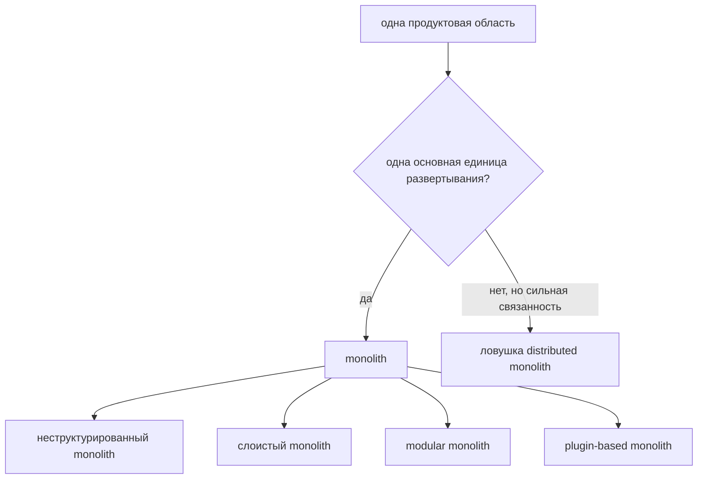
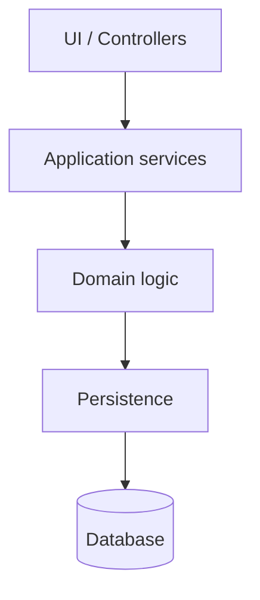
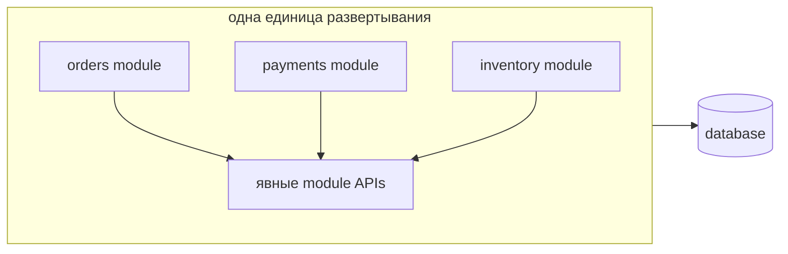

# Виды монолитных архитектур

## Главная идея

**Monolith** - это приложение, где бизнес-возможность поставляется как одна основная единица развертывания: один application artifact, один release train и обычно один runtime process или тесно согласованный набор tiers. При этом внутри у него может быть чистый дизайн. Ресторан может быть одним зданием с одним входом, но внутри могут быть отдельные станции для салатов, гриля, кассы и мойки.

Полезное различие на собеседовании не в том, что "monolith плохой, microservices хорошие". Настоящий вопрос: **где проходят границы и что должно развертываться вместе?** Как в почтовом отделении: здание может быть одно, но окна могут быть хаотичными, разделенными по слоям или аккуратно разделенными по услугам.

## Основные виды

### 1. Неструктурированный monolith

**Неструктурированный monolith** - это одна единица развертывания со слабыми границами: controllers вызывают repositories напрямую, business rules разбросаны, modules знают друг о друге слишком много, а изменение в одной области часто ломает другую. Его все еще просто развернуть, но трудно безопасно менять. В кухонной аналогии все готовят, моют, принимают оплату и переписывают меню за одним столом.

Часто именно это имеют в виду, когда жалуются на "монолит", но проблема не в самой единой единице развертывания. Проблема в неконтролируемой связанности.

### 2. Слоистый monolith

**Слоистый monolith** держит код в горизонтальных слоях: UI/controllers, application services, domain logic и persistence. У каждого слоя своя ответственность, и обычно слой вызывает только слой ниже. Это похоже на очередь в почтовом отделении: сотрудник принимает запрос, сортировочный стол его обрабатывает, а кладовая хранит посылки.

Слои помогают разделить технические ответственности, но не автоматически разделяют бизнес-домены. `OrderService` и `BillingService` все еще могут делить одни таблицы, entities и transaction scripts. Spring-приложения часто начинают отсюда, особенно при понятных [IoC и dependency injection](topic:spring-ioc-di).

### 3. Modular monolith

**Modular monolith** все еще остается одной единицей развертывания, но код разделен на бизнес-модули с явными APIs и скрытыми internals: например `orders`, `payments`, `inventory` и `customers`. Каждый module владеет своей model и rules, а другие modules взаимодействуют через public interfaces, events или application services, а не лезут напрямую в его tables и classes. Представьте одно почтовое отделение с отдельными окнами: посылки, паспорта и платежи под одной крышей, но у каждого окна своя очередь и правила.

Такой стиль часто лучший первый ответ для растущих систем. Вы получаете local calls, одно deployment и более простую эксплуатацию, но сохраняете границы, которые позже можно превратить в services при реальной необходимости. Если module позже потребует независимого scaling или release ownership, при выделении становятся важны [Outbox pattern](topic:outbox-pattern) и [Inbox pattern](topic:inbox-pattern).

### 4. Plugin-based или microkernel monolith

**Plugin-based monolith** имеет небольшое core и optional extensions, загружаемые вокруг него. Весь продукт все еще может развертываться как одно приложение, но функции организованы как plugins. Примеры - admin platforms, IDE-like products, CMS systems и внутренние business tools. Это похоже на торговый центр: одно здание, общие электричество и охрана, но отдельные магазины можно добавлять или убирать.

Этот стиль работает, когда core workflow стабилен, а extension points хорошо определены. Он ломается, когда каждый plugin начинает зависеть от internals каждого другого plugin, как торговый центр становится трудно ремонтировать, если все магазины тайно делят одну кладовку.

### 5. N-tier monolith

**N-tier monolith** разделяет deployment по техническим tiers: web server, application server и database server. Он может работать на нескольких машинах, но если application layer - это один codebase, который выпускается вместе, с точки зрения architecture и ownership он все еще монолитный. Это как ресторан с залом, кухней и кладовой в разных комнатах: путь клиента все равно зависит от одного ресторана как единого целого.

Не путайте tiers с services. Отдельный database server не является microservice boundary. Темы проектирования БД вроде [normalization](topic:database-normalization) и [indexes](topic:database-indexes) все еще важны, но сами по себе они не создают автономию services.

### 6. Distributed monolith

**Distributed monolith** - это ловушка: несколько отдельно развертываемых services ведут себя как один monolith, потому что их нужно выпускать вместе, они синхронно вызывают друг друга для каждой операции, делят database tables или не переносят недоступность одного service. Это как разделить одно почтовое отделение на пять зданий, а потом заставить клиента объезжать все пять окон ради одной посылки.

У него операционная цена microservices без автономии. На собеседовании называйте это anti-pattern, а не здоровым видом монолита.

## Как их сравнивать

Используйте четыре вопроса:

- **Deployment unit:** вся бизнес-возможность поставляется одним artifact или многими? Это входная дверь здания.
- **Code boundaries:** может ли одна область напрямую использовать internals другой? Это как ситуация, где сотрудники кухни могут без спроса брать ингредиенты с любой станции.
- **Data ownership:** каждый module владеет своей data model или все пишут в одни tables? Это как если бы все окна почты пользовались одним общим ящиком.
- **Change autonomy:** может ли команда изменить и протестировать одну область без сюрпризов для остальных? Это как ремонт дорожной полосы без закрытия всего города.

## Ответ на собеседовании за 60 секунд

> Монолиты отличаются прежде всего внутренними границами и связанностью развертывания. Самая простая форма - неструктурированный monolith: одна единица развертывания со спутанным кодом и общими данными. Layered monolith добавляет технические слои вроде controller, service, domain и persistence, что улучшает разделение ответственностей, но бизнес-домены все еще могут смешиваться. Modular monolith оставляет одну единицу развертывания, но делит систему на бизнес-модули с явными APIs и скрытыми internals; это часто сильная архитектура для средних систем и хороший шаг перед выделением services. Plugin-based или microkernel monolith имеет core и extensions. N-tier monolith может размещать UI, app и DB на разных серверах, но приложение все равно выпускается как единое целое. Distributed monolith - anti-pattern: несколько services, которые все равно нужно менять, выпускать или запрашивать вместе.

## Практическая важность

Выбор вида монолита влияет на скорость deployment, ownership команд, scope тестирования и будущую миграцию. Чистый modular monolith может годами жить в production с меньшими операционными затратами, чем преждевременные microservices. Запутанный monolith может тормозить поставку даже на одном сервере. Distributed monolith может быть хуже обоих вариантов, потому что network calls, координация deployment и shared data становятся ежедневным трением.

В реальной работе начинайте с самой простой формы, которая сохраняет границы. Как с дорожным движением: сначала нарисуйте полосы, прежде чем строить мосты. Если команда не может удержать module boundaries внутри одного process, разделение на services обычно только покажет связанность, а не уберет ее.

## Частые заблуждения

- "Monolith" значит "плохая архитектура". Нет. Monolith может быть layered или modular и хорошо сопровождаться.
- "Modular monolith - это то же самое, что microservices." Нет. У него есть внутренние бизнес-границы, но одна единица развертывания.
- "N-tier значит microservices." Нет. Tiers разделяют технические runtime-части, а не бизнес-владение.
- "Shared database всегда доказывает, что дизайн плохой." Не всегда внутри monolith, но неконтролируемые shared writes осложняют будущее выделение services.
- "Distributed monolith лучше, потому что там есть services." Нет. Если services должны двигаться вместе, система получает лишние network и deployment costs без независимости.
- "Layered architecture гарантирует чистые domains." Нет. Layers разделяют technical concerns; modules разделяют business capabilities.
