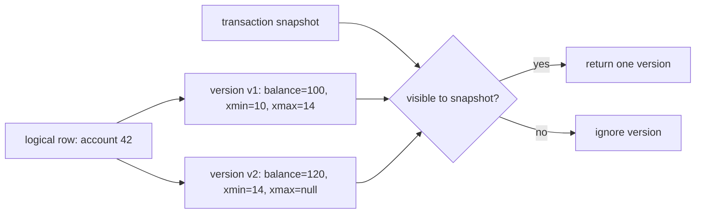
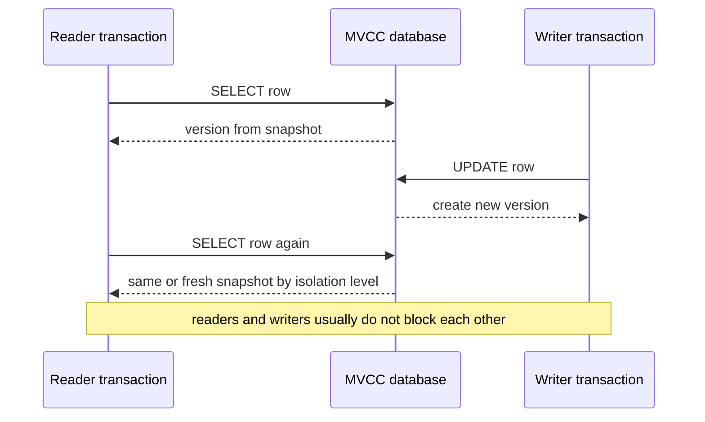

# MVCC: Multi-Version Concurrency Control

**MVCC** means **Multi-Version Concurrency Control**. Instead of forcing every
reader and writer to stand in one line, the database keeps multiple versions of a
row and lets each transaction read the version that belongs to its snapshot. It
is part of the practical isolation story behind [ACID](topic:acid-principles).
Think of a busy post office: a clerk can work from a stamped copy of a form while
another clerk prepares a newer copy, so the counter does not stop for every edit.

In a simple lock-only design, a writer might block readers until the update is
finished, and readers might block writers to keep their view stable. MVCC changes
that tradeoff: writers create new versions, and readers choose an older or newer
visible version according to the isolation level. It is like a kitchen order
board where cooks read a photo of the board while the manager pins a newer ticket
beside the old one.

## The Core Idea

A row that looks like one business record may have several physical versions.
Each version carries metadata such as the transaction that created it and,
eventually, the transaction that replaced or deleted it. A snapshot is the
transaction's rule for deciding which versions count as visible. Everyday hook:
the parcel is one delivery order, but the post office keeps several stamped
copies; the clerk uses the copy that was valid for their queue number.

When transaction A updates a row, it does not have to overwrite the old version
in place for every current reader. It can mark the old version as superseded and
create a new version. A reader whose snapshot started earlier can still see the
old version, while a later reader can see the new committed version. Analogy:
the kitchen does not erase yesterday's recipe card while a cook is still using
it; it places the updated card next to it and lets each cook use the right card.

## Readers And Writers

The headline advantage is high read concurrency. Ordinary `SELECT` statements
usually read a snapshot and do not wait for an unrelated writer to finish. The
writer creates a new version, and the reader keeps seeing the version allowed by
its snapshot. Traffic analogy: one car can use the old lane marking while road
workers paint the new lane, as long as the traffic controller knows which marking
applies to that car.

MVCC does **not** mean "no locks". Writers can still conflict with other writers
updating the same row, unique constraints still need enforcement, and higher
isolation levels may detect unsafe dependency patterns. For example, PostgreSQL
can abort a `SERIALIZABLE` transaction if the concurrent result cannot be
explained as a safe serial order. Everyday hook: two clerks may read different
copies of a schedule, but if both try to reserve the same desk, the office still
needs a rule to choose or retry.

## Snapshots And Isolation Levels

MVCC is the mechanism; isolation level is the policy that says **when** a
snapshot is taken and **how strict** the database must be. In PostgreSQL,
`READ COMMITTED` gives each statement a fresh snapshot, while `REPEATABLE READ`
uses one stable transaction snapshot. See the focused topic on
[PostgreSQL isolation levels](topic:postgresql-isolation-levels) for the exact
PostgreSQL behavior. Analogy: a cashier may look at the shelf before each
customer question, or use one printed stock sheet for the whole shift.

This is also why MVCC helps prevent `dirty read`: a transaction normally does not
show versions created by another transaction that has not committed. The reader
chooses from committed, snapshot-visible versions instead of peeking at unfinished
work. Post office analogy: a clerk can read stamped forms, not pencil drafts that
may be thrown away.

MVCC also shapes classic [transaction read anomalies](topic:transaction-read-anomalies).
Snapshots can prevent dirty reads and, depending on the isolation level, can make
repeated reads stable. But snapshot isolation alone is not the same as full
serializability; cross-row rules may still need constraints, explicit locks, or
retry logic. Kitchen analogy: each cook may have a consistent photo of the board,
but two cooks can still make decisions that leave the final pantry count wrong.

## Cleanup Cost

Multiple versions are useful only while some active snapshot may still need them.
After no transaction can see an old version, the database must clean it up. In
PostgreSQL this is associated with `VACUUM`; other systems use their own garbage
collection or version cleanup. Everyday hook: a post office keeps old copies of
forms while disputes are possible, but boxes overflow if nobody archives or
throws away expired copies.

Long transactions make this harder because they may keep old snapshots alive for
a long time. The database has to retain older row versions, which can increase
storage, slow scans, and create bloat. Analogy: one cook holding an old kitchen
board photo all afternoon forces everyone to keep old recipe cards on the table.

## 60-Second Interview Answer

MVCC is a concurrency-control technique where the database stores multiple
versions of a row and each transaction reads the version visible to its snapshot.
It lets ordinary readers and writers run concurrently: a writer creates a new row
version instead of making every reader wait, and a reader keeps using the version
allowed by its isolation level. MVCC helps prevent dirty reads because
uncommitted versions are not visible to normal snapshots. It is the mechanism
behind behavior such as PostgreSQL `READ COMMITTED` using a fresh statement
snapshot and `REPEATABLE READ` using a stable transaction snapshot. MVCC does not
remove all conflicts: writers still need conflict checks, constraints still
matter, and serializable isolation may require transaction retries. The cost is
version cleanup, because old row versions must be removed once no active
transaction can see them.

## Production Relevance

MVCC is why many OLTP databases can serve reports and API reads while writes are
happening. A product page can read a consistent price and inventory snapshot
while checkout updates another version. Real-world hook: the shop can keep
selling from the current shelf list while the stock clerk prepares the next list.

It affects how you choose isolation. Default `READ COMMITTED` is often enough for
request-by-request business operations, but reports, exports, and multi-step
checks may need a stable snapshot or stronger protection. Analogy: a cashier can
check the shelf live for one customer, while an auditor should use one printed
inventory sheet for the whole count.

It also affects operations. Long transactions, forgotten idle sessions, and slow
batch jobs can keep old versions alive and make cleanup fall behind. Analogy: if
one clerk never returns an old form copy, the office has to keep a pile of old
paper that everyone else thought was finished.

## Common Misconceptions

- "MVCC means reads never block and writes never block." Not always. Ordinary
  readers usually avoid blocking writers, but writers can block or conflict with
  writers, and some statements take locks. A post office can process copies in
  parallel, but two clerks cannot both stamp the same final slot.
- "MVCC means every transaction sees the latest data." No. A snapshot may
  intentionally show an older committed version. A cook using a printed board
  does not see a ticket pinned up five minutes later.
- "MVCC is the same as SERIALIZABLE." No. MVCC is a mechanism used by several
  isolation levels; serializable behavior needs extra rules or conflict detection.
  Traffic lanes are the mechanism; the traffic law decides which crossing pattern
  is legal.
- "Old versions are free." They cost storage and cleanup work until no snapshot
  can see them. Keeping every old parcel label makes the counter slower.
- "MVCC prevents all anomalies automatically." It prevents some visibility
  problems, but write skew, lost update patterns, and business invariants may need
  constraints, locks, atomic updates, or retries. A consistent kitchen photo does
  not by itself stop two cooks from taking the last ingredient.
