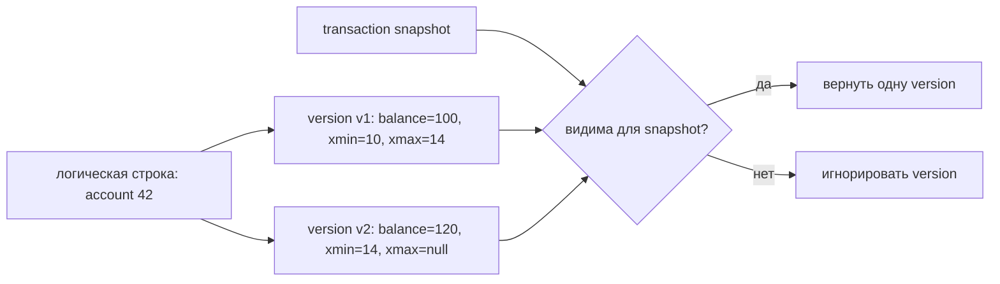
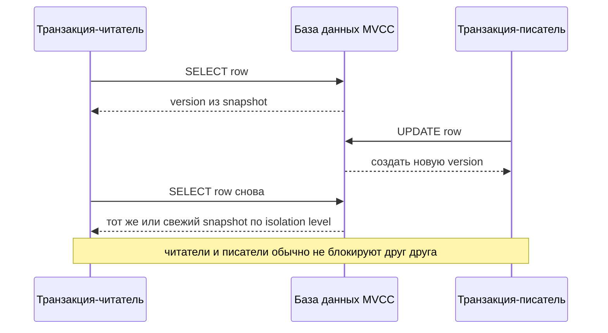

# MVCC: многоверсионное управление параллельным доступом

**MVCC** означает **Multi-Version Concurrency Control** - многоверсионное
управление параллельным доступом. Вместо того чтобы ставить каждого читателя и
писателя в одну очередь, база данных хранит несколько версий строки и позволяет
каждой транзакции читать версию, которая подходит ее snapshot. Это часть
практической истории isolation в [ACID](topic:acid-principles). Представь
загруженное почтовое отделение: сотрудник работает со stamped copy формы, пока
другой сотрудник готовит более новую копию, поэтому стойка не останавливается
из-за каждой правки.

В простой схеме только на locks писатель мог бы блокировать читателей до конца
обновления, а читатели могли бы блокировать писателя, чтобы сохранить стабильный
вид. MVCC меняет этот компромисс: писатели создают новые версии, а читатели
выбирают старую или новую видимую версию согласно isolation level. Это похоже на
кухонную доску заказов: повара читают фотографию доски, пока менеджер
прикалывает новый ticket рядом со старым.

## Основная идея

Строка, которая выглядит как одна бизнес-запись, может иметь несколько
физических версий. Каждая version хранит metadata, например транзакцию, которая
ее создала, и со временем транзакцию, которая ее заменила или удалила. Snapshot
- это правило транзакции для выбора видимых versions. Бытовая подсказка:
посылка - это один заказ на доставку, но почта хранит несколько stamped copies;
сотрудник использует копию, которая была действительна для его номера в очереди.

Когда транзакция A обновляет строку, ей не обязательно перезаписывать старую
version на месте для всех текущих читателей. Она может пометить старую version
как замененную и создать новую version. Читатель, чей snapshot начался раньше,
все еще может видеть старую version, а более поздний читатель может увидеть
новую committed version. Аналогия: кухня не стирает вчерашнюю карточку рецепта,
пока повар ей пользуется; она кладет обновленную карточку рядом и дает каждому
повару правильную карточку.

## Читатели и писатели

Главное преимущество - высокая параллельность чтения. Обычные `SELECT` обычно
читают snapshot и не ждут, пока несвязанный писатель завершится. Писатель
создает новую version, а читатель продолжает видеть version, разрешенную его
snapshot. Дорожная аналогия: одна машина может ехать по старой разметке, пока
рабочие рисуют новую, если регулировщик знает, какая разметка относится к этой
машине.

MVCC **не** означает «никаких locks». Писатели все еще могут конфликтовать с
другими писателями, которые обновляют ту же строку, unique constraints все еще
нужно проверять, а более строгие isolation levels могут обнаруживать опасные
dependency patterns. Например, PostgreSQL может abort транзакцию `SERIALIZABLE`,
если параллельный результат нельзя объяснить безопасным serial order. Бытовая
подсказка: два сотрудника могут читать разные копии расписания, но если оба
пытаются забронировать один и тот же стол, офису все равно нужно правило выбора
или retry.

## Snapshot и isolation levels

MVCC - это механизм; isolation level - это политика, которая говорит, **когда**
берется snapshot и **насколько строгой** должна быть база данных. В PostgreSQL
`READ COMMITTED` дает каждому statement свежий snapshot, а `REPEATABLE READ`
использует один стабильный transaction snapshot. Точное поведение PostgreSQL
разобрано в отдельной теме про
[уровни изоляции PostgreSQL](topic:postgresql-isolation-levels). Аналогия:
кассир может смотреть на полку перед каждым вопросом покупателя или пользоваться
одним распечатанным листом остатков всю смену.

Поэтому MVCC помогает предотвращать `dirty read`: транзакция обычно не показывает
versions, созданные другой транзакцией, которая еще не committed. Читатель
выбирает из committed versions, видимых для snapshot, а не подглядывает в
незавершенную работу. Почтовая аналогия: сотрудник читает stamped forms, а не
черновики карандашом, которые могут выбросить.

MVCC также влияет на классические
[аномалии чтения транзакций](topic:transaction-read-anomalies). Snapshots могут
предотвращать dirty reads и, в зависимости от isolation level, делать повторные
чтения стабильными. Но snapshot isolation само по себе не равно полной
serializability; правила между несколькими строками могут требовать constraints,
явных locks или retry logic. Кухонная аналогия: у каждого повара может быть
согласованная фотография доски, но два повара все равно могут принять решения,
после которых итоговый запас продуктов станет неправильным.

## Цена очистки

Несколько versions полезны только пока какой-то активный snapshot может в них
нуждаться. После того как ни одна транзакция не может увидеть старую version,
база данных должна ее очистить. В PostgreSQL это связано с `VACUUM`; другие
системы используют собственный garbage collection или cleanup версий. Бытовая
подсказка: почта хранит старые копии форм, пока возможны споры, но коробки
переполняются, если никто не архивирует и не выбрасывает устаревшие копии.

Длинные транзакции усложняют очистку, потому что могут долго удерживать старые
snapshots. Базе данных приходится сохранять старые versions строк, что может
увеличивать storage, замедлять scans и создавать bloat. Аналогия: один повар,
который весь день держит старую фотографию кухонной доски, заставляет всех
оставлять старые карточки рецептов на столе.

## Ответ на собеседовании за 60 секунд

MVCC - это техника управления параллельным доступом, при которой база данных
хранит несколько версий строки, а каждая транзакция читает version, видимую для
ее snapshot. Это позволяет обычным читателям и писателям работать параллельно:
писатель создает новую row version вместо того, чтобы заставлять каждого
читателя ждать, а читатель продолжает использовать version, разрешенную его
isolation level. MVCC помогает предотвращать dirty reads, потому что uncommitted
versions не видны обычным snapshots. Это механизм за поведением вроде
PostgreSQL `READ COMMITTED` со свежим statement snapshot и `REPEATABLE READ` со
стабильным transaction snapshot. MVCC не убирает все конфликты: писателям все
еще нужны conflict checks, constraints остаются важными, а serializable isolation
может требовать retry всей транзакции. Цена - cleanup версий, потому что старые
row versions нужно удалить, когда ни одна активная транзакция больше не может их
увидеть.

## Значение в production

MVCC объясняет, почему многие OLTP базы данных могут обслуживать отчеты и API
reads, пока происходят writes. Страница товара может читать согласованный
snapshot цены и остатков, пока checkout обновляет другую version. Бытовая
подсказка: магазин может продавать по текущему списку полок, пока кладовщик
готовит следующий список.

Это влияет на выбор isolation. Default `READ COMMITTED` часто достаточно для
бизнес-операций уровня одного запроса, но отчеты, exports и многошаговые checks
могут требовать стабильный snapshot или более сильную защиту. Аналогия: кассир
может смотреть на полку live для одного покупателя, а auditor должен использовать
один распечатанный inventory sheet для всего подсчета.

Это влияет и на эксплуатацию. Длинные транзакции, забытые idle sessions и
медленные batch jobs могут удерживать старые versions живыми и мешать cleanup.
Аналогия: если один сотрудник никогда не возвращает старую копию формы, офису
приходится хранить стопку старой бумаги, которую все остальные считали закрытой.

## Частые заблуждения

- «MVCC означает, что reads никогда не блокируют и writes никогда не блокируют».
  Не всегда. Обычные читатели обычно не блокируют писателей, но writers могут
  блокировать или конфликтовать с writers, а некоторые statements берут locks.
  Почта может обрабатывать копии параллельно, но два сотрудника не могут
  одновременно поставить stamp в один финальный слот.
- «MVCC означает, что каждая транзакция видит самые свежие данные». Нет. Snapshot
  может специально показывать более старую committed version. Повар с
  распечатанной доской не видит ticket, приколотый пять минут спустя.
- «MVCC - это то же самое, что SERIALIZABLE». Нет. MVCC - механизм, который
  используется несколькими isolation levels; serializable behavior требует
  дополнительных правил или conflict detection. Дорожные полосы - это механизм,
  а правила движения решают, какой порядок проезда законен.
- «Старые versions бесплатны». Они стоят storage и cleanup work, пока какой-то
  snapshot может их видеть. Если хранить все старые labels посылок, стойка
  начнет работать медленнее.
- «MVCC автоматически предотвращает все anomalies». Он предотвращает часть
  проблем видимости, но write skew, lost update patterns и business invariants
  могут требовать constraints, locks, atomic updates или retries. Согласованная
  фотография кухни сама по себе не мешает двум поварам забрать последний
  ingredient.
