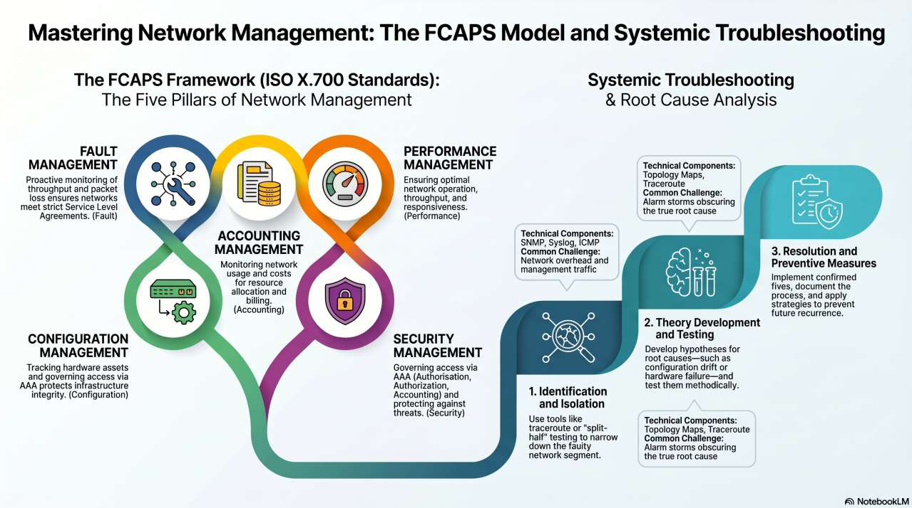

# Fault Management — Network Management

Network management is the set of functions, tools, and processes executed to keep a network operational within established performance parameters (e.g. maximum delay, minimum throughput). Networks support critical domains like IoT, cloud computing, and big data analysis, which makes systematic management essential.

## The FCAPS Model (ISO X.700)

Developed by the ISO in the early 1980s to guide network management solution development, FCAPS defines **five functional areas** — Fault, Configuration, Accounting, Performance, and Security. The pillars are independent yet interconnected — a **holistic approach**: for example, Fault Management relies on Configuration Management records for Root Cause Analysis.

- **Fault (F):** detecting and repairing abnormal behaviors. Proactive monitoring of throughput and packet loss ensures networks meet strict Service Level Agreements.
- **Configuration (C):** tracking network settings and firmware versions; tracking hardware assets and governing access via AAA protects infrastructure integrity.
- **Accounting (A):** measuring resource utilisation for billing or quotas; monitoring network usage and costs for resource allocation.
- **Performance (P):** monitoring metrics like jitter and packet loss to ensure Service Level Agreements (SLAs); ensuring optimal operation, throughput, and responsiveness.
- **Security (S):** governing access control and encryption to protect infrastructure; access via AAA (Authentication, Authorization, Accounting).

## Defining Fault Management

- **Primary goal:** to detect, isolate, identify, and correct malfunctions in a telecommunications network.
- **Key distinction:** a fault (an abnormal condition like a severed cable) is different from a performance issue (sluggishness due to heavy streaming).

### The Fault Taxonomy

- **Hard faults:** device cannot communicate (total failure).
- **Soft faults:** device operates abnormally (sending corrupted or incorrectly routed data).
- **Temporal categories:** Permanent (requires action), Transient (short-lived), and Intermittent (periodically reappears).

### Errors vs Faults

- **Fault:** the root cause of undesirable events (e.g. hardware malfunction).
- **Error:** a discrepancy between observed and expected values, often caused by a fault and capable of propagating through the network.

## The FM Lifecycle (Six-Stage Model)

1. **Detection:** identifying an anomaly.
2. **Isolation:** pinpointing the location and cause.
3. **Diagnosis:** understanding the impact and scope.
4. **Resolution:** restoration and repair.
5. **Verification:** confirming the fix is stable.
6. **Reporting:** post-incident analytics.

## Detection

### Passive Monitoring (Event-Driven)

- **Mechanism:** network devices "speak up" when errors occur.
- **SNMP traps:** lightweight, asynchronous messages triggered by events (e.g. link state change).
- **Syslog:** timestamped, human-readable strings sent to a central server, graded on a severity scale from 0 (Emergency) to 7 (Debug).

### Active Monitoring (Polling)

- **Mechanism:** the Network Management System (NMS) regularly queries devices.
- **Tool:** ICMP Echo Requests (Ping) are used to verify device "liveness".
- **Mathematical threshold:**

  > Time to Detection = (Polling Interval × Retry Threshold) + Timeout Value

### Alarm Management and Severity

- **Alarms:** symptom of a potential fault.
- **Filtering:** systems assign severity levels (Cleared, Low, Medium, High, Critical) to manage thousands of generated alerts.
- **Challenge:** one single fault can trigger an **Alarm Storm**, overwhelming technicians with redundant alerts.

## Isolation and Diagnosis

### Root Cause Analysis (RCA) Frameworks

- **Definition:** systematic investigation into the primary origin of a problem.
- **Structured methods:** Five Whys (iterative questioning) and Fishbone Diagrams (visualising cause categories).

### Technical Isolation Techniques

- **Hop-by-hop trace analysis:** utilising Traceroute to identify exactly where packets drop along a network path.
- **Split-half troubleshooting:** isolating the middle of a network segment to cut potential troubleshooting paths by 50% iteratively.

### Event Correlation Strategies

- **Deterministic correlation:** pre-defined "if-then" loops based on known topology.
- **Probabilistic / machine learning correlation:** evaluating historical patterns to predict the likelihood of specific component failures.

### Dependency Graph-Based Approaches

- Modelling the network as a graph where vertices are devices and edges are weights representing dependency strength.
- Weighted edges reflect the conditional probability that the failure of one object is caused by another.

## Resolution

### Immediate Fault Mitigation

- **Objective:** restore service quickly, even before a permanent fix is applied.
- **Dynamic re-routing:** protocols like OSPF or BGP automatically calculate alternative paths if a link fails.
- **Hardware redundancy:** protocols like VRRP or HSRP allow a backup router to assume a "virtual" gateway IP instantly.

### Permanent Resolution Procedures

- **Hardware replacement:** swapping hot-swappable line cards or failed power supplies.
- **Configuration rollbacks:** using archive repositories to push the last known stable state if a bug or misconfiguration caused the crash.

## Verification and Reporting

- Saturating repaired links with synthetic traffic to verify that Frame Check Sequence (FCS) errors and packet drops have returned to zero.
- **Post-incident reviews:** identifying trends and preventive measures for the future.

## Supporting Infrastructure

- **Remote Monitoring (RMON):** allows network devices to monitor themselves against set thresholds (rising/falling). **Proactive advantage:** eliminates excessive polling by the SNMP platform, saving bandwidth.
- **TFTP servers:** used for central storage of configuration files and software images.
- **Distributed syslog collection:** remote collection stations filter messages before forwarding them to a main server, reducing central overhead.
- **NMS platforms:** consoles like HP OpenView or CiscoWorks provide graphical maps showing device status through color-coded icons.
- **Management Information Bases (MIBs):** standardised database formats defining the alerts and parameters for specific devices.

## The Shift to Proactive FM

- **Traditional:** reactive "firefighting" after failure occurs.
- **Modern:** AI-driven anomaly detection and self-healing workflows.

### Pattern Mining in FM

- **Association rule mining:** discovering relationships between alarm properties (e.g. if alarm X occurs, device Y is likely failing).
- **Sequential pattern mining:** extracting temporal correlations to find sequences of alarms that precede a major failure.

### Machine Learning Architectures

- **Artificial Neural Networks (ANN):** suitable for noise-tolerant diagnosis but can have long training times.
- **Bayesian networks:** directed acyclic graphs used for backward inference to find likely causes of observed symptoms.
- **Support Vector Machines (SVM):** used for linear and non-linear classification of "normal" vs "faulty" data traces.

## Key FM Performance Metrics

- **MTTR (Mean Time to Repair/Resolution):** average time to fix a fault after detection; the primary metric to minimise.
- **MTTD (Mean Time to Detection):** time taken to notice a fault.
- **MTBF (Mean Time Between Failures):** average duration a device runs before failing.

## Business Impact and ROI

- Proactive FM can lead to a **40–60% reduction** in the cost of outages.
- **Benefits:** increased employee productivity, maintained customer trust, and adherence to legal compliance/governance.

## Future Directions in FM

- **5G/6G complexity:** novel networking technologies raise new challenges for current FM systems.
- **AIOps:** developing hybrid ML systems to overcome the disadvantages of single-technique models.

## Key Takeaways

FCAPS remains the industry blueprint for network resilience. Fault Management is an active research topic, moving toward fully autonomous, self-healing networks. A question worth pondering: how does the rise of SDN (Software Defined Networking) change the "Isolate" phase of FM?
