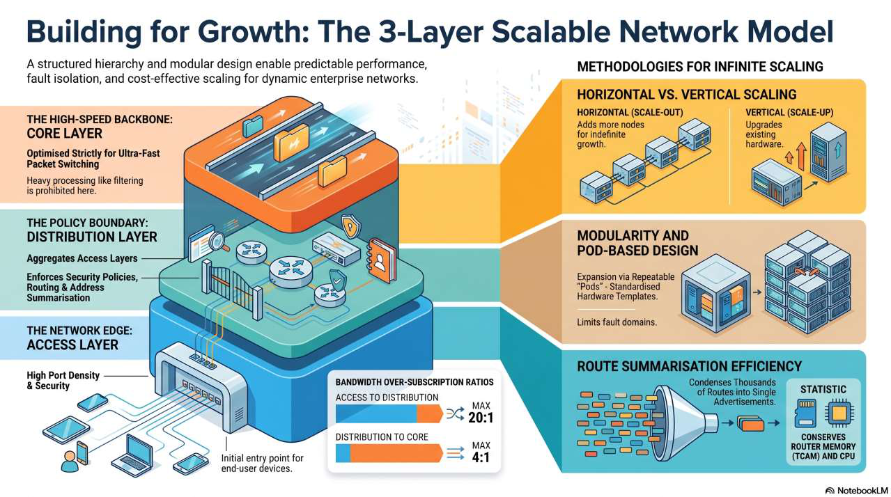

# Масштабируемость — основные принципы проектирования сетей

Масштабируемость — это структурная, математическая и алгоритмическая способность сетевой инфраструктуры наращивать ёмкость, географический охват, пропускную способность и профиль управления. Ключевой фокус успешного дизайна — поддерживать **линейное, предсказуемое соотношение затрат к росту** при минимальной деградации эксплуатации.

## Почему масштабируемость — фундаментальная цель дизайна

- **Почему это важно:** организации — динамичные, живые системы, постоянно переживающие структурные трансформации: слияния, переход к гибридному облаку, географическую экспансию.
- **Альтернатива:** немасштабируемые сети демонстрируют **экспоненциальные кривые** потребления ресурсов и роста сложности, что в итоге приводит к архитектурному коллапсу.

### Три измерения масштабирования

| Измерение | Что должно масштабироваться |
| --- | --- |
| **Административное** | Управление ростом без линейного увеличения штата IT — за счёт автоматизации и абстракции политик |
| **Data plane** | Способность путей пересылки обрабатывать полосу и кадры без аппаратных узких мест |
| **Control plane** | Способность протоколов маршрутизации (CPU/память) обрабатывать изменения топологии по мере роста диаметра сети |

## Методологии масштабирования: Scale-Up против Scale-Out

**Вертикальное масштабирование (scale-up)** добавляет ёмкость существующему активу: апгрейд RAM, более производительные supervisor engine, крипто-акселераторы, расширение модульного шасси или увеличение плотности линейных карт.

- **Ограничения:** упирается в физические пределы — пропускную способность backplane (коммутационной фабрики) и число физических слотов.
- **«Жёсткая стена масштабирования»:** после насыщения дальнейший рост требует разрушительного **«forklift upgrade»** — полной замены системы.

**Горизонтальное масштабирование (scale-out)** наращивает ёмкость добавлением дискретных узлов и распределением нагрузки по агрегированной фабрике: стеки коммутаторов доступа, Anycast-маршрутизация, Virtual Switching Systems (VSS/StackWise).

- **Предпочтительно для долгосрочной масштабируемости:** отвязывает расширение от физических ограничений одного устройства и позволяет расти, не трогая существующую продуктивную среду.

## Трёхуровневая иерархическая модель

Структурированные каркасы приходят на смену плоским немаршрутизируемым топологиям. У каждого уровня — своя роль в масштабируемости:

- **Уровень доступа (Access, край сети):** высокая плотность портов и идентификация устройств. Масштабируется горизонтально; изолирует «шум» конечных пользователей (флапы линков, смену MAC-адресов) от верхних уровней.
- **Уровень распределения (Distribution, применение политик):** исполнение политик, границы маршрутизации и обеспечение безопасности. Защищает ядро, агрегируя тысячи периферийных подключений в высокоскоростные линки точка-точка.
- **Уровень ядра (Core, магистраль):** сверхнизкая задержка и максимальная пропускная способность. Тяжёлая обработка систематически убирается — **никаких ACL и DPI**, — чтобы сохранять форвардинг на скорости канала (wire-rate).

## Модульность и pod-архитектура

Модульность превращает расширение в повторяемый процесс «под копирку». **Pod** — это модульная самодостаточная функциональная единица (например, шаблон «Campus Pod») с заданными соотношениями коммутаторов доступа и распределения.

- **Предсказуемый CapEx:** закупки точно знают, сколько стоит один pod.
- **Изолированные домены отказа:** серьёзные ошибки конфигурации или аппаратные аномалии удерживаются границами Layer 3 распределительного блока.

## Логическая масштабируемость: адресация и суммаризация

Физическая масштабируемость железа бесполезна без логической масштабируемости.

- **Иерархическая IP-адресация** отражает физическую иерархию: непрерывные блоки IP-адресов выделяются по географическому или pod-принципу.
- **Суммаризация маршрутов (агрегация)** — алгоритмический процесс, при котором маршрутизатор сворачивает множество конкретных префиксов (например, путей /24 или /32) в один консолидированный анонс, избавляя маршрутизаторы ядра от гигантских явных таблиц.

Техническая эффективность суммаризации:

- **Экономия TCAM** — высокоскоростная Ternary Content-Addressable Memory остаётся эффективной.
- **Экономия циклов CPU** — влияние «флапающих» линков локализуется, предотвращая глобальные пересчёты SPF.

### Масштабирование control plane в протоколах маршрутизации

- **OSPF** масштабируется многозонной иерархией (Area 0 как магистраль). **ABR (Area Border Router)** блокируют внутренние Link-State Advertisements (LSA), внедряют summary-LSA и не дают локальным сбоям запускать глобальные пересчёты SPF.
- **EIGRP** (дистанционно-векторный) масштабируется через **Stub Router**: hub-маршрутизаторы не отправляют query-сообщения stub-маршрутизаторам, что устраняет ошибки «Stuck-in-Active» (SIA) в крупных WAN.

## Программные, security- и облачные подходы

- **Программная масштабируемость:** современные сети применяют принципы разработки ПО — микросервисы и балансировку нагрузки. **Statelessness (отсутствие состояния)** критично для масштабирования API и веб-сервисов сети: любой экземпляр может обработать запрос без репликации данных.
- **Архитектура Cisco SAFE:** модульный зонный каркас с приоритетом безопасности; сеть делится на функциональные области (Data Centre, Campus, Edge) со своими технологическими стеками.
- **Application Networking Services (ANS):** сеть становится «понимающей контент», чтобы оптимально обслуживать сложный трафик вроде голоса и видео; компоненты включают Cisco Wide Area Application Services (WAAS) для LAN-подобной производительности на WAN-линках.
- **Cloud-native и виртуализированная масштабируемость:** авто-масштабирование, serverless-функции и оркестрация контейнеров (Kubernetes) подстраивают ресурсы под нагрузку в реальном времени.

## Планирование, управление и документация

- **Планирование ёмкости против избыточного резервирования:** прогнозируйте будущую полосу по данным **NetFlow** и трендам; балансируйте высокий CapEx over-provisioning и риск деградации при пиках.
- **Масштабируемость управления сетью:** NMS (Network Management System) взаимодействует с локальными агентами через SNMP, MIB и RMON; распределённые RMON-зонды и NetFlow дают детальный анализ потоков без большого оверхеда.
- **Жизненный цикл сетевого дизайна (PPDIOO):** Plan, Design, Implement, Operate, Optimise — непрерывное улучшение адаптирует масштабируемый дизайн к меняющимся потребностям организации.
- **Документация как инструмент масштабирования:** логические и физические схемы, спецификации оборудования (BOM) — необходимы для быстрого поиска неисправностей и повторяемых модульных развёртываний.

## Убийцы масштабируемости (анти-паттерны)

- **Плоские топологии Layer 2:** огромные широковещательные домены ведут к broadcast-штормам и полному коллапсу сети.
- **Жёстко зашитые конфигурации:** явные IP-адреса в политиках делают массовые миграции невозможными.
- **Игнорирование коэффициентов переподписки:** неучёт суммарной полосы в ядре. Целевые значения: максимум **20:1** для Access→Distribution и максимум **4:1** для Distribution→Core.

## Главное

Масштабируемость — не качественное допущение, а требование количественных прогнозов. Успешный дизайн допускает органический рост, защищая инвестиции организации и гибкость бизнеса.
