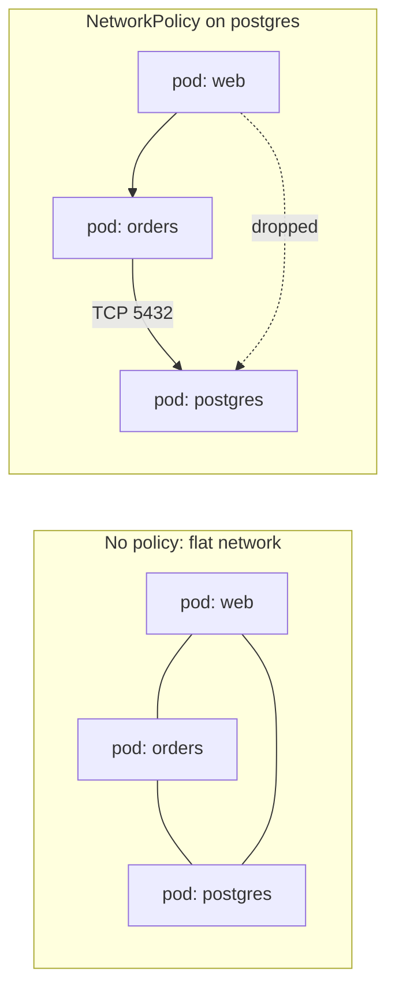
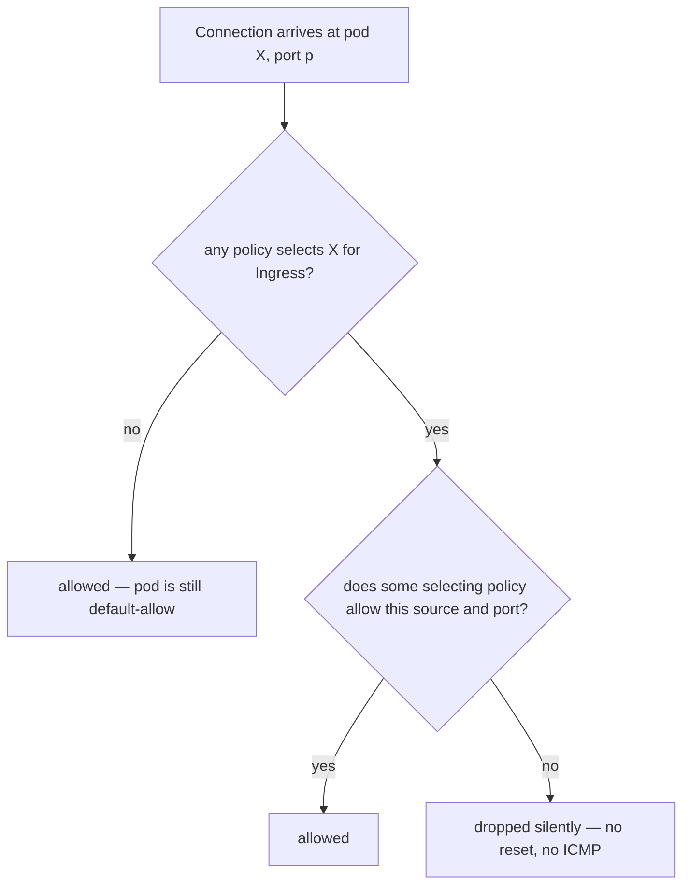
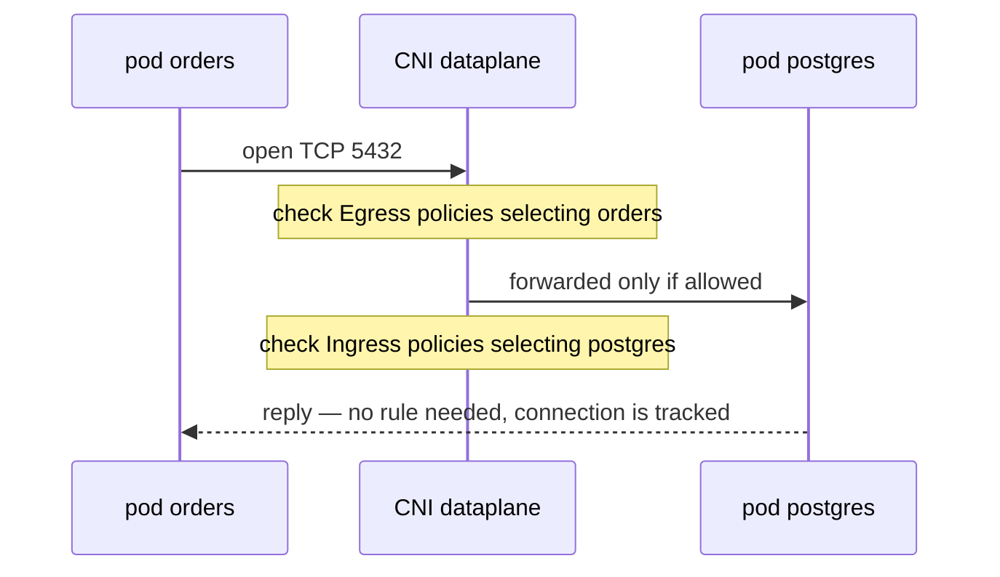

# What Is a Network Policy Definition?

A **NetworkPolicy** is a Kubernetes object that declares which pods are allowed
to talk to which — a definition, in YAML, of the traffic permitted in and out of
a selected set of pods. Like everything else in [Kubernetes](topic:why-kubernetes)
it is desired state: you describe the allowed connections, and the network plugin
makes the actual dataplane match.

The reason this question gets asked at all is the default it replaces.

## The Default It Replaces: A Flat Network

The Kubernetes network model *requires* that every pod gets its own IP and that
**every pod can reach every other pod, on every port, across every namespace,
without NAT**. That is not sloppy configuration — it is in the spec, and a CNI
plugin has to provide it to be conformant.

Which means: the moment one pod is compromised — an
[injection bug](topic:injection-attacks), a vulnerable dependency, a leaked
token — the attacker sits on a flat network together with your database, your
cache, your internal admin service, and every workload in every other namespace.
A firewall at the cluster edge does nothing about this: it is east-west traffic
and it never leaves the cluster. In a [microservice](topic:why-microservices)
system that flat surface is large and grows with every new service.

A NetworkPolicy turns that default-allow into an explicit allowlist for the pods
it selects.



## Anatomy of the Definition

```yaml
apiVersion: networking.k8s.io/v1
kind: NetworkPolicy
metadata:
  name: postgres-from-orders
  namespace: shop
spec:
  podSelector:               # WHICH PODS this policy protects
    matchLabels:
      app: postgres
  policyTypes: [Ingress]     # which directions it governs
  ingress:
    - from:
        - podSelector:       # the allowed peer, in namespace shop
            matchLabels:
              app: orders
      ports:
        - protocol: TCP
          port: 5432         # the port on the protected pod
```

Read it field by field, because each one hides a trap:

- `metadata.namespace` — a NetworkPolicy is **namespaced** and only ever selects
  pods in its own namespace. There is no cluster-wide policy in core Kubernetes;
  Calico and Cilium add their own CRDs for that.
- `spec.podSelector` — **which pods this policy protects**, by label. `{}` means
  every pod in the namespace. This is the single most misread field: it is the
  target, not the peer.
- `spec.policyTypes` — the directions this policy governs: `Ingress`, `Egress`,
  or both.
- `spec.ingress[].from` / `spec.egress[].to` — the **peers**: `podSelector` (pods
  in this namespace), `namespaceSelector` (pods in matching namespaces), or
  `ipBlock` (a CIDR for things outside the cluster, with an optional `except`).
- `ports` — protocol and port **on the protected side**, which for ingress is the
  container's port, not the Service port.

## The Four Rules of the Semantics

Almost everything confusing about NetworkPolicies follows from four rules, and
interviewers probe exactly these.

**1. Selection flips the default, per direction.** A pod that no policy selects
is wide open. The instant *one* policy selects it for `Ingress`, that pod becomes
default-deny for ingress and only explicitly allowed traffic gets in. Egress is
independent: a policy with `policyTypes: [Ingress]` does not restrict outbound
traffic at all.



**2. Policies are additive; there is no deny.** Several policies selecting the
same pod form a **union** of what is allowed. There is no `deny` rule, no
priority, no ordering, no first-match-wins. So you cannot write "allow everyone
except namespace `dev`" — you express a negative as default-deny plus the
positives you want. (`ipBlock.except` is the one narrow exception, and only for
CIDRs.)

**3. Enforcement is stateful.** Rules are about *connections*, not packets. If
ingress on TCP 5432 is allowed, the responses flow back without any matching
egress rule. What you *do* need is a rule at each end: if the caller's namespace
has default-deny egress, the caller needs an egress rule **and** the callee needs
an ingress rule. "I allowed it on the server and it still fails" is nearly always
the missing egress half.



**4. It is L3/L4 only.** Selectors, IPs, protocol, port. A NetworkPolicy cannot
say "only `GET /health`", "only requests carrying a valid token", or "only this
workload identity". Those belong to the [API gateway](topic:api-gateway) and
service-mesh layers; NetworkPolicy is the coarse, cheap control underneath them.

## The Parts Everyone Gets Wrong the First Time

### The dash that changes the meaning

```yaml
  # AND — pods labelled app=orders INSIDE namespaces labelled env=prod
  ingress:
    - from:
        - namespaceSelector:
            matchLabels: { env: prod }
          podSelector:
            matchLabels: { app: orders }

  # OR — any pod in any env=prod namespace, PLUS app=orders pods in this namespace
  ingress:
    - from:
        - namespaceSelector:
            matchLabels: { env: prod }
        - podSelector:
            matchLabels: { app: orders }
```

Two selectors inside **one** list item are an AND; **two** list items are an OR.
The second version quietly opens the pod to every workload in every `env: prod`
namespace, which is almost never what the author meant.

### Default-deny, and the DNS outage that follows

The canonical starting point for a namespace is a policy that selects everything
and allows nothing:

```yaml
spec:
  podSelector: {}                 # every pod in this namespace
  policyTypes: [Ingress, Egress]  # no ingress/egress blocks = nothing allowed
```

Apply that with `Egress` included and the first thing that breaks is not a
service call — it is **DNS**. Pods resolve names through CoreDNS in `kube-system`,
that lookup is now denied, and every call fails as an unknown-host error rather
than anything that looks like a firewall. Every default-deny namespace needs a
companion policy:

```yaml
  egress:
    - to:
        - namespaceSelector:
            matchLabels:
              kubernetes.io/metadata.name: kube-system
          podSelector:
            matchLabels:
              k8s-app: kube-dns
      ports:
        - { protocol: UDP, port: 53 }
        - { protocol: TCP, port: 53 }
```

### Ports are pod ports, not Service ports

Selectors match **pods**; there is no way to write "allow traffic to the `orders`
Service". A Service exposing `port: 80` and forwarding to `targetPort: 8080` needs
`8080` in the policy, because kube-proxy has already rewritten the destination by
the time the packet reaches the pod.

### Probes come from the node

Liveness and readiness checks originate from the kubelet on the node, whose IP is
not a pod IP and matches no `podSelector`. A strict ingress policy can silently
break health checks, and the symptom is pods flapping in `CrashLoopBackOff`
rather than any visible network error.

## The Trap That Matters Most: Nothing Enforces It By Itself

The API server stores a NetworkPolicy exactly the way it stores any other object.
**Enforcement is entirely the CNI plugin's job.** Calico, Cilium, Antrea and
Weave implement it; plain Flannel and a few managed defaults do not.

On a cluster whose CNI ignores NetworkPolicies, `kubectl apply` succeeds,
`kubectl get networkpolicy` lists your object, `kubectl describe` prints your
rules — and every packet still flows. No warning, no event, no status field. You
end up with a security control that exists only on paper, which is worse than
having none, because the audit checkbox is ticked.

The only trustworthy verification is an actual attempt: exec into a pod that
should be blocked and try to open the connection.

```
kubectl exec -n dev deploy/scratch -- nc -zv postgres.shop 5432
```

## Where It Earns Its Keep

Blast-radius reduction is the honest framing. Segmentation does not prevent the
first compromise; it decides what the first compromise is worth. A default-deny
namespace with a handful of explicit allows means a compromised frontend pod can
reach exactly the two services it was designed to call, not the payments database
next door. That is the network half of the same reasoning behind
[designing a security scheme for your endpoints](topic:endpoint-security-design),
and the concrete control behind the segmentation advice in the
[OWASP top ten](topic:owasp-top-ten).

Two more uses teams underrate: **multi-tenancy**, where namespaces must not see
each other at all, and **compliance scoping**, where a regulated workload has to
be provably isolated from everything else in the cluster.

What it does not replace is authentication. Network reachability is not identity —
see [how authentication works in a system](topic:authentication-flow). A
NetworkPolicy says "this IP may connect"; it says nothing about who is on the
other end, and it encrypts nothing, so
[TLS](topic:ssl-tls-certificate) remains a separate decision. Mesh mTLS and
NetworkPolicy answer different questions and are usually deployed together, which
is also worth knowing when you compare
[options for inter-service communication](topic:inter-service-communication-options).

## 60-Second Interview Answer

> A NetworkPolicy is the Kubernetes object that defines which pods may talk to
> which, at the IP and port level. It matters because the cluster default is a
> flat network — every pod can reach every pod in every namespace — so one
> compromised pod sees everything. The definition has three parts: a `podSelector`
> for which pods the policy protects, `policyTypes` for which directions it
> governs, and ingress/egress rules listing allowed peers — pod selectors,
> namespace selectors or CIDR blocks — with protocols and ports. The semantics
> are what people get wrong: policies only allow, never deny; multiple policies
> on one pod are a union; and a pod is wide open until some policy selects it, at
> which point it becomes default-deny for that direction. So the usual pattern is
> a default-deny policy per namespace plus explicit allows — remembering to allow
> DNS to CoreDNS, or everything fails as unknown host. It is L3/L4 only, so no
> HTTP paths, no identity and no encryption; that is the gateway or mesh layer.
> And critically, it is enforced by the CNI plugin, so on a plugin that does not
> implement NetworkPolicy the YAML applies cleanly and blocks nothing at all.

## Common Misconceptions

- **"Applying a NetworkPolicy blocks everything else automatically."** It blocks
  everything else *for the pods it selects, in the directions it names*. Pods the
  selector misses stay wide open, and a policy listing only `Ingress` in
  `policyTypes` leaves egress completely unrestricted.
- **"`spec.podSelector` is the source."** It is the **target** — the pods being
  protected. Sources live under `ingress.from`. Swapping the two yields a policy
  that reads plausibly and guards the wrong pods.
- **"You can write a deny rule."** There is none. The model is allowlist-only;
  "deny X" is expressed as default-deny plus allows for everything except X.
- **"The response traffic needs its own rule."** No — enforcement is
  connection-tracked. But both *ends* of a connection need their own rule when
  both are covered by policies.
- **"NetworkPolicies are cluster-wide."** They are namespaced and select only
  pods in their own namespace. Cluster-wide rules need vendor CRDs such as
  Calico's `GlobalNetworkPolicy` or Cilium's `CiliumClusterwideNetworkPolicy`.
- **"`namespaceSelector` matches pod labels."** It matches **namespace** labels.
  Since Kubernetes 1.21 every namespace automatically carries
  `kubernetes.io/metadata.name`, which is usually what you match on.
- **"The port in the rule is the Service port."** It is the pod's port. kube-proxy
  rewrites the destination before the packet ever reaches the pod.
- **"It replaces a firewall, a service mesh or mTLS."** Different layers: no L7
  rules, no workload identity, no encryption on the wire.
- **"`kubectl apply` succeeded, so it works."** Enforcement belongs to the CNI.
  The only meaningful test is attempting a connection that is supposed to fail.
