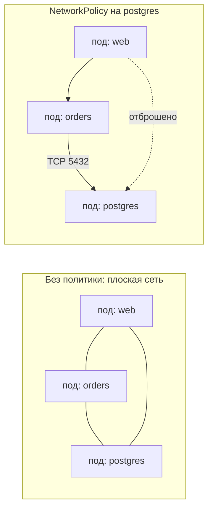
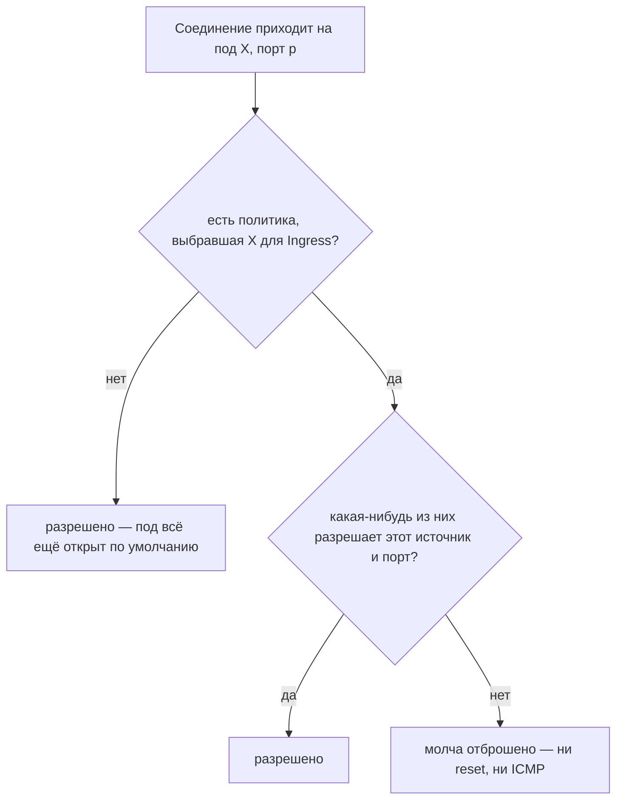
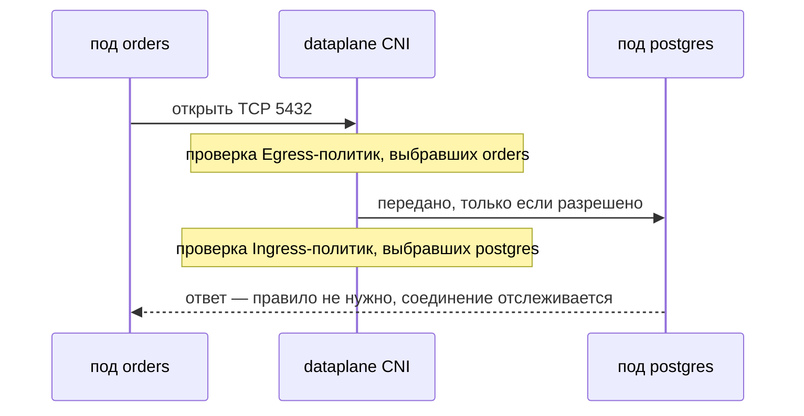

# Что такое Network Policy Definition?

**NetworkPolicy** — это объект Kubernetes, который описывает, каким подам
разрешено общаться с какими: определение (в YAML) трафика, допустимого на вход и
на выход для выбранного набора подов. Как и всё остальное в
[Kubernetes](topic:why-kubernetes), это желаемое состояние: вы описываете
разрешённые соединения, а сетевой плагин приводит фактический dataplane в
соответствие.

Сам вопрос существует из-за того умолчания, которое эта политика заменяет.

## Что она заменяет: плоская сеть

Сетевая модель Kubernetes *требует*, чтобы у каждого пода был свой IP и чтобы
**каждый под мог достучаться до любого другого пода, на любой порт, в любом
пространстве имён, без NAT**. Это не небрежная настройка — это записано в
спецификации, и CNI-плагин обязан это обеспечивать.

А значит: как только скомпрометирован один под — [баг с
инъекцией](topic:injection-attacks), уязвимая зависимость, утёкший токен, —
атакующий оказывается в одной плоской сети с вашей базой данных, кешем,
внутренним админским сервисом и всеми нагрузками во всех остальных пространствах
имён. Межсетевой экран на границе кластера тут бесполезен: это трафик
«восток-запад», он вообще не выходит за пределы кластера. В
[микросервисной](topic:why-microservices) системе такая плоская поверхность
велика и растёт с каждым новым сервисом.

NetworkPolicy превращает это «по умолчанию разрешено» в явный список разрешений
для выбранных ею подов.



## Анатомия определения

```yaml
apiVersion: networking.k8s.io/v1
kind: NetworkPolicy
metadata:
  name: postgres-from-orders
  namespace: shop
spec:
  podSelector:               # КАКИЕ ПОДЫ защищает эта политика
    matchLabels:
      app: postgres
  policyTypes: [Ingress]     # какие направления она регулирует
  ingress:
    - from:
        - podSelector:       # разрешённый участник, в namespace shop
            matchLabels:
              app: orders
      ports:
        - protocol: TCP
          port: 5432         # порт на защищаемом поде
```

Разбирайте поле за полем — в каждом спрятана своя ловушка:

- `metadata.namespace` — NetworkPolicy **привязана к пространству имён** и
  выбирает поды только внутри своего. Общекластерных политик в ядре Kubernetes
  нет; Calico и Cilium добавляют для этого свои CRD.
- `spec.podSelector` — **какие поды эта политика защищает**, по меткам. `{}`
  означает все поды пространства имён. Это самое неверно читаемое поле: здесь
  цель, а не источник.
- `spec.policyTypes` — направления, которые политика регулирует: `Ingress`,
  `Egress` или оба.
- `spec.ingress[].from` / `spec.egress[].to` — **участники**: `podSelector` (поды
  этого пространства имён), `namespaceSelector` (поды подходящих пространств
  имён) или `ipBlock` (CIDR для всего за пределами кластера, с необязательным
  `except`).
- `ports` — протокол и порт **на защищаемой стороне**: для ingress это порт
  контейнера, а не порт Service.

## Четыре правила семантики

Почти всё, что путает в NetworkPolicy, вытекает из четырёх правил — и именно их
проверяют на собеседовании.

**1. Выбор пода меняет умолчание, по каждому направлению отдельно.** Под, которого
не выбрала ни одна политика, полностью открыт. Как только *одна* политика выбрала
его для `Ingress`, этот под становится закрытым по умолчанию на вход, и внутрь
попадает только явно разрешённое. Egress независим: политика с
`policyTypes: [Ingress]` вообще не ограничивает исходящий трафик.



**2. Политики складываются; запрета не существует.** Несколько политик, выбравших
один под, дают **объединение** разрешённого. Нет правила `deny`, нет приоритетов,
нет порядка, нет «побеждает первое совпадение». Поэтому нельзя написать «разрешить
всем, кроме пространства имён `dev`» — отрицание выражается как запрет по
умолчанию плюс нужные разрешения. (`ipBlock.except` — единственное узкое
исключение, и только для CIDR.)

**3. Enforcement отслеживает состояние.** Правила описывают *соединения*, а не
пакеты. Если вход на TCP 5432 разрешён, ответы вернутся без всякого встречного
правила egress. А вот что действительно нужно — правило на каждом конце: если в
пространстве имён вызывающего действует default-deny на egress, вызывающему нужно
правило egress, **и** вызываемому нужно правило ingress. «Я разрешил на сервере, а
всё равно не работает» — это почти всегда недостающая половина с egress.



**4. Это только L3/L4.** Селекторы, IP, протокол, порт. NetworkPolicy не может
сказать «только `GET /health`», «только запросы с валидным токеном» или «только
эта идентичность нагрузки». Это уровень [API-шлюза](topic:api-gateway) и
service mesh; NetworkPolicy — грубый и дешёвый контроль под ними.

## То, в чём ошибаются с первого раза

### Дефис, который меняет смысл

```yaml
  # И — поды с меткой app=orders ВНУТРИ пространств имён с меткой env=prod
  ingress:
    - from:
        - namespaceSelector:
            matchLabels: { env: prod }
          podSelector:
            matchLabels: { app: orders }

  # ИЛИ — любой под в любом env=prod namespace, ПЛЮС поды app=orders в этом namespace
  ingress:
    - from:
        - namespaceSelector:
            matchLabels: { env: prod }
        - podSelector:
            matchLabels: { app: orders }
```

Два селектора внутри **одного** элемента списка — это И; **два** элемента списка —
это ИЛИ. Второй вариант тихо открывает под всем нагрузкам во всех пространствах
имён с `env: prod`, чего автор почти наверняка не имел в виду.

### Default-deny и падение DNS следом

Канонический старт для пространства имён — политика, которая выбирает всё и не
разрешает ничего:

```yaml
spec:
  podSelector: {}                 # каждый под в этом namespace
  policyTypes: [Ingress, Egress]  # нет блоков ingress/egress = не разрешено ничего
```

Примените её вместе с `Egress` — и первым сломается не вызов сервиса, а **DNS**.
Поды резолвят имена через CoreDNS в `kube-system`, этот запрос теперь запрещён, и
любой вызов падает с ошибкой «неизвестный хост», а вовсе не с чем-то похожим на
сетевой запрет. Каждому default-deny пространству имён нужна политика-компаньон:

```yaml
  egress:
    - to:
        - namespaceSelector:
            matchLabels:
              kubernetes.io/metadata.name: kube-system
          podSelector:
            matchLabels:
              k8s-app: kube-dns
      ports:
        - { protocol: UDP, port: 53 }
        - { protocol: TCP, port: 53 }
```

### Порты — это порты подов, а не порты Service

Селекторы выбирают **поды**; написать «разрешить трафик к Service `orders`»
невозможно. Service с `port: 80`, пробрасывающий на `targetPort: 8080`, требует в
политике `8080`, потому что kube-proxy уже переписал адрес назначения к моменту,
когда пакет доходит до пода.

### Пробы приходят с узла

Проверки liveness и readiness исходят от kubelet на узле, чей IP не является IP
пода и не подходит ни под один `podSelector`. Строгая ingress-политика может молча
сломать проверки здоровья, и симптомом будет не сетевая ошибка, а поды, которые
бесконечно перезапускаются в `CrashLoopBackOff`.

## Главная ловушка: сама по себе она ничего не применяет

API server хранит NetworkPolicy ровно так же, как любой другой объект.
**Применение целиком на стороне CNI-плагина.** Calico, Cilium, Antrea и Weave это
реализуют; чистый Flannel и некоторые умолчания у облачных провайдеров — нет.

В кластере, чей CNI игнорирует NetworkPolicy, `kubectl apply` отработает,
`kubectl get networkpolicy` покажет ваш объект, `kubectl describe` напечатает ваши
правила — и все пакеты по-прежнему пройдут. Ни предупреждения, ни события, ни
поля статуса. В итоге у вас средство защиты, существующее только на бумаге, что
хуже его отсутствия: галочка в аудите уже поставлена.

Единственная надёжная проверка — реальная попытка: зайти в под, который должен
быть заблокирован, и попробовать открыть соединение.

```
kubectl exec -n dev deploy/scratch -- nc -zv postgres.shop 5432
```

## Где она реально нужна

Честная формулировка — сокращение радиуса поражения. Сегментация не предотвращает
первую компрометацию; она определяет, чего эта первая компрометация стоит.
Пространство имён с default-deny и горсткой явных разрешений означает, что
скомпрометированный фронтенд-под дотянется ровно до тех двух сервисов, для которых
он и был написан, а не до базы платежей по соседству. Это сетевая половина той же
логики, что и при
[проектировании схемы безопасности эндпоинтов](topic:endpoint-security-design), и
конкретный механизм за советами о сегментации из
[OWASP Top 10](topic:owasp-top-ten).

Ещё два применения, которые недооценивают: **мультитенантность**, где пространства
имён вообще не должны видеть друг друга, и **сужение области комплаенса**, где
регулируемая нагрузка обязана быть доказуемо изолирована от остального кластера.

Чего NetworkPolicy не заменяет — так это аутентификацию. Сетевая достижимость не
равна идентичности, см. [как работает аутентификация в
системе](topic:authentication-flow). NetworkPolicy говорит «этому IP можно
подключиться»; она ничего не говорит о том, кто на другом конце, и ничего не
шифрует, поэтому [TLS](topic:ssl-tls-certificate) остаётся отдельным решением.
mTLS в service mesh и NetworkPolicy отвечают на разные вопросы и обычно
разворачиваются вместе — это стоит помнить и при сравнении
[способов настройки межсервисного
взаимодействия](topic:inter-service-communication-options).

## Ответ за 60 секунд

> NetworkPolicy — это объект Kubernetes, который определяет, какие поды могут
> общаться с какими, на уровне IP и портов. Это важно, потому что по умолчанию
> кластер — плоская сеть: любой под достаёт до любого пода в любом пространстве
> имён, поэтому один скомпрометированный под видит всё. В определении три части:
> `podSelector` — какие поды политика защищает, `policyTypes` — какие направления
> она регулирует, и правила ingress/egress со списком разрешённых участников
> (селекторы подов, селекторы пространств имён или блоки CIDR) с протоколами и
> портами. Ошибаются обычно в семантике: политики только разрешают и никогда не
> запрещают; несколько политик на одном поде объединяются; под полностью открыт,
> пока его не выберет хотя бы одна политика, и только тогда становится закрытым по
> умолчанию для этого направления. Поэтому обычный приём — политика default-deny на
> пространство имён плюс явные разрешения, не забывая разрешить DNS к CoreDNS,
> иначе всё падает с «неизвестным хостом». Это только L3/L4: никаких путей HTTP,
> идентичности и шифрования — это уровень шлюза или mesh. И главное: применяет её
> CNI-плагин, так что на плагине без поддержки NetworkPolicy YAML применится без
> ошибок и не заблокирует вообще ничего.

## Частые заблуждения

- **«Применил NetworkPolicy — всё остальное блокируется автоматически».**
  Блокируется всё остальное *для выбранных ею подов и в названных направлениях*.
  Поды, которые селектор не поймал, остаются полностью открытыми, а политика,
  указавшая в `policyTypes` только `Ingress`, никак не ограничивает исходящий
  трафик.
- **«`spec.podSelector` — это источник».** Это **цель**, то есть защищаемые поды.
  Источники живут в `ingress.from`. Перепутав их, вы получите политику, которая
  выглядит правдоподобно и охраняет не те поды.
- **«Можно написать правило-запрет».** Нельзя. Модель — только список разрешений;
  «запретить X» выражается как запрет по умолчанию плюс разрешения для всего,
  кроме X.
- **«Ответному трафику нужно своё правило».** Нет — соединения отслеживаются. Но
  оба *конца* соединения нуждаются в собственном правиле, если оба покрыты
  политиками.
- **«NetworkPolicy действует на весь кластер».** Она привязана к пространству имён
  и выбирает поды только своего. Общекластерные правила требуют вендорских CRD —
  например `GlobalNetworkPolicy` у Calico или `CiliumClusterwideNetworkPolicy` у
  Cilium.
- **«`namespaceSelector` смотрит на метки подов».** Он смотрит на метки
  **пространства имён**. Начиная с Kubernetes 1.21 у каждого namespace
  автоматически есть `kubernetes.io/metadata.name`, по которому обычно и матчат.
- **«Порт в правиле — это порт Service».** Это порт пода. kube-proxy переписывает
  адрес назначения ещё до того, как пакет доходит до пода.
- **«Она заменяет межсетевой экран, service mesh или mTLS».** Это разные уровни:
  ни правил L7, ни идентичности нагрузки, ни шифрования на проводе.
- **«`kubectl apply` прошёл, значит работает».** Применение — забота CNI.
  Единственная осмысленная проверка — попытка соединения, которое должно
  провалиться.
