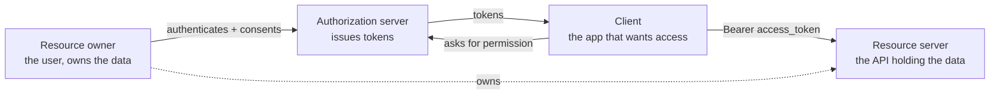
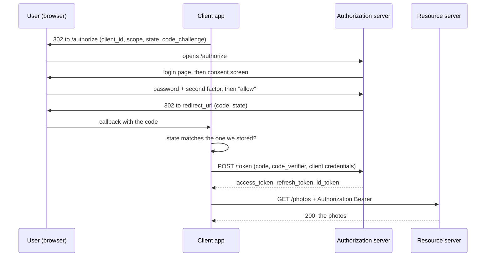
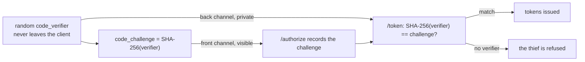

# How OAuth 2.0 and OpenID Connect work

**OAuth 2.0 exists to answer one question: how can an app act on your behalf at some
provider without ever seeing your password?** That is delegated *authorization*.

**OpenID Connect (OIDC) answers the question OAuth deliberately does not: who is the
user?** That is *authentication*, and it is a thin, standard layer on top of the same
flow.

Keep those two sentences apart and everything else follows. Blur them and you get the
single most common OAuth bug in production: an app that treats "a token came back" as
"this must be Alice".

## The problem, before the protocol

A photo-printing app wants your photos from a provider. The pre-OAuth answer was:
give the app your provider username and password. That is terrible in ways worth
naming, because each one maps to a feature of the protocol:

- The app now holds a secret that works **everywhere** at that provider, not just for
  photos.
- You cannot limit it — no "read photos, never delete".
- You cannot revoke it without changing your password, which breaks every other app.
- The provider's MFA, SSO and risk checks never run, because the provider never sees
  you.
- Every app that stores it is one breach away from your account. See
  [How authentication works](topic:authentication-flow) for what that storage costs.

OAuth replaces it with: **the user authenticates at the provider, and the app gets a
narrow, expiring, revocable token instead.**

## The four roles

Most confusion about OAuth is really confusion about who is who.

- **Resource owner** — the user. They own the data and are the only one who can grant
  access to it.
- **Client** — the app that wants access. Note that the client is *never* the user;
  most bugs come from letting it pretend otherwise.
- **Authorization server** — where the user authenticates and consents, and the only
  party that mints tokens. Google, Keycloak, Auth0, your own identity service.
- **Resource server** — the API that accepts the token. Often, but not always, run by
  the same organisation as the authorization server.

## The two channels

The second half of the mental model, and the one that explains nearly every security
rule in the spec:

- **Front channel** — messages that travel *through the user's browser* as redirects.
  Anyone can read them: they are in the address bar, browser history, `Referer`
  headers, proxy logs, extensions. Nothing secret may go here.
- **Back channel** — a direct server-to-server HTTPS call. The browser is not
  involved and nothing appears in any URL. This is where secrets live.

Almost every OAuth attack is something ending up on the wrong channel, and almost
every countermeasure (`state`, PKCE, "code, not token") is about keeping the front
channel harmless.

## The authorization code flow, step by step

This is the flow to describe in an interview. Everything else is a variation.

Read it as six moments:

1. **Authorize.** The client cannot call the provider for you, so it *redirects the
   browser* there with what it wants in the query string: `response_type=code`,
   `client_id`, `redirect_uri`, `scope`, `state`, `code_challenge`.
2. **Authenticate.** The user types their password **on the provider's page, at the
   provider's domain**. This is the most important line in the protocol. The client
   never learns the password, so it cannot leak it — and the provider's MFA and SSO
   apply automatically.
3. **Consent.** The provider shows what this specific app is asking for. The user can
   grant part of it.
4. **Code.** The provider redirects the browser back to the registered `redirect_uri`
   with an **authorization code** — not a token. The code goes over the channel that
   leaks, so it is built to be nearly worthless: single-use, valid for about a
   minute, bound to this client and this redirect URI, and useless without a secret
   that never travelled.
5. **Exchange.** The client calls `/token` **directly**, server to server, presenting
   the code plus its `code_verifier` and (if it has one) its `client_secret`. Only
   here do tokens exist.
6. **Call.** The client sends `Authorization: Bearer <access_token>` to the API.

The whole design is in step 4→5: the browser carries something almost useless, and
the valuable exchange happens where nobody can watch. All of it rides on
[HTTPS](topic:http-vs-https); over plain HTTP the protocol has nothing left.

## What comes back, and who each thing is for

| Token | Addressed to | The client should | Lifetime |
|---|---|---|---|
| `access_token` | the **API** | treat as opaque, just forward it | minutes |
| `id_token` | the **client** | parse and validate every claim | minutes, used once at login |
| `refresh_token` | the **authorization server** | keep on the back channel only | hours to days |

This table is the answer to half of all OAuth follow-up questions.

An **access token** is a key to an API. It usually names the API in its `aud` claim,
carries the granted scopes, and says nothing the client can act on. Often it is a
[JWT](topic:jwt-vs-session-token), which is why the resource server can verify it
locally with the provider's public keys instead of calling the provider on every
request; when it is opaque instead, the API introspects it once and caches.

An **id_token** is the OIDC addition: a signed JWT that says *this user authenticated,
at this provider, at this time, for this client*.

A **refresh token** buys a new access token on the back channel, with no redirect and
no consent screen. That is why a fifteen-minute access token does not mean logging in
every fifteen minutes — and why a refresh token must never touch the front channel or
`localStorage`.

## What OIDC adds, exactly

Ask for the `openid` scope and you get four things: an `id_token`, a `nonce`
parameter, a standard `/userinfo` endpoint, and a discovery document
(`/.well-known/openid-configuration`) with the provider's endpoints and signing keys.

The id_token is only evidence once you validate it. **Before believing a single
claim:**

- **Signature** against the provider's published keys (JWKS), with the algorithm
  pinned by you, not read from the token's own header.
- **`iss`** is the provider you expected.
- **`aud` equals your `client_id`.** This is the check that stops a token issued for
  *another* app being replayed at yours.
- **`exp`** has not passed (and `iat` is sane).
- **`nonce`** equals the one you sent at `/authorize`, tying the token to this login.

Then, and only then, you know who logged in — and you typically create your own
session or [token](topic:jwt-vs-session-token) for your app. The id_token is proof of
a login event, not a long-lived credential for your API.

## Scopes and consent

A **scope** is what the *grant* is limited to: `photos.read`, not "Alice is an admin".
The resource server enforces it, and enforces it itself: a perfectly valid token gets
`200` on one call and `403` on the next.

- **401** — I do not know who you are (no token, bad signature, expired).
- **403** — I do, and this is not allowed (scope missing, or your own rules say no).

Scopes are **not** the user's permissions in your system. `photos.delete` in the token
means *the user allowed this app to try*; whether that user may delete *this* photo is
still your check. See [Designing a security scheme for your
endpoints](topic:endpoint-security-design).

## PKCE: why the code is not enough on its own

A mobile app or a SPA is a **public client**: its code runs on the user's machine, so
it cannot keep a `client_secret` — anything shipped to a browser or an app store can
be read out of it. For years that meant an intercepted authorization code was enough
to take over the grant.

**PKCE** (Proof Key for Code Exchange) fixes it with one idea: *send only a hash on
the channel that leaks, and prove the original when redeeming.*

A thief who copies the code out of the browser also sees the *challenge* — and a hash
cannot be run backwards. PKCE is now recommended for **every** client, confidential
ones included, and is mandatory in OAuth 2.1.

## `state`: proving the callback is yours

`state` is a random value the client stores before the redirect and compares when the
callback arrives. It answers: *does this callback belong to a flow this browser
started?*

Without it, your `redirect_uri` is an endpoint anyone can call. The attack does not
even involve theft: the attacker logs in at the provider **as themselves**, keeps
their own authorization code, and gets your user to open
`https://yourapp/callback?code=<attacker's code>` — a link in an email is enough. Your
app redeems it and quietly binds the victim's session to the attacker's account, so
everything the victim saves next lands somewhere the attacker can read. This is login
[CSRF](topic:csrf), and one string comparison prevents it.

## Which grant, when

- **Authorization code + PKCE** — everything a user is involved in: server-rendered
  web apps, SPAs, mobile and desktop apps. This is the default answer.
- **Client credentials** — no user at all. A batch job or one service calling
  another: one back-channel call with the client's own credentials, no browser, no
  consent, no id_token, no refresh token. The app acts as *itself*. Compare with the
  other options in [Inter-service
  communication](topic:inter-service-communication-options).
- **Device code** — input-constrained devices: a TV shows a short code you type on
  your phone.
- **Refresh token** — renewal, never a first login.
- **Implicit** — *deprecated*. No back channel, so the access token itself came back
  in the URL fragment: history, extensions, referrers, and one sloppy redirect leaks
  it outright. There was also no way to authenticate the client and no refresh token.
  It existed because browsers could not make cross-origin calls; they can now, so the
  answer is code + PKCE with [CORS](topic:cors) on the token endpoint.
- **Resource owner password credentials** — *deprecated*. The user types the provider
  password into the app, which removes the redirect and with it the entire point of
  OAuth: no consent, no MFA, no SSO, and a password sitting in a third-party app.

OAuth 2.1 removes the last two.

## In your own system

You do not need Google to use this. A common shape: one internal authorization server
issues tokens, an [API gateway](topic:api-gateway) validates them at the edge and
rejects the obviously bad ones, and each service still validates the token itself —
checking signature, `iss`, `aud` and scopes — because a service must never assume it
is only ever reached through the gateway. Service-to-service calls use
`client_credentials` or mTLS instead of a user token.

## The 60-second interview answer

> OAuth 2.0 is delegated authorization: it lets an app act on a user's behalf at a
> provider without ever seeing their password. Four roles — resource owner, client,
> authorization server, resource server — and two channels: the front channel through
> the browser, which everyone can read, and the back channel between servers, where
> secrets live. In the authorization code flow the client redirects the browser to the
> authorization server with `client_id`, `scope`, `state` and a PKCE `code_challenge`;
> the user authenticates *at the provider* and consents; a single-use, short-lived
> code comes back through the browser; the client checks `state` and swaps that code
> for tokens on a direct back-channel call, proving its `code_verifier`. The access
> token goes to the API, which checks signature, audience, expiry and scopes.
> OpenID Connect adds the `openid` scope and an `id_token` — a signed JWT addressed to
> this client, saying who authenticated — which is what "log in with Google" actually
> is. An access token is *not* proof of identity: it is not addressed to the client,
> so a token obtained by another app would pass that check. Validate the id_token's
> signature, `iss`, `aud`, `exp` and `nonce` before believing any of it.

## Common traps and misconceptions

- **"OAuth is a login protocol."** It is not; OIDC is. OAuth alone tells the client
  nothing about who the user is.
- **"A token came back, so it must be Alice."** The classic bug. The access token is
  not addressed to your client and has no audience you can check, so a malicious app
  can present a token a user gave *it* and be signed in as that user. That is exactly
  what `id_token` + `aud` prevents.
- **"The scopes are the user's permissions."** They are the limits of *this grant*.
  Your own authorization check still has to run.
- **"We skipped `state`, it is just a nonce."** It is the anti-CSRF check for your
  callback. See the attack above.
- **"PKCE is only for mobile."** Recommended for every client and mandatory in
  OAuth 2.1. It costs one hash.
- **"Our SPA has a `client_secret`."** Then it is not a secret. Anything in the
  browser bundle is public; that is what makes a client *public*.
- **"Store the tokens in `localStorage`."** Any [XSS](topic:xss) then reads them. Prefer
  a backend-for-frontend holding the tokens server-side and an `HttpOnly` cookie for
  the browser.
- **"The resource server has to call the provider on every request."** Not for a
  signed JWT access token: verify the signature with cached public keys. Introspection
  is for opaque tokens, and you cache it.
- **"Logging out revokes the tokens."** Ending your app's session is not revoking an
  access token. A live access token keeps working until it expires — the reason
  lifetimes are short and revocation targets the refresh token.
- **"Any redirect URI will do."** They are registered and matched exactly. A wildcard
  or an open redirect on your domain hands the code to somebody else.
- **"The user is authenticated because the API call worked."** The API authenticated a
  *token*. Who the user is came from the id_token, if you asked for one.
