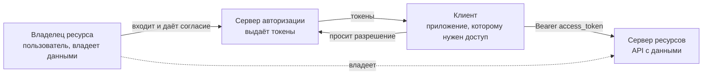
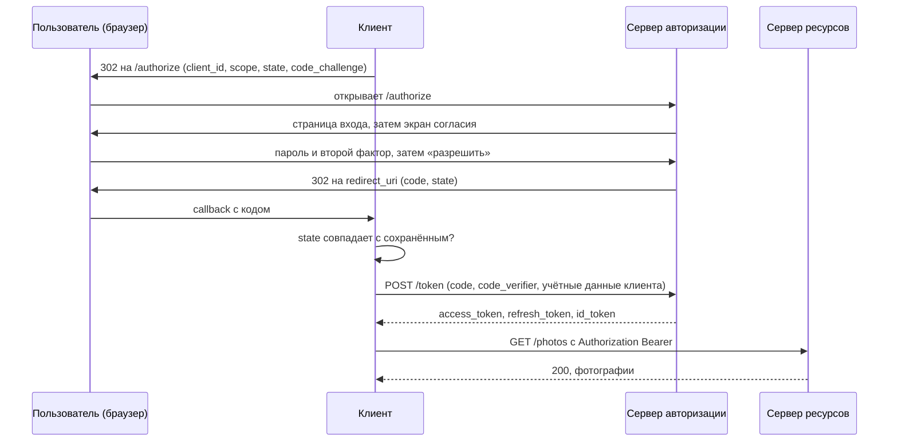
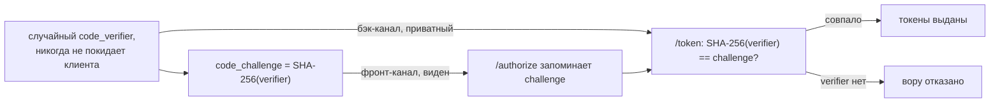

# Как работают OAuth 2.0 и OpenID Connect

**OAuth 2.0 существует ради одного вопроса: как приложению действовать от вашего
имени у провайдера, ни разу не увидев вашего пароля?** Это делегированная
*авторизация*.

**OpenID Connect (OIDC) отвечает на вопрос, на который OAuth намеренно не отвечает:
кто такой пользователь?** Это *аутентификация*, и она сделана тонким стандартным
слоем поверх того же потока.

Держите эти два предложения раздельно — и всё остальное сложится само. Смешайте их —
и получите самую распространённую ошибку OAuth в проде: приложение, которое считает,
что «токен пришёл» означает «значит, это Alice».

## Задача до протокола

Приложению для печати фотографий нужны ваши фотографии у провайдера. Ответ до OAuth
был такой: дайте приложению своё имя пользователя и пароль от провайдера. Это плохо
по нескольким причинам, и каждую стоит назвать, потому что каждая соответствует
какой-то части протокола:

- У приложения теперь есть секрет, который работает у этого провайдера **везде**, а
  не только для фотографий.
- Ограничить его нельзя — никакого «читать фотографии, но никогда не удалять».
- Отозвать его без смены пароля нельзя, а смена пароля ломает все остальные
  приложения.
- MFA, SSO и антифрод провайдера не срабатывают, потому что провайдер вас не видит.
- Каждое приложение, которое хранит этот пароль, — это одна утечка до вашего
  аккаунта. Чего стоит такое хранение, см. в
  [Как работает аутентификация](topic:authentication-flow).

OAuth заменяет всё это на: **пользователь аутентифицируется у провайдера, а
приложение получает узкий, истекающий и отзываемый токен.**

## Четыре роли

Почти вся путаница вокруг OAuth — на самом деле путаница в том, кто есть кто.

- **Владелец ресурса** — пользователь. Данные принадлежат ему, и только он может дать
  к ним доступ.
- **Клиент** — приложение, которому нужен доступ. Обратите внимание: клиент *никогда*
  не является пользователем; большинство ошибок начинается с того, что ему позволяют
  притворяться.
- **Сервер авторизации** — там пользователь аутентифицируется и даёт согласие, и это
  единственный участник, который выпускает токены. Google, Keycloak, Auth0 или ваш
  собственный сервис идентификации.
- **Сервер ресурсов** — API, который принимает токен. Часто, но не обязательно,
  принадлежит той же организации, что и сервер авторизации.

## Два канала

Вторая половина модели — та, из которой следует почти каждое правило безопасности в
спецификации:

- **Фронт-канал** — сообщения, которые едут *через браузер пользователя* редиректами.
  Их может прочитать кто угодно: они в адресной строке, в истории браузера, в
  заголовках `Referer`, в логах прокси, в расширениях. Ничего секретного сюда
  отправлять нельзя.
- **Бэк-канал** — прямой HTTPS-вызов сервер — сервер. Браузер в этом не участвует, и
  ничего не попадает ни в какой URL. Секреты живут здесь.

Почти каждая атака на OAuth — это что-то, оказавшееся не на том канале, и почти
каждая мера защиты (`state`, PKCE, «код, а не токен») нужна для того, чтобы
фронт-канал оставался безобидным.

## Поток authorization code по шагам

Это тот поток, который стоит рассказывать на собеседовании. Всё остальное —
вариации.

Читайте это как шесть моментов:

1. **Запрос.** Клиент не может обратиться к провайдеру за вас, поэтому он
   *перенаправляет туда браузер*, записав нужное в query-строку: `response_type=code`,
   `client_id`, `redirect_uri`, `scope`, `state`, `code_challenge`.
2. **Вход.** Пользователь вводит пароль **на странице провайдера, на домене
   провайдера**. Это самая важная строчка протокола. Клиент не узнаёт пароль, а
   значит, не может его утечь, — и MFA и SSO провайдера применяются автоматически.
3. **Согласие.** Провайдер показывает, чего именно просит это конкретное приложение.
   Пользователь может выдать часть.
4. **Код.** Провайдер возвращает браузер на зарегистрированный `redirect_uri` с
   **кодом авторизации**, а не с токеном. Код едет по каналу, который протекает,
   поэтому его сделали почти бесполезным: одноразовый, живёт около минуты, привязан к
   этому клиенту и этому redirect_uri и бесполезен без секрета, который никуда не
   ехал.
5. **Обмен.** Клиент обращается к `/token` **напрямую**, сервер к серверу,
   предъявляя код, свой `code_verifier` и (если он есть) `client_secret`. Токены
   появляются только здесь.
6. **Вызов.** Клиент отправляет в API `Authorization: Bearer <access_token>`.

Вся конструкция — в переходе 4→5: через браузер везут почти бесполезное, а ценный
обмен происходит там, где никто не подсмотрит. И всё это держится на
[HTTPS](topic:http-vs-https): по обычному HTTP от протокола ничего не остаётся.

## Что возвращается и кому что предназначено

| Токен | Кому адресован | Что делает клиент | Срок жизни |
|---|---|---|---|
| `access_token` | **API** | считает непрозрачным, просто пересылает | минуты |
| `id_token` | **клиенту** | разбирает и проверяет каждое поле | минуты, используется один раз при входе |
| `refresh_token` | **серверу авторизации** | держит только на бэк-канале | часы или дни |

Эта таблица — ответ на половину уточняющих вопросов про OAuth.

**Access-токен** — это ключ к API. Обычно он называет этот API в поле `aud`, несёт
выданные scope и не сообщает клиенту ничего, на что тот мог бы опереться. Часто это
[JWT](topic:jwt-vs-session-token), и поэтому сервер ресурсов может проверить его
локально по публичным ключам провайдера, а не ходить к провайдеру на каждый запрос;
если токен непрозрачный, API делает introspection один раз и кеширует результат.

**id_token** — это добавка OIDC: подписанный JWT, который говорит, что *этот
пользователь аутентифицировался, у этого провайдера, в это время, для этого
клиента*.

**Refresh-токен** покупает новый access-токен по бэк-каналу — без редиректа и без
экрана согласия. Поэтому пятнадцатиминутный access-токен не означает вход каждые
пятнадцать минут — и поэтому refresh-токен ни при каких условиях не должен попадать
на фронт-канал или в `localStorage`.

## Что именно добавляет OIDC

Запросите scope `openid` — и получите четыре вещи: `id_token`, параметр `nonce`,
стандартный эндпоинт `/userinfo` и документ discovery
(`/.well-known/openid-configuration`) с эндпоинтами и ключами подписи провайдера.

id_token становится доказательством только после проверки. **Прежде чем поверить хоть
одному полю:**

- **Подпись** по опубликованным ключам провайдера (JWKS), причём алгоритм задаёте вы,
  а не читаете из заголовка самого токена.
- **`iss`** — тот провайдер, которого вы ждали.
- **`aud` равен вашему `client_id`.** Именно эта проверка не даёт переиграть у вас
  токен, выпущенный для *другого* приложения.
- **`exp`** не истёк (и `iat` разумный).
- **`nonce`** совпадает с отправленным в `/authorize` — это привязывает токен к
  данному входу.

И только тогда вы знаете, кто вошёл, — и обычно заводите собственную сессию или
[токен](topic:jwt-vs-session-token) для своего приложения. id_token — доказательство
события входа, а не долгоживущие учётные данные для вашего API.

## Scope и согласие

**Scope** — это то, чем ограничено *выданное разрешение*: `photos.read`, а не «Alice
— администратор». Проверяет его сервер ресурсов, и проверяет сам: один и тот же
совершенно корректный токен получает `200` на одном вызове и `403` на следующем.

- **401** — я не знаю, кто ты (токена нет, подпись плохая, срок истёк).
- **403** — знаю, и этого нельзя (нет нужного scope или ваши собственные правила
  против).

Scope — это **не** права пользователя в вашей системе. `photos.delete` в токене
означает, что *пользователь разрешил этому приложению попробовать*; а можно ли этому
пользователю удалить *именно эту* фотографию — по-прежнему ваша проверка. См.
[Проектирование схемы безопасности эндпоинтов](topic:endpoint-security-design).

## PKCE: почему одного кода мало

Мобильное приложение или SPA — это **публичный клиент**: его код выполняется на
машине пользователя, поэтому `client_secret` он хранить не может — всё, что уехало в
браузер или в магазин приложений, можно оттуда достать. Годами это означало, что
перехваченного кода авторизации хватало, чтобы забрать выданное разрешение.

**PKCE** (Proof Key for Code Exchange) решает это одной идеей: *по каналу, который
протекает, отправляем только хеш, а при обмене предъявляем оригинал.*

Вор, скопировавший код из браузера, видит и *challenge* — а хеш нельзя обратить. PKCE
сегодня рекомендуют **всем** клиентам, включая конфиденциальные, и в OAuth 2.1 он
обязателен.

## `state`: доказательство, что callback ваш

`state` — это случайное значение, которое клиент сохраняет перед редиректом и
сравнивает, когда приходит callback. Оно отвечает на вопрос: *относится ли этот
callback к потоку, который начал этот браузер?*

Без него ваш `redirect_uri` — эндпоинт, который может вызвать кто угодно. В атаке
даже нет кражи: злоумышленник входит у провайдера **под собой**, оставляет себе
собственный код авторизации и заставляет вашего пользователя открыть
`https://вашеприложение/callback?code=<код злоумышленника>` — достаточно ссылки в
письме. Приложение обменивает код и тихо привязывает сессию жертвы к аккаунту
злоумышленника: всё, что жертва сохранит дальше, окажется там, где он это прочитает.
Это login [CSRF](topic:csrf), и одно сравнение строк его предотвращает.

## Какой grant и когда

- **Authorization code + PKCE** — всё, где участвует пользователь: серверные
  веб-приложения, SPA, мобильные и десктопные приложения. Это ответ по умолчанию.
- **Client credentials** — пользователя нет вообще. Фоновая задача или вызов одного
  сервиса другим: один вызов по бэк-каналу с собственными учётными данными клиента,
  без браузера, без согласия, без id_token, без refresh-токена. Приложение действует
  *от себя*. Сравните с другими вариантами в
  [Взаимодействии между сервисами](topic:inter-service-communication-options).
- **Device code** — устройства с неудобным вводом: телевизор показывает короткий код,
  который вы вводите с телефона.
- **Refresh token** — продление, но никогда не первый вход.
- **Implicit** — *устарел*. Бэк-канала нет, поэтому в URL-фрагменте возвращался сам
  access-токен: история, расширения, referer — и один небрежный редирект утекает его
  целиком. Ещё там нельзя было аутентифицировать клиента и не было refresh-токена. Он
  существовал потому, что браузеры не умели кросс-доменных запросов; теперь умеют,
  поэтому ответ — code + PKCE и [CORS](topic:cors) на эндпоинте токенов.
- **Resource owner password credentials** — *устарел*. Пользователь вводит пароль от
  провайдера в приложение, а это убирает редирект, а вместе с ним и весь смысл OAuth:
  ни согласия, ни MFA, ни SSO, и пароль лежит в стороннем приложении.

В OAuth 2.1 последние два удалены.

## В вашей собственной системе

Google для этого не нужен. Типичная схема: один внутренний сервер авторизации выдаёт
токены, [API-шлюз](topic:api-gateway) проверяет их на границе и отсекает явно плохие,
а каждый сервис всё равно проверяет токен сам — подпись, `iss`, `aud` и scope, —
потому что сервис не должен предполагать, что к нему приходят только через шлюз.
Вызовы между сервисами используют `client_credentials` или mTLS, а не токен
пользователя.

## Ответ на собеседовании за 60 секунд

> OAuth 2.0 — это делегированная авторизация: она позволяет приложению действовать от
> имени пользователя у провайдера, ни разу не увидев его пароля. Четыре роли —
> владелец ресурса, клиент, сервер авторизации, сервер ресурсов — и два канала:
> фронт-канал через браузер, который может прочитать любой, и бэк-канал между
> серверами, где живут секреты. В потоке authorization code клиент перенаправляет
> браузер на сервер авторизации с `client_id`, `scope`, `state` и PKCE-параметром
> `code_challenge`; пользователь аутентифицируется *у провайдера* и даёт согласие;
> через браузер возвращается одноразовый короткоживущий код; клиент проверяет `state`
> и меняет код на токены прямым вызовом по бэк-каналу, предъявляя `code_verifier`.
> Access-токен уходит в API, который проверяет подпись, аудиторию, срок и scope.
> OpenID Connect добавляет scope `openid` и `id_token` — подписанный JWT, адресованный
> именно этому клиенту и сообщающий, кто аутентифицировался; «войти через Google» —
> это именно он. Access-токен *не* является доказательством личности: он адресован не
> клиенту, поэтому такую проверку прошёл бы и токен, полученный другим приложением.
> Прежде чем поверить id_token, проверьте подпись, `iss`, `aud`, `exp` и `nonce`.

## Ловушки и заблуждения

- **«OAuth — это протокол входа».** Нет; входом занимается OIDC. Один только OAuth не
  сообщает клиенту ничего о том, кто пользователь.
- **«Токен пришёл, значит, это Alice».** Классическая ошибка. Access-токен адресован
  не вашему клиенту и не содержит аудитории, которую вы могли бы проверить, поэтому
  вредоносное приложение может предъявить токен, выданный *ему* пользователем, и
  войти этим пользователем. Ровно это и предотвращают `id_token` и `aud`.
- **«Scope — это права пользователя».** Это границы *данного разрешения*. Ваша
  собственная проверка прав всё равно обязана отработать.
- **«Мы пропустили `state`, это же просто nonce».** Это анти-CSRF-проверка вашего
  callback. Атаку см. выше.
- **«PKCE нужен только мобильным».** Рекомендован всем клиентам и обязателен в
  OAuth 2.1. Стоит он одного хеша.
- **«У нашего SPA есть `client_secret`».** Значит, это не секрет. Всё, что попало в
  бандл браузера, публично; именно это и делает клиента *публичным*.
- **«Храните токены в `localStorage`».** Тогда любой [XSS](topic:xss) их прочитает.
  Лучше backend-for-frontend, который держит токены на сервере, и `HttpOnly`-кука для
  браузера.
- **«Сервер ресурсов обязан обращаться к провайдеру на каждый запрос».** Для
  подписанного JWT-токена — нет: проверьте подпись по закешированным публичным ключам.
  Introspection нужен для непрозрачных токенов, и его тоже кешируют.
- **«Выход из системы отзывает токены».** Завершение сессии вашего приложения — не
  отзыв access-токена. Живой access-токен работает до истечения срока; поэтому срок
  делают коротким, а отзыв нацеливают на refresh-токен.
- **«Redirect URI подойдёт любой».** Их регистрируют и сверяют точно. Wildcard или
  открытый редирект на вашем домене отдают код кому-то другому.
- **«Пользователь аутентифицирован, раз вызов API прошёл».** API аутентифицировал
  *токен*. Кто такой пользователь — это из id_token, если вы его запрашивали.
