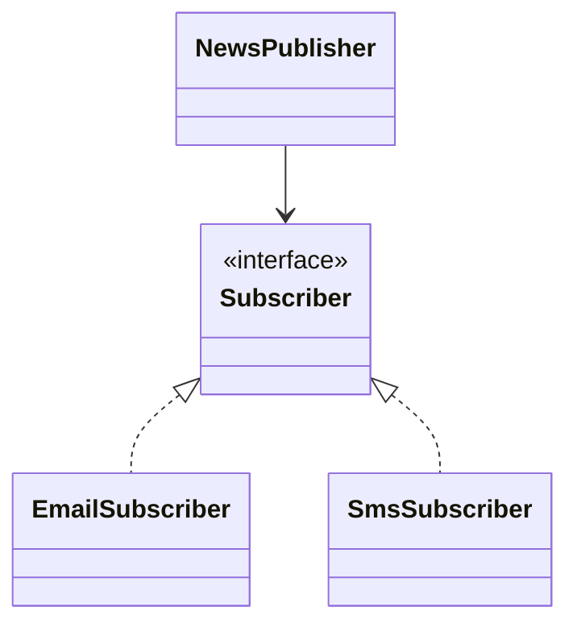
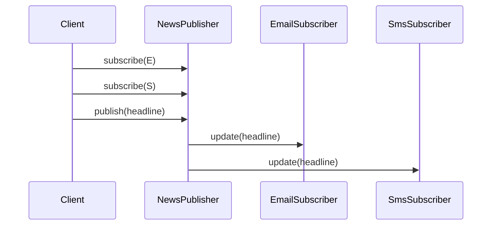

# Observer Pattern

> **Practice mode.** This is a *structural* topic: there is no "Run". You build the
> pattern as real classes in the file tree on the left, press **Analyze**, and the
> app compiles your code, draws the **class diagram** from it, and checks the
> missions against the relationships it finds.

## The idea

**Observer** defines a one-to-many dependency: one object, often called the
**subject** or **publisher**, keeps a list of **observers** or **subscribers** and
notifies them when something important changes. Think of a post office notice
board: people sign up for alerts, and the clerk posts one notice without walking
to every house personally.

The publisher depends only on an observer interface. It does not know whether a
subscriber sends an email, writes to a log, refreshes a UI, or updates metrics.
That is like a kitchen bell: the cook rings the same bell, while each waiter
decides what to do next.

The important class relationships are:

1. an observer interface with an `update(...)` method,
2. multiple concrete observers that implement it,
3. a publisher that stores observers through the interface and loops over them
   when publishing an event.

The pattern is part of the broader [design patterns](topic:design-patterns-overview)
family and relies on interface-based polymorphism, the same object-oriented tool
you also use in [Strategy](topic:strategy). The difference is intent: Strategy
chooses one interchangeable behavior for a context, while Observer broadcasts one
change to many interested listeners. In everyday terms, Strategy is choosing one
recipe for dinner; Observer is announcing that dinner is ready to everyone waiting.

## The target shape

You will build a small news publisher. `NewsPublisher` is the subject, `Subscriber`
is the observer interface, and `EmailSubscriber` plus `SmsSubscriber` are concrete
observers.

- `Subscriber` is the observer interface. It is the shared mailbox shape: every
  subscriber must accept the same `update(String headline)` message.
- `EmailSubscriber` and `SmsSubscriber` are concrete observers. They are like two
  delivery routes: both receive the same news, but each handles it in its own way.
- `NewsPublisher` is the subject/publisher. It keeps a `Subscriber` field or a
  collection such as `List<Subscriber>`, like a front desk keeping a sign-up sheet.

At runtime the flow is simple: add subscribers, publish one update, notify each
subscriber through the interface.

The missions pass when the class diagram shows two concrete subscribers and an
association from `NewsPublisher` to `Subscriber`.

## 60-second interview answer

> Observer is a behavioral pattern where a subject keeps a list of observers and
> notifies them when its state or an event changes. The subject depends on an
> observer interface, not on concrete listener classes, so new listeners can be
> added without changing the subject. It is useful for UI events, domain events,
> cache invalidation, metrics, and Spring-style application events. The pattern is
> not automatically asynchronous: notifications can be plain synchronous method
> calls unless an event bus, executor, or message broker makes delivery async.
> The main risks are memory leaks from forgotten unsubscribe calls, unclear
> ordering, slow observers blocking the publisher, and error handling across many
> listeners.

## Where it is used

- **UI listeners.** A button publishes a click event, and many listeners can react.
  Like a doorbell in an apartment building, one press can alert several people.
- **Domain events.** An order can publish `OrderPaid`, while email, analytics, and
  audit listeners react independently. This is the software version of a post
  office stamp that sends the same parcel into several back-office workflows.
- **Spring application events.** Spring listeners often look like Observer, and
  transactional variants such as [`@TransactionalEventListener`](topic:spring-transactional-event-listener)
  control whether the notification happens after commit or rollback. That is like
  waiting for a receipt before handing the order ticket to the kitchen.
- **Caches and read models.** A data change can notify components that need to
  refresh derived state. Think of a train station board updating all platform
  displays from one schedule change.

## Common misconceptions

- **"Observer is the same as polling."** Polling repeatedly asks, "anything new?"
  Observer pushes the update when it happens. Polling is checking the mailbox every
  minute; Observer is the courier ringing the bell.
- **"Observer is always asynchronous."** The GoF pattern only says who knows whom
  and how notification is sent. A direct `observer.update(...)` loop is
  synchronous, just like a clerk calling names from a queue one by one.
- **"The publisher should create its observers."** Usually it should not. If
  `NewsPublisher` creates `EmailSubscriber` directly, it becomes coupled to that
  concrete class. Better to register observers from outside, like customers
  writing their own names on the sign-up sheet.
- **"Observers can be ignored after registration."** Subscriptions need lifecycle
  management. Forgotten observers can keep objects alive, similar to a notice list
  that still contains people who moved away.
- **"Observer and [Chain of Responsibility](topic:chain-of-responsibility) are the
  same because both pass a request around."** Observer broadcasts to many
  listeners; Chain passes a request along handlers until one handles it. One is a
  town announcement, the other is a service desk forwarding a form.
