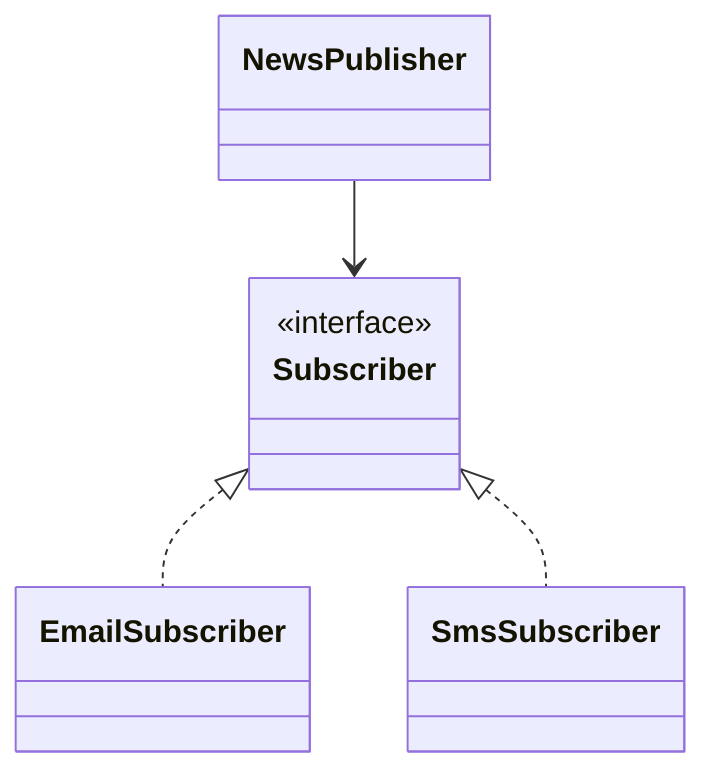
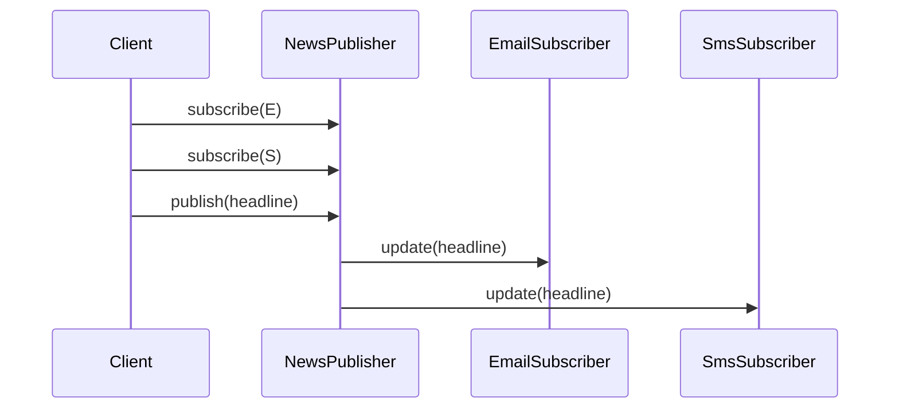

# Паттерн Observer

> **Режим практики.** Это *структурная* тема: кнопки «Запустить» нет. Вы строите
> паттерн настоящими классами в дереве файлов слева, нажимаете **«Проанализировать»**,
> и приложение компилирует ваш код, рисует по нему **диаграмму классов** и проверяет
> миссии по найденным связям.

## Идея

**Observer** задаёт зависимость «один ко многим»: один объект, часто называемый
**subject** или **publisher**, хранит список **observers** или **subscribers** и
уведомляет их, когда происходит важное изменение. Представьте доску объявлений в
почтовом отделении: люди подписываются на оповещения, а сотрудник вывешивает одно
объявление, не обходя каждый дом лично.

Publisher зависит только от observer interface. Он не знает, отправляет ли
subscriber email, пишет в лог, обновляет UI или метрики. Это похоже на звонок на
кухне: повар звонит в один и тот же колокольчик, а каждый официант сам решает, что
делать дальше.

Важные связи классов такие:

1. observer interface с методом `update(...)`,
2. несколько concrete observers, которые его реализуют,
3. publisher, который хранит observers через interface и проходит по ним при
   публикации события.

Паттерн входит в семейство [design patterns](topic:design-patterns-overview) и
опирается на полиморфизм через интерфейсы, тот же инструмент ООП, который
используется в [Strategy](topic:strategy). Разница в намерении: Strategy выбирает
одно взаимозаменяемое поведение для контекста, а Observer рассылает одно изменение
многим заинтересованным listeners. В бытовой аналогии Strategy — это выбрать один
рецепт ужина, а Observer — объявить всем ожидающим, что ужин готов.

## Целевая структура

Вы соберёте небольшой news publisher. `NewsPublisher` — это subject, `Subscriber`
— observer interface, а `EmailSubscriber` и `SmsSubscriber` — concrete observers.

- `Subscriber` — observer interface. Это общий формат почтового ящика: каждый
  subscriber должен принять одно и то же сообщение `update(String headline)`.
- `EmailSubscriber` и `SmsSubscriber` — concrete observers. Они похожи на два
  маршрута доставки: оба получают одну новость, но каждый обрабатывает её по-своему.
- `NewsPublisher` — subject/publisher. Он хранит поле `Subscriber` или коллекцию
  вроде `List<Subscriber>`, как стойка регистрации хранит лист подписчиков.

Во время выполнения поток простой: добавить subscribers, опубликовать один update,
уведомить каждого subscriber через interface.

Миссии засчитываются, когда диаграмма классов показывает двух concrete subscribers
и связь association от `NewsPublisher` к `Subscriber`.

## Ответ на собеседовании (за 60 секунд)

> Observer — это поведенческий паттерн, в котором subject хранит список observers
> и уведомляет их, когда меняется его состояние или происходит событие. Subject
> зависит от observer interface, а не от конкретных классов listeners, поэтому
> новых listeners можно добавлять без изменения subject. Он полезен для UI events,
> domain events, cache invalidation, metrics и Spring-style application events.
> Паттерн не становится асинхронным автоматически: уведомления могут быть обычными
> синхронными вызовами методов, если event bus, executor или message broker не
> делают доставку async. Главные риски — memory leaks из-за забытых unsubscribe,
> неясный порядок вызовов, медленные observers, блокирующие publisher, и обработка
> ошибок среди множества listeners.

## Где используется

- **UI listeners.** Button публикует click event, и много listeners могут
  отреагировать. Как дверной звонок в многоквартирном доме: одно нажатие может
  предупредить нескольких людей.
- **Domain events.** Order может опубликовать `OrderPaid`, а email, analytics и
  audit listeners реагируют независимо. Это программная версия почтового штампа,
  который отправляет одну посылку в несколько внутренних процессов.
- **Spring application events.** Spring listeners часто похожи на Observer, а
  transactional-варианты вроде [`@TransactionalEventListener`](topic:spring-transactional-event-listener)
  управляют тем, произойдёт уведомление после commit или rollback. Это как
  дождаться чека, прежде чем передать заказной талон на кухню.
- **Caches and read models.** Изменение данных может уведомить компоненты, которым
  нужно обновить производное состояние. Представьте табло на вокзале: одно
  изменение расписания обновляет все платформенные экраны.

## Частые заблуждения

- **«Observer — это то же самое, что polling.»** Polling постоянно спрашивает:
  «появилось что-то новое?» Observer отправляет update, когда событие произошло.
  Polling — это проверять почтовый ящик каждую минуту; Observer — это курьер,
  который звонит в дверь.
- **«Observer всегда асинхронный.»** GoF-паттерн говорит только о том, кто кого
  знает и как отправляется уведомление. Прямой цикл `observer.update(...)`
  синхронный, как сотрудник, который вызывает людей из очереди по одному.
- **«Publisher должен создавать своих observers.»** Обычно не должен. Если
  `NewsPublisher` напрямую создаёт `EmailSubscriber`, он связывается с конкретным
  классом. Лучше регистрировать observers снаружи, как клиенты сами вписывают свои
  имена в лист подписки.
- **«После регистрации observers можно не учитывать.»** Подпискам нужен lifecycle
  management. Забытые observers могут удерживать объекты в памяти, как список
  объявлений, где всё ещё числятся люди, которые давно переехали.
- **«Observer и [Chain of Responsibility](topic:chain-of-responsibility) одинаковы,
  потому что оба передают request дальше.»** Observer рассылает сообщение многим
  listeners; Chain передаёт request по handlers, пока кто-то его не обработает.
  Одно похоже на городское объявление, другое — на стойку сервиса, которая
  пересылает форму дальше.
