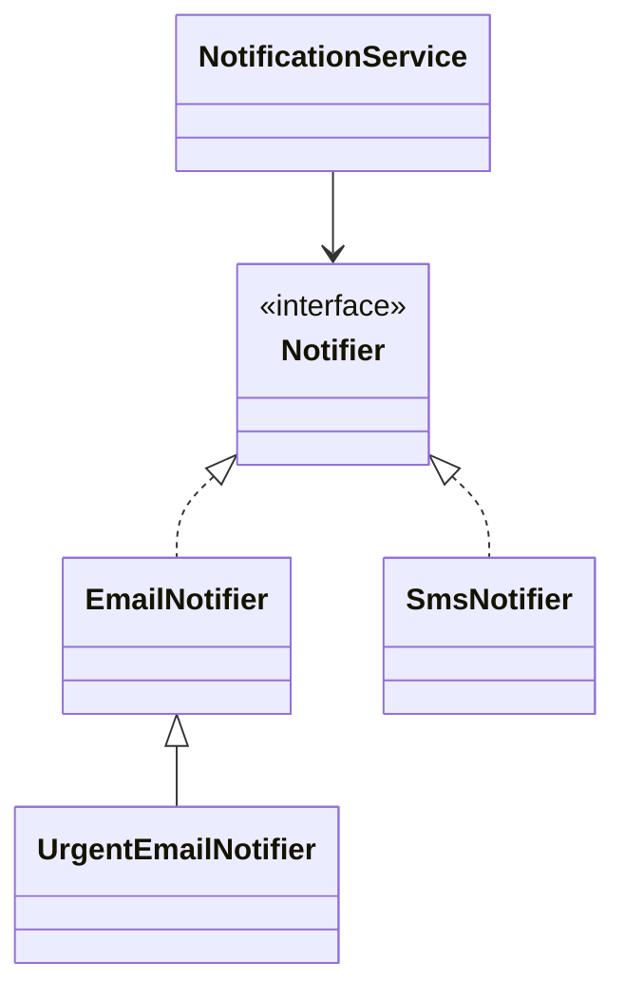

# OOP Principles in Practice

> **Practice mode.** This is a *structural* topic: there is no "Run". You build the
> design as real classes in the file tree on the left, press **Analyze**, and the
> app compiles your code, draws the **class diagram** from it, and checks the
> missions against the relationships it finds.

## The idea

Interviewers rarely want a textbook list of the four pillars — they want to see
that you can *express* them in code. So instead of reciting definitions, you'll
build a tiny notification system in which each principle is a visible design
decision:

- **Abstraction** — declare *what* a notifier does, not *how*. That is the
  `Notifier` interface: one operation, `send(String)`, with no implementation
  detail leaking out.
- **Polymorphism** — many concrete notifiers behind that one interface
  (`EmailNotifier`, `SmsNotifier`, …). Calling `send` on a `Notifier` reference
  runs whichever implementation is really there.
- **Inheritance** — specialize an existing notifier by *extending* it
  (`UrgentEmailNotifier extends EmailNotifier`) to reuse and refine behaviour.
- **Encapsulation** — `NotificationService` keeps its collaborator (and any
  recipient state) **private**, exposing only `notify(...)`. Callers can't reach
  in and depend on internals.

The fourth move, **composition**, ties it together: the service *has-a* notifier
rather than *being* one, so you can swap delivery channels without touching the
service.

## The target shape

- `Notifier` — the abstraction (given to you).
- `EmailNotifier`, `SmsNotifier` — concrete implementations (`implements Notifier`) →
  **abstraction + polymorphism**.
- `UrgentEmailNotifier` — a subclass (`extends EmailNotifier`) → **inheritance**.
- `NotificationService` — holds a **private** `Notifier` field and delegates to it →
  **composition + encapsulation**.

The missions on the right pass when the diagram shows exactly this: an interface
with ≥2 implementations, an `extends` edge, and a class that composes the
interface.

## How to map each principle to code

| Principle | Where it lives in this design |
|-----------|-------------------------------|
| Abstraction | the `Notifier` interface — a contract with no `how` |
| Encapsulation | `private` fields in `NotificationService`; behaviour reached only through `notify(...)` |
| Inheritance | `UrgentEmailNotifier extends EmailNotifier` |
| Polymorphism | a `Notifier` variable holding any implementation; `send` dispatches at runtime |

## 60-second interview answer

> OOP organizes a program around objects that bundle data with the behaviour that
> acts on it. **Abstraction** exposes a clean contract (an interface) and hides the
> rest. **Encapsulation** keeps state private and guards it behind methods, so
> invariants stay valid and internals can change freely. **Inheritance** lets a
> subclass reuse and specialize a base type's behaviour for an "is-a"
> relationship. **Polymorphism** lets one reference type stand in for many
> implementations, so calling code depends on the abstraction, not the concrete
> class. In practice I lean on composition and program to interfaces, using
> inheritance only for genuine "is-a" cases — that keeps designs open for extension
> but closed for modification.

## Common misconceptions

- ❌ "Abstraction and encapsulation are the same." — Abstraction is about *what to
  expose* (the contract); encapsulation is about *hiding state* behind that
  contract. You can have one without the other.
- ❌ "Inheritance is the main tool for reuse." — Prefer **composition**; deep
  inheritance trees are rigid and leak base-class details. Use inheritance only
  for true "is-a".
- ❌ "Polymorphism just means overriding methods." — Java also has *parametric*
  polymorphism (generics) and *ad-hoc* polymorphism (overloading); runtime
  overriding is only one kind.
- ❌ "Making fields `public` is fine if you add getters later." — Exposing fields
  breaks encapsulation now and is hard to walk back; start private.
