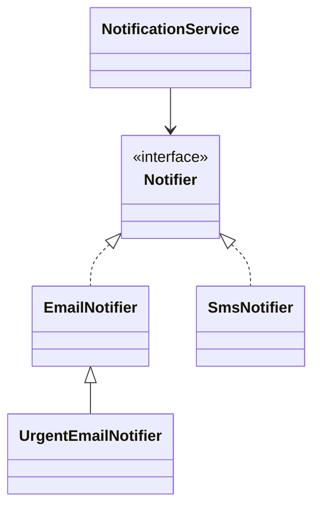

# Принципы ООП на практике

> **Режим практики.** Это *структурная* тема: кнопки "Запустить" здесь нет. Ты
> строишь дизайн как реальные классы в дереве файлов слева, нажимаешь **Analyze**,
> и приложение компилирует твой код, рисует по нему **диаграмму классов** и
> проверяет миссии по найденным связям.

## Идея

Интервьюеры редко хотят услышать заученный список из четырёх столпов — они хотят
увидеть, что ты умеешь *выразить* их в коде. Поэтому вместо определений ты
соберёшь крошечную систему уведомлений, где каждый принцип — это видимое
проектное решение:

- **Абстракция** — объяви, *что* делает notifier, а не *как*. Это интерфейс
  `Notifier`: одна операция `send(String)` без утечки деталей реализации.
- **Полиморфизм** — множество конкретных notifier'ов за этим единым интерфейсом
  (`EmailNotifier`, `SmsNotifier`, …). Вызов `send` по ссылке типа `Notifier`
  выполняет ту реализацию, которая там на самом деле.
- **Наследование** — специализируй существующий notifier, *расширив* его
  (`UrgentEmailNotifier extends EmailNotifier`), чтобы переиспользовать и уточнить
  поведение.
- **Инкапсуляция** — `NotificationService` держит своего соавтора (и любое
  состояние получателей) **приватным**, открывая наружу только `notify(...)`.
  Вызывающий код не может залезть внутрь и зависеть от внутренностей.

Четвёртый ход, **композиция**, связывает всё вместе: сервис *has-a* notifier, а не
*является* им, поэтому каналы доставки можно менять, не трогая сам сервис.

## Целевая форма

- `Notifier` — абстракция (дана тебе).
- `EmailNotifier`, `SmsNotifier` — конкретные реализации (`implements Notifier`) →
  **абстракция + полиморфизм**.
- `UrgentEmailNotifier` — подкласс (`extends EmailNotifier`) → **наследование**.
- `NotificationService` — держит **приватное** поле `Notifier` и делегирует ему →
  **композиция + инкапсуляция**.

Миссии справа проходят, когда диаграмма показывает именно это: интерфейс с ≥2
реализациями, связь `extends` и класс, который композирует интерфейс.

## Как сопоставить каждый принцип с кодом

| Принцип | Где он живёт в этом дизайне |
|---------|-----------------------------|
| Абстракция | интерфейс `Notifier` — контракт без `как` |
| Инкапсуляция | `private`-поля в `NotificationService`; поведение доступно только через `notify(...)` |
| Наследование | `UrgentEmailNotifier extends EmailNotifier` |
| Полиморфизм | переменная типа `Notifier` хранит любую реализацию; `send` диспетчеризуется во время выполнения |

## Ответ на собеседовании за 60 секунд

> ООП организует программу вокруг объектов, которые объединяют данные с поведением,
> работающим над ними. **Абстракция** открывает чистый контракт (интерфейс) и
> прячет остальное. **Инкапсуляция** держит состояние приватным и защищает его за
> методами, чтобы инварианты оставались верными, а внутренности можно было свободно
> менять. **Наследование** позволяет подклассу переиспользовать и специализировать
> поведение базового типа для отношения "is-a". **Полиморфизм** позволяет одной
> ссылке заменять множество реализаций, так что вызывающий код зависит от
> абстракции, а не от конкретного класса. На практике я опираюсь на композицию и
> программирую на уровне интерфейсов, используя наследование только для настоящих
> случаев "is-a" — это держит дизайн открытым для расширения, но закрытым для
> изменения.

## Частые заблуждения

- ❌ "Абстракция и инкапсуляция — это одно и то же." — Абстракция о том, *что
  открыть* (контракт); инкапсуляция о том, *как спрятать состояние* за этим
  контрактом. Одно бывает без другого.
- ❌ "Наследование — главный инструмент переиспользования." — Предпочитай
  **композицию**; глубокие деревья наследования жёсткие и протекают деталями
  базового класса. Используй наследование только для настоящего "is-a".
- ❌ "Полиморфизм — это просто переопределение методов." — В Java есть ещё
  *параметрический* полиморфизм (дженерики) и *ad-hoc* полиморфизм (перегрузка);
  переопределение во время выполнения — лишь один из видов.
- ❌ "Сделать поля `public` нормально, если потом добавить геттеры." — Открытые
  поля ломают инкапсуляцию уже сейчас, и откатить это трудно; начинай с приватных.
