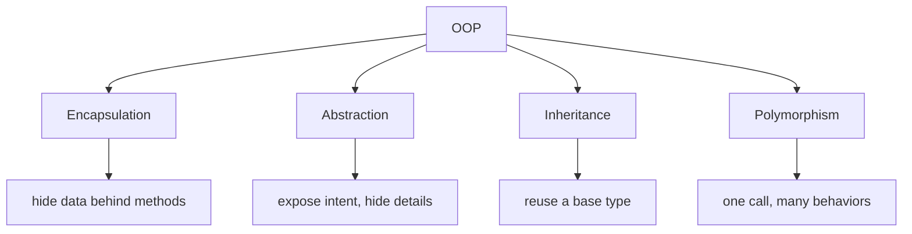
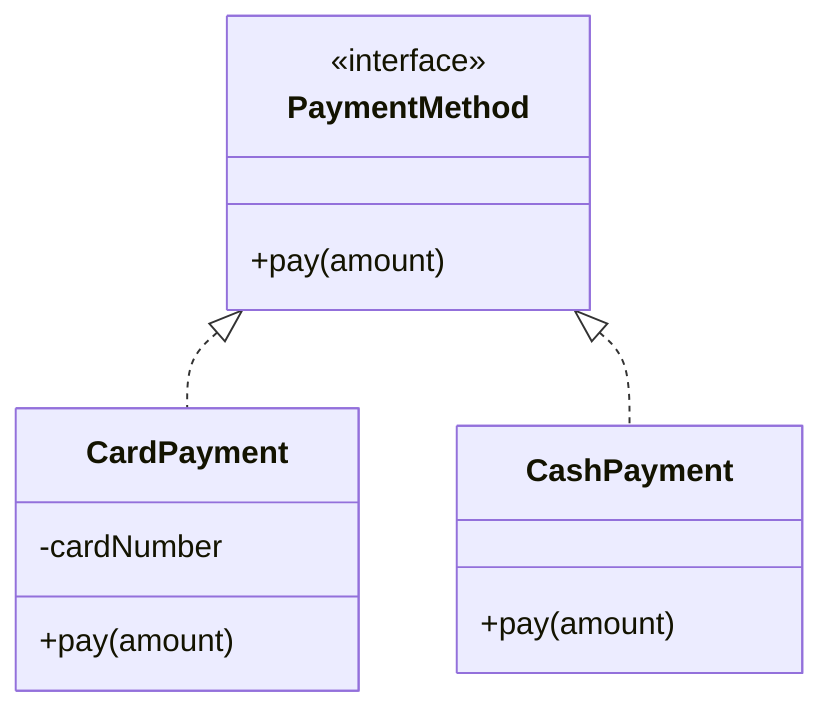

# OOP Principles

**Object-oriented programming** organizes a program around *objects* — bundles of
data together with the behavior that acts on that data — instead of a long list of
free-standing procedures. Four principles describe how those objects are built and
how they relate: **Encapsulation**, **Abstraction**, **Inheritance**, and
**Polymorphism**. Think of a coffee shop: each staff member is an object with their
own private supplies and a small set of things they know how to do, and you, the
customer, interact with them only through the counter.



## Encapsulation — hide the data, expose the behavior

Encapsulation keeps an object's data (`private` fields) inside the object and lets
the outside world touch it only through controlled methods (getters, setters,
business operations). The object protects its own invariants — nobody can put it
into an invalid state by reaching in directly. Like a cash register: the cashier
takes your money through the drawer's operations, but you cannot reach into the
till and rearrange the coins yourself.

```java
public class BankAccount {
    private long balanceCents;            // hidden state

    public void deposit(long cents) {
        if (cents <= 0) throw new IllegalArgumentException("amount must be positive");
        balanceCents += cents;            // the invariant is enforced here
    }

    public long getBalanceCents() {       // controlled read access
        return balanceCents;
    }
}
```

Because the field is `private`, the rule "balance only changes through validated
operations" cannot be bypassed.

## Abstraction — expose the *what*, hide the *how*

Abstraction means presenting a simple, intention-revealing surface and hiding the
messy implementation behind it. In Java you express it with `interface`s and
`abstract` classes: callers depend on `List`, not on the array-resizing details of
`ArrayList`. Like driving a car — you turn the wheel and press the pedal without
knowing how the steering rack or fuel injection works.

```java
public interface PaymentMethod {
    void pay(long amountCents);           // what it does — not how
}
```

Encapsulation hides *data*; abstraction hides *complexity* behind a contract. They
are related but not the same. This is the same idea behind the
[SOLID](topic:solid-principles) "depend on abstractions" rule.

## Inheritance — reuse and specialize a base type

Inheritance lets a class (`extends`) take on the fields and methods of a parent and
add or override behavior, modeling an "is-a" relationship. A `SavingsAccount` *is
an* `Account`, so it inherits the balance and deposit logic and adds interest. Like
a chain of coffee shops: every branch inherits the company recipe book and then
adds its own seasonal specials.

```java
public class SavingsAccount extends BankAccount {
    public void addMonthlyInterest(double rate) {
        deposit(Math.round(getBalanceCents() * rate));
    }
}
```

A common trap: inheritance is for true "is-a" relationships only. When you just
want to reuse code, **composition** (holding another object as a field) is usually
safer than inheritance — favoring composition keeps the design flexible.

## Polymorphism — one interface, many behaviors

Polymorphism lets the *same* call do different things depending on the actual
object behind a reference. The most important form is **runtime (dynamic)
polymorphism**: a variable typed as the parent runs the child's overridden method,
chosen at runtime. Like the barista calling "next!" — the same word starts a
different drink depending on who steps up.

```java
PaymentMethod method = pickMethod();      // Card? Cash? Wallet?
method.pay(500);                          // each class runs its own pay()
```

There is also **compile-time polymorphism** (method *overloading* — same name,
different parameter lists, resolved by the compiler). The interview-critical one is
the runtime kind, because it is what makes Abstraction and the
[Strategy](topic:strategy) pattern useful: you write code against `PaymentMethod`
and new implementations plug in without changing the caller.

## How the four fit together



In one checkout flow you see all four: each payment class **encapsulates** its own
data, the `PaymentMethod` interface is the **abstraction**, the concrete classes
**inherit** that contract, and calling `pay()` through the interface is
**polymorphism**. Together they make code easier to change and extend — the same
goal the [SOLID](topic:solid-principles) principles and most
[design patterns](topic:design-patterns-overview) build on.

## 60-second interview answer

> OOP has four principles. **Encapsulation** hides an object's data behind methods
> so it controls its own state and protects its invariants. **Abstraction** exposes
> a simple, intention-revealing contract (an interface or abstract class) and hides
> the implementation behind it. **Inheritance** lets a class reuse and specialize a
> base type in an "is-a" relationship. **Polymorphism** lets one call behave
> differently depending on the actual object — at runtime through overriding, at
> compile time through overloading. Together they reduce coupling and make code
> easier to extend, which is why they underpin SOLID and design patterns.

## Production relevance

These four show up constantly in real Java: `private` fields with validated setters
(encapsulation), coding against `List`/`Repository`/a service interface
(abstraction), framework base classes you extend (inheritance), and dependency
injection wiring different implementations behind one interface (polymorphism). A
Spring app is built on exactly this: you depend on a `PaymentGateway` interface and
the container injects whichever concrete bean fits.

## Common misconceptions

- **"Encapsulation just means writing getters and setters."** No — it means
  protecting invariants. A setter that lets anyone set any value gives away the
  same control as a public field.
- **"Abstraction and encapsulation are the same thing."** Related but distinct.
  Encapsulation hides *data*; abstraction hides *complexity* behind a contract.
- **"Inheritance is the main tool for reuse."** Overusing inheritance creates
  rigid, deep hierarchies. Prefer composition for plain code reuse; use inheritance
  only for genuine "is-a".
- **"Polymorphism is just overloading."** The interview-critical form is *runtime*
  polymorphism via overriding and dynamic dispatch, not method overloading.
- **"Some people add a fifth principle."** Many curricula list four pillars
  (Encapsulation, Abstraction, Inheritance, Polymorphism); some treat Abstraction
  as a consequence of the others and list three. Know both framings and pick one
  clearly.
