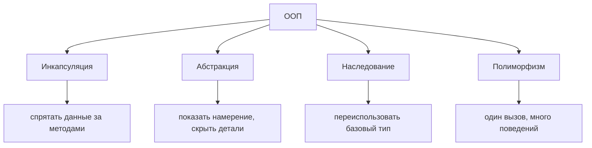
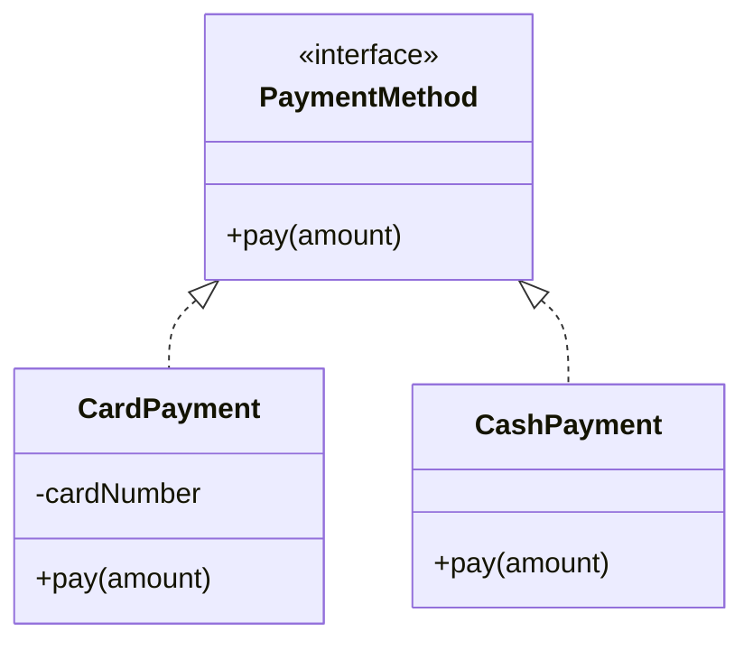

# Принципы ООП

**Объектно-ориентированное программирование** строит программу вокруг *объектов* —
связок данных и поведения, которое с этими данными работает, — вместо длинного
списка отдельных процедур. Четыре принципа описывают, как такие объекты устроены и
как они связаны: **инкапсуляция**, **абстракция**, **наследование** и
**полиморфизм**. Представьте кофейню: каждый сотрудник — это объект со своими
личными запасами и небольшим набором действий, которые он умеет делать, а вы,
клиент, взаимодействуете с ним только через стойку.



## Инкапсуляция — спрятать данные, показать поведение

Инкапсуляция держит данные объекта (`private`-поля) внутри объекта и позволяет
внешнему миру обращаться к ним только через контролируемые методы (геттеры,
сеттеры, бизнес-операции). Объект защищает свои инварианты — никто не может
перевести его в некорректное состояние, дотянувшись напрямую. Как кассовый аппарат:
кассир принимает ваши деньги через операции с ящиком, но вы не можете сами залезть в
кассу и переложить монеты.

```java
public class BankAccount {
    private long balanceCents;            // hidden state

    public void deposit(long cents) {
        if (cents <= 0) throw new IllegalArgumentException("amount must be positive");
        balanceCents += cents;            // the invariant is enforced here
    }

    public long getBalanceCents() {       // controlled read access
        return balanceCents;
    }
}
```

Так как поле `private`, правило «баланс меняется только через проверенные операции»
невозможно обойти.

## Абстракция — показать *что*, скрыть *как*

Абстракция означает, что вы предъявляете простую, раскрывающую намерение поверхность
и прячете за ней сложную реализацию. В Java это выражается через `interface` и
`abstract`-классы: вызывающий код зависит от `List`, а не от деталей перевыделения
массива в `ArrayList`. Как вождение автомобиля — вы крутите руль и жмёте педаль, не
зная, как устроена рулевая рейка или впрыск топлива.

```java
public interface PaymentMethod {
    void pay(long amountCents);           // what it does — not how
}
```

Инкапсуляция прячет *данные*; абстракция прячет *сложность* за контрактом. Они
связаны, но это не одно и то же. Та же идея лежит в основе правила «зависеть от
абстракций» из [SOLID](topic:solid-principles).

## Наследование — переиспользовать и специализировать базовый тип

Наследование позволяет классу (`extends`) перенять поля и методы родителя и добавить
или переопределить поведение, моделируя отношение «is-a». `SavingsAccount` *является*
`Account`, поэтому наследует логику баланса и пополнения и добавляет начисление
процентов. Как сеть кофеен: каждый филиал наследует фирменную книгу рецептов и затем
добавляет свои сезонные новинки.

```java
public class SavingsAccount extends BankAccount {
    public void addMonthlyInterest(double rate) {
        deposit(Math.round(getBalanceCents() * rate));
    }
}
```

Частая ловушка: наследование — только для настоящих отношений «is-a». Когда вам
нужно просто переиспользовать код, **композиция** (хранение другого объекта как
поля) обычно безопаснее наследования — предпочтение композиции делает дизайн гибче.

## Полиморфизм — один интерфейс, много поведений

Полиморфизм позволяет *одному и тому же* вызову делать разное в зависимости от
реального объекта за ссылкой. Самая важная форма — **полиморфизм времени выполнения
(динамический)**: переменная с типом родителя выполняет переопределённый метод
потомка, выбранный во время выполнения. Как бариста, выкрикивающий «следующий!» —
одно и то же слово запускает разный напиток в зависимости от того, кто подошёл.

```java
PaymentMethod method = pickMethod();      // Card? Cash? Wallet?
method.pay(500);                          // each class runs its own pay()
```

Есть и **полиморфизм времени компиляции** (*перегрузка* методов — одно имя, разные
списки параметров, разрешаемые компилятором). На собеседовании критична именно
динамическая форма, потому что именно она делает полезными абстракцию и паттерн
[Strategy](topic:strategy): вы пишете код против `PaymentMethod`, и новые реализации
подключаются без изменения вызывающего кода.

## Как четыре принципа сочетаются



В одном процессе оплаты видны все четыре: каждый класс оплаты **инкапсулирует** свои
данные, интерфейс `PaymentMethod` — это **абстракция**, конкретные классы
**наследуют** этот контракт, а вызов `pay()` через интерфейс — это **полиморфизм**.
Вместе они делают код проще для изменения и расширения — та же цель, на которой
строятся принципы [SOLID](topic:solid-principles) и большинство
[шаблонов проектирования](topic:design-patterns-overview).

## Ответ за 60 секунд

> В ООП четыре принципа. **Инкапсуляция** прячет данные объекта за методами, чтобы он
> сам управлял своим состоянием и защищал инварианты. **Абстракция** предъявляет
> простой контракт, раскрывающий намерение (интерфейс или абстрактный класс), и
> прячет за ним реализацию. **Наследование** позволяет классу переиспользовать и
> специализировать базовый тип в отношении «is-a». **Полиморфизм** позволяет одному
> вызову вести себя по-разному в зависимости от реального объекта — во время
> выполнения через переопределение, во время компиляции через перегрузку. Вместе они
> снижают связанность и упрощают расширение кода, поэтому на них опираются SOLID и
> шаблоны проектирования.

## Применимость на практике

Эти четыре принципа постоянно встречаются в реальной Java: `private`-поля с
проверяющими сеттерами (инкапсуляция), код против `List`/`Repository`/интерфейса
сервиса (абстракция), базовые классы фреймворка, которые вы расширяете
(наследование), и внедрение зависимостей, подставляющее разные реализации за одним
интерфейсом (полиморфизм). Spring-приложение построено именно на этом: вы зависите от
интерфейса `PaymentGateway`, а контейнер внедряет подходящий конкретный bean.

## Частые заблуждения

- **«Инкапсуляция — это просто написать геттеры и сеттеры».** Нет — это защита
  инвариантов. Сеттер, позволяющий кому угодно установить любое значение, отдаёт
  столько же контроля, сколько публичное поле.
- **«Абстракция и инкапсуляция — одно и то же».** Связаны, но различны. Инкапсуляция
  прячет *данные*; абстракция прячет *сложность* за контрактом.
- **«Наследование — главный инструмент переиспользования».** Злоупотребление
  наследованием порождает жёсткие, глубокие иерархии. Для обычного переиспользования
  кода предпочитайте композицию; наследование — только для настоящего «is-a».
- **«Полиморфизм — это просто перегрузка».** На собеседовании критична форма
  *времени выполнения* через переопределение и динамическую диспетчеризацию, а не
  перегрузка методов.
- **«Некоторые добавляют пятый принцип».** Многие программы перечисляют четыре столпа
  (инкапсуляция, абстракция, наследование, полиморфизм); некоторые считают абстракцию
  следствием остальных и называют три. Знайте обе трактовки и выбирайте одну
  уверенно.
