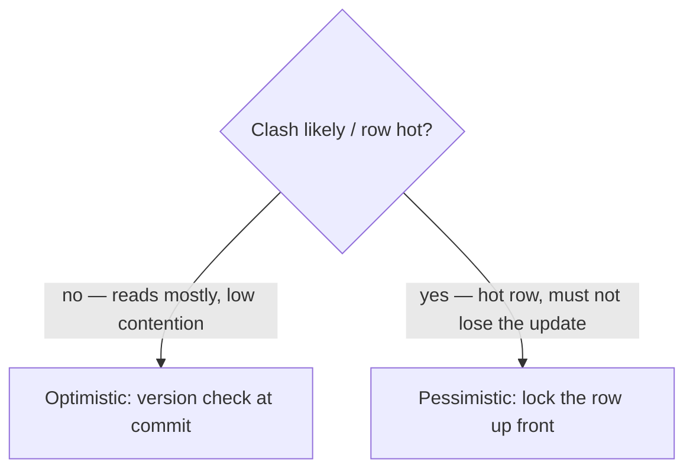
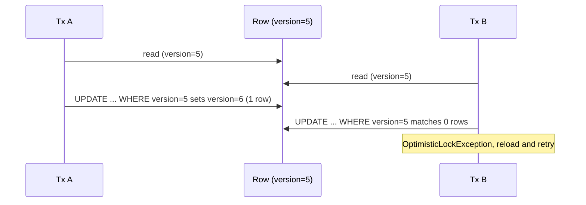
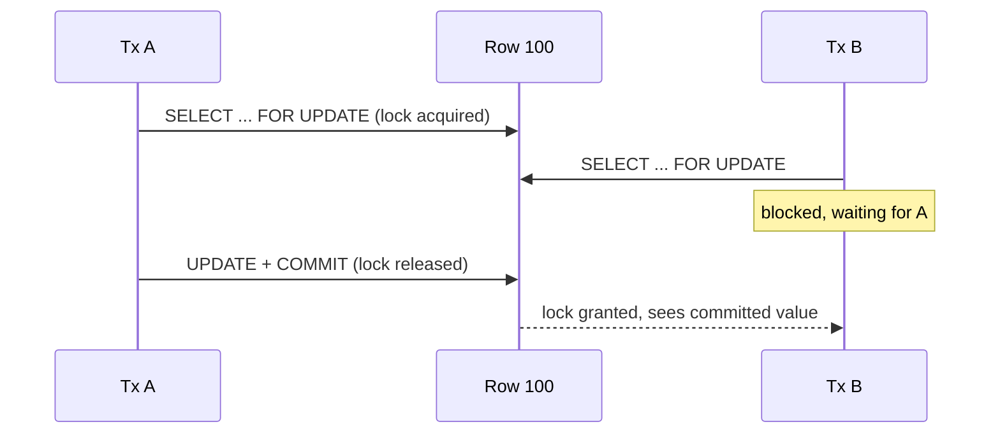

# Optimistic vs Pessimistic Locking

Both solve the same problem: two transactions read the same row, both change it,
and one silently overwrites the other — the **lost update** anomaly (see
[Transaction Read Anomalies](topic:transaction-read-anomalies)). They differ in
*when* they check for a clash.

Picture a shared library.

- **Pessimistic** locking assumes a clash is likely, so it acts like taking a
  physical book off the shelf: while you hold it, the shelf slot is empty and
  nobody else can take that book — they wait at the desk until you return it.
- **Optimistic** locking assumes clashes are rare, so it acts like editing a
  shared online document: everyone types freely, and only when you press **Save**
  does the system check "did anyone else change this since you opened it?" If so,
  it refuses your save and asks you to reload.



## Optimistic locking — check at the end

You add a **version** column to the row (`@Version` in JPA — an `int`/`long` or a
timestamp). When you load the entity you remember its version, say `5`. When you
flush a change, Hibernate does not blindly `UPDATE`; it writes:

```sql
UPDATE product
SET price = 42, version = 6
WHERE id = 100 AND version = 5;
```

If someone committed a change in the meantime, the row is now at `version = 6`,
the `WHERE` matches **zero rows**, Hibernate sees `rowsUpdated == 0` and throws
`OptimisticLockException` (`StaleObjectStateException`). Nothing was locked while
you were "thinking"; the conflict is detected only at write time, and it is *your*
job to catch it and **retry** the whole read-modify-write.

This is exactly a database-level [compare-and-set](topic:compare-and-set): "swap
the value only if the version is still what I read." Like the online document, no
one is ever blocked — but a save can be rejected, and the loser redoes the work.



**Use it when** contention is low and reads dominate, transactions are short, or
the read and the write are far apart in time — e.g. a user loads a form, thinks
for a minute, then saves (a *detached* entity across two HTTP requests). Holding a
database lock across that "think time" would be a disaster; a version check costs
nothing until commit. It also scales across nodes because the check lives in the
row, not in a held lock.

## Pessimistic locking — lock up front

Here you take the lock the moment you read, so no one else can touch the row until
you commit or roll back. In JPA you ask for it explicitly:

```java
Product p = em.find(Product.class, 100, LockModeType.PESSIMISTIC_WRITE);
// ... others trying to lock row 100 now wait for this transaction ...
p.setPrice(42);
```

Hibernate translates that into a **locking `SELECT`**:

```sql
SELECT * FROM product WHERE id = 100 FOR UPDATE;
```

The `FOR UPDATE` grabs a row-level lock inside your transaction. Another
transaction that runs `SELECT ... FOR UPDATE`, `UPDATE`, or `DELETE` on the same
row **blocks** until you finish. Like the borrowed library book: the second person
stands at the desk and waits; they never get a stale copy and can never overwrite
you, because they simply can't proceed until the book is back.



**Use it when** contention is high, the transaction is short, and a conflict/retry
would be expensive or unacceptable — decrementing stock for a hot product,
debiting an account balance, or dispatching jobs from a queue. You trade
throughput for certainty: the update *will* apply on fresh data, but you serialize
access and risk lock waits and **deadlocks**, so keep the transaction tiny.

## The SQL pessimistic locking generates

In PostgreSQL these are row-level locks appended to a `SELECT`. JPA's
`LockModeType` maps onto them:

| JPA `LockModeType`         | SQL (PostgreSQL)        | Meaning |
|----------------------------|-------------------------|---------|
| `PESSIMISTIC_WRITE`        | `SELECT ... FOR UPDATE` | **Exclusive**: blocks other `FOR UPDATE`/`FOR SHARE`/`UPDATE`/`DELETE` on the row. |
| `PESSIMISTIC_READ`         | `SELECT ... FOR SHARE`  | **Shared**: many readers may hold it together; writers block. |
| `PESSIMISTIC_FORCE_INCREMENT` | `FOR UPDATE` **+** bump `@Version` | Locks *and* raises the version, even if you only read. |

`FOR UPDATE` is exclusive — one holder at a time, like one person can hold the
book. `FOR SHARE` is shared — several readers can "look over each other's
shoulder" and guarantee the row won't change under them, but nobody may write
until they all let go.

Two important modifiers avoid waiting forever:

```sql
SELECT * FROM product WHERE id = 100 FOR UPDATE NOWAIT;      -- fail instantly if already locked
SELECT * FROM job WHERE status = 'NEW' FOR UPDATE SKIP LOCKED LIMIT 1;  -- ignore locked rows
```

- **`NOWAIT`** throws immediately instead of queuing at the desk (JPA:
  `javax.persistence.lock.timeout = 0`) — good when you'd rather fail fast than
  stall.
- **`SKIP LOCKED`** steps over rows someone else already holds and grabs the next
  free one — the classic pattern for pulling jobs off a queue so N workers never
  fight over the same row.

Under the hood the lock is enforced by [MVCC](topic:mvcc): normal `SELECT`s stay
non-blocking on their own snapshot, and only these explicit locking reads (and
writers) actually contend. Because a locking `SELECT` reads the *latest committed*
row, it also sidesteps the stale-snapshot lost update you can get under
`REPEATABLE READ` — see [PostgreSQL Isolation Levels](topic:postgresql-isolation-levels).

## 60-second interview answer

> Both prevent a lost update, but they check at different times. **Optimistic
> locking** holds no lock: you keep a `@Version` column, and on update Hibernate
> runs `UPDATE ... SET version = v+1 WHERE id = ? AND version = v`. If zero rows
> match, someone else won and you get an `OptimisticLockException` to retry. It's
> best for low-contention, read-heavy work and long "think time" between load and
> save. **Pessimistic locking** takes a row lock at read time — JPA
> `PESSIMISTIC_WRITE` emits `SELECT ... FOR UPDATE` (exclusive) and
> `PESSIMISTIC_READ` emits `SELECT ... FOR SHARE` (shared) — so other writers
> block until you commit. It's best for hot rows and short transactions where a
> retry is too costly, at the price of throughput and possible deadlocks; keep the
> transaction short and consider `NOWAIT` or `SKIP LOCKED`.

## Common misconceptions

- ❌ "Optimistic locking locks the row." — It doesn't lock anything; it *detects*
  a conflict at commit via the version check. No `@Version`, no protection.
- ❌ "Pessimistic is always safer, so always use it." — It serializes access, cuts
  throughput, and invites deadlocks and lock-wait timeouts. On low-contention data
  it's pure overhead.
- ❌ "`FOR UPDATE` locks the whole table." — It's a **row-level** lock in
  PostgreSQL; only matched rows are locked (index the predicate or you may lock
  more than you meant while scanning).
- ❌ "A plain `SELECT` blocks a `SELECT ... FOR UPDATE`." — Under MVCC, ordinary
  reads don't take row locks and don't block the locking read; only writers and
  other locking reads contend.
- ❌ "`OptimisticLockException` means a bug." — It's expected under contention; the
  correct handling is to reload and retry, not to crash.
- ❌ "The version bump is manual." — Hibernate manages `@Version` automatically on
  every flush; you must not set it yourself.
