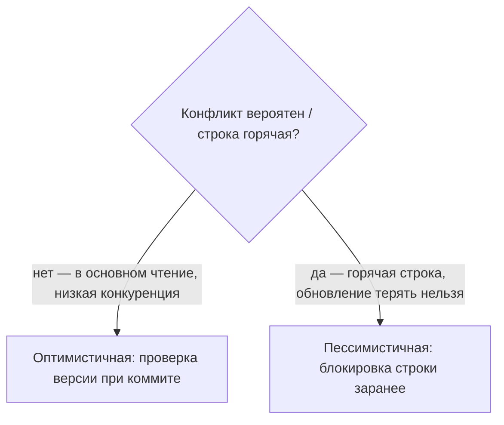
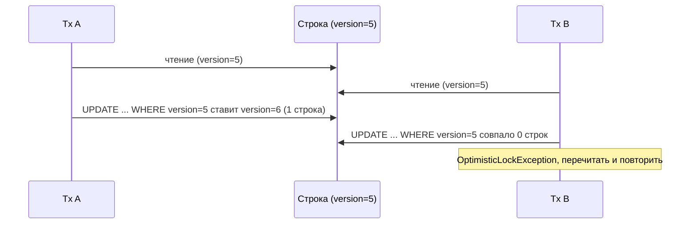
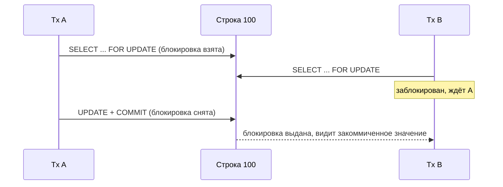

# Оптимистичная и пессимистичная блокировка

Обе решают одну задачу: две транзакции читают одну строку, обе её меняют, и одна
молча затирает другую — аномалия **потерянного обновления** (см.
[Аномалии чтения в транзакциях](topic:transaction-read-anomalies)). Отличаются они
тем, *когда* проверяют конфликт.

Представьте общую библиотеку.

- **Пессимистичная** блокировка считает, что конфликт вероятен, и ведёт себя как
  взятие бумажной книги с полки: пока книга у вас, ячейка на полке пуста, и никто
  другой эту книгу взять не может — они ждут у стойки, пока вы её не вернёте.
- **Оптимистичная** блокировка считает, что конфликты редки, и ведёт себя как
  редактирование общего онлайн-документа: все печатают свободно, и только когда вы
  нажимаете **Сохранить**, система проверяет: «изменил ли кто-то это, пока было
  открыто у вас?» Если да — сохранение отклоняется и просят перезагрузить.



## Оптимистичная блокировка — проверка в конце

В строку добавляется столбец **version** (`@Version` в JPA — `int`/`long` или
timestamp). При загрузке сущности вы запоминаете её версию, например `5`. При
сбросе изменения Hibernate не делает `UPDATE` вслепую, а пишет:

```sql
UPDATE product
SET price = 42, version = 6
WHERE id = 100 AND version = 5;
```

Если кто-то за это время закоммитил изменение, строка уже на `version = 6`, `WHERE`
не находит **ни одной строки**, Hibernate видит `rowsUpdated == 0` и бросает
`OptimisticLockException` (`StaleObjectStateException`). Пока вы «думали», ничего
не было заблокировано; конфликт обнаруживается только в момент записи, и это *ваша*
задача — поймать его и **повторить** весь цикл read-modify-write.

Это ровно [compare-and-set](topic:compare-and-set) на уровне БД: «поменяй значение,
только если версия всё ещё та, что я прочитал». Как и в онлайн-документе, никто
никогда не заблокирован — но сохранение может быть отклонено, и проигравший
переделывает работу.



**Применяйте**, когда конкуренция низкая и преобладает чтение, транзакции короткие,
или чтение и запись сильно разнесены во времени — например, пользователь открыл
форму, минуту думал и сохранил (*detached*-сущность между двумя HTTP-запросами).
Держать блокировку БД всё это «время на раздумья» было бы катастрофой; проверка
версии не стоит ничего до самого коммита. Она к тому же хорошо масштабируется между
узлами, потому что проверка живёт в строке, а не в удерживаемой блокировке.

## Пессимистичная блокировка — блокируем заранее

Здесь вы берёте блокировку в момент чтения, так что никто другой не может тронуть
строку, пока вы не закоммитите или не откатитесь. В JPA её запрашивают явно:

```java
Product p = em.find(Product.class, 100, LockModeType.PESSIMISTIC_WRITE);
// ... другие, кто пытается заблокировать строку 100, теперь ждут эту транзакцию ...
p.setPrice(42);
```

Hibernate переводит это в **блокирующий `SELECT`**:

```sql
SELECT * FROM product WHERE id = 100 FOR UPDATE;
```

`FOR UPDATE` берёт блокировку уровня строки внутри вашей транзакции. Другая
транзакция, выполняющая `SELECT ... FOR UPDATE`, `UPDATE` или `DELETE` по той же
строке, **блокируется**, пока вы не завершитесь. Как с одолженной книгой: второй
человек стоит у стойки и ждёт; он никогда не получит устаревшую копию и никогда вас
не перезапишет, потому что просто не может продолжить, пока книга не вернётся.



**Применяйте**, когда конкуренция высокая, транзакция короткая, а конфликт/повтор
дорог или недопустим — списание остатка популярного товара, дебет баланса счёта или
раздача задач из очереди. Вы меняете пропускную способность на определённость:
обновление *точно* применится к свежим данным, но вы сериализуете доступ и рискуете
ожиданиями блокировок и **дедлоками**, поэтому держите транзакцию крошечной.

## Какой SQL порождает пессимистичная блокировка

В PostgreSQL это блокировки уровня строки, добавляемые к `SELECT`. `LockModeType`
из JPA ложится на них так:

| JPA `LockModeType`         | SQL (PostgreSQL)        | Смысл |
|----------------------------|-------------------------|-------|
| `PESSIMISTIC_WRITE`        | `SELECT ... FOR UPDATE` | **Эксклюзивная**: блокирует по строке другие `FOR UPDATE`/`FOR SHARE`/`UPDATE`/`DELETE`. |
| `PESSIMISTIC_READ`         | `SELECT ... FOR SHARE`  | **Разделяемая**: много читателей держат её вместе; писатели блокируются. |
| `PESSIMISTIC_FORCE_INCREMENT` | `FOR UPDATE` **+** инкремент `@Version` | Блокирует *и* поднимает версию, даже если вы только читали. |

`FOR UPDATE` эксклюзивна — один держатель за раз, как книгу держит один человек.
`FOR SHARE` разделяемая — несколько читателей могут «смотреть через плечо» и
гарантировать, что строка под ними не изменится, но никто не может писать, пока все
не отпустят.

Два важных модификатора спасают от бесконечного ожидания:

```sql
SELECT * FROM product WHERE id = 100 FOR UPDATE NOWAIT;      -- сразу упасть, если уже заблокировано
SELECT * FROM job WHERE status = 'NEW' FOR UPDATE SKIP LOCKED LIMIT 1;  -- пропустить заблокированные строки
```

- **`NOWAIT`** бросает ошибку немедленно, вместо очереди у стойки (JPA:
  `javax.persistence.lock.timeout = 0`) — хорошо, когда лучше быстро упасть, чем
  простаивать.
- **`SKIP LOCKED`** перешагивает строки, уже занятые кем-то, и берёт следующую
  свободную — классический приём для вытягивания задач из очереди, чтобы N воркеров
  никогда не дрались за одну строку.

Под капотом блокировку обеспечивает [MVCC](topic:mvcc): обычные `SELECT` остаются
неблокирующими на своём снимке, и лишь эти явные блокирующие чтения (и писатели)
реально конкурируют. Поскольку блокирующий `SELECT` читает *последнюю
закоммиченную* строку, он к тому же обходит потерянное обновление из-за устаревшего
снимка, возможное при `REPEATABLE READ` — см.
[Уровни изоляции в PostgreSQL](topic:postgresql-isolation-levels).

## Ответ за 60 секунд

> Обе предотвращают потерянное обновление, но проверяют в разные моменты.
> **Оптимистичная блокировка** не держит блокировок: у вас есть столбец `@Version`,
> и при обновлении Hibernate выполняет
> `UPDATE ... SET version = v+1 WHERE id = ? AND version = v`. Если совпало ноль
> строк — кто-то опередил, и вы получаете `OptimisticLockException` для повтора.
> Она хороша при низкой конкуренции, преобладании чтения и долгом «времени на
> раздумья» между загрузкой и сохранением. **Пессимистичная блокировка** берёт
> блокировку строки в момент чтения — JPA `PESSIMISTIC_WRITE` порождает
> `SELECT ... FOR UPDATE` (эксклюзивную), а `PESSIMISTIC_READ` —
> `SELECT ... FOR SHARE` (разделяемую), — так что другие писатели ждут вашего
> коммита. Она хороша для горячих строк и коротких транзакций, где повтор слишком
> дорог, ценой пропускной способности и возможных дедлоков; держите транзакцию
> короткой и рассмотрите `NOWAIT` или `SKIP LOCKED`.

## Частые заблуждения

- ❌ «Оптимистичная блокировка блокирует строку.» — Она ничего не блокирует; она
  *обнаруживает* конфликт при коммите через проверку версии. Нет `@Version` — нет
  защиты.
- ❌ «Пессимистичная всегда безопаснее, значит используем всегда.» — Она
  сериализует доступ, режет пропускную способность и провоцирует дедлоки и таймауты
  ожидания блокировок. На данных с низкой конкуренцией это чистые накладные расходы.
- ❌ «`FOR UPDATE` блокирует всю таблицу.» — В PostgreSQL это блокировка **уровня
  строки**; блокируются только совпавшие строки (индексируйте предикат, иначе при
  сканировании можно заблокировать больше, чем вы имели в виду).
- ❌ «Обычный `SELECT` блокирует `SELECT ... FOR UPDATE`.» — При MVCC обычные чтения
  не берут блокировок строк и не блокируют блокирующее чтение; конкурируют только
  писатели и другие блокирующие чтения.
- ❌ «`OptimisticLockException` — это баг.» — При конкуренции это ожидаемо;
  правильная реакция — перечитать и повторить, а не падать.
- ❌ «Версию нужно поднимать вручную.» — Hibernate управляет `@Version`
  автоматически при каждом flush; выставлять её самому нельзя.
