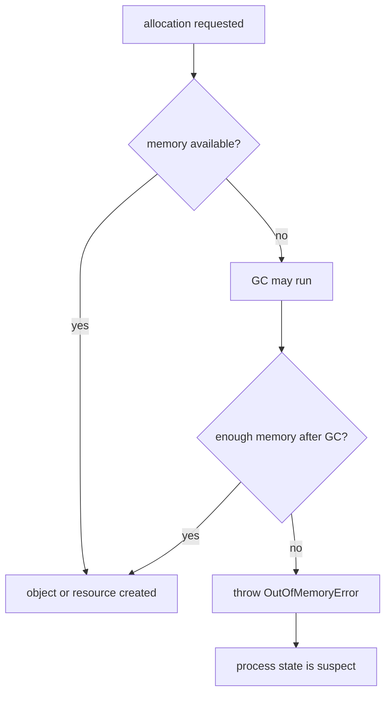
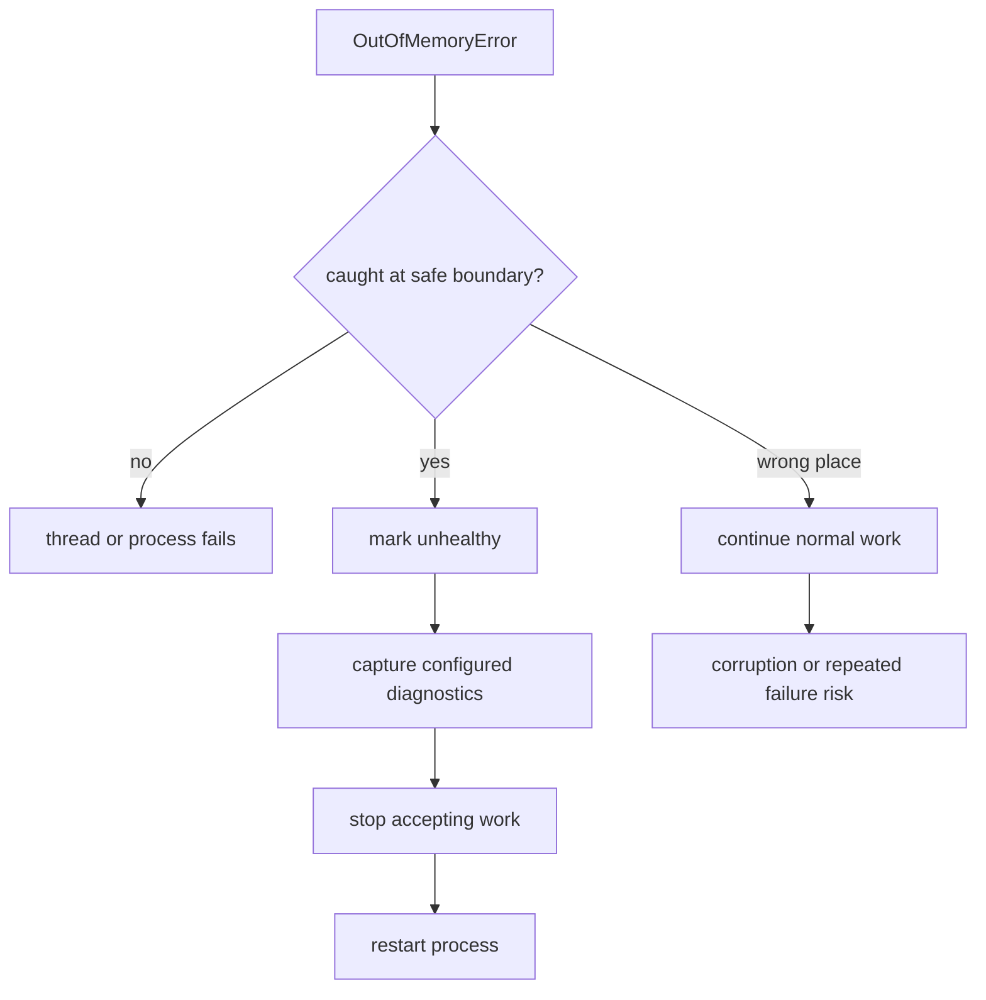

# Catching OutOfMemoryError and Continuing

## Short Answer

Usually, no: catching `OutOfMemoryError` and continuing normal work is a bad recovery strategy. `OutOfMemoryError` means the JVM could not allocate memory in some area, so the program may not have enough memory even to log, build an error response, finish cleanup, or keep invariants consistent. Treat the process as unhealthy, collect diagnostics if possible, release critical resources carefully, and restart it under a supervisor.

Everyday analogy: if a restaurant kitchen has no counter space left, the answer is not to keep accepting orders and hope every cook can improvise. Stop the line, preserve the evidence, clean up what you safely can, and reopen with a fixed cause.

## Where OutOfMemoryError Fits

`OutOfMemoryError` is an `Error`, not an application-level `Exception`. In the Java hierarchy, `Error` represents serious VM or environment failures that normal business code is not expected to handle. For the larger hierarchy, see [Exceptions in Java](topic:exception-basics). Kitchen analogy: a rejected ingredient order is an `Exception`; the whole kitchen losing storage space is an `Error`.

The error can come from different memory areas: `Java heap space`, `GC overhead limit exceeded`, `Metaspace`, `Direct buffer memory`, or even `unable to create native thread`. Those areas are explained in [JVM memory areas](topic:jvm-memory-areas) and [heap generations](topic:heap-generations). Post office analogy: "no room" may mean no shelf for parcels, no desk for forms, or no clerk available; catching the alarm does not create new space.

## Why Continuing Is Risky

The first risk is that the handler itself may need memory. Logging frameworks, string concatenation, stack trace rendering, JSON error responses, metric tags, and cleanup code often allocate. Traffic analogy: when the road is completely blocked, sending more trucks to write signs can block the emergency lane too.

The second risk is inconsistent application state. The allocation that failed may have happened halfway through updating a cache, creating a response, appending to a queue, or loading a class. A `catch` block cannot know that every object graph and invariant is still safe. Kitchen analogy: if the pantry collapse happened while three cooks were plating dishes, you cannot assume every plate is still clean and complete.

The third risk is hiding the real incident. If broad code catches `Throwable`, logs "ignored", and continues, the service may keep serving partial failures until data is corrupted or latency explodes. Post office analogy: stamping every failed parcel as "delivered" makes the queue look shorter while customers lose packages.

## What Is Acceptable To Catch

There are narrow cases where a boundary may catch `OutOfMemoryError`, but the goal is controlled failure, not business-as-usual execution:

- mark the process unhealthy so load balancers stop sending traffic;
- trigger a minimal shutdown path;
- release an external resource if that release is simple and already safe;
- emit a tiny pre-planned signal, if the code was designed not to allocate;
- let the error continue upward after cleanup.

Traffic analogy: a highway control room may catch the alarm to turn on a red signal and close the ramp, not to wave more cars into the jam.

Some small tools or batch jobs can catch `OutOfMemoryError` at the outermost boundary to print a plain message and exit with a clear code. That is still not "continue". It is like a ticket machine showing "out of paper" and shutting down instead of selling invisible tickets.

## Production Recovery

Production recovery should be designed outside the failed request path. Prefer JVM and platform mechanisms such as `-XX:+HeapDumpOnOutOfMemoryError`, `-XX:HeapDumpPath=...`, `-XX:+ExitOnOutOfMemoryError`, container restart policies, health checks, and alerts. For finding the root cause, use [Diagnosing Memory Growth and Leaks](topic:diagnosing-memory-leaks), [Memory Leaks in Java](topic:memory-leaks), and [Configuring the Garbage Collector](topic:gc-configuration). Post office analogy: install cameras, shelf limits, and a night manager restart procedure before the parcel room floods.

It is usually better for the process to die and restart cleanly than to limp forward with unknown state. A restart gives the service a fresh heap; diagnostics tell you whether the cause was a leak, too-small heap, excessive concurrency, unbounded cache, large request, native memory pressure, or thread explosion. Kitchen analogy: after a freezer fails, reopening after inspection is safer than serving food from unknown trays.

## A Practical Interview Answer

> You can technically catch `OutOfMemoryError`, because it is a `Throwable`, but normal application code should not catch it and continue. It usually means the JVM could not allocate memory and the application state may be unreliable. A handler is acceptable only at a narrow boundary for emergency actions: mark the service unhealthy, trigger diagnostics such as a heap dump, release very simple resources if safe, and shut down or let a supervisor restart the process. The real fix is to diagnose the memory pressure or leak, not to hide the error with try-catch.

## Common Misconceptions

- **"If I catch it, memory is fine again."** Not necessarily. The failed allocation may have been abandoned, but the heap or another memory area can still be full. Like moving one box from a crowded shelf, it does not mean the warehouse is usable again.
- **"`System.gc()` in catch fixes it."** It is only a request to the JVM and may not free enough memory. Like asking everyone in traffic to move at once, it does not guarantee a clear lane.
- **"Catching `Throwable` is defensive programming."** It often catches failures the program cannot safely recover from, including `OutOfMemoryError` and [StackOverflowError](topic:stackoverflow-error). Like putting every alarm under one mute button, it hides the difference between a typo and a fire.
- **"Only heap leaks cause OutOfMemoryError."** Native threads, direct buffers, Metaspace, and GC overhead can also produce it. Like a post office, capacity can run out at the parcel shelf, the counter, or the staff roster.
- **"A single request can catch it and the server can continue."** Sometimes the triggering request was large, but the process-wide memory pressure may still affect every thread. Like one oversized truck blocking a junction, the problem is not always isolated to that driver.
