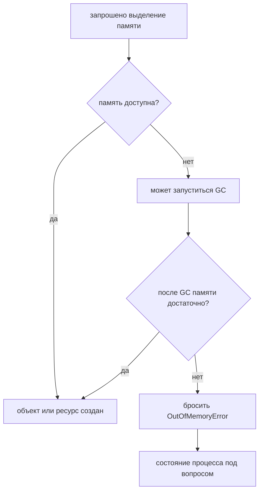
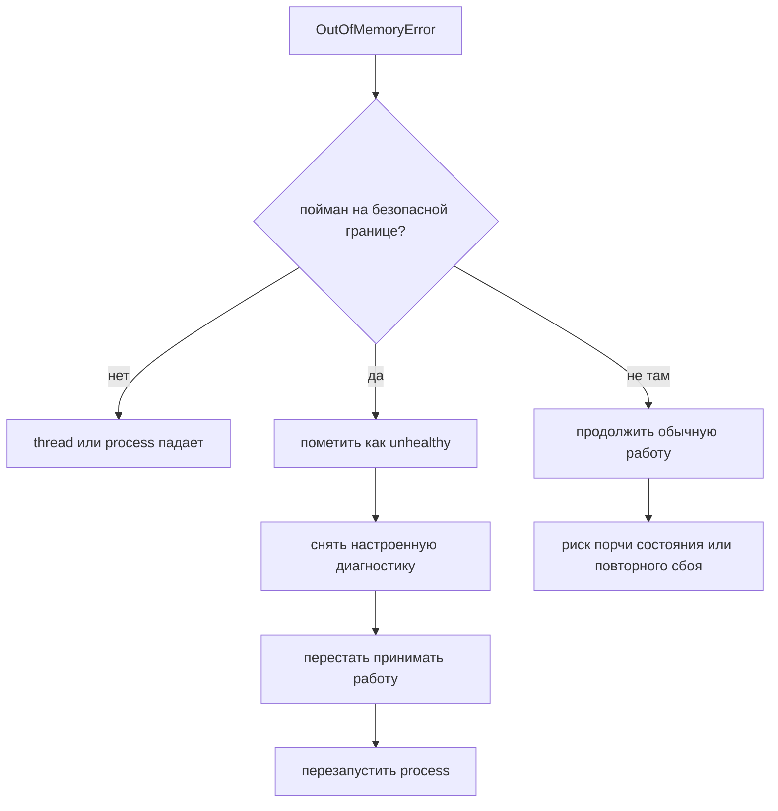

# Перехват OutOfMemoryError и продолжение работы

## Короткий ответ

Обычно нет: ловить `OutOfMemoryError` и продолжать обычную работу — плохая стратегия восстановления. `OutOfMemoryError` означает, что JVM не смогла выделить память в какой-то области, поэтому программе может не хватить памяти даже на логирование, сборку error response, завершение cleanup или сохранение инвариантов в согласованном состоянии. Считай процесс нездоровым, по возможности собери диагностику, аккуратно освободи критичные ресурсы и перезапусти его под supervisor.

Бытовая аналогия: если на кухне ресторана полностью закончилось рабочее место, решение — не продолжать принимать заказы и надеяться, что каждый повар выкрутится. Нужно остановить линию, сохранить следы проблемы, безопасно убрать то, что можно, и открыться заново после исправления причины.

## Где находится OutOfMemoryError

`OutOfMemoryError` — это `Error`, а не прикладной `Exception`. В иерархии Java `Error` означает серьёзные сбои VM или окружения, которые обычный бизнес-код не должен обрабатывать как штатный сценарий. Более широкая иерархия разобрана в теме [Исключения в Java](topic:exception-basics). Кухонная аналогия: отказ поставщика привезти один ингредиент — это `Exception`; потеря всего места для хранения на кухне — это `Error`.

Ошибка может прийти из разных областей памяти: `Java heap space`, `GC overhead limit exceeded`, `Metaspace`, `Direct buffer memory` или даже `unable to create native thread`. Эти области разобраны в темах [об областях памяти JVM](topic:jvm-memory-areas) и [поколениях heap](topic:heap-generations). Почтовая аналогия: «нет места» может означать, что нет полки для посылок, нет стола для бланков или нет свободного сотрудника; перехват сигнала не создаёт новое место.

## Почему продолжать опасно

Первый риск в том, что самому обработчику может понадобиться память. Logging frameworks, конкатенация строк, отрисовка stack trace, JSON error response, metric tags и cleanup-код часто выделяют объекты. Дорожная аналогия: когда дорога полностью заблокирована, отправка новых машин для установки знаков может забить ещё и аварийную полосу.

Второй риск — несогласованное состояние приложения. Ошибка выделения могла случиться посередине обновления cache, создания response, добавления в queue или загрузки class. Блок `catch` не знает, что все object graphs и инварианты всё ещё безопасны. Кухонная аналогия: если кладовая обвалилась, пока три повара собирали блюда, нельзя считать, что каждая тарелка чистая и завершённая.

Третий риск — скрыть настоящий инцидент. Если широкий код ловит `Throwable`, пишет в лог "ignored" и продолжает, сервис может ещё долго отдавать частичные сбои, пока данные не испортятся или latency не взлетит. Почтовая аналогия: если ставить штамп «доставлено» на каждую проблемную посылку, очередь выглядит короче, но клиенты теряют отправления.

## Что допустимо ловить

Есть узкие случаи, где boundary может поймать `OutOfMemoryError`, но цель — контролируемый отказ, а не работа как ни в чём не бывало:

- пометить процесс нездоровым, чтобы load balancers перестали слать трафик;
- запустить минимальный shutdown path;
- освободить внешний ресурс, если это простое и заранее безопасное действие;
- отправить крошечный заранее продуманный сигнал, если код спроектирован без выделений памяти;
- дать ошибке продолжить распространение после cleanup.

Дорожная аналогия: диспетчерская трассы может поймать тревогу, чтобы включить красный сигнал и закрыть въезд, а не чтобы направлять больше машин в пробку.

Небольшие утилиты или batch jobs иногда ловят `OutOfMemoryError` на самом внешнем уровне, чтобы напечатать простое сообщение и завершиться с понятным кодом. Это всё равно не «продолжить». Это как билетный автомат, который показывает «нет бумаги» и выключается, вместо того чтобы продавать невидимые билеты.

## Восстановление на production

Production-восстановление лучше проектировать вне пути упавшего request. Предпочитай механизмы JVM и платформы: `-XX:+HeapDumpOnOutOfMemoryError`, `-XX:HeapDumpPath=...`, `-XX:+ExitOnOutOfMemoryError`, container restart policies, health checks и alerts. Для поиска причины смотри [Диагностику роста памяти и утечек](topic:diagnosing-memory-leaks), [Memory Leaks in Java](topic:memory-leaks) и [настройку GC](topic:gc-configuration). Почтовая аналогия: камеры, лимиты полок и ночную процедуру перезапуска менеджер ставит до того, как комнату завалит посылками.

Обычно лучше дать процессу умереть и стартовать чисто, чем тащить его дальше с неизвестным состоянием. Перезапуск даёт сервису свежий heap; диагностика показывает, что было причиной: leak, слишком маленький heap, чрезмерная concurrency, unbounded cache, большой request, давление native memory или взрыв числа threads. Кухонная аналогия: после поломки морозильника безопаснее открыться после проверки, чем подавать еду с непонятных подносов.

## Практический ответ на собеседовании

> Технически `OutOfMemoryError` можно поймать, потому что это `Throwable`, но обычный прикладной код не должен ловить его и продолжать работу. Обычно это означает, что JVM не смогла выделить память, а состояние приложения может быть ненадёжным. Обработчик допустим только на узкой границе для аварийных действий: пометить сервис unhealthy, запустить диагностику вроде heap dump, освободить очень простые ресурсы, если это безопасно, и остановиться или дать supervisor перезапустить процесс. Настоящее исправление — найти причину давления на память или утечки, а не прятать ошибку через try-catch.

## Частые заблуждения

- **«Если я поймал ошибку, память снова в порядке».** Не обязательно. Неудачное выделение могло быть отброшено, но heap или другая область памяти всё ещё может быть заполнена. Как если убрать одну коробку с переполненной полки: это не значит, что склад снова пригоден к работе.
- **«`System.gc()` в catch это исправит».** Это только просьба к JVM и она может не освободить достаточно памяти. Как попросить всех в пробке одновременно сдвинуться: свободная полоса не гарантирована.
- **«Ловить `Throwable` — это defensive programming».** Часто так ловятся сбои, от которых программа не может безопасно восстановиться, включая `OutOfMemoryError` и [StackOverflowError](topic:stackoverflow-error). Это как повесить все тревоги на одну кнопку отключения: она скрывает разницу между опечаткой и пожаром.
- **«OutOfMemoryError бывает только из-за heap leak».** Native threads, direct buffers, Metaspace и GC overhead тоже могут привести к нему. Как на почте, capacity может закончиться на полке для посылок, у стойки или в расписании сотрудников.
- **«Один request может поймать ошибку, а server продолжит».** Иногда триггером был большой request, но process-wide давление памяти может затронуть все threads. Как один слишком большой грузовик на перекрёстке: проблема не всегда изолирована только в этом водителе.
