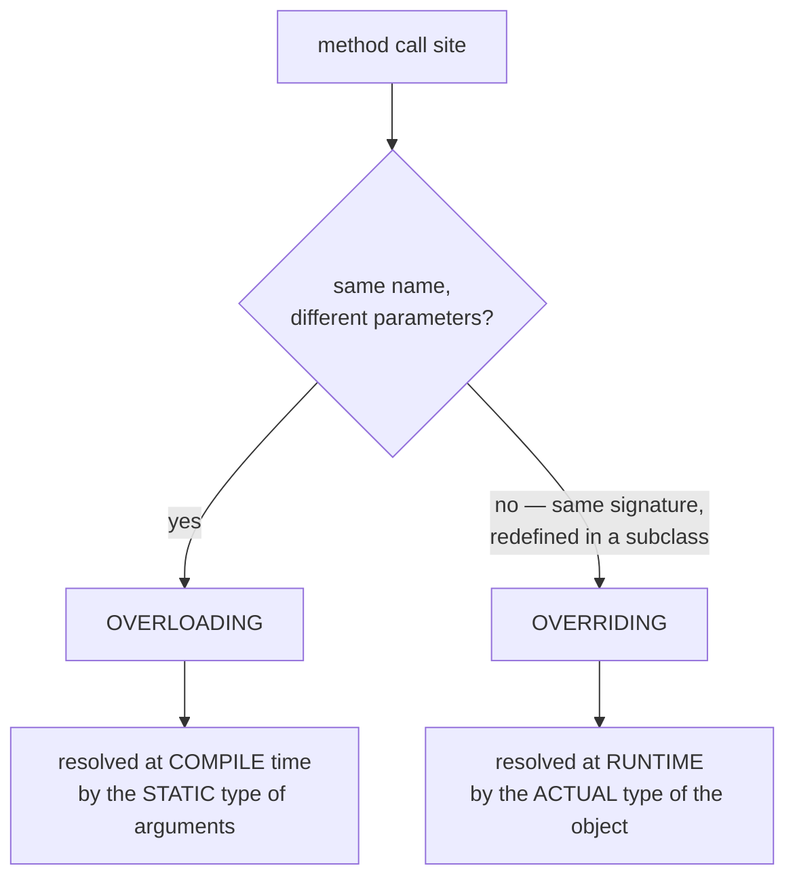
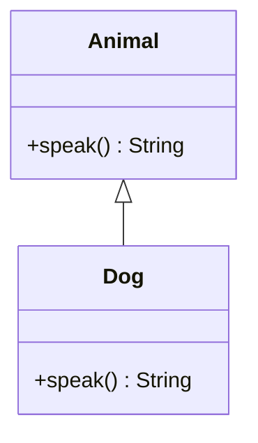

# Overriding vs Overloading

Both let several methods share a name, but they answer completely different
questions, and Java resolves them at **different times**.

- **Overloading** = same method name, **different parameter lists** in the *same*
  class. The compiler picks one **at compile time** from the **static (declared)
  type** of the arguments.
- **Overriding** = a **subclass redefines** an inherited method with the **same
  signature**. The JVM picks the body **at runtime** from the **actual type** of
  the object.

> Real-world picture: think of a **post office counter**. *Overloading* is one
> clerk who accepts a letter, a parcel, or a registered package — same desk
> ("send"), but a different procedure chosen by **what you hand over** (the
> declared kind of item). *Overriding* is the same instruction "deliver this"
> sent to whichever **branch actually holds the address** — the procedure is
> decided by the **real destination**, not by the label on the envelope.

## How each one is resolved



> The fork is like sorting mail: the **shape of what you carry** routes an
> overloaded call (parcel vs letter), while the **address on the object itself**
> routes an overridden call.

### Overriding: late binding by the real object



`Animal a = new Dog(); a.speak();` runs **`Dog.speak()`**. The variable's type
(`Animal`) only decides *what you are allowed to call*; the **object** decides
*which body runs*. This is the engine of **runtime polymorphism** — the same call
site does different things depending on the real object. It powers patterns like
[Strategy](topic:strategy) and [Template Method](topic:template-method), and is
one face of the [OOP principle](topic:oop-principles) of polymorphism.

> Like dialing one phone number ("speak") that rings whichever **specific shop**
> the line is currently connected to: the signboard out front (the `Animal`
> label) doesn't pick up — the shop that actually answers does.

If a subclass does **not** override the method, dispatch walks **up** the chain
to the nearest ancestor that declares it — so an inherited body runs unchanged.

### Overloading: early binding by the declared type

```java
void print(Object o) { ... }
void print(String s) { ... }

String s = "hi";
print(s);          // print(String)  — most specific applicable overload

Object o = "hi";   // a String, but DECLARED as Object
print(o);          // print(Object)  — NOT print(String)!
```

The compiler sees only the **static type** of the argument. `o` is *declared*
`Object`, so `print(Object)` is baked in **before the program runs** — the fact
that `o` happens to hold a `String` at runtime is never consulted. Overloading is
**not** polymorphic.

> This is the post-office trap: if your parcel is **filled out on the form as
> "document"**, it travels by the document procedure — even if the box is
> actually full of fragile glass. The **paperwork (declared type)** routes it, not
> the contents (runtime type).

## The 60-second interview answer

> Overloading and overriding both reuse a method name, but differ in *what*
> changes and *when* the target is chosen. **Overloading** is several methods with
> the **same name and different parameter lists** in one class; the **compiler**
> resolves the call **at compile time** using the **static types** of the
> arguments, picking the most specific applicable overload. **Overriding** is a
> **subclass providing a new body for an inherited method with the same
> signature**; the **JVM** resolves it **at runtime** using the **actual type** of
> the object (virtual dispatch / late binding). So overriding gives **runtime
> polymorphism**; overloading does not. Overriding has rules — same parameters, a
> covariant (same or narrower) return type, access not more restrictive, no
> broader checked exceptions — while overloading only needs the parameter lists to
> differ. `static`, `private` and `final` methods are **not** overridden:
> `static` methods are *hidden* by the static type, and `private` ones aren't
> inherited at all.

## Production relevance

- **Polymorphism in frameworks**: overriding `equals`/`hashCode`/`toString`,
  Spring callbacks, servlet `doGet`/`doPost`, and template hooks all rely on
  runtime dispatch to your subclass.
- **API ergonomics**: overloaded methods (`StringBuilder.append`, logging
  facades) offer convenient signatures — but resolution by static type can
  surprise you when a value is held in a wider variable.
- **`@Override` saves you**: annotate every override. If your signature does not
  actually match a supertype method (a stray parameter, a typo), it silently
  becomes a brand-new **overload** and your code compiles but misbehaves — the
  annotation turns that into a compile error.

## Common traps and misconceptions

- **"Overloading is polymorphism."** No — it is resolved at compile time by the
  static type. Only **overriding** is runtime polymorphism.
- **`Object o = aString; print(o)` calls `print(String)`.** It calls
  `print(Object)`; the runtime type is ignored for overload selection.
- **"You can override a `static` method."** You **hide** it. Which static method
  runs is decided by the **static type**, not the object — it does not dispatch.
- **"Return type distinguishes overloads."** It does not. Two methods that differ
  **only** by return type do not compile.
- **An override may widen exceptions or restrict access.** It may not: it cannot
  throw **broader checked** exceptions and cannot be **less** accessible than the
  method it overrides.
- **A typo'd "override" silently becomes an overload.** Without `@Override` the
  compiler is happy and the wrong method runs. Always annotate.
- **Choosing the type to model behaviour** (interface vs base class) interacts
  with this — see [Interface vs Abstract Class](topic:interface-vs-abstract-class).
