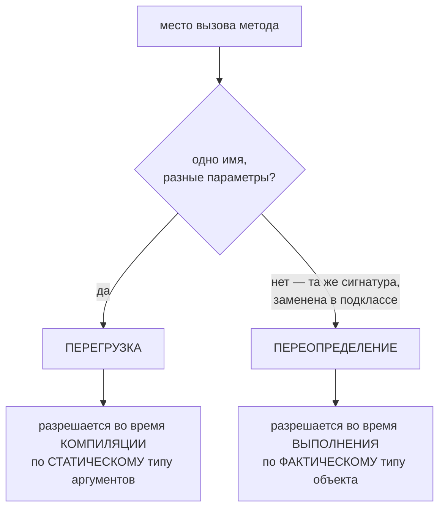
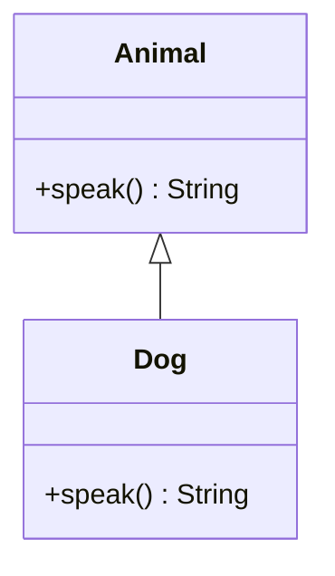

# Переопределение vs перегрузка

Оба механизма позволяют нескольким методам иметь одно имя, но отвечают на
совершенно разные вопросы, и Java разрешает их в **разное время**.

- **Перегрузка** (overloading) = одно имя метода, **разные списки параметров** в
  *одном* классе. Компилятор выбирает нужный **во время компиляции** по
  **статическому (объявленному) типу** аргументов.
- **Переопределение** (overriding) = **подкласс заменяет** унаследованный метод с
  **той же сигнатурой**. JVM выбирает тело **во время выполнения** по
  **фактическому типу** объекта.

> Образ из жизни: представь **окно на почте**. *Перегрузка* — один оператор,
> который принимает письмо, посылку или заказное отправление: окно одно
> («отправить»), но процедуру выбирают по тому, **что вы подаёте** (объявленный
> вид отправления). *Переопределение* — та же команда «доставить это», отправленная
> тому **отделению, где реально находится адрес**: процедуру определяет
> **настоящий получатель**, а не надпись на конверте.

## Как разрешается каждое



> Развилка как сортировка почты: **форма того, что вы несёте**, маршрутизирует
> перегруженный вызов (посылка или письмо), а **адрес на самом объекте**
> маршрутизирует переопределённый вызов.

### Переопределение: позднее связывание по реальному объекту



`Animal a = new Dog(); a.speak();` выполнит **`Dog.speak()`**. Тип переменной
(`Animal`) определяет только *что вам разрешено вызвать*; а **объект** определяет
*какое тело выполнится*. Это и есть движок **полиморфизма во время выполнения**:
одно и то же место вызова делает разное в зависимости от реального объекта. На нём
держатся паттерны [Strategy](topic:strategy) и
[Template Method](topic:template-method), и это одна из граней
[принципа ООП](topic:oop-principles) — полиморфизма.

> Как один телефонный номер («speak»), который дозванивается до того **конкретного
> магазина**, к которому линия подключена сейчас: вывеска на входе (метка
> `Animal`) трубку не берёт — отвечает тот магазин, что реально на линии.

Если подкласс **не** переопределяет метод, диспетчеризация поднимается **вверх**
по цепочке до ближайшего предка, который его объявляет, — и выполняется
унаследованное тело без изменений.

### Перегрузка: раннее связывание по объявленному типу

```java
void print(Object o) { ... }
void print(String s) { ... }

String s = "hi";
print(s);          // print(String)  — самая конкретная подходящая перегрузка

Object o = "hi";   // это String, но ОБЪЯВЛЕН как Object
print(o);          // print(Object)  — НЕ print(String)!
```

Компилятор видит только **статический тип** аргумента. `o` *объявлен* как
`Object`, поэтому `print(Object)` «зашивается» **ещё до запуска программы**: то,
что в `o` во время выполнения лежит `String`, вообще не учитывается. Перегрузка
**не** полиморфна.

> Это и есть почтовая ловушка: если в **бланке посылка оформлена как «документ»**,
> она поедет по процедуре для документов — даже если внутри коробки хрупкое стекло.
> Маршрут задают **бумаги (объявленный тип)**, а не содержимое (тип во время
> выполнения).

## Ответ за 60 секунд на собеседовании

> Перегрузка и переопределение оба переиспользуют имя метода, но различаются тем,
> *что* меняется и *когда* выбирается цель. **Перегрузка** — это несколько методов
> с **одним именем и разными списками параметров** в одном классе; **компилятор**
> разрешает вызов **во время компиляции** по **статическим типам** аргументов,
> выбирая самую конкретную подходящую перегрузку. **Переопределение** — это
> **подкласс, дающий новое тело унаследованному методу с той же сигнатурой**; **JVM**
> разрешает его **во время выполнения** по **фактическому типу** объекта
> (виртуальная диспетчеризация / позднее связывание). Поэтому переопределение даёт
> **полиморфизм во время выполнения**, а перегрузка — нет. У переопределения есть
> правила: те же параметры, ковариантный (тот же или более узкий) тип возврата,
> доступ не строже, никаких более широких проверяемых исключений — а перегрузке
> нужно лишь, чтобы различались списки параметров. Методы `static`, `private` и
> `final` **не** переопределяются: `static` *скрывается* по статическому типу, а
> `private` вообще не наследуется.

## Где это важно на практике

- **Полиморфизм во фреймворках**: переопределение `equals`/`hashCode`/`toString`,
  колбэки Spring, `doGet`/`doPost` в сервлетах и хуки шаблонных методов — всё
  опирается на диспетчеризацию во время выполнения в ваш подкласс.
- **Удобство API**: перегруженные методы (`StringBuilder.append`, фасады
  логирования) дают удобные сигнатуры — но разрешение по статическому типу может
  удивить, когда значение лежит в переменной более широкого типа.
- **`@Override` спасает**: помечайте каждое переопределение. Если ваша сигнатура на
  самом деле не совпадает с методом суперкласса (лишний параметр, опечатка), она
  молча становится новой **перегрузкой** — код компилируется, но работает не так;
  аннотация превращает это в ошибку компиляции.

## Частые ловушки и заблуждения

- **«Перегрузка — это полиморфизм».** Нет: она разрешается во время компиляции по
  статическому типу. Полиморфизм во время выполнения даёт только
  **переопределение**.
- **`Object o = aString; print(o)` вызовет `print(String)`.** Вызовет
  `print(Object)`; тип во время выполнения для выбора перегрузки игнорируется.
- **«Можно переопределить `static`-метод».** Его **скрывают** (hiding). Какой
  static-метод выполнится, решает **статический тип**, а не объект, —
  диспетчеризации нет.
- **«Тип возврата различает перегрузки».** Нет. Два метода, отличающиеся **только**
  типом возврата, не компилируются.
- **«Переопределение может расширить исключения или ужесточить доступ».** Не может:
  нельзя бросать более широкие **проверяемые** исключения и нельзя быть **менее**
  доступным, чем переопределяемый метод.
- **Опечатка в «переопределении» молча становится перегрузкой.** Без `@Override`
  компилятор доволен, а выполняется не тот метод. Всегда ставьте аннотацию.
- **Выбор типа для моделирования поведения** (интерфейс или базовый класс) связан с
  этим — см. [Интерфейс vs абстрактный класс](topic:interface-vs-abstract-class).
