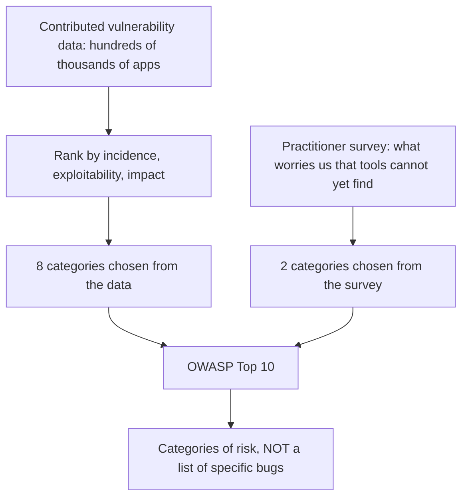
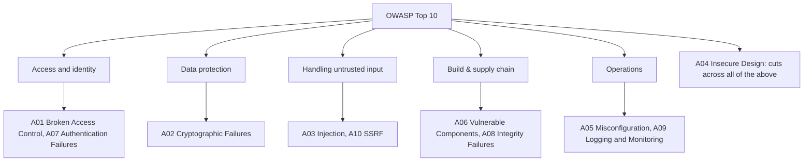
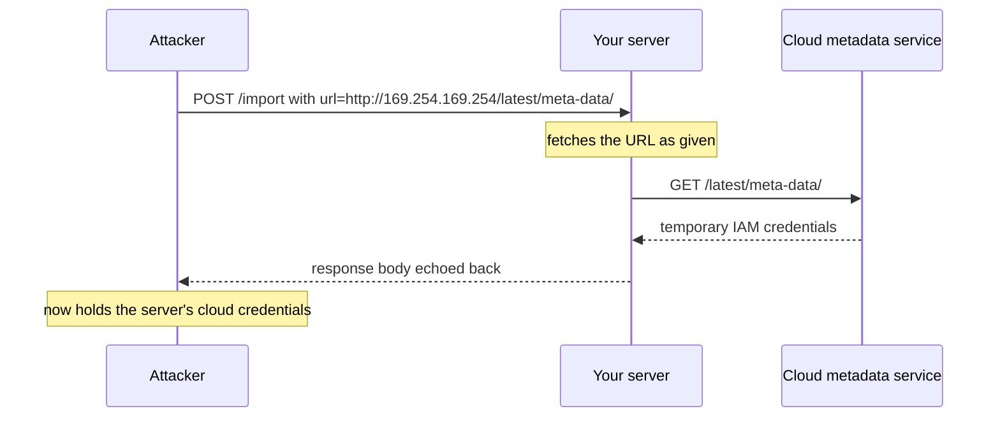

# What OWASP Is and Its Top 10 Risks

## What OWASP actually is

**OWASP** — the **Open Worldwide Application Security Project** (it was the *Open Web* Application Security Project until 2023, when the scope outgrew the web) — is a **non-profit foundation**, not a company, not a certification body and not a standards authority with legal force. Everything it produces is free, open and vendor-neutral, built by volunteer chapters and project teams.

Interviewers ask about OWASP because it is the common vocabulary of application security: when a security engineer writes "this is an A01" in a pull request, everyone knows what was meant without arguing about definitions.

The foundation ships far more than the famous list:

| Project | What it is | When you reach for it |
| --- | --- | --- |
| **Top 10** | Awareness document: the ten broadest risk categories | Onboarding, training, a shared vocabulary |
| **ASVS** (Application Security Verification Standard) | An actual requirements checklist, in three levels | When you need something to *verify* against |
| **Cheat Sheet Series** | Short, concrete "how do I do X safely" guides | While writing the code |
| **SAMM** | A maturity model for a security programme | Assessing an organisation, not an app |
| **ZAP** | An intercepting proxy / dynamic scanner | DAST in CI, manual testing |
| **Dependency-Check** | Scans dependencies for known CVEs | Supply-chain hygiene in the build |
| **Juice Shop** | A deliberately vulnerable app | Practising the attacks safely |
| **API Security Top 10**, **Top 10 for LLM Applications**, **MASVS** | Top-10-style lists for other surfaces | APIs, AI features, mobile |

The distinction worth remembering: **the Top 10 is awareness, the ASVS is verification.** Answering "we follow OWASP" usually means the Top 10; answering "we verify against ASVS Level 2" means you actually have requirements.

## How the Top 10 is built (and why that matters)

The list is not a vote on "scariest bug". It is assembled from **vulnerability data contributed by testing firms and bug-bounty programmes across hundreds of thousands of real applications**, ranked by a mix of incidence rate, exploitability and impact — and then **two of the ten slots are filled from a practitioner survey** instead of the data.

That last detail is the one candidates miss, and it explains the list's shape. Data can only report what tools and testers already know how to find; the survey slots let the list warn about categories that are real but not yet measurable at scale — which is exactly how *Insecure Design* got in.

Two consequences follow directly:

- **These are categories, not vulnerabilities.** "Broken Access Control" covers hundreds of distinct CWEs. You cannot "fix A01" the way you fix a ticket.
- **The ranking reflects what is found in the wild, not what is worst for you.** Your threat model may put something at #7 on the list at the top of your own.

## The ten categories

The 2021 edition is the one most interviewers, tools and compliance documents still quote, so it is the one to know cold.

### A01 — Broken Access Control

**Number one, and by a wide margin.** The user is correctly *authenticated* and then does something they are not *authorized* to do.

- **IDOR / broken object-level authorization:** `GET /api/orders/1042` returns the order — and so does `/api/orders/1043`, which belongs to someone else. The check asked "are you logged in?" instead of "is this row yours?".
- **Missing function-level checks:** `/admin/users` is not in the menu for normal users, and the menu is not a security control.
- **Client-trusted authorization:** a role taken from a request parameter, a hidden field, or an unverified claim in a token the client can edit.
- **Metadata problems:** a permissive CORS policy that hands responses to an attacker's origin, or force-browsing to an authenticated endpoint.

The fix is structural: **deny by default**, enforce authorization **server-side on every request**, and check the *object*, not just the route — the identifier in the URL is attacker input. See [Designing a Security Scheme for Your Endpoints](topic:endpoint-security-design), [How Authentication Works in a System](topic:authentication-flow), [JWT vs Session Token](topic:jwt-vs-session-token) and [What Is CORS](topic:cors).

### A02 — Cryptographic Failures

Formerly "Sensitive Data Exposure" — renamed because the old name described the *symptom*. The real question is: which data needs protection in transit and at rest, and is the crypto around it any good?

Typical findings: plaintext HTTP on an internal hop, obsolete TLS versions or unvalidated certificates, passwords hashed with MD5/SHA-1 or with a fast hash and no salt, hardcoded keys in the repository, AES in ECB mode, `java.util.Random` where `SecureRandom` was required, and — the cheapest fix of all — storing data you never needed to store.

Passwords get a purpose-built slow hash: **bcrypt, scrypt or Argon2**, never a general-purpose digest. Background: [HTTP vs HTTPS](topic:http-vs-https), [SSL/TLS Certificates](topic:ssl-tls-certificate), [Symmetric vs Asymmetric Encryption](topic:symmetric-vs-asymmetric-encryption).

### A03 — Injection

Untrusted data reaches an interpreter and part of it is read as **command instead of data** — SQL, NoSQL, OS commands, LDAP, XPath, template expressions. Since 2021 **XSS lives here too**, because it is the same defect with the browser as the interpreter.

The fix is never "escape the input". It is to **keep data out of the command grammar**: parameterized queries / [prepared statements](topic:prepared-statements) and ORM bindings for SQL, a real process API instead of a shell string for commands, and **context-aware output encoding** for the browser, as detailed in [Cross-Site Scripting (XSS)](topic:xss). Allowlist validation is worth having, but as defence in depth — the same string can be harmless in one sink and fatal in the next.

### A04 — Insecure Design

New in 2021, and the category that separates a memorised answer from an understood one. **This is the class of flaw that no amount of careful coding removes, because the flaw is in what was designed, not in how it was written.** A perfectly implemented feature can be the vulnerability.

Examples: a password-reset flow with no rate limit; a checkout that accepts a negative quantity and issues a refund; a "security question" whose answer is on the user's public profile; a payment endpoint with no idempotency, so a retry charges twice; a cinema booking system that lets one account reserve every seat.

The countermeasures are design-time, not code-time: **threat modelling**, abuse cases written next to the user stories, secure design patterns, and limits designed into the business flow. In this app, [Avoiding Duplicate Sales on Registration](topic:duplicate-sale-prevention), [Idempotency and Idempotent HTTP Methods](topic:http-idempotency) and [Mutable Balance vs Append-Only Ledger](topic:balance-in-place-vs-ledger) are all A04 conversations wearing engineering clothes.

### A05 — Security Misconfiguration

The system is capable of being secure and simply is not configured that way: default or unchanged credentials, stack traces and framework versions returned to clients, an admin console or a Spring Boot Actuator endpoint exposed to the internet, directory listing on, `Access-Control-Allow-Origin: *` next to credentials, unnecessary features and sample apps installed, missing security headers, permissive cloud storage. **XXE** was folded into this category in 2021 — an XML parser left with external entities enabled is a misconfigured parser.

The fix is a **hardened, repeatable baseline**: the same automated configuration in every environment, a minimal install, and a check that verifies the settings rather than a wiki page that describes them. Related: [Managing Errors and Error Codes](topic:api-error-handling) — an error contract that leaks internals is a misconfiguration you shipped on purpose.

### A06 — Vulnerable and Outdated Components

You inherit the vulnerabilities of every direct **and transitive** dependency, plus the runtime, the container base image and the OS. Log4Shell is the canonical demonstration: one logging library, one line of format string, remote code execution across a large share of the Java world.

What it takes to hold this line: an inventory (**SBOM**) of what you actually ship, continuous scanning against CVE feeds (OWASP **Dependency-Check**, and the equivalents in your build), a patching cadence that does not depend on an incident, removal of unused dependencies, and a preference for libraries that are still maintained. "We're on the latest version" is a statement with a shelf life of days.

### A07 — Identification and Authentication Failures

Proving *who* the caller is, done wrong: credential stuffing permitted because there is no rate limiting or lockout, no multi-factor option for sensitive accounts, weak or default passwords accepted, session identifiers exposed in URLs, sessions not invalidated on logout or on password change, a password-reset flow with a guessable or long-lived token, or JWT validation that accepts `alg: none` or skips signature verification altogether.

See [How Authentication Works in a System](topic:authentication-flow), [JWT vs Session Token](topic:jwt-vs-session-token) and [How OAuth 2.0 and OpenID Connect Work](topic:oauth-openid-connect). The practical rule: **use the framework's authentication, do not write your own** — this is the area where hand-rolled code fails most reliably.

### A08 — Software and Data Integrity Failures

Code or data is trusted **without verifying where it came from**. The famous member is **insecure deserialization**: handing untrusted bytes to Java's native `ObjectInputStream` is remote code execution, because deserialization runs code from the payload's gadget chain before you ever see an object. It also covers auto-update mechanisms with unsigned artefacts, a CI/CD pipeline that pulls a build plugin from an unverified source, and dependency-confusion attacks where a public package shadows your internal one.

The fix is provenance: **signatures and checksum verification**, trusted repositories, a reviewed and access-controlled pipeline, and — for the deserialization half — never deserializing untrusted input with a format that can instantiate arbitrary types. Use JSON with an explicit target type instead.

### A09 — Security Logging and Monitoring Failures

Not an exploit; a **detection** failure. The breach happens and nobody notices — industry dwell times are measured in weeks or months, and the usual notification comes from an outside party. The findings: failed logins and access-control denials are not logged, logs stay on the machine that produced them, there are no alerts and no one owns them, log entries carry no correlation id so a request cannot be reconstructed, or the logs themselves leak passwords and tokens.

What good looks like: log authentication events, authorization failures and server-side validation failures with enough context to identify actor and action; ship them off-box to somewhere tamper-resistant; alert on patterns rather than lines; and **test the detection** — an alert nobody has ever seen fire is not a control.

### A10 — Server-Side Request Forgery (SSRF)

The application fetches a URL that the user supplied — an avatar importer, a webhook tester, a PDF renderer, a link preview — and the attacker points it inward. Your server is on the internal network, so it can reach what the attacker cannot: `http://169.254.169.254/` for cloud instance credentials, `http://localhost:8080/actuator/env`, an internal admin service with no authentication because "it isn't reachable from outside".

Defences: an **allowlist** of permitted hosts and schemes (a denylist of "internal" addresses loses to DNS rebinding, redirects and IPv6 notation), resolve the hostname and validate the resulting IP, **do not follow redirects**, never echo the raw fetched response back to the caller, and block egress to the metadata endpoint at the network level.

## The list is not frozen

The Top 10 is revised roughly every three to four years — 2013, 2017, 2021, and a 2025 edition. The categories move, merge and get renamed: CSRF was a Top 10 entry until 2017 and dropped out once frameworks and `SameSite` cookies made it uncommon; XSS was its own entry until 2021 and is now part of Injection; XXE became part of Misconfiguration.

The 2025 refresh keeps **Broken Access Control at number one**, promotes **Security Misconfiguration** up the list, broadens "Vulnerable and Outdated Components" into a wider **software supply chain** category, and adds a category for **mishandled exceptional conditions**. Confirm the exact ordering and wording on `owasp.org` before quoting position numbers in an audit — and in an interview, talk about the categories and their defences rather than reciting `A0n:2021`, because the numbers are the part that goes stale. Dropping out of the list does not mean the risk is gone: [Cross-Site Request Forgery (CSRF)](topic:csrf) is still a real bug in an app that turns cookie-based session handling on and CSRF protection off.

## 60-second interview answer

> OWASP is the Open Worldwide Application Security Project — a non-profit that publishes free, vendor-neutral application-security material. People usually mean the **Top 10**, an *awareness* document listing the ten broadest categories of web-application risk, built mostly from measured vulnerability data across hundreds of thousands of applications, with two slots from a practitioner survey so it can flag risks tools cannot yet detect. In the 2021 edition: **A01 Broken Access Control** — number one, and it is authorization enforced per-object and server-side, not IDOR by URL id; **A02 Cryptographic Failures** — TLS, key handling, and slow password hashes like bcrypt or Argon2; **A03 Injection**, which now includes XSS — fixed with parameterized queries and context-aware output encoding, not by escaping input; **A04 Insecure Design** — flaws you cannot code your way out of, such as a reset flow with no rate limit, answered with threat modelling; **A05 Security Misconfiguration** — defaults, exposed actuators, stack traces, and XXE; **A06 Vulnerable and Outdated Components** — the Log4Shell category, answered with an SBOM and dependency scanning; **A07 Identification and Authentication Failures** — credential stuffing, session handling, JWT validation; **A08 Software and Data Integrity Failures** — insecure deserialization and unverified build artefacts; **A09 Security Logging and Monitoring Failures** — the detection gap; and **A10 SSRF** — user-supplied URLs fetched by a server that sits inside the network. The important caveat is that the Top 10 is not a standard and not a checklist: it is a floor and a shared vocabulary. When I need something to actually verify against, I use the OWASP **ASVS**, and the **Cheat Sheet Series** while writing the code.

## Production relevance

**It is the lingua franca of security reviews.** Pen-test reports, vendor questionnaires, PCI-DSS and many customer security addenda are written in Top 10 terms. Being able to map a finding onto a category — and to say honestly which ones your design already handles — is a large part of what "security-aware developer" means in practice.

**Most of it is already implemented for you; the job is not to switch it off.** Spring Security gives you method-level authorization, CSRF tokens, security headers and a sane password encoder; JPA parameterizes queries; template engines escape by default. A striking share of real findings come from someone disabling one of these to make a demo work — `csrf().disable()`, `permitAll()`, a raw `EntityManager.createNativeQuery` with string concatenation, `@JsonTypeInfo` polymorphic deserialization on an untrusted payload.

**A01 and A04 are where design reviews earn their keep.** Access control cannot be bolted on: it has to be a property of how requests carry identity and how the data layer scopes queries. If every repository method takes the tenant or owner as a parameter, IDOR becomes hard to write; if authorization is a scattering of `if` statements in controllers, it becomes inevitable.

**Automate what a tool can find, and spend humans on what it cannot.** Dependency scanning (A06), secret scanning (A02), static analysis for injection (A03) and configuration checks (A05) belong in CI. Business-logic flaws (A04) and authorization gaps (A01) mostly do not show up in scanners at all — those need threat modelling and review.

**The 2021 renamings were on purpose.** "Sensitive Data Exposure" → "Cryptographic Failures" and the arrival of "Insecure Design" both push the same message: name the *cause*, not the headline. It is worth mirroring that when you write your own findings.

## Common misconceptions

- **"We fixed the OWASP Top 10, so we're secure."** The Top 10 is an awareness document covering ten *categories*; it was never meant to be exhaustive or to be a pass/fail bar. It is a floor. The document says so itself and points you at the **ASVS** when you need real, verifiable requirements.
- **"OWASP is a standard / a certification."** It is a non-profit foundation publishing free material. Nothing it produces is legally binding. Some regulations *reference* it (PCI-DSS historically did), which is not the same thing.
- **"The Top 10 is a list of vulnerabilities."** It is a list of risk categories, each spanning many CWEs. "Broken Access Control" is not a bug you can close; it is a heading under which hundreds of different bugs live.
- **"Injection means SQL injection."** SQL is the famous example. The category is any interpreter — OS commands, LDAP, XPath, NoSQL query documents, expression languages — and since 2021 it includes **XSS**, where the interpreter is the browser.
- **"XSS and CSRF dropped off the list, so they're solved."** XSS was merged into Injection and CSRF fell out because framework defaults made it rarer — both are still exploitable the moment you turn those defaults off. Position on the list tracks prevalence, not danger.
- **"Escaping or validating input fixes injection."** Validation is defence in depth. The fix is separating data from code at the point of use: bound parameters for SQL, and encoding chosen by the output context for HTML. A string that is safe in one sink is dangerous in the next.
- **"Authentication is the hard part."** Authentication is largely solved by libraries and identity providers. **Authorization** is the one at number one, because it is per-object, per-request application logic that no framework can decide for you.
- **"HTTPS covers A02."** TLS protects data in transit on that hop. Cryptographic Failures also covers data at rest, key management, password hashing, randomness and the data you should not have collected in the first place.
- **"Insecure Design is just a fancy name for bugs."** It is specifically the flaws that survive a correct implementation — a missing rate limit, a business rule that permits abuse, a flow with no idempotency. The remedy is threat modelling and abuse cases, not more careful coding.
- **"Our dependencies are fine, we only use popular libraries."** Popularity is why Log4Shell mattered. What matters is a current inventory of direct *and transitive* dependencies plus a patch cadence — the risk arrives on the CVE feed's schedule, not yours.
- **"Deserialization is safe if I trust the source."** With Java native serialization the payload can drive a gadget chain through classes already on your classpath, before your code sees an object. Do not deserialize untrusted bytes with a format that instantiates arbitrary types.
- **"Logging is not a security control."** A09 exists precisely because missed detection turns a contained incident into a breach. Logs that are not shipped, not alerted on, or full of secrets are as good as absent — and the alert has to be tested.
- **"SSRF only matters in the cloud."** Cloud metadata endpoints make it spectacular, but any server that fetches a user-supplied URL is a proxy into your internal network — and an internal service with no authentication is the normal case, not the exception.
