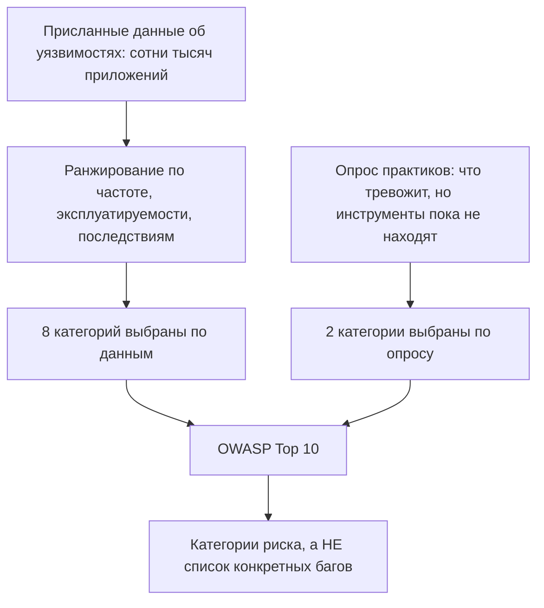
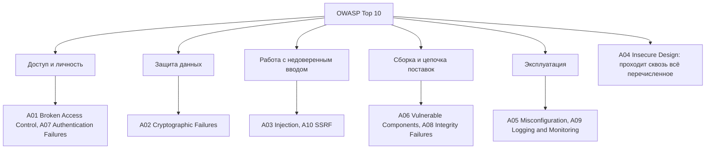
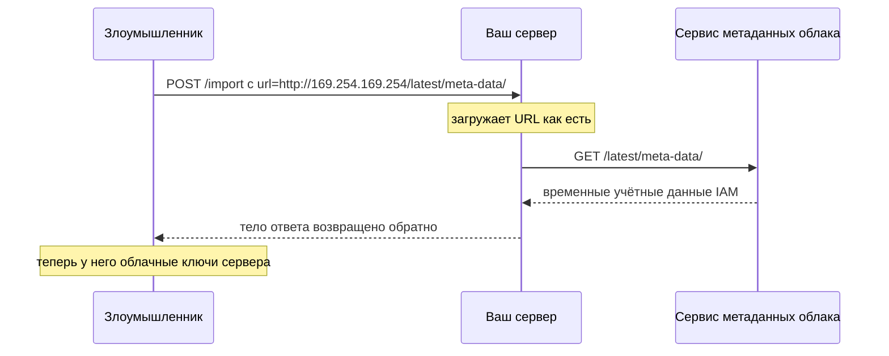

# Что такое OWASP и какие риски он выделяет

## Что такое OWASP на самом деле

**OWASP** — **Open Worldwide Application Security Project** (до 2023 года — *Open Web* Application Security Project, название сменили, когда охват перерос веб) — это **некоммерческий фонд**, а не компания, не орган сертификации и не регулятор со стандартами, имеющими юридическую силу. Всё, что он выпускает, бесплатно, открыто и независимо от вендоров; делают это добровольческие отделения и проектные команды.

На собеседованиях про OWASP спрашивают потому, что это общий словарь безопасности приложений: когда инженер по безопасности пишет в пул-реквесте «это A01», всем понятно, о чём речь, без спора об определениях.

Фонд выпускает гораздо больше, чем знаменитый список:

| Проект | Что это | Когда берут |
| --- | --- | --- |
| **Top 10** | Документ для осведомлённости: десять самых широких категорий риска | Онбординг, обучение, общий словарь |
| **ASVS** (Application Security Verification Standard) | Настоящий чек-лист требований, в трёх уровнях | Когда нужно, по чему *проверять* |
| **Cheat Sheet Series** | Короткие конкретные руководства «как безопасно сделать X» | Пока пишете код |
| **SAMM** | Модель зрелости программы безопасности | Оценка организации, а не приложения |
| **ZAP** | Перехватывающий прокси / динамический сканер | DAST в CI, ручное тестирование |
| **Dependency-Check** | Сканирует зависимости на известные CVE | Гигиена цепочки поставок в сборке |
| **Juice Shop** | Намеренно уязвимое приложение | Безопасно попрактиковаться в атаках |
| **API Security Top 10**, **Top 10 for LLM Applications**, **MASVS** | Списки в формате Top 10 для других поверхностей | API, AI-функции, мобильные приложения |

Различие, которое стоит запомнить: **Top 10 — про осведомлённость, ASVS — про проверку.** Ответ «мы следуем OWASP» обычно означает Top 10; ответ «мы проверяемся по ASVS Level 2» означает, что у вас действительно есть требования.

## Как собирают Top 10 (и почему это важно)

Список — не голосование за «самый страшный баг». Он собирается из **данных об уязвимостях, которые предоставляют тестирующие компании и программы bug bounty по сотням тысяч реальных приложений**, ранжируется по сочетанию частоты встречаемости, эксплуатируемости и последствий — а затем **две позиции из десяти заполняются по опросу практиков**, а не по данным.

Именно эту деталь кандидаты упускают, а она объясняет форму списка. Данные могут сообщить лишь о том, что инструменты и тестировщики уже умеют находить; позиции «из опроса» позволяют предупредить о категориях, которые реальны, но пока не измеримы в масштабе, — ровно так в список попал *Insecure Design*.

Отсюда прямо следуют два вывода:

- **Это категории, а не уязвимости.** «Broken Access Control» покрывает сотни различных CWE. «Починить A01» так, как чинят тикет, нельзя.
- **Порядок отражает то, что находят в дикой природе, а не то, что хуже всего именно для вас.** Ваша модель угроз может поставить пункт №7 из списка на первое место у себя.

## Десять категорий

Редакцию 2021 года до сих пор цитируют большинство интервьюеров, инструментов и комплаенс-документов, поэтому её и надо знать назубок.

### A01 — Broken Access Control (нарушенный контроль доступа)

**Первое место, причём с большим отрывом.** Пользователь корректно *аутентифицирован*, а затем делает то, на что не *авторизован*.

- **IDOR / нарушенная авторизация на уровне объекта:** `GET /api/orders/1042` возвращает заказ — и `/api/orders/1043` тоже, хотя он принадлежит другому. Проверка спрашивала «вы вошли?» вместо «эта строка ваша?».
- **Отсутствие проверок на уровне функций:** `/admin/users` не показан в меню обычным пользователям, а меню — не средство защиты.
- **Авторизация с доверием к клиенту:** роль берётся из параметра запроса, скрытого поля или непроверенного claim в токене, который клиент может изменить.
- **Проблемы с метаданными:** разрешающая политика CORS, отдающая ответы на origin злоумышленника, или переход по адресу аутентифицированного эндпоинта вручную.

Починка структурная: **запрещать по умолчанию**, применять авторизацию **на сервере при каждом запросе** и проверять *объект*, а не только маршрут — идентификатор в URL это ввод злоумышленника. См. [Проектирование схемы безопасности эндпоинтов](topic:endpoint-security-design), [Как работает аутентификация в системе](topic:authentication-flow), [JWT vs Session Token](topic:jwt-vs-session-token) и [Что такое CORS](topic:cors).

### A02 — Cryptographic Failures (криптографические сбои)

Раньше называлось «Sensitive Data Exposure» — переименовали, потому что старое название описывало *симптом*. Настоящий вопрос: какие данные нужно защищать при передаче и при хранении и годится ли криптография вокруг них.

Типичные находки: открытый HTTP на внутреннем участке, устаревшие версии TLS или непроверяемые сертификаты, пароли, хешированные MD5/SHA-1 либо быстрым хешем и без соли, зашитые в репозиторий ключи, AES в режиме ECB, `java.util.Random` там, где требовался `SecureRandom`, и — самое дешёвое исправление — хранение данных, которые вообще не надо было хранить.

Для паролей берут специально медленный хеш: **bcrypt, scrypt или Argon2**, но не дайджест общего назначения. Фон: [HTTP vs HTTPS](topic:http-vs-https), [Сертификаты SSL/TLS](topic:ssl-tls-certificate), [Симметричное и асимметричное шифрование](topic:symmetric-vs-asymmetric-encryption).

### A03 — Injection (инъекции)

Недоверенные данные доходят до интерпретатора, и часть из них читается как **команда, а не как данные** — SQL, NoSQL, команды ОС, LDAP, XPath, выражения шаблонизаторов. С 2021 года **XSS живёт здесь же**, потому что это тот же дефект, только интерпретатор — браузер.

Починка — никогда не «экранировать ввод». Нужно **не пускать данные в грамматику команды**: параметризованные запросы / [prepared statements](topic:prepared-statements) и привязки ORM для SQL, нормальный process API вместо строки для шелла в случае команд и **экранирование вывода по контексту** для браузера, как подробно разобрано в [Межсайтовый скриптинг (XSS)](topic:xss). Валидация по белому списку полезна, но как эшелонированная оборона — одна и та же строка бывает безобидна в одном месте вывода и смертельна в соседнем.

### A04 — Insecure Design (небезопасное проектирование)

Новинка 2021 года и та категория, которая отделяет заученный ответ от понятого. **Это класс дефектов, который не устраняется никакой аккуратностью в коде, потому что дефект в том, что спроектировали, а не в том, как написали.** Идеально реализованная функция сама может быть уязвимостью.

Примеры: процесс сброса пароля без ограничения частоты; оформление заказа, принимающее отрицательное количество и выдающее возврат средств; «секретный вопрос», ответ на который есть в публичном профиле; платёжный эндпоинт без идемпотентности, из-за чего повтор списывает дважды; система бронирования кинозала, позволяющая одному аккаунту занять все места.

Контрмеры относятся к этапу проектирования, а не написания кода: **моделирование угроз**, сценарии злоупотребления рядом с пользовательскими историями, безопасные паттерны проектирования и ограничения, заложенные в бизнес-процесс. В этом приложении темы [Как избежать дублирующих продаж при регистрации](topic:duplicate-sale-prevention), [Идемпотентность и идемпотентные HTTP-методы](topic:http-idempotency) и [Изменяемый баланс vs журнал только на добавление](topic:balance-in-place-vs-ledger) — это всё разговоры про A04 в инженерной одежде.

### A05 — Security Misconfiguration (ошибки конфигурации)

Система способна быть безопасной и просто так не настроена: учётные данные по умолчанию или неизменённые, стектрейсы и версии фреймворков, возвращаемые клиентам, админ-консоль или эндпоинт Spring Boot Actuator, открытый в интернет, включённый листинг каталогов, `Access-Control-Allow-Origin: *` рядом с учётными данными, установленные ненужные функции и примеры приложений, отсутствующие заголовки безопасности, слишком разрешающее облачное хранилище. **XXE** в 2021 году свернули в эту категорию — XML-парсер с включёнными внешними сущностями это неправильно настроенный парсер.

Починка — **укреплённый воспроизводимый базовый образ конфигурации**: одинаковая автоматическая настройка во всех окружениях, минимальная установка и проверка, которая верифицирует настройки, а не страница в вики, которая их описывает. Смежное: [Управление ошибками и кодами ошибок](topic:api-error-handling) — контракт ошибок, протекающий внутренностями, это ошибка конфигурации, которую вы выпустили намеренно.

### A06 — Vulnerable and Outdated Components (уязвимые и устаревшие компоненты)

Вы наследуете уязвимости каждой прямой **и транзитивной** зависимости, плюс среды выполнения, базового образа контейнера и ОС. Log4Shell — каноничная демонстрация: одна библиотека логирования, одна строка формата, удалённое выполнение кода в значительной части мира Java.

Что нужно, чтобы держать эту линию: инвентаризация (**SBOM**) того, что вы реально поставляете, непрерывное сканирование по фидам CVE (OWASP **Dependency-Check** и аналоги в вашей сборке), ритм обновлений, не зависящий от инцидента, удаление неиспользуемых зависимостей и предпочтение библиотек, которые всё ещё сопровождаются. «У нас последняя версия» — утверждение со сроком годности в несколько дней.

### A07 — Identification and Authentication Failures (сбои идентификации и аутентификации)

Доказательство того, *кто* вызывающий, сделанное неправильно: разрешённый credential stuffing, потому что нет ограничения частоты и блокировки; отсутствие второго фактора для чувствительных аккаунтов; принимаемые слабые пароли или пароли по умолчанию; идентификаторы сессии в URL; сессии, не аннулируемые при выходе или смене пароля; сброс пароля с угадываемым или долгоживущим токеном; проверка JWT, принимающая `alg: none` или вовсе пропускающая проверку подписи.

См. [Как работает аутентификация в системе](topic:authentication-flow), [JWT vs Session Token](topic:jwt-vs-session-token) и [Как работают OAuth 2.0 и OpenID Connect](topic:oauth-openid-connect). Практическое правило: **используйте аутентификацию фреймворка, не пишите свою** — именно здесь самодельный код проваливается надёжнее всего.

### A08 — Software and Data Integrity Failures (нарушения целостности кода и данных)

Коду или данным доверяют **без проверки их происхождения**. Знаменитый представитель — **небезопасная десериализация**: передать недоверенные байты в родной `ObjectInputStream` Java значит получить удалённое выполнение кода, потому что десериализация запускает код по цепочке гаджетов из нагрузки ещё до того, как вы увидите объект. Сюда же входят механизмы автообновления с неподписанными артефактами, пайплайн CI/CD, тянущий плагин сборки из непроверенного источника, и атаки dependency confusion, где публичный пакет затеняет ваш внутренний.

Починка — происхождение: **подписи и проверка контрольных сумм**, доверенные репозитории, проверяемый пайплайн с контролем доступа и — для десериализационной половины — никогда не десериализовать недоверенный ввод форматом, способным создавать произвольные типы. Берите JSON с явным целевым типом.

### A09 — Security Logging and Monitoring Failures (недостатки логирования и мониторинга)

Это не эксплуатация, а провал **обнаружения**. Взлом произошёл, и никто не заметил — время незамеченного присутствия в отрасли измеряется неделями и месяцами, а уведомление обычно приходит от внешней стороны. Типичные находки: неудачные входы и отказы контроля доступа не логируются; логи остаются на той машине, где возникли; нет оповещений и никто за них не отвечает; в записях нет correlation id, поэтому запрос невозможно восстановить; либо сами логи протекают паролями и токенами.

Как выглядит хорошо: логировать события аутентификации, отказы авторизации и провалы серверной валидации с достаточным контекстом, чтобы понять субъект и действие; отправлять их за пределы машины туда, где их нельзя подделать; оповещать по паттернам, а не по строкам; и **тестировать обнаружение** — оповещение, срабатывания которого никто никогда не видел, не является средством защиты.

### A10 — Server-Side Request Forgery (SSRF, подделка запросов на стороне сервера)

Приложение загружает URL, который передал пользователь — импорт аватара, проверка вебхука, рендер PDF, предпросмотр ссылки, — а злоумышленник направляет его внутрь. Ваш сервер находится во внутренней сети, поэтому дотягивается туда, куда злоумышленник не может: `http://169.254.169.254/` за учётными данными облачного экземпляра, `http://localhost:8080/actuator/env`, внутренний админ-сервис без аутентификации, потому что «снаружи он недоступен».

Защита: **белый список** разрешённых хостов и схем (чёрный список «внутренних» адресов проигрывает DNS rebinding, редиректам и записи IPv6), разрешать имя хоста и проверять полученный IP, **не следовать редиректам**, никогда не возвращать вызывающему сырой загруженный ответ и закрыть исходящий доступ к эндпоинту метаданных на уровне сети.

## Список не заморожен

Top 10 пересматривают примерно раз в три-четыре года — 2013, 2017, 2021 и редакция 2025. Категории перемещаются, сливаются и переименовываются: CSRF был пунктом Top 10 до 2017 года и выпал, когда фреймворки и куки `SameSite` сделали его редким; XSS был отдельным пунктом до 2021 года и теперь входит в Injection; XXE стал частью Misconfiguration.

Обновление 2025 года оставляет **Broken Access Control на первом месте**, поднимает **Security Misconfiguration** выше по списку, расширяет «Vulnerable and Outdated Components» до более широкой категории про **цепочку поставок ПО** и добавляет категорию про **неправильную обработку исключительных ситуаций**. Точный порядок и формулировки перед цитированием номеров в аудите сверяйте на `owasp.org` — а на собеседовании говорите о категориях и защитах, а не декламируйте `A0n:2021`, потому что устаревают именно номера. Выпадение из списка не значит, что риск исчез: [Межсайтовая подделка запроса (CSRF)](topic:csrf) остаётся настоящим багом в приложении, где включена сессия на куках и выключена защита от CSRF.

## Ответ за 60 секунд

> OWASP — это Open Worldwide Application Security Project, некоммерческий фонд, публикующий бесплатные и независимые от вендоров материалы по безопасности приложений. Обычно имеют в виду **Top 10** — документ *для осведомлённости*, перечисляющий десять самых широких категорий риска веб-приложений; он строится в основном по измеренным данным об уязвимостях в сотнях тысяч приложений, плюс две позиции из опроса практиков, чтобы отмечать риски, которые инструменты пока не находят. В редакции 2021 года: **A01 Broken Access Control** — первое место, речь про авторизацию на сервере и на уровне объекта, а не про IDOR по идентификатору в URL; **A02 Cryptographic Failures** — TLS, обращение с ключами и медленные хеши паролей вроде bcrypt или Argon2; **A03 Injection**, куда теперь входит XSS, — чинится параметризованными запросами и экранированием вывода по контексту, а не экранированием ввода; **A04 Insecure Design** — дефекты, из которых не выйти кодом, например сброс пароля без ограничения частоты, а ответ на них — моделирование угроз; **A05 Security Misconfiguration** — значения по умолчанию, открытые actuator, стектрейсы и XXE; **A06 Vulnerable and Outdated Components** — категория Log4Shell, ответ на неё SBOM и сканирование зависимостей; **A07 Identification and Authentication Failures** — credential stuffing, работа с сессиями, проверка JWT; **A08 Software and Data Integrity Failures** — небезопасная десериализация и непроверенные артефакты сборки; **A09 Security Logging and Monitoring Failures** — провал обнаружения; и **A10 SSRF** — переданные пользователем URL, которые загружает сервер, стоящий внутри сети. Важная оговорка: Top 10 это не стандарт и не чек-лист, это пол и общий словарь. Когда нужно, по чему реально проверять, я беру OWASP **ASVS**, а во время написания кода — **Cheat Sheet Series**.

## Практическая значимость

**Это общий язык проверок безопасности.** Отчёты пентестов, опросники вендоров, PCI-DSS и многие приложения к клиентским договорам написаны в терминах Top 10. Умение положить находку на категорию — и честно сказать, какие из них ваш дизайн уже закрывает, — во многом и есть то, что на практике называют «разработчик, понимающий безопасность».

**Бо́льшая часть уже реализована за вас; задача — это не выключить.** Spring Security даёт авторизацию на уровне методов, CSRF-токены, заголовки безопасности и вменяемый кодировщик паролей; JPA параметризует запросы; шаблонизаторы экранируют по умолчанию. Заметная доля реальных находок появляется оттого, что кто-то отключил одно из этого, чтобы заработала демонстрация: `csrf().disable()`, `permitAll()`, голый `EntityManager.createNativeQuery` со склейкой строк, полиморфная десериализация `@JsonTypeInfo` на недоверенной нагрузке.

**A01 и A04 — это то, ради чего окупаются ревью дизайна.** Контроль доступа нельзя прикрутить сбоку: он должен быть свойством того, как запросы несут личность и как слой данных ограничивает выборки. Если каждый метод репозитория принимает арендатора или владельца параметром, IDOR трудно написать; если авторизация — это россыпь `if` в контроллерах, IDOR неизбежен.

**Автоматизируйте то, что находит инструмент, а людей тратьте на то, что не находит.** Сканирование зависимостей (A06), поиск секретов (A02), статический анализ на инъекции (A03) и проверки конфигурации (A05) должны быть в CI. Дефекты бизнес-логики (A04) и пробелы авторизации (A01) в сканерах в основном не всплывают вовсе — им нужны моделирование угроз и ревью.

**Переименования 2021 года сделаны намеренно.** «Sensitive Data Exposure» → «Cryptographic Failures» и появление «Insecure Design» продвигают одну и ту же мысль: называть *причину*, а не заголовок. Это стоит повторять и когда вы пишете собственные находки.

## Частые заблуждения

- **«Мы закрыли OWASP Top 10, значит мы защищены».** Top 10 — документ для осведомлённости, покрывающий десять *категорий*; он никогда не задумывался как исчерпывающий или как планка «прошёл/не прошёл». Это пол. Сам документ так и говорит и направляет к **ASVS**, когда нужны настоящие проверяемые требования.
- **«OWASP — это стандарт / сертификация».** Это некоммерческий фонд, публикующий бесплатные материалы. Ничто из выпущенного им не имеет юридической силы. Некоторые нормативы *ссылаются* на него (исторически так делал PCI-DSS), а это не то же самое.
- **«Top 10 — это список уязвимостей».** Это список категорий риска, каждая из которых охватывает множество CWE. «Broken Access Control» — не баг, который можно закрыть; это заголовок, под которым живут сотни разных багов.
- **«Инъекция — это про SQL-инъекцию».** SQL — знаменитый пример. Категория про любой интерпретатор: команды ОС, LDAP, XPath, документы запросов NoSQL, языки выражений — а с 2021 года сюда входит **XSS**, где интерпретатор это браузер.
- **«XSS и CSRF выпали из списка, значит они решены».** XSS слили в Injection, а CSRF выпал, потому что настройки фреймворков по умолчанию сделали его реже, — оба эксплуатируются в ту же секунду, когда эти настройки выключают. Позиция в списке отражает распространённость, а не опасность.
- **«Экранирование или валидация ввода чинит инъекции».** Валидация — эшелонированная оборона. Чинит разделение данных и кода в точке использования: связанные параметры для SQL и экранирование, выбранное по контексту вывода, для HTML. Строка, безопасная в одном месте вывода, опасна в соседнем.
- **«Аутентификация — вот что сложно».** Аутентификация в основном решена библиотеками и провайдерами идентичности. На первом месте стоит **авторизация**, потому что это логика приложения на каждый объект и каждый запрос, и решить её за вас не может ни один фреймворк.
- **«HTTPS закрывает A02».** TLS защищает данные при передаче на этом участке. Cryptographic Failures — ещё и про данные при хранении, управление ключами, хеширование паролей, случайность и про данные, которые вообще не стоило собирать.
- **«Insecure Design — просто красивое название для багов».** Это именно те дефекты, которые переживают корректную реализацию: отсутствующее ограничение частоты, бизнес-правило, допускающее злоупотребление, процесс без идемпотентности. Лекарство — моделирование угроз и сценарии злоупотребления, а не ещё более аккуратный код.
- **«С зависимостями всё в порядке, мы берём только популярные библиотеки».** Именно из-за популярности Log4Shell и оказался значимым. Важна актуальная инвентаризация прямых *и транзитивных* зависимостей плюс ритм обновлений — риск приходит по расписанию фида CVE, а не по вашему.
- **«Десериализация безопасна, если источнику я доверяю».** С родной сериализацией Java нагрузка способна провести цепочку гаджетов через классы, уже лежащие в classpath, до того, как ваш код увидит объект. Не десериализуйте недоверенные байты форматом, который создаёт произвольные типы.
- **«Логирование — не средство защиты».** A09 существует ровно потому, что пропущенное обнаружение превращает локализованный инцидент во взлом. Логи, которые не отгружены, по которым не оповещают или которые полны секретов, равносильны их отсутствию — и оповещение необходимо тестировать.
- **«SSRF важен только в облаке».** Эндпоинты метаданных облака делают его эффектным, но любой сервер, загружающий переданный пользователем URL, — это прокси в вашу внутреннюю сеть, а внутренний сервис без аутентификации это норма, а не исключение.
