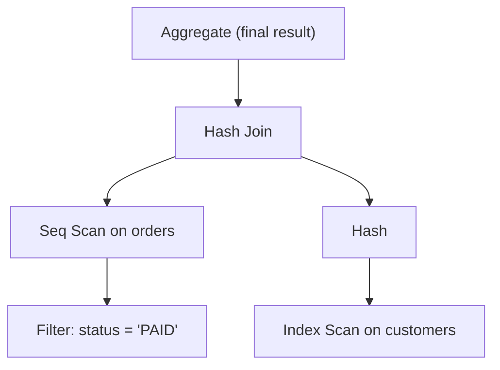
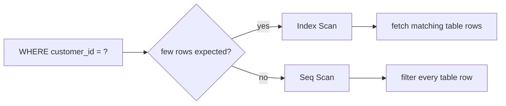

# Reading PostgreSQL EXPLAIN Plans

## Intuition

`EXPLAIN` is PostgreSQL showing the work order it plans to follow for a SQL
statement. A broader [query plan](topic:query-plan) says "how the database will
answer the question"; this topic is about reading the printed PostgreSQL plan
without getting fooled by the names. Think of a kitchen ticket: the customer
ordered dinner, but the kitchen breaks it into prep stations, cooking stations
and plating.

PostgreSQL prints the plan as a tree. Child nodes feed rows into parent nodes,
so you usually read the most indented lines first and move upward. It is like a
post office sorting parcels: small sorting desks produce trays, then the main
desk combines those trays into the final delivery bag.

Use plain `EXPLAIN` when you only want the estimate. Use `EXPLAIN ANALYZE` when
you need reality: it executes the query and adds actual row counts and timings.
For production investigation, `EXPLAIN (ANALYZE, BUFFERS)` is often the most
useful view because it also shows page reads. The analogy is a route plan versus
a delivery driver report: the plan says what should happen, the report says
where the van actually waited.

## First Pass: Read the Tree

Start with the leaves: scans read tables or indexes. Then move to joins,
filters, sorts, aggregates and limits. The parent node cannot finish until its
children produce enough rows. In a kitchen, the plating station cannot plate a
meal until the grill and salad station hand over their parts.

Pay attention to `loops` in `EXPLAIN ANALYZE`. PostgreSQL reports actual time per
loop, so a node that looks cheap can dominate if it is executed thousands of
times. This is like a post office clerk spending only five seconds per parcel,
but doing it for every parcel in the city.

The root node is the final operation, not necessarily the first operation. A
plan that starts visually with `Aggregate` may spend most of its time in a child
`Seq Scan` or `Hash Join`. It is like seeing "serve meal" at the top of a recipe:
the expensive work happened earlier at the prep stations.

## Seq Scan vs Index Scan

`Seq Scan` means PostgreSQL reads the table pages sequentially and tests the
filter against rows. It is not automatically bad. It can be the cheapest choice
for small tables, for filters that return a large fraction of the table, or when
no useful [database index](topic:database-indexes) matches the predicate. Like
checking every mailbox on a short street, walking the whole street can be faster
than opening a street directory first.

`Index Scan` means PostgreSQL walks an index to find candidate row locations and
then fetches table rows. It is best when the predicate is selective and the index
matches the access pattern. Like a post office shelf sorted by address, it lets
the clerk jump to the right tray instead of opening every envelope.

`Index Only Scan` can avoid fetching table rows when the index contains all
needed columns and PostgreSQL can prove the rows are visible. Because PostgreSQL
uses [MVCC](topic:mvcc), that proof depends on the visibility map. The household
analogy: if the address card already has every detail and has a trusted "checked"
stamp, the clerk does not need to open the package.

`Bitmap Index Scan` plus `Bitmap Heap Scan` is a middle ground: PostgreSQL gathers
many matching row locations from one or more indexes, then visits table pages in
a more efficient order. It is like marking all relevant apartments on a building
map before walking the floors.

A `Seq Scan` becomes suspicious when the table is large, the filter should be
selective, and `Rows Removed by Filter` is huge. That usually means the query
needs a better index, a more index-friendly predicate, or fresher statistics.
Like searching a warehouse for one invoice by opening every box, the scan itself
is the clue that the filing system is not helping.

## Cost, Rows and Width

A typical node line contains fields such as `cost=0.43..42.10 rows=15 width=64`.
The first cost is startup cost: work before the first row can be returned. The
second is total cost: estimated work to return all rows from that node. These are
planner cost units, not milliseconds. Treat them like price tags in one store:
useful for comparing options in the same plan, not a universal stopwatch.

`rows` is PostgreSQL's estimated row count for that node, and `width` is the
estimated average row size in bytes. Bad row estimates often explain bad plans.
If the planner expects 10 rows but `EXPLAIN ANALYZE` shows 500,000 actual rows,
it may choose a nested loop or index path that collapses at real size. Like a
caterer planning for 10 guests and 500,000 people arriving, the whole kitchen
schedule becomes wrong.

Costs are built from statistics: row counts, distinct values, histograms and
configuration constants. For how the planner chooses among alternatives, see
[how a query plan is determined](topic:query-execution-plan). If statistics are
stale or the predicate hides the indexed column behind a function or cast, the
planner can misjudge selectivity. Like a traffic app using last month's road
closures, the route can be technically legal and still terrible.

## Join Nodes

`Nested Loop` takes rows from the outer side and runs the inner side for each
one. It is excellent when the outer side is tiny and the inner side has a useful
index. It becomes dangerous when the outer side is large and the inner side is
scanned repeatedly, because the work can approach [O(n²)](topic:quadratic-complexity).
Imagine checking every arriving guest against every name on a paper list again
and again.

`Hash Join` builds a hash table from one input, usually the smaller one, and
probes it with the other input. It is strong for large equality joins when enough
memory is available. The kitchen analogy is sorting all order tickets into
numbered bins once, then finding matches quickly.

`Merge Join` reads two sorted inputs side by side. It is good when both inputs
are already sorted by indexes or when sorting is cheaper than hashing. It is
like two post office lines sorted by ZIP code walking forward together and
matching parcels as they go.

Watch the children of a join node. A good join type can still be slow if its
child scan returns far more rows than estimated, if a sort spills to disk, or if
the join condition is applied late as a filter. The dinner may be planned well,
but if one prep station sends ten times more plates than expected, the pass still
gets blocked.

## Red Flags

The biggest warning sign is a large difference between estimated and actual rows.
That points to stale statistics, skewed data, correlated columns, poor selectivity
estimates or predicates the planner cannot reason about. It is the restaurant
reservation list saying 20 guests while buses keep arriving outside.

Other common red flags:

- `Seq Scan` on a large table with a selective predicate and many rows removed by
  the filter.
- `Nested Loop` with high `loops`, especially when the inner node scans many rows
  repeatedly.
- `Sort` or `Hash` nodes that spill to disk or show heavy temporary I/O.
- `Rows Removed by Filter` or `Rows Removed by Join Filter` much larger than the
  rows returned.
- An index exists but is not used because the predicate is not index-friendly,
  for example a function around the column, an implicit cast, a leading wildcard
  `LIKE`, or a low-selectivity condition.
- High buffer reads in `EXPLAIN (ANALYZE, BUFFERS)`, showing the query is touching
  many pages.

When you find the hot node, choose the fix from evidence. Add or adjust an index
when the access pattern is selective and stable; see [which indexes to add for
query optimization](topic:indexes-for-query-optimization). Refresh statistics
with `ANALYZE` when estimates are far from reality. Rewrite SQL when the planner
cannot use an index or when joins and filters happen too late. This is like
repairing the exact station that delays the kitchen instead of buying random new
appliances.

## 60-second Interview Answer

> I read a PostgreSQL EXPLAIN plan as a tree: the most indented child nodes
> produce rows first, and parent nodes consume them. `Seq Scan` means scanning
> the table pages and filtering rows; it is fine for small tables or broad
> filters, but suspicious on a large table with a selective predicate. `Index
> Scan` uses an index to find candidate rows, but it is not always cheaper,
> especially if many rows must be fetched from the table. `cost=a..b` is startup
> and total estimated planner cost, not milliseconds; `rows` is the estimated
> cardinality. With `EXPLAIN ANALYZE`, I compare estimated rows to actual rows,
> inspect loops, timings and buffers, and then check join nodes: Nested Loop is
> good for small outer inputs with indexed lookups, Hash Join for large equality
> joins, and Merge Join for sorted inputs. Red flags are huge estimate mistakes,
> large scans with many filtered rows, repeated inner scans, disk spills and high
> buffer reads.

## Production Relevance

In production, plan reading prevents random tuning. Start from a slow-query log
or a measured candidate, then inspect `EXPLAIN (ANALYZE, BUFFERS)` if it is safe
to run. For choosing which query deserves attention first, see
[choosing queries to optimize](topic:query-optimization-candidates). It is like
checking the traffic camera before rebuilding a road: first prove where the jam
is.

Be careful with writes. `EXPLAIN` alone does not run the statement, but `EXPLAIN
ANALYZE` does. For `INSERT`, `UPDATE` and `DELETE`, use a transaction you roll
back or test in a safe environment. Like a kitchen drill with real orders, the
exercise still moves food unless you explicitly cancel it.

Plans can also change over time. New data, stale statistics, parameter values,
configuration changes and different indexes can all change the chosen plan. A
delivery route that was good on Monday can be bad on Friday after roadworks and
new traffic.

## Common Misconceptions

- "Seq Scan is always bad." No. It is often correct for small tables or filters
  that return much of the table.
- "Index Scan is always good." No. If many heap rows must be fetched, an index
  path can be slower than a sequential scan.
- "Cost is time in milliseconds." No. It is a relative planner estimate.
- "The first line runs first." No. The plan is a tree; child nodes produce rows
  for parents.
- "Estimated rows are facts." No. They are guesses from statistics. Compare them
  with actual rows from `EXPLAIN ANALYZE`.
- "Nested Loop is always wrong." No. It is often best for a small outer result
  with an indexed inner lookup.
- "Adding an index always fixes the plan." No. The predicate must match the index,
  the filter must be selective enough, and writes will pay index maintenance
  costs. For the trade-offs, see [SQL query optimization](topic:sql-query-optimization).
