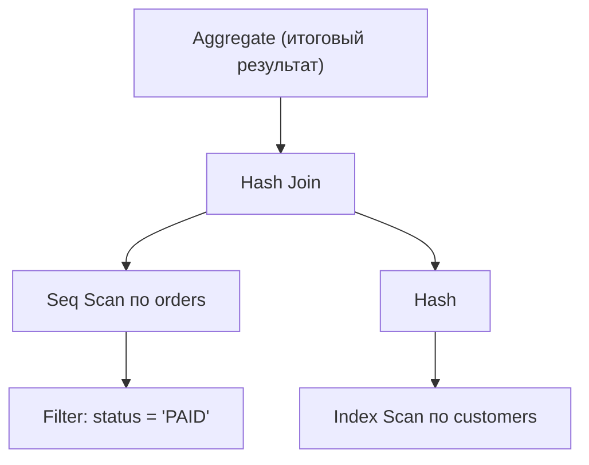
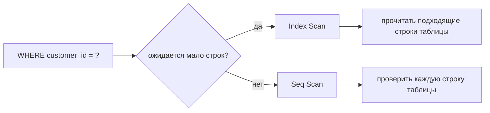

# Чтение планов EXPLAIN в PostgreSQL

## Интуиция

`EXPLAIN` показывает, какой рабочий порядок PostgreSQL планирует для SQL-запроса.
Более общий [план запроса](topic:query-plan) отвечает на вопрос «как база получит
ответ»; эта тема учит читать именно печатный план PostgreSQL и не обманываться
названиями узлов. Представьте чек на кухне: гость заказал ужин, а кухня разбила
его на подготовку, готовку и подачу.

PostgreSQL печатает план как дерево. Дочерние узлы передают строки родительским,
поэтому обычно читают самые глубокие строки с наибольшим отступом, а затем
поднимаются вверх. Это похоже на сортировку посылок на почте: маленькие столы
сортировки готовят лотки, а главный стол объединяет их в итоговую сумку доставки.

Используйте обычный `EXPLAIN`, когда нужна только оценка. Используйте `EXPLAIN
ANALYZE`, когда нужна реальность: он выполняет запрос и добавляет фактическое
число строк и время. Для расследований в production часто полезнее всего
`EXPLAIN (ANALYZE, BUFFERS)`, потому что он показывает ещё и чтение страниц.
Аналогия: маршрутный лист против отчёта водителя доставки. План говорит, что
должно произойти, отчёт показывает, где фургон реально ждал.

## Первый проход: читаем дерево

Начинайте с листьев: сканирования читают таблицы или индексы. Потом переходите к
соединениям, фильтрам, сортировкам, агрегациям и лимитам. Родительский узел не
может закончить, пока дочерние не произведут достаточно строк. На кухне станция
подачи не сможет собрать блюдо, пока гриль и салатная станция не передадут свои
части.

Обращайте внимание на `loops` в `EXPLAIN ANALYZE`. PostgreSQL показывает
фактическое время на один loop, поэтому узел, который выглядит дешёвым, может
доминировать, если выполняется тысячи раз. Это как почтовый служащий, который
тратит только пять секунд на посылку, но делает это для каждой посылки в городе.

Корневой узел - финальная операция, а не обязательно первая. План, который
визуально начинается с `Aggregate`, может тратить большую часть времени в
дочернем `Seq Scan` или `Hash Join`. Это как видеть «подать блюдо» вверху
рецепта: дорогая работа уже произошла раньше на станциях подготовки.

## Seq Scan vs Index Scan

`Seq Scan` означает, что PostgreSQL последовательно читает страницы таблицы и
проверяет фильтр по строкам. Это не всегда плохо. Такой выбор может быть самым
дешёвым для маленьких таблиц, фильтров, возвращающих большую часть таблицы, или
ситуаций, где нет полезного [индекса базы данных](topic:database-indexes) под
предикат. Как с почтовыми ящиками на короткой улице: пройти всю улицу может быть
быстрее, чем сначала открывать справочник улиц.

`Index Scan` означает, что PostgreSQL проходит по индексу, находит кандидатов и
затем читает строки таблицы. Он лучше всего работает, когда предикат селективен,
а индекс соответствует шаблону доступа. Как почтовая полка, отсортированная по
адресу: служащий сразу прыгает к нужному лотку, а не открывает каждый конверт.

`Index Only Scan` может не читать строки таблицы, если индекс содержит все нужные
колонки и PostgreSQL может доказать, что строки видимы. Так как PostgreSQL
использует [MVCC](topic:mvcc), это доказательство зависит от visibility map.
Бытовая аналогия: если на адресной карточке уже есть все детали и надёжная
отметка «проверено», служащему не нужно открывать посылку.

`Bitmap Index Scan` вместе с `Bitmap Heap Scan` - промежуточный вариант:
PostgreSQL собирает много подходящих адресов строк из одного или нескольких
индексов, а потом посещает страницы таблицы в более эффективном порядке. Это как
сначала отметить все нужные квартиры на плане дома, а затем пройти этажи.

`Seq Scan` становится подозрительным, когда таблица большая, фильтр должен быть
селективным, а `Rows Removed by Filter` огромен. Обычно это значит, что запросу
нужен лучший индекс, более дружественный индексу предикат или более свежая
статистика. Как искать один счёт на складе, открывая каждую коробку: само
сканирование подсказывает, что система хранения не помогает.

## Cost, Rows и Width

Типичная строка узла содержит поля вроде `cost=0.43..42.10 rows=15 width=64`.
Первая стоимость - startup cost: работа до возврата первой строки. Вторая -
total cost: оценочная работа для возврата всех строк из этого узла. Это единицы
стоимости планировщика, а не миллисекунды. Считайте их ценниками в одном
магазине: полезно сравнивать варианты внутри одного плана, но это не универсальный
секундомер.

`rows` - оценочное число строк для узла, а `width` - оценочный средний размер
строки в байтах. Плохие оценки строк часто объясняют плохие планы. Если
планировщик ожидает 10 строк, а `EXPLAIN ANALYZE` показывает 500 000 фактических
строк, он может выбрать Nested Loop или путь через индекс, который рушится на
реальном размере. Как кейтеринг, который готовился к 10 гостям, а пришло 500 000:
весь график кухни становится неверным.

Стоимость строится из статистики: числа строк, числа различных значений,
гистограмм и настроек. О том, как планировщик выбирает между альтернативами, см.
[как определяется план запроса](topic:query-execution-plan). Если статистика
устарела или предикат прячет индексированную колонку за функцией или cast,
планировщик может неверно оценить селективность. Как приложение с пробками,
которое использует перекрытия дорог за прошлый месяц: маршрут формально возможен,
но всё равно ужасен.

## Join-узлы

`Nested Loop` берёт строки с внешней стороны и запускает внутреннюю сторону для
каждой из них. Это отлично, когда внешняя сторона маленькая, а на внутренней есть
полезный индекс. Это опасно, когда внешняя сторона большая, а внутренняя
сканируется снова и снова, потому что работа может приблизиться к
[O(n²)](topic:quadratic-complexity). Представьте, что каждого прибывающего гостя
снова и снова сверяют со всем бумажным списком.

`Hash Join` строит хеш-таблицу по одному входу, обычно меньшему, и проверяет её
другим входом. Он силён для больших equality join, когда хватает памяти. Кухонная
аналогия: один раз разложить все билеты заказов по пронумерованным контейнерам,
а затем быстро искать совпадения.

`Merge Join` читает два отсортированных входа рядом друг с другом. Он хорош,
когда оба входа уже отсортированы индексами или сортировка дешевле хеширования.
Это как две почтовые очереди, отсортированные по ZIP code, которые идут вперёд
вместе и сопоставляют посылки по ходу.

Смотрите на дочерние узлы join-узла. Даже хороший тип соединения может быть
медленным, если дочернее сканирование возвращает намного больше строк, чем
ожидалось, если сортировка уходит на диск или если условие соединения применяется
поздно как фильтр. Ужин может быть хорошо спланирован, но если одна станция
подготовки присылает в десять раз больше тарелок, проход всё равно заблокируется.

## Тревожные признаки

Главный тревожный признак - большое различие между оценочными и фактическими
строками. Это указывает на устаревшую статистику, перекошенные данные,
коррелирующие колонки, плохую оценку селективности или предикаты, которые
планировщик плохо понимает. Это как список бронирований на 20 гостей, пока к
двери продолжают подъезжать автобусы.

Другие частые тревожные признаки:

- `Seq Scan` по большой таблице с селективным предикатом и большим числом строк,
  удалённых фильтром.
- `Nested Loop` с высоким `loops`, особенно когда внутренний узел многократно
  сканирует много строк.
- Узлы `Sort` или `Hash`, которые проливаются на диск или показывают тяжёлый
  временный I/O.
- `Rows Removed by Filter` или `Rows Removed by Join Filter` намного больше, чем
  число возвращённых строк.
- Индекс существует, но не используется, потому что предикат недружелюбен к
  индексу: например, функция вокруг колонки, неявный cast, ведущий wildcard в
  `LIKE` или условие с низкой селективностью.
- Высокие чтения буферов в `EXPLAIN (ANALYZE, BUFFERS)`, показывающие, что запрос
  трогает много страниц.

Когда найден горячий узел, выбирайте исправление по фактам. Добавляйте или
меняйте индекс, когда шаблон доступа селективен и стабилен; см.
[какие индексы добавить для оптимизации запроса](topic:indexes-for-query-optimization).
Обновляйте статистику через `ANALYZE`, когда оценки далеки от реальности.
Переписывайте SQL, когда планировщик не может использовать индекс или когда
соединения и фильтры происходят слишком поздно. Это как чинить конкретную станцию,
которая задерживает кухню, а не покупать случайную новую технику.

## Ответ за 60 секунд

> Я читаю план PostgreSQL EXPLAIN как дерево: самые глубокие дочерние узлы сначала
> производят строки, а родительские узлы их потребляют. `Seq Scan` означает
> сканирование страниц таблицы и фильтрацию строк; это нормально для маленьких
> таблиц или широких фильтров, но подозрительно на большой таблице с селективным
> предикатом. `Index Scan` использует индекс для поиска строк-кандидатов, но не
> всегда дешевле, особенно если из таблицы нужно прочитать много строк.
> `cost=a..b` - это startup и total оценочной стоимости планировщика, не
> миллисекунды; `rows` - оценочная кардинальность. С `EXPLAIN ANALYZE` я сравниваю
> оценочные строки с фактическими, смотрю loops, timings и buffers, а затем
> проверяю join-узлы: Nested Loop хорош для маленького внешнего входа с индексным
> поиском внутри, Hash Join - для больших equality join, Merge Join - для
> отсортированных входов. Тревожные признаки: огромные ошибки оценок, большие
> сканирования с множеством отфильтрованных строк, повторные внутренние
> сканирования, проливы на диск и высокие чтения буферов.

## Применение на практике

В production чтение планов защищает от случайного тюнинга. Начните с slow-query
log или измеренного кандидата, затем смотрите `EXPLAIN (ANALYZE, BUFFERS)`, если
его безопасно выполнять. О выборе запроса, который заслуживает внимания первым,
см. [выбор запросов для оптимизации](topic:query-optimization-candidates). Это
как посмотреть камеру дорожного движения перед перестройкой дороги: сначала
докажите, где пробка.

Будьте осторожны с записями. Сам `EXPLAIN` не выполняет statement, но `EXPLAIN
ANALYZE` выполняет. Для `INSERT`, `UPDATE` и `DELETE` используйте транзакцию,
которую откатите, или безопасную среду. Как кухонная тренировка с настоящими
заказами: еда всё равно двигается, если её явно не отменить.

Планы также могут меняться со временем. Новые данные, устаревшая статистика,
значения параметров, изменения конфигурации и разные индексы могут изменить
выбранный план. Маршрут доставки, хороший в понедельник, может стать плохим в
пятницу после дорожных работ и нового трафика.

## Частые заблуждения

- «Seq Scan всегда плох». Нет. Он часто правилен для маленьких таблиц или
  фильтров, возвращающих большую часть таблицы.
- «Index Scan всегда хорош». Нет. Если нужно прочитать много heap-строк, путь
  через индекс может быть медленнее последовательного сканирования.
- «Cost - это время в миллисекундах». Нет. Это относительная оценка планировщика.
- «Первая строка выполняется первой». Нет. План - это дерево; дочерние узлы
  производят строки для родителей.
- «Оценочные rows - факты». Нет. Это догадки из статистики. Сравнивайте их с
  фактическими rows из `EXPLAIN ANALYZE`.
- «Nested Loop всегда неправильный». Нет. Он часто лучший для маленького внешнего
  результата с индексным поиском во внутренней стороне.
- «Добавление индекса всегда чинит план». Нет. Предикат должен соответствовать
  индексу, фильтр должен быть достаточно селективным, а записи будут платить за
  обслуживание индекса. О компромиссах см.
  [оптимизация SQL-запросов](topic:sql-query-optimization).
