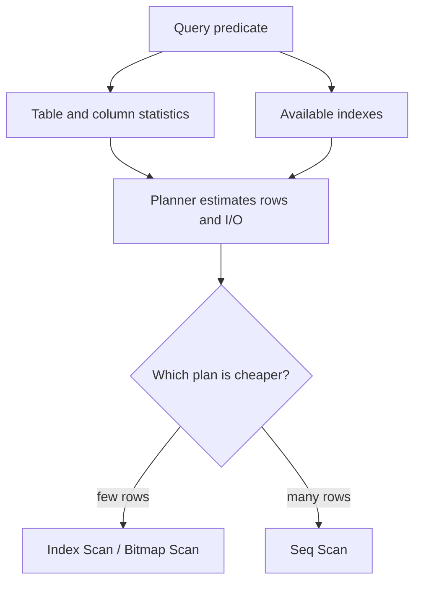
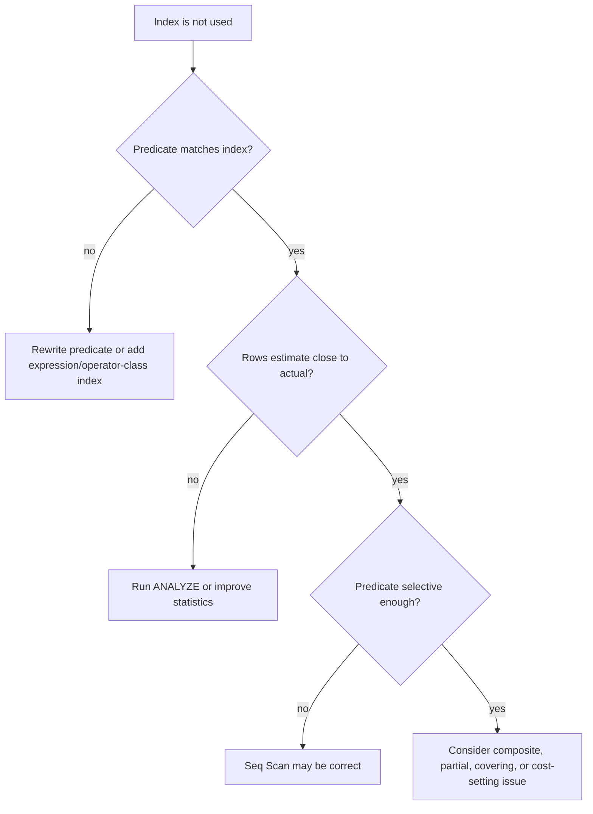

# PostgreSQL Index Exists but Is Not Used

## Intuition

An index is an option, not an order. PostgreSQL compares possible plans and picks
the one it estimates to be cheapest. A [database index](topic:database-indexes)
is like a post office directory: useful when the clerk needs a few exact boxes,
but slower than walking the aisle if almost every box must be opened anyway.

The planner chooses from statistics, predicates, available indexes, table size,
cost settings, and sometimes prepared-statement parameter rules. For the broader
mechanics, see [how a query plan is determined](topic:query-execution-plan) and
[what a query plan is](topic:query-plan). The everyday analogy is traffic
navigation: even if a shortcut exists, the app may avoid it when it predicts
too many turns, tolls, or jams.

So the interview answer should not be "PostgreSQL is broken." It should be:
"the index may not be the cheapest valid path, or the query may not match the
index in a way the planner can use." In kitchen terms, having a special knife
does not mean the cook uses it for every onion.

## Why an Existing Index Is Skipped

Low selectivity is the most common reason. If a predicate returns a large share
of the table, PostgreSQL may prefer `Seq Scan` because index lookup still has to
visit many heap pages. Like a courier delivering mail to almost every apartment,
it is faster to walk the hallway than to check the directory before each door.

Small tables are another normal case. A table with a few pages can be cheaper to
scan entirely than to traverse an index first. This is like checking all spoons
in one kitchen drawer instead of opening a catalog to find a spoon.

The predicate may be non-index-friendly. A normal B-tree index on `email` helps
`WHERE email = ?`, but not necessarily `WHERE lower(email) = ?` unless there is
an expression index on `lower(email)`. Implicit casts, arithmetic around the
column, leading-wildcard `LIKE '%abc'`, incompatible collations, and unsupported
operators can all hide the indexed order. It is like alphabetizing envelopes by
surname, then asking for "names after converting every surname to a nickname."

Composite indexes depend on column order and the leftmost prefix. An index on
`(tenant_id, created_at)` is strong for `tenant_id = ? AND created_at > ?`, but
not for filtering only by `created_at` across all tenants. Think of a warehouse
sorted first by city and then by street: it helps if you know the city, but not
if you only know the street name.

Partial indexes only apply when PostgreSQL can prove the query condition implies
the index predicate. An index like `WHERE status = 'ACTIVE'` may not help a query
using a parameter `WHERE status = $1`, especially in a generic prepared plan.
That is like a shelf labeled "active orders only"; the clerk cannot use it if
the ticket merely says "some status will be supplied later."

Statistics may be stale or too weak. If PostgreSQL underestimates or
overestimates row counts, it can reject the better path. `ANALYZE`, higher
statistics targets, and extended statistics for correlated columns can help. It
is like a restaurant planning dinner from last month's reservation book.

An index-only scan may still touch the heap. PostgreSQL uses [MVCC](topic:mvcc),
so it must know whether rows are visible to the current transaction. If the
visibility map is not set for relevant pages, the engine checks heap tuples even
when all selected columns are in the index. Like a parcel card containing every
detail but missing a "verified" stamp, the clerk still opens the parcel.

Prepared statements can change the plan. PostgreSQL may choose a generic plan
that is acceptable for many parameter values instead of a custom plan for one
specific value. With skewed data, the generic plan may ignore an index that would
be excellent for a rare value. This is like a traffic app giving one average
route for every day instead of adapting to today's road closure.

Cost settings and physical reality matter too. `random_page_cost`,
`effective_cache_size`, table bloat, correlation between index order and table
order, and caching can shift the estimated price of index access. This is like a
delivery route where the same map behaves differently if roads are empty,
blocked, or full of potholes.

## Diagnosis Flow

Start with evidence: run `EXPLAIN (ANALYZE, BUFFERS)` when it is safe, and read
the plan using the same habits from [Reading PostgreSQL EXPLAIN Plans](topic:postgresql-explain-plan-reading).
Compare estimated rows with actual rows, check `Rows Removed by Filter`, heap
fetches, loops, and buffer reads. It is like watching the kitchen during dinner
service before buying a new oven.

Then check whether the query matches the index shape. Look at equality filters,
range filters, joins, sort order, grouping, and projected columns; these are the
[fields that matter in database queries](topic:database-query-fields). The
post-office analogy is simple: first ask whether the address on the parcel uses
the same format as the address book.

If estimates are wrong, refresh or improve statistics before creating another
index. Run `ANALYZE`, inspect skewed columns, consider `CREATE STATISTICS` for
correlated columns, and verify again. This is like updating the restaurant's
reservation list before changing the whole kitchen layout.

If the predicate is not index-friendly, prefer a precise rewrite or the right
index type. Examples: move the function to the constant side when valid, add an
expression index, use a partial index for a stable subset, use `text_pattern_ops`
or trigram indexes for pattern search, or fix a type mismatch. It is like
relabelling shelves so the clerk can search directly instead of translating
every label on the fly.

If the query is broad, accept that `Seq Scan` may be correct. Adding another
index can slow writes, increase storage, and still not win. For index selection
trade-offs, see [which indexes to add to optimize queries](topic:indexes-for-query-optimization)
and [SQL query optimization](topic:sql-query-optimization). Like buying another
traffic lane, it only helps if that lane is where cars actually queue.

Use `enable_seqscan = off` only as a local experiment to see whether an index
plan is even possible. Do not use it as a production fix. That is like forcing
every courier down an alley to prove the alley exists, not because it is the best
route.

## 60-second Interview Answer

> PostgreSQL does not use an index just because it exists. The planner compares
> estimated costs and may choose `Seq Scan` if the table is small, the predicate
> returns many rows, heap fetches would be expensive, or the index does not match
> the query shape. I would inspect `EXPLAIN (ANALYZE, BUFFERS)`, compare
> estimated and actual rows, and check whether the predicate is index-friendly:
> no function or cast hiding the column, no leading wildcard for a normal B-tree,
> correct composite index prefix, and matching partial-index condition. If
> estimates are wrong, I would run `ANALYZE` or improve statistics, including
> extended statistics for correlated columns. If the query shape is the problem,
> I would rewrite the predicate or add the right composite, partial, expression,
> covering, or operator-class index. I would not force index usage in production;
> I would measure the plan and balance read speed against write and storage cost.

## Production Relevance

In production, the dangerous move is adding indexes blindly. Every index has a
write and storage cost, and too many indexes can slow `INSERT`, `UPDATE`, and
`DELETE`. Like adding more shelves to a post office, sorting becomes faster for
some searches but every incoming parcel takes more work to file.

Use real workload evidence: slow-query logs, `pg_stat_statements`, safe
`EXPLAIN (ANALYZE, BUFFERS)`, and before/after measurements. Also check whether
the query comes from a prepared statement whose generic plan differs from a
literal-value test. It is like diagnosing traffic with actual rush-hour camera
footage, not an empty-road rehearsal.

Prefer small, targeted fixes. Sometimes the fix is `ANALYZE`; sometimes it is a
SQL rewrite; sometimes it is a composite, partial, expression, or covering index;
sometimes the correct answer is to leave the `Seq Scan` alone. A good engineer
fixes the slow station in the kitchen, not every appliance in the building.

## Common Misconceptions

- "If an index exists, PostgreSQL should use it." No. The planner uses the
  cheapest estimated valid plan.
- "Seq Scan always means missing index." No. It can be optimal for small tables
  or broad predicates.
- "Index Scan is always faster." No. Many random heap fetches can lose to a
  sequential read.
- "ANALYZE changes data." No. It refreshes statistics so the planner can estimate
  better.
- "A composite index can use any column independently." No. B-tree composite
  indexes depend heavily on the leftmost prefix and predicate shape.
- "A partial index works whenever its columns match." No. The query must imply
  the partial-index predicate.
- "Index Only Scan never reads the table." No. PostgreSQL may still need heap
  visibility checks.
- "Disabling Seq Scan is a fix." No. It is a diagnostic experiment, not a
  production tuning strategy.
