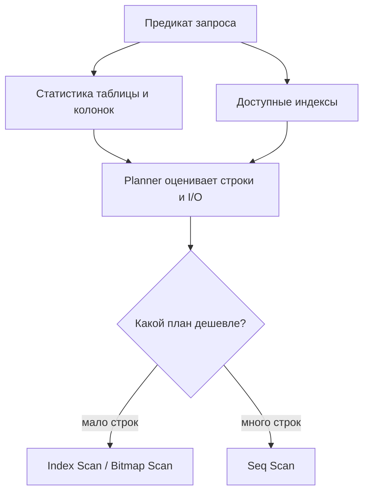
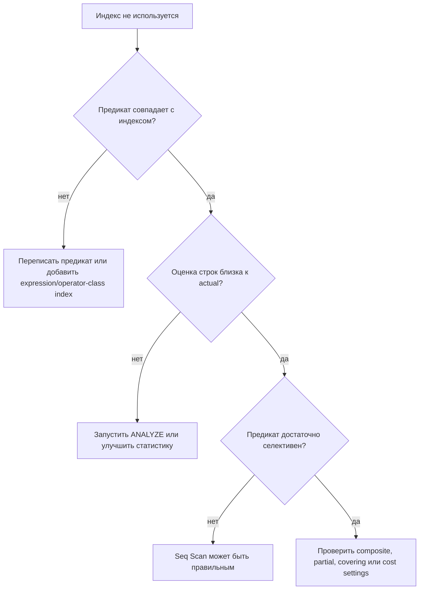

# Индекс в PostgreSQL есть, но не используется

## Интуиция

Индекс - это возможность, а не приказ. PostgreSQL сравнивает возможные планы и
выбирает тот, который считает самым дешёвым. [Индекс в базе данных](topic:database-indexes)
похож на справочник на почте: он полезен, когда сотруднику нужно найти несколько
точных коробок, но медленнее обычного прохода по ряду, если всё равно придётся
открыть почти каждую коробку.

Planner выбирает план по статистике, предикатам, доступным индексам, размеру
таблицы, настройкам стоимости и иногда правилам параметров prepared statements.
Более широкую механику смотри в темах [как определяется план запроса](topic:query-execution-plan)
и [что такое query plan](topic:query-plan). Бытовая аналогия - навигатор в
трафике: даже если короткий проезд есть, приложение может избегать его, если
ожидает слишком много поворотов, платных участков или пробок.

Поэтому ответ на собеседовании не должен быть "PostgreSQL сломался". Лучше:
"индекс может быть не самым дешёвым корректным путём, или запрос может не
совпадать с индексом так, чтобы planner мог им воспользоваться." На кухне
наличие специального ножа тоже не означает, что повар берёт его для каждой
луковицы.

## Почему существующий индекс пропускается

Низкая селективность - самая частая причина. Если предикат возвращает большую
долю таблицы, PostgreSQL может предпочесть `Seq Scan`, потому что поиск через
индекс всё равно потребует посещения множества heap-страниц. Как курьер, который
разносит письма почти в каждую квартиру: быстрее пройти по коридору, чем перед
каждой дверью смотреть в справочник.

Маленькие таблицы - ещё один нормальный случай. Таблицу из нескольких страниц
может быть дешевле прочитать целиком, чем сначала проходить по индексу. Это как
проверить все ложки в одном кухонном ящике вместо того, чтобы открывать каталог
для поиска ложки.

Предикат может быть неудобным для индекса. Обычный B-tree индекс по `email`
помогает `WHERE email = ?`, но не обязательно помогает `WHERE lower(email) = ?`,
если нет expression index по `lower(email)`. Неявные приведения типов,
арифметика вокруг колонки, `LIKE '%abc'` с wildcard в начале, несовместимые
collation и неподдерживаемые операторы могут скрыть индексный порядок. Это как
отсортировать конверты по фамилии, а потом искать "имена после превращения
каждой фамилии в прозвище".

Составные индексы зависят от порядка колонок и leftmost prefix. Индекс
`(tenant_id, created_at)` силён для `tenant_id = ? AND created_at > ?`, но не
для фильтрации только по `created_at` среди всех tenants. Представь склад,
отсортированный сначала по городу, а потом по улице: он помогает, если город
известен, но плохо помогает, если известна только улица.

Частичные индексы применяются только тогда, когда PostgreSQL может доказать, что
условие запроса подразумевает предикат индекса. Индекс вида
`WHERE status = 'ACTIVE'` может не помочь запросу с параметром
`WHERE status = $1`, особенно в generic plan у prepared statement. Это как полка
с табличкой "только активные заказы"; сотрудник не может использовать её, если
на талоне написано лишь "статус будет передан позже".

Статистика может быть устаревшей или слишком слабой. Если PostgreSQL занижает
или завышает число строк, он может отвергнуть лучший путь. Помогают `ANALYZE`,
более высокий statistics target и extended statistics для коррелированных
колонок. Это как ресторан, который планирует ужин по книге бронирований за
прошлый месяц.

Index Only Scan всё равно может обращаться к heap. PostgreSQL использует
[MVCC](topic:mvcc), поэтому ему нужно знать, видимы ли строки текущей
транзакции. Если visibility map не выставлена для нужных страниц, движок
проверяет heap tuples, даже когда все выбранные колонки есть в индексе. Как
карточка посылки со всеми деталями, но без штампа "проверено": сотрудник всё
равно открывает посылку.

Prepared statements могут менять план. PostgreSQL может выбрать generic plan,
который приемлем для многих значений параметров, вместо custom plan для одного
конкретного значения. При перекошенных данных generic plan может игнорировать
индекс, который был бы отличным для редкого значения. Это как навигатор, который
даёт один средний маршрут на каждый день, а не подстраивается под сегодняшнее
перекрытие дороги.

Настройки стоимости и физическая реальность тоже важны. `random_page_cost`,
`effective_cache_size`, bloat таблицы, корреляция между порядком индекса и
порядком таблицы, а также кеширование могут менять оценочную цену индексного
доступа. Это как маршрут доставки: одна и та же карта ведёт себя по-разному,
если дороги пустые, перекрытые или разбитые.

## Порядок диагностики

Начни с фактов: запусти `EXPLAIN (ANALYZE, BUFFERS)`, когда это безопасно, и
читай план теми же приёмами, что в теме [Чтение планов EXPLAIN в PostgreSQL](topic:postgresql-explain-plan-reading).
Сравни estimated rows с actual rows, проверь `Rows Removed by Filter`, heap
fetches, loops и buffer reads. Это как понаблюдать за кухней во время ужина,
прежде чем покупать новую духовку.

Затем проверь, совпадает ли запрос с формой индекса. Смотри на equality filters,
range filters, joins, sort order, grouping и выбранные колонки; это [поля,
которые важны в запросах к базе данных](topic:database-query-fields). Почтовая
аналогия простая: сначала проверь, записан ли адрес на посылке в том же формате,
что и в адресной книге.

Если оценки неверны, обнови или улучши статистику до создания ещё одного
индекса. Запусти `ANALYZE`, посмотри на перекошенные колонки, подумай о `CREATE
STATISTICS` для коррелированных колонок и проверь план снова. Это как обновить
список бронирований ресторана перед перестройкой всей кухни.

Если предикат неудобен для индекса, предпочитай точное переписывание или
правильный тип индекса. Примеры: перенести функцию на сторону константы, когда
это корректно, добавить expression index, использовать partial index для
стабильного подмножества, выбрать `text_pattern_ops` или trigram indexes для
поиска по шаблону, либо исправить несовпадение типов. Это как переклеить
этикетки на полках, чтобы сотрудник искал напрямую, а не переводил каждую
этикетку на ходу.

Если запрос широкий, прими, что `Seq Scan` может быть правильным. Ещё один
индекс может замедлить записи, увеличить storage и всё равно не выиграть. О
компромиссах выбора индексов смотри [какие индексы нужны для оптимизации
запросов](topic:indexes-for-query-optimization) и [SQL query optimization](topic:sql-query-optimization).
Как с новой полосой на дороге: она помогает только там, где действительно
стоят машины.

Используй `enable_seqscan = off` только как локальный эксперимент, чтобы понять,
возможен ли индексный план вообще. Не используй это как production fix. Это как
заставить каждого курьера ехать через переулок, чтобы доказать, что переулок
существует, а не потому, что это лучший маршрут.

## Ответ за 60 секунд

> PostgreSQL не использует индекс просто потому, что он существует. Planner
> сравнивает оценочную стоимость и может выбрать `Seq Scan`, если таблица
> маленькая, предикат возвращает много строк, heap fetches будут дорогими или
> индекс не совпадает с формой запроса. Я бы посмотрел `EXPLAIN (ANALYZE,
> BUFFERS)`, сравнил estimated и actual rows и проверил, дружит ли предикат с
> индексом: нет ли функции или cast вокруг колонки, нет ли wildcard в начале для
> обычного B-tree, правильно ли используется префикс составного индекса и
> совпадает ли условие частичного индекса. Если оценки неверны, я бы запустил
> `ANALYZE` или улучшил статистику, включая extended statistics для
> коррелированных колонок. Если проблема в форме запроса, я бы переписал
> предикат или добавил правильный composite, partial, expression, covering или
> operator-class index. Я бы не форсировал использование индекса в production, а
> измерил план и сбалансировал скорость чтения со стоимостью записи и хранения.

## Значение в production

В production опасно добавлять индексы вслепую. У каждого индекса есть стоимость
записи и хранения, а слишком много индексов может замедлить `INSERT`, `UPDATE` и
`DELETE`. Как дополнительные полки на почте: некоторые поиски становятся
быстрее, но каждую входящую посылку приходится дольше раскладывать.

Используй факты из реальной нагрузки: slow-query logs, `pg_stat_statements`,
безопасный `EXPLAIN (ANALYZE, BUFFERS)` и измерения до/после. Также проверь, не
приходит ли запрос из prepared statement, где generic plan отличается от теста с
литеральным значением. Это как диагностировать пробку по реальным камерам в час
пик, а не по репетиции на пустой дороге.

Предпочитай небольшие точные исправления. Иногда решение - `ANALYZE`; иногда
переписывание SQL; иногда composite, partial, expression или covering index;
иногда правильный ответ - оставить `Seq Scan` в покое. Хороший инженер чинит
медленную станцию на кухне, а не всю технику в здании.

## Распространённые заблуждения

- "Если индекс есть, PostgreSQL должен его использовать." Нет. Planner использует
  самый дешёвый оценочный корректный план.
- "Seq Scan всегда означает отсутствующий индекс." Нет. Он может быть оптимален
  для маленьких таблиц или широких предикатов.
- "Index Scan всегда быстрее." Нет. Множество random heap fetches может проиграть
  последовательному чтению.
- "ANALYZE меняет данные." Нет. Он обновляет статистику, чтобы planner лучше
  оценивал план.
- "Составной индекс может независимо использовать любую колонку." Нет. B-tree
  составные индексы сильно зависят от leftmost prefix и формы предиката.
- "Частичный индекс работает всегда, если совпадают колонки." Нет. Запрос должен
  подразумевать предикат частичного индекса.
- "Index Only Scan никогда не читает таблицу." Нет. PostgreSQL всё равно может
  потребовать heap visibility checks.
- "Отключить Seq Scan - это исправление." Нет. Это диагностический эксперимент,
  а не production-стратегия настройки.
