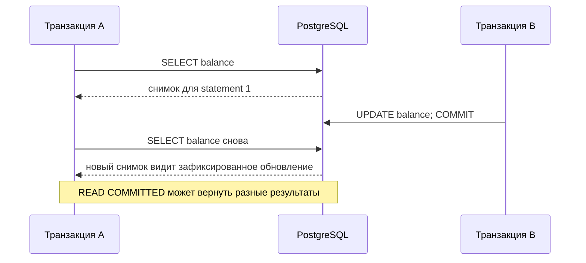

# Уровни изоляции транзакций в PostgreSQL

Изоляция - это буква "I" в [ACID](topic:acid-principles): она определяет, насколько одна транзакция может замечать другую транзакцию, пока обе выполняются. В PostgreSQL это построено на MVCC: читающие операции обычно видят снимок данных, а не блокируют пишущие. Представь общую доску заказов на кухне: повар может читать либо текущую доску, либо фотографию доски, в зависимости от уровня изоляции.

PostgreSQL принимает четыре стандартных названия SQL:

- `READ UNCOMMITTED`
- `READ COMMITTED`
- `REPEATABLE READ`
- `SERIALIZABLE`

Важная деталь для собеседования: в PostgreSQL здесь только три разных поведения, потому что `READ UNCOMMITTED` ведет себя как `READ COMMITTED`. Как почтовое отделение, которое не показывает наполовину заполненные адресные ярлыки, PostgreSQL не раскрывает грязные чтения даже при запросе самого слабого уровня.

## Уровни

| Уровень | Поведение PostgreSQL | Подсказка для запоминания |
| --- | --- | --- |
| `READ UNCOMMITTED` | Принимается, но трактуется как `READ COMMITTED`; грязные чтения все равно невозможны. | Даже просьба заглянуть в недоделанную посылку дает только запечатанные посылки. |
| `READ COMMITTED` | Уровень по умолчанию. Каждый statement видит строки, зафиксированные до начала этого statement. | Каждый раз, когда смотришь на кухонную доску, получаешь свежий вид. |
| `REPEATABLE READ` | После первого statement используется один снимок на всю транзакцию, поэтому последующие чтения видят тот же снимок базы. В PostgreSQL на этом уровне также предотвращаются phantom reads. | Ты делаешь одну фотографию доски и продолжаешь готовить по этой фотографии. |
| `SERIALIZABLE` | Самый строгий уровень. PostgreSQL использует Serializable Snapshot Isolation и может отменить одну транзакцию, если конкурентный результат нельзя представить как какой-либо последовательный порядок. | Регулировщик разрешает машинам ехать вместе, но отправляет одну машину на повторный круг, если порядок на перекрестке становится небезопасным. |

## READ COMMITTED

`READ COMMITTED` - уровень PostgreSQL по умолчанию. Каждый SQL statement получает собственный снимок зафиксированных данных. Если транзакция A выполняет `SELECT`, транзакция B фиксирует обновление, а транзакция A снова выполняет тот же `SELECT`, второй результат может отличаться. Это допускает non-repeatable reads и phantoms.

Аналогия: кассир смотрит на полку перед каждым запросом покупателя. Если коллега пополнил полку между двумя взглядами, кассир увидит новую полку во второй раз.

Для `UPDATE`, `DELETE`, `SELECT FOR UPDATE` и похожих statement с блокировкой строк PostgreSQL может подождать конкурентное обновление, а затем заново проверить условие `WHERE` уже по самой новой зафиксированной строке. Аналогия: если два сотрудника пытаются править одну бумажную форму, второй ждет, а потом проверяет готовую форму и решает, все еще подходит ли она под запрос.

## REPEATABLE READ

`REPEATABLE READ` дает транзакции стабильный снимок. После первого statement обычные чтения продолжают видеть одно и то же зафиксированное состояние всю транзакцию, даже если другие транзакции фиксируют изменения. Реализация PostgreSQL на этом уровне предотвращает dirty reads, non-repeatable reads и phantom reads.

Аналогия: повар делает датированную фотографию кладовой и планирует весь рецепт по этой фотографии. Новые продукты могут приехать, но рецепт этого повара внезапно не меняется.

Ловушка в том, что PostgreSQL `REPEATABLE READ` не равен полной serializability. Это snapshot isolation. Некоторые бизнес-правила между несколькими строками все еще могут столкнуться с write skew: две транзакции читают один и тот же стабильный снимок, обновляют разные строки и вместе нарушают инвариант. Аналогия: два руководителя видят двух людей на смене, затем каждый отправляет домой разного человека; никто не заметил, что итоговое расписание оставило слишком мало людей.

## SERIALIZABLE

`SERIALIZABLE` - самый сильный уровень. PostgreSQL все еще использует снимки ради производительности, но дополнительно отслеживает зависимости чтения и записи. Если конкурентные транзакции дают результат, который нельзя объяснить так, будто одна транзакция полностью выполнилась до другой, PostgreSQL отменяет одну из них с serialization failure, обычно SQLSTATE `40001`.

Аналогия: машины могут одновременно въезжать на перекресток, пока регулировщик следит за траекториями. Если итоговое движение стало бы небезопасным, одну машину отправляют попробовать снова.

Поскольку такие отмены являются частью контракта, код приложения должен повторять всю транзакцию, а не только последний statement. Это важно в сервисах с фреймворками вроде Spring transactions: retry должен оборачивать границу транзакции, а не находиться внутри уже обреченной транзакции. Аналогия: если почтовую форму отклонили из-за изменившейся очереди, ты заполняешь и подаешь всю форму заново, а не только последнюю строку с подписью.

## Ответ за 60 секунд

В PostgreSQL можно установить `READ UNCOMMITTED`, `READ COMMITTED`, `REPEATABLE READ` и `SERIALIZABLE`. Уровень по умолчанию - `READ COMMITTED`: каждый statement видит свежий снимок данных, зафиксированных до начала этого statement, поэтому возможны non-repeatable reads и phantoms. `READ UNCOMMITTED` принимается, но ведет себя как `READ COMMITTED`, потому что PostgreSQL MVCC не показывает грязные чтения. `REPEATABLE READ` использует стабильный снимок транзакции и в PostgreSQL предотвращает dirty reads, non-repeatable reads и phantom reads, но это все еще snapshot isolation, поэтому write skew может остаться. `SERIALIZABLE` добавляет проверки Serializable Snapshot Isolation и может отменить транзакцию с serialization failure; корректный код должен повторять всю транзакцию.

## Где это важно в production

Большинству OLTP-кода достаточно `READ COMMITTED` по умолчанию, особенно если инварианты защищены constraints, unique indexes и явными блокировками строк. Аналогия: для обычной работы магазина достаточно проверять текущую полку перед каждой операцией.

`REPEATABLE READ` полезен для отчетов, экспортов или расчетов, которым нужен стабильный вид множества строк. Аналогия: команда инвентаризации должна пользоваться одним распечатанным листом, а не листом, который меняется во время подсчета.

`SERIALIZABLE` стоит использовать, когда приложению нужно, чтобы база отвергала небезопасные конкурентные расписания, особенно для бизнес-правил на нескольких строках. Аналогия: регулировщик нужен там, где несколько дорог сходятся на опасном перекрестке.

Длинные транзакции на строгих уровнях изоляции могут повышать число конфликтов и дольше удерживать старые версии строк. Аналогия: если часами держать старую фотографию кладовой, всем приходится помнить, как кладовая выглядела тогда.

## Частые заблуждения

- "PostgreSQL `READ UNCOMMITTED` разрешает грязные чтения." Нет, он ведет себя как `READ COMMITTED`. Кухня не выдает блюда по незавершенному талону.
- "`REPEATABLE READ` означает serializable." Не в PostgreSQL: он сильнее минимума SQL и предотвращает phantoms, но write skew все еще возможен. Два сотрудника могут следовать своим копиям расписания и все равно получить плохой итоговый график.
- "`SERIALIZABLE` просто блокирует все." PostgreSQL использует SSI, а не одну глобальную блокировку. Перекресток продолжает работать, но небезопасные схемы движения могут быть отклонены.
- "Serialization failure - это баг базы данных." Это ожидаемое поведение. Приложение должно повторить всю транзакцию, как повторную подачу формы после изменения очереди.
- "Чем выше изоляция, тем всегда лучше." Более высокая изоляция может означать больше retry, больше ожиданий и более долгое хранение старых версий строк. Более строгий процесс на кухне безопаснее, но замедляет обслуживание, если каждый маленький заказ требует старшего смены.
