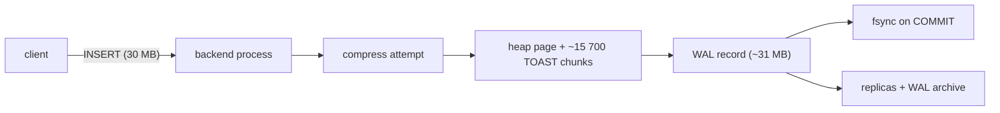
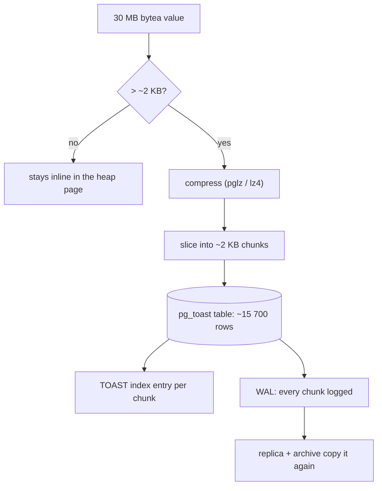
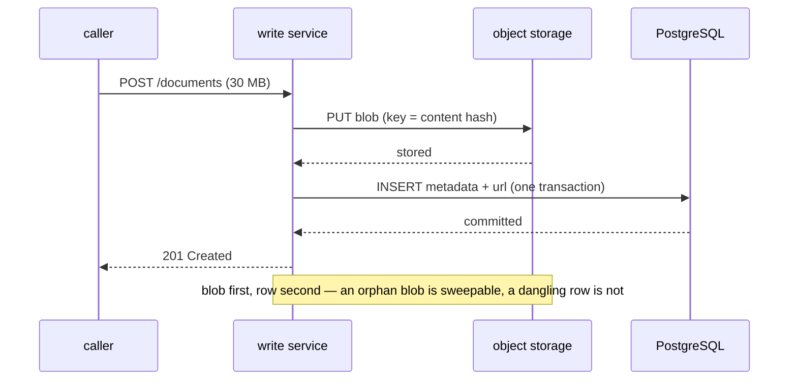

# Improving PostgreSQL Write Performance

The question hands you three facts, and each one constrains a different part of
the answer:

1. the service **only writes** — so read-side tuning, replicas and caches are off
   the table as a fix;
2. the records are **~30 MB** — so the payload, not the statement, is the unit of
   work;
3. **many services call its API** — so throughput and queueing matter, not just
   the latency of one write.

Before anything else, ask what the 30 MB *is*. "Large data" can mean one record
of 30 MB, a request that carries 30 MB, or a table that has grown to 30 MB in
total. Only the first two are a write-performance problem at all; a 30 MB table
fits in RAM and has nothing wrong with it. The rest of this assumes what the
question implies: **each record carries about 30 MB of payload.**

## Price one write before you tune it

The examples in this topic run a **cost model** — fixed unit costs, no real
server — so that the shape of the sum is visible. That shape is the whole
answer. One row-by-row `INSERT` of a 30 MB record splits like this:

| part | what it is | cost |
| --- | --- | --- |
| network | one client/server round trip | 0.4 ms |
| parse | parse, plan and execute one statement | 0.06 ms |
| compress | the TOAST compression attempt | 27 ms |
| table | writing heap and TOAST pages | 36 ms |
| toast | per-chunk overhead of ~15 700 chunk rows | 47 ms |
| wal | writing the same bytes again to the WAL | 37 ms |
| index | 5 index entries | 0.3 ms |
| commit | waiting for the WAL to reach the disk | 1.5 ms |

Round trips, statements, indexes and the commit — everything the usual answer
attacks — add up to about **1%**. Run **The baseline write** and look at the bar.
An optimisation can never be larger than the slice it touches, so the first job
is finding out which slice that is; the same discipline as
[diagnosing a slow site](topic:slow-website-diagnosis).

## What PostgreSQL does with a 30 MB value

A row must fit in an 8 KB page, so a value over roughly 2 KB is handled by
**TOAST** (The Oversized-Attribute Storage Technique):

1. **Compress it.** `bytea` and `text` default to `EXTENDED` storage, so
   PostgreSQL tries `pglz` (or `lz4`, if `default_toast_compression = lz4`).
   Compressible JSON might shrink 4×. A JPEG, a PDF, a zip or anything encrypted
   shrinks by nothing — and the *attempt* still costs CPU on every write.
2. **Slice it.** What is left is cut into chunks of just under 2 KB and inserted
   as rows in a hidden TOAST table, each with an entry in the TOAST index. A
   30 MB value becomes about **15 700 chunk rows**. One `INSERT` is not one row
   write; it is fifteen thousand of them.
3. **Log all of it.** Every one of those chunk rows is a WAL record. The row is
   written to the table and then written *again* to the write-ahead log, so
   30 MB of payload costs about **61 MB of disk** — before streaming replication
   and WAL archiving each copy the WAL a further time.

Run **Where the 30 MB goes**. Two things are worth noticing: compressible data
cuts the whole write by about 60%, and `ALTER TABLE ... ALTER COLUMN payload SET
STORAGE EXTERNAL` removes 27 ms of pointless compression per row for data that
was already compressed.

## The usual answers, weighed

Every one of these is a real technique. What differs is the slice it touches.

- **Batch the inserts.** JDBC `addBatch()`/`executeBatch()` in one transaction,
  or the driver option `reWriteBatchedInserts=true` which rewrites them into
  multi-row `INSERT`s. It removes per-statement round trips and per-row commits.
  On the 30 MB table that is 5.7 ms of a 598 ms write — **0.9%**. On a small row
  it is ~80%. Same technique, two verdicts. (With Hibernate, remember that
  `IDENTITY` id generation silently disables insert batching; use a sequence with
  an allocation size — see [Hibernate under the hood](topic:hibernate-under-the-hood).)
- **`COPY ... FROM STDIN`.** Streams rows in one statement with no per-row parse
  or plan. Strictly better than batched `INSERT` for bulk loading, and it changes
  nothing about the bytes underneath.
- **Fewer indexes.** Every index is an extra entry per row, plus its own WAL. At
  30 MB per row that is 0.2% of the write; at 512 B per row, eight indexes are
  21%. Run **What indexes really cost**. On a write-only table, an index that no
  query uses is pure cost — see
  [which indexes to add](topic:indexes-for-query-optimization) and
  [database indexes](topic:database-indexes).
- **`synchronous_commit = off`.** The commit stops waiting for the WAL flush. You
  lose *recently committed transactions* on a crash — a window of a few hundred
  milliseconds — and you lose **nothing else**: no corruption, no torn rows, none
  of the isolation guarantees of [ACID](topic:acid-principles) except the D. That
  is a genuine option for telemetry and a bad one for payments. Note that fewer,
  bigger transactions attack the *same* cost and give nothing up, so try that
  first. (`fsync = off` is a different thing entirely: it risks an unrecoverable
  database. Never in production.)
- **`UNLOGGED` tables.** No WAL at all — and the table is truncated after a crash
  and does not reach replicas. A staging table you can rebuild, never the table
  of record.
- **Partitioning.** It does not make one insert faster. It keeps each partition's
  indexes small, spreads the write across files, and turns retention into
  `DETACH`/`DROP` instead of a `DELETE` plus a vacuum. Worth it for the second
  and third reasons, not as a throughput fix.
- **A bigger connection pool.** See below — often the *least* effective thing on
  this list.

## The actual fix: the bytes should not be in PostgreSQL

A relational database is superb at small structured rows, transactions and
queries. It is a mediocre file server: it makes every byte durable twice,
replicates it, backs it up, vacuums it and passes it through a single-threaded
backend process. Thirty megabytes of opaque payload get none of that value and
pay all of its cost.

So put the payload where bytes are cheap — S3, MinIO, a filesystem, any object
store — and keep in PostgreSQL the row it is genuinely good at: an id, an owner,
a type, a status, a URL, a checksum, a size and timestamps. Run **Move the
payload out**: 149.6 ms per write becomes 2.3 ms, with the same code, the same
four indexes and the same one-insert-per-record loop. Nothing was tuned. The
bytes just stopped going through the WAL.

That ordering is the whole trick, because you now have a **dual write** and no
transaction spans both systems. Write the blob first under a deterministic key
(a content hash makes the upload idempotent, so a retry overwrites itself), then
insert the row. If the row insert fails you are left with an unreferenced blob,
which a nightly sweeper deletes; the reverse order leaves a row pointing at
nothing, which is a bug your API returns to a caller. If other services must be
told about the new record, publish that with the [Outbox
pattern](topic:outbox-pattern) in the same transaction as the row, and
deduplicate on the consumer with the [Inbox pattern](topic:inbox-pattern).

What you give up, honestly: one atomic write becomes two systems to operate,
back up and restore consistently; deletes need the same care in reverse (row
first, blob after, or a tombstone); and "restore the database to Tuesday" no
longer restores the payloads.

## If the payload truly must stay in the database

Sometimes it must — a hard requirement that a single backup contains everything,
or a compliance rule about where data lives. Then the levers are:

- **`SET STORAGE EXTERNAL`** on the payload column for already-compressed data:
  keeps it out of line, skips the compression attempt.
- **`lz4` instead of `pglz`** (`default_toast_compression`) for compressible
  data: far cheaper CPU per megabyte.
- **Compress in the application** and store `EXTERNAL`, so you control the codec
  and level and the database stops guessing.
- **Large objects** (`lo_*`, `pg_largeobject`) if you need to stream a value in
  and out in pieces rather than materialising 30 MB in memory on both sides.
- **Give the WAL its own fast volume**, raise `max_wal_size` so checkpoints are
  less frequent, and enable `wal_compression` — which compresses full-page
  images, the extra copies of whole pages that the first write to a page after a
  checkpoint produces.
- **Split the row**: metadata in one narrow table with the indexes, payload in a
  separate table with none. Then the frequently-read, frequently-indexed part
  stops being dragged around by the payload.

## Two ceilings, and only one of them is the pool

"Many services use its API" makes people reach for the connection pool. Run
**Many services, one pool**: 300 callers, 20 connections, and raising the pool to
200 changes the drain time **not at all** — 37.5 s either way. There are two
independent ceilings:

- **connections × per-write cost** — how many writes can be in flight;
- **disk bandwidth ÷ bytes per write** — how many the storage can absorb.

At ~61 MB of disk per record, a 500 MB/s volume tops out around **8 writes per
second**. The pool was never the constraint; adding connections just moves the
queue from the pool to the disk, and PostgreSQL is worse off for it, because
every connection is an operating-system process. Once the payload is out and a
row is 1.5 KB, the disk ceiling is in the hundreds of thousands and the pool
becomes the real limit — *then* pool size (and PgBouncer in front of many
clients) is a sensible lever. This is the same reasoning as
[scaling an overloaded server](topic:scaling-an-overloaded-server): find which
resource is saturated before adding more of a different one.

The API shape matters too. If callers do not need the record to be queryable the
instant they get a response, accept the request, put it on a queue and persist in
the background: the caller's latency stops being the write's latency and bursts
are absorbed instead of rejected. That is a real change to the contract, not a
free win — see [synchronous vs asynchronous
communication](topic:sync-vs-async-communication). And whatever you choose,
retried submissions must not create duplicates:
[idempotency](topic:http-idempotency) is what makes a retry safe.

## Doing it in production

- **Measure first, on the real thing.** `pg_stat_statements` for where time goes
  per statement, `pg_stat_bgwriter` and `pg_stat_wal` for checkpoint and WAL
  volume, and the size split between the table and its TOAST table
  (`pg_total_relation_size` vs `pg_relation_size`). "The WAL is 60 MB per record"
  is a number you can verify in ten minutes.
- **Migrate existing rows in the background.** Add the URL column, write new
  records to object storage, then backfill old payloads in small batches, then
  drop the payload column. `DROP COLUMN` is instant metadata; the space returns
  with a `VACUUM FULL` or `pg_repack`. No downtime, and each step is reversible
  until the last.
- **Re-measure.** A change with no before-number is a belief. Track writes per
  second, p95 write latency, WAL bytes per second and pool wait time — the
  metrics that would have told you all of this in the first place, as in
  [application metrics](topic:application-metrics).

## The 60-second interview answer

> First I would check what the 30 MB is — per record, per request, or the whole
> table — because only a large *record* is a write problem. Assuming each record
> is ~30 MB, I would measure one write before tuning, and the split is always the
> same: round trips, statements, index entries and the commit are about one
> percent, and the payload is the rest. A value that size gets TOASTed —
> compressed, sliced into ~15 000 chunk rows of 2 KB, written to the table and
> written again to the WAL, so 30 MB of payload is ~60 MB of disk, which every
> replica and the archive copy again. That is why batching helps by under one
> percent here: it removes overhead that was never the bottleneck. So the fix is
> a design change, not a knob — the payload goes to object storage and PostgreSQL
> keeps a small row with a URL, a checksum and the metadata. That is roughly two
> orders of magnitude on the write path. It creates a dual write, so I write the
> blob first under a content-hash key, insert the row second, and sweep orphan
> blobs; if other services need notifying, that goes through an outbox in the
> same transaction. Only *then* are the standard levers worth their effort:
> batching or `COPY`, dropping indexes no query uses, fewer and bigger
> transactions, and `synchronous_commit = off` if the data tolerates losing the
> last few hundred milliseconds on a crash. On the API side, more connections is
> usually the wrong answer — at 60 MB per write the disk caps you at single-digit
> writes per second no matter how big the pool is. If the callers can tolerate
> it, I would also accept-and-queue so a burst is absorbed rather than queued on
> a connection. And if the payload legally cannot leave the database, I would
> keep it out of line with `SET STORAGE EXTERNAL`, use `lz4` or compress in the
> app, and put the WAL on its own fast volume.

## Common misconceptions

- **"Batch the inserts and it will be fast."** Batching removes per-statement and
  per-commit overhead. When that overhead is 1% of the write, so is the win. The
  technique is right; the target is wrong.
- **"30 MB is one row, so it is one write."** It is one heap row plus ~15 700
  TOAST chunk rows plus their index entries plus a WAL record for every one of
  them.
- **"The WAL is just a log, it is small."** The WAL contains the data. A 30 MB
  insert writes ~30 MB of WAL, which replicas and the archive copy again.
- **"`bytea` compresses, so it is fine."** Only compressible data compresses. On
  a JPEG or an encrypted blob the compression attempt is pure CPU for nothing,
  paid on every single write.
- **"Add connections — the pool is full."** A full pool is a symptom. If the disk
  is the ceiling, more connections move the queue and make PostgreSQL's process
  scheduling worse. Find the saturated resource first.
- **"Drop the indexes, they slow down writes."** Only relative to what else the
  write is doing. Measure their share before spending your query performance on
  it.
- **"`synchronous_commit = off` risks corrupting the database."** It risks losing
  recently committed transactions on a crash, nothing more. `fsync = off` is the
  one that risks corruption.
- **"Storing files in the database is always wrong."** It is right when the
  payloads are small, when a single consistent backup is a hard requirement, or
  when operating a second storage system costs more than the write path does. At
  30 MB per record with a throughput problem, it is not this case.
- **"Partitioning will speed up the writes."** It keeps indexes smaller and makes
  retention cheap. A single insert does not get faster.
- **"We can just scale the database vertically."** A faster disk raises the
  bandwidth ceiling linearly and costs money forever; removing 60 MB per write
  raises it by a factor of forty thousand and costs one migration.
