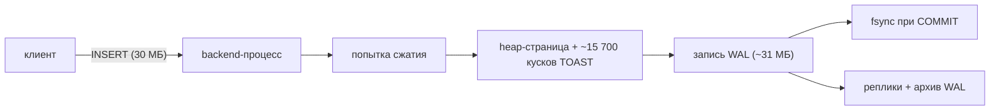
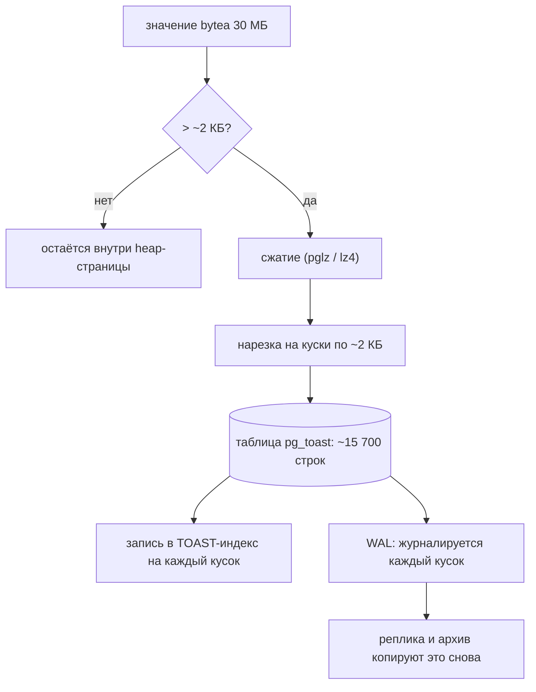
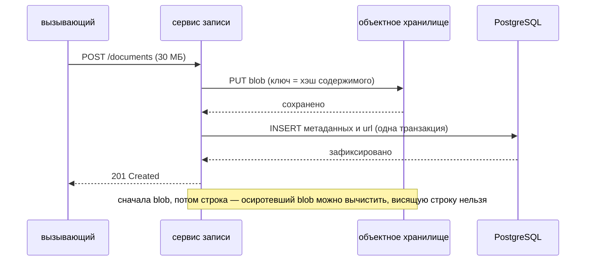

# Улучшение производительности записи в PostgreSQL

Вопрос выдаёт три факта, и каждый из них ограничивает свою часть ответа:

1. сервис **только пишет** — значит, тюнинг чтения, реплики и кэши как решение
   отпадают;
2. записи по **~30 МБ** — значит, единицей работы является полезная нагрузка, а
   не statement;
3. **много сервисов вызывают его API** — значит, важны пропускная способность и
   очереди, а не только задержка одной записи.

Прежде всего уточните, что такое эти 30 МБ. «Большие данные» могут означать одну
запись в 30 МБ, запрос, несущий 30 МБ, или таблицу, выросшую до 30 МБ целиком.
Проблемой производительности записи являются только первые два случая; таблица в
30 МБ помещается в память, и с ней всё в порядке. Дальше предполагается то, что
подразумевает вопрос: **каждая запись несёт около 30 МБ полезной нагрузки.**

## Оцените стоимость одной записи до всякого тюнинга

Примеры в этой теме выполняют **модель стоимости** — фиксированные удельные
цены, никакого настоящего сервера, — чтобы стала видна форма суммы. Эта форма и
есть весь ответ. Один построчный `INSERT` записи в 30 МБ раскладывается так:

| часть | что это | стоимость |
| --- | --- | --- |
| сеть | один round trip клиент/сервер | 0,4 мс |
| разбор | разбор, планирование и выполнение одного statement | 0,06 мс |
| сжатие | попытка сжатия в TOAST | 27 мс |
| таблица | запись страниц heap и TOAST | 36 мс |
| toast | накладные расходы на ~15 700 строк-кусков | 47 мс |
| wal | запись тех же байтов ещё раз в WAL | 37 мс |
| индексы | 5 записей в индексы | 0,3 мс |
| коммит | ожидание, пока WAL дойдёт до диска | 1,5 мс |

Round trips, statements, индексы и коммит — всё, по чему бьёт привычный ответ, —
в сумме дают около **1%**. Запустите **Базовую запись** и посмотрите на полосу.
Оптимизация никогда не бывает больше того куска, которого она касается, поэтому
первая задача — выяснить, что это за кусок; та же дисциплина, что и при
[поиске причины медленного сайта](topic:slow-website-diagnosis).

## Что PostgreSQL делает со значением в 30 МБ

Строка должна поместиться в страницу 8 КБ, поэтому значение больше примерно 2 КБ
обрабатывает **TOAST** (The Oversized-Attribute Storage Technique):

1. **Сжать.** У `bytea` и `text` по умолчанию хранение `EXTENDED`, поэтому
   PostgreSQL пробует `pglz` (или `lz4`, если
   `default_toast_compression = lz4`). Сжимаемый JSON может уменьшиться в 4 раза.
   JPEG, PDF, zip или что-нибудь зашифрованное не уменьшится вовсе — а *попытка*
   всё равно стоит процессорного времени на каждой записи.
2. **Нарезать.** Оставшееся режется на куски чуть меньше 2 КБ и вставляется
   строками в скрытую TOAST-таблицу, каждая со своей записью в TOAST-индексе.
   Значение в 30 МБ превращается примерно в **15 700 строк-кусков**. Один
   `INSERT` — это не запись одной строки; это запись пятнадцати тысяч строк.
3. **Записать всё это в журнал.** Каждая из этих строк-кусков — запись в WAL.
   Строка пишется в таблицу, а затем пишется *ещё раз* в журнал упреждающей
   записи, поэтому 30 МБ нагрузки обходятся примерно в **61 МБ диска** — и это до
   того, как потоковая репликация и архивация WAL скопируют журнал ещё по разу.

Запустите **Куда уходят 30 МБ**. Стоит заметить две вещи: сжимаемые данные
сокращают всю запись примерно на 60%, а
`ALTER TABLE ... ALTER COLUMN payload SET STORAGE EXTERNAL` снимает 27 мс
бессмысленного сжатия на строку для уже сжатых данных.

## Привычные ответы, взвешенные

Каждый из них — настоящий приём. Различаются они тем, какого куска касаются.

- **Собрать вставки в батч.** JDBC `addBatch()`/`executeBatch()` в одной
  транзакции или опция драйвера `reWriteBatchedInserts=true`, переписывающая их в
  многострочные `INSERT`. Это убирает round trips на каждый statement и коммиты
  на каждую строку. На таблице с 30 МБ это 5,7 мс из 598 мс записи — **0,9%**. На
  маленькой строке — около 80%. Один и тот же приём, два разных вывода. (В
  Hibernate помните, что генерация id через `IDENTITY` молча отключает батчинг
  вставок; используйте sequence с allocation size — см.
  [Hibernate под капотом](topic:hibernate-under-the-hood).)
- **`COPY ... FROM STDIN`.** Передаёт строки потоком в одном statement, без
  разбора и планирования на каждую строку. Строго лучше батча `INSERT` для
  массовой загрузки и ничего не меняет в байтах под ним.
- **Меньше индексов.** Каждый индекс — это дополнительная запись на строку плюс
  собственный WAL. При 30 МБ на строку это 0,2% записи; при 512 Б на строку
  восемь индексов дают 21%. Запустите **Во что реально обходятся индексы**. На
  таблице только для записи индекс, которым не пользуется ни один запрос, —
  чистые расходы; см. [какие индексы добавлять](topic:indexes-for-query-optimization)
  и [индексы в базе данных](topic:database-indexes).
- **`synchronous_commit = off`.** Коммит перестаёт ждать сброса WAL на диск. При
  падении вы теряете *недавно зафиксированные транзакции* — окно в несколько сотен
  миллисекунд — и не теряете **больше ничего**: ни повреждений, ни рваных строк,
  ни одной из гарантий [ACID](topic:acid-principles), кроме D. Для телеметрии это
  настоящий вариант, для платежей — плохой. Учтите, что более редкие и крупные
  транзакции бьют по *той же* статье расходов и ничем не жертвуют, поэтому
  начинать стоит с них. (`fsync = off` — совсем другое дело: это риск
  невосстановимой базы. В продакшене — никогда.)
- **Таблицы `UNLOGGED`.** WAL нет вовсе — но таблица усекается после падения и не
  доезжает до реплик. Годится для промежуточной таблицы, которую можно
  пересобрать, и никогда для таблицы-источника истины.
- **Партиционирование.** Одну вставку оно быстрее не делает. Оно держит индексы
  каждой партиции маленькими, размазывает запись по файлам и превращает
  удержание данных в `DETACH`/`DROP` вместо `DELETE` плюс вакуум. Стоит того ради
  второй и третьей причин, но не как средство от пропускной способности.
- **Больший пул соединений.** См. ниже — часто это *наименее* действенный пункт
  в списке.

## Настоящее решение: байтов не должно быть в PostgreSQL

Реляционная база великолепна на маленьких структурированных строках,
транзакциях и запросах. Файловый сервер из неё посредственный: она делает
каждый байт долговечным дважды, реплицирует его, кладёт в бэкап, вакуумит и
пропускает через однопоточный backend-процесс. Тридцать мегабайт непрозрачной
нагрузки не получают из этого ничего и оплачивают всё.

Поэтому положите нагрузку туда, где байты дёшевы, — в S3, MinIO, файловую
систему, любое объектное хранилище, — а в PostgreSQL оставьте ту строку, в
которой он действительно хорош: id, владелец, тип, статус, URL, контрольная
сумма, размер и метки времени. Запустите **Вынести нагрузку наружу**: 149,6 мс
на запись превращаются в 2,3 мс при том же коде, тех же четырёх индексах и том
же цикле «одна вставка на запись». Ничего не тюнили. Просто байты перестали идти
через WAL.

Весь фокус именно в этом порядке, потому что у вас теперь **двойная запись**, и
ни одна транзакция не охватывает обе системы. Сначала запишите blob под
детерминированным ключом (хэш содержимого делает загрузку идемпотентной, поэтому
повтор перезаписывает сам себя), затем вставьте строку. Если вставка строки
упадёт, останется blob, на который никто не ссылается, — его удалит ночной
уборщик; обратный порядок оставит строку, указывающую в никуда, а это ошибка,
которую ваш API вернёт вызывающему. Если о новой записи нужно сообщить другим
сервисам, публикуйте это через [Outbox-паттерн](topic:outbox-pattern) в той же
транзакции, что и строку, и дедуплицируйте у потребителя
[Inbox-паттерном](topic:inbox-pattern).

Чем вы платите, честно: одна атомарная запись превращается в две системы,
которые надо эксплуатировать, бэкапить и согласованно восстанавливать; удаление
требует той же аккуратности в обратном порядке (сначала строка, потом blob, либо
надгробие); а «восстановить базу на состояние вторника» больше не восстанавливает
сами нагрузки.

## Если нагрузка действительно обязана остаться в базе

Иногда обязана — жёсткое требование, чтобы один бэкап содержал всё, или норма
регулятора о том, где лежат данные. Тогда рычаги такие:

- **`SET STORAGE EXTERNAL`** на колонке нагрузки для уже сжатых данных: держит их
  вне строки и пропускает попытку сжатия.
- **`lz4` вместо `pglz`** (`default_toast_compression`) для сжимаемых данных:
  заметно дешевле по процессору на мегабайт.
- **Сжимать в приложении** и хранить как `EXTERNAL`, чтобы кодек и уровень
  выбирали вы, а база перестала гадать.
- **Large objects** (`lo_*`, `pg_largeobject`), если нужно передавать значение
  потоком по частям, а не материализовать 30 МБ в памяти с обеих сторон.
- **Отдать WAL собственный быстрый том**, поднять `max_wal_size`, чтобы
  контрольные точки случались реже, и включить `wal_compression` — он сжимает
  full-page images, то есть копии целых страниц, которые порождает первая запись
  в страницу после контрольной точки.
- **Разделить строку**: метаданные в одной узкой таблице с индексами, нагрузка в
  отдельной таблице без индексов. Тогда часто читаемая и часто индексируемая
  часть перестаёт таскать нагрузку за собой.

## Два потолка, и только один из них — пул

Из-за фразы «много сервисов используют его API» люди хватаются за пул соединений.
Запустите **Много сервисов, один пул**: 300 вызывающих, 20 соединений, и
увеличение пула до 200 не меняет время разбора очереди **вообще** — 37,5 с в
обоих случаях. Потолков два, и они независимы:

- **соединения × стоимость записи** — сколько записей может быть в полёте;
- **пропускная способность диска ÷ байты на запись** — сколько их примет
  хранилище.

При ~61 МБ диска на запись том с 500 МБ/с упирается примерно в **8 записей в
секунду**. Пул никогда не был ограничением; добавление соединений просто
переносит очередь из пула на диск, и PostgreSQL от этого только хуже, потому что
каждое соединение — процесс операционной системы. Как только нагрузка вынесена и
строка занимает 1,5 КБ, потолок диска измеряется сотнями тысяч, а настоящим
пределом становится пул — *вот тогда* размер пула (и PgBouncer перед множеством
клиентов) является разумным рычагом. Это то же рассуждение, что и при
[масштабировании перегруженного сервера](topic:scaling-an-overloaded-server):
сначала найти насыщенный ресурс, а потом добавлять другой.

Форма API тоже важна. Если вызывающим не нужно, чтобы запись стала доступной для
запросов в тот же миг, когда пришёл ответ, — примите запрос, положите его в
очередь и сохраняйте в фоне: задержка вызывающего перестаёт быть задержкой
записи, а всплески поглощаются, а не отклоняются. Это настоящее изменение
контракта, а не бесплатный выигрыш — см.
[синхронное и асинхронное взаимодействие](topic:sync-vs-async-communication). И
что бы вы ни выбрали, повторные отправки не должны создавать дубликаты:
[идемпотентность](topic:http-idempotency) — это то, что делает повтор
безопасным.

## Как это делается в продакшене

- **Сначала измерить, на настоящей системе.** `pg_stat_statements` — куда уходит
  время по statement, `pg_stat_bgwriter` и `pg_stat_wal` — контрольные точки и
  объём WAL, и разделение размера между таблицей и её TOAST-таблицей
  (`pg_total_relation_size` против `pg_relation_size`). «WAL — это 60 МБ на
  запись» является числом, которое можно проверить за десять минут.
- **Переносить существующие строки в фоне.** Добавьте колонку с URL, пишите новые
  записи в объектное хранилище, затем небольшими партиями перенесите старые
  нагрузки, затем удалите колонку нагрузки. `DROP COLUMN` мгновенен и меняет
  только метаданные; место вернёт `VACUUM FULL` или `pg_repack`. Простоя нет, и
  каждый шаг обратим до последнего.
- **Измерить снова.** Изменение без числа «до» является верой. Следите за
  записями в секунду, p95 задержки записи, байтами WAL в секунду и временем
  ожидания в пуле — за теми метриками, которые рассказали бы всё это с самого
  начала, как в [метриках приложения](topic:application-metrics).

## Ответ на собеседовании за 60 секунд

> Сначала я бы уточнил, что такое эти 30 МБ — на запись, на запрос или вся
> таблица, — потому что проблемой записи является только большая *запись*.
> Считая, что каждая запись ~30 МБ, я бы измерил одну запись до всякого тюнинга,
> и расклад всегда один и тот же: round trips, statements, записи в индексы и
> коммит дают около процента, а всё остальное — полезная нагрузка. Значение
> такого размера попадает в TOAST: сжимается, режется примерно на 15 000
> строк-кусков по 2 КБ, пишется в таблицу и пишется ещё раз в WAL, поэтому 30 МБ
> нагрузки — это ~60 МБ диска, которые каждая реплика и архив копируют снова.
> Именно поэтому батчинг здесь даёт меньше процента: он убирает накладные
> расходы, которые никогда не были узким местом. Значит, решение — изменение
> дизайна, а не ручка: нагрузка уходит в объектное хранилище, а PostgreSQL
> держит маленькую строку с URL, контрольной суммой и метаданными. Это примерно
> два порядка на пути записи. Появляется двойная запись, поэтому я сначала пишу
> blob под ключом-хэшем содержимого, потом вставляю строку, а осиротевшие blob'ы
> вычищаю уборщиком; если другим сервисам нужно уведомление, оно идёт через
> outbox в той же транзакции. И только *после* этого стандартные рычаги стоят
> усилий: батчинг или `COPY`, удаление индексов, которыми не пользуется ни один
> запрос, более редкие и крупные транзакции и `synchronous_commit = off`, если
> данные терпят потерю последних нескольких сотен миллисекунд при падении. Со
> стороны API больше соединений — обычно неверный ответ: при 60 МБ на запись диск
> ограничивает вас единицами записей в секунду при любом размере пула. Если
> вызывающие это терпят, я бы ещё сделал приём в очередь, чтобы всплеск
> поглощался, а не стоял на соединении. А если нагрузка юридически не может
> покинуть базу, я бы держал её вне строки через `SET STORAGE EXTERNAL`,
> использовал `lz4` или сжимал в приложении и вынес WAL на отдельный быстрый том.

## Частые заблуждения

- **«Собери вставки в батч, и станет быстро».** Батчинг убирает накладные расходы
  на statement и на коммит. Когда эти расходы составляют 1% записи, столько же
  составит и выигрыш. Приём верный, цель — нет.
- **«30 МБ — это одна строка, значит, одна запись».** Это одна heap-строка плюс
  ~15 700 строк-кусков TOAST плюс их записи в индексе плюс запись в WAL на
  каждую из них.
- **«WAL — это всего лишь журнал, он маленький».** В WAL лежат данные. Вставка на
  30 МБ пишет ~30 МБ WAL, которые реплики и архив копируют снова.
- **«`bytea` сжимается, так что всё нормально».** Сжимаются только сжимаемые
  данные. На JPEG или зашифрованном blob'е попытка сжатия — чистый процессор
  впустую, оплачиваемый на каждой записи.
- **«Добавьте соединений — пул полон».** Полный пул является симптомом. Если
  потолком является диск, новые соединения переносят очередь и ухудшают
  планирование процессов в PostgreSQL. Сначала найдите насыщенный ресурс.
- **«Удалите индексы, они замедляют запись».** Только относительно того, что
  запись делает помимо них. Измерьте их долю, прежде чем платить за это
  производительностью запросов.
- **«`synchronous_commit = off` рискует повредить базу».** Он рискует потерей
  недавно зафиксированных транзакций при падении, и только. Повреждением рискует
  `fsync = off`.
- **«Хранить файлы в базе всегда неправильно».** Это правильно, когда нагрузки
  маленькие, когда единый согласованный бэкап является жёстким требованием или
  когда эксплуатация второго хранилища обходится дороже, чем путь записи. При
  30 МБ на запись и проблеме с пропускной способностью это не тот случай.
- **«Партиционирование ускорит запись».** Оно держит индексы меньше и удешевляет
  удержание данных. Одна вставка быстрее не станет.
- **«Просто отмасштабируем базу вертикально».** Более быстрый диск поднимает
  потолок пропускной способности линейно и стоит денег постоянно; снятие 60 МБ с
  каждой записи поднимает его в сорок тысяч раз и стоит одной миграции.
