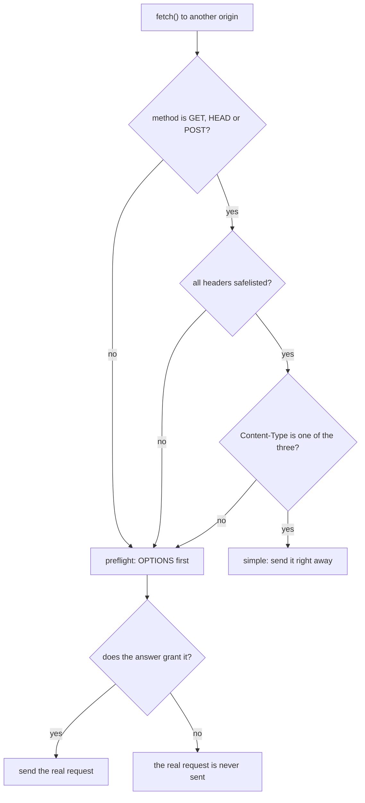
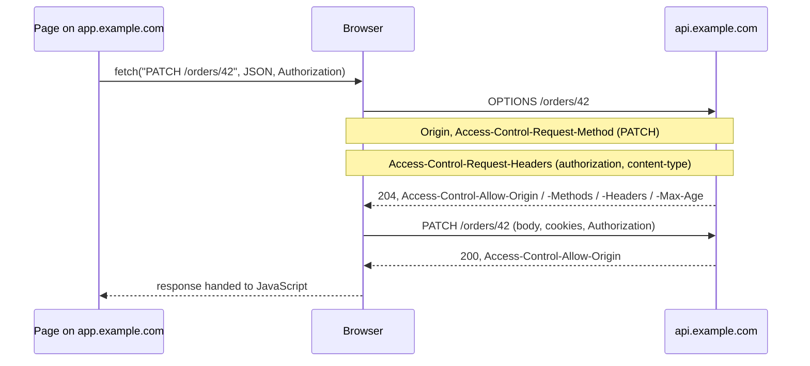

# What are preflight requests

**A preflight is an extra `OPTIONS` request the browser sends, on its own
initiative, before a cross-origin request it is not already allowed to make.**
It asks one question — *may I send this?* — and refuses to send anything until
the server answers.

It exists because [CORS](topic:cors) had to be added to a web that was already
running. Browsers could not start allowing arbitrary cross-origin requests, and
they could not start blocking the ones that already worked. So the rule became:
if the request is something an ordinary HTML `<form>` could already have
submitted, send it as before; if it is something new, ask first.

## The exact rule

A request is **simple** — no preflight — when *all* of these hold:

- the method is `GET`, `HEAD` or `POST`;
- every header the code sets is on the CORS safelist: `Accept`,
  `Accept-Language`, `Content-Language`, `Content-Type` (and a couple more);
- if `Content-Type` is set, its value is one of
  `application/x-www-form-urlencoded`, `multipart/form-data`, `text/plain`.

Break any one of those and the request is **preflighted**. That gives exactly
three triggers:

| Trigger | Example |
|---|---|
| the method | `DELETE /orders/42`, and [PUT or PATCH](topic:put-vs-patch) |
| a header name | `Authorization`, `X-Request-Id`, `X-Tenant` |
| the `Content-Type` value | `application/json` |

Two consequences people miss. First, a **read** can be preflighted: a plain
`GET` with a tracing header costs two round trips. Second, `Content-Type` is
safelisted *conditionally* — it is the value, not the header, that decides. That
is the whole reason a JSON API preflights and an HTML form does not, and it is
why analytics beacons deliberately send `text/plain`.

## What the exchange actually contains

The browser builds the `OPTIONS` request itself. Your code cannot see it,
change it or intercept it.

On the way out:

- `Origin` — who is asking;
- `Access-Control-Request-Method` — the method the real request will use;
- `Access-Control-Request-Headers` — the **names** of the non-safelisted headers
  it will set, lowercased and sorted. Names only: the server never sees the
  token, only the word `authorization`.

And, importantly, what is **not** there: no request body, no cookies, no
`Authorization` header. A preflight is anonymous by design.

On the way back the browser requires:

- a **2xx** status (`204` is the convention). A `301`, `401` or `500` is a
  failure — and a redirect on a preflight is not followed;
- `Access-Control-Allow-Origin` matching the page (the preflight has to pass the
  origin check too);
- `Access-Control-Allow-Methods` containing the method — except `GET`, `HEAD`
  and `POST`, which are always accepted;
- `Access-Control-Allow-Headers` containing every requested header.

The response body is ignored entirely.

## A denied preflight means nothing ran

This is the sentence that separates a memorised answer from an understood one.

- **Simple request, blocked**: it was sent, the handler ran, the row was
  written — and only then did the browser refuse to hand the response to
  JavaScript.
- **Preflighted request, denied**: the real request never left the browser. No
  handler ran, nothing changed, and the access log contains only the `OPTIONS`
  line.

So "did it happen?" has a definite answer, and the server log tells you which
case you are in.

## The preflight cache

`Access-Control-Max-Age` is what stops every JSON call from costing two round
trips. The browser remembers the answer, keyed by **origin + URL + method +
header set + credentials mode**.

That key is the practical catch: `POST /orders` and `PUT /orders/42` are
separate entries, and so are `/orders` and `/invoices`. A REST API with a path
per resource gets far fewer cache hits than the header suggests.

Browsers also cap what they will keep, regardless of what you send — roughly two
hours in Chromium, twenty-four in Firefox — and clear the cache on network
changes. The flip side: after you fix a CORS configuration, a browser may keep
using the *old* permission until it expires, which is why the fix can look like
it did not take.

## The 401 that is not a CORS problem

The single most common production failure in this topic is not a CORS
misconfiguration at all.

A security filter that authenticates every request will answer the preflight
with `401` — and the preflight carries no cookies and no `Authorization`
header, so it can never satisfy it. The browser reports a generic CORS error,
and the team spends the afternoon editing a CORS configuration that was correct
all along.

The fix is ordering, not policy: CORS handling must run **before**
authentication, and `OPTIONS` preflights must be permitted through the filter
chain. In Spring Security that is `http.cors(...)` with a registered
`CorsConfigurationSource`, which installs the `CorsFilter` ahead of the
authentication filters. Anything that sits in front of the app — a gateway, an
ingress, a WAF — has to do the same; see
[why an API gateway is needed](topic:api-gateway) and
[designing a security scheme for your endpoints](topic:endpoint-security-design).

## Where the wildcard stops

`Access-Control-Allow-Headers: *` looks like "everything is allowed". It has two
holes, both written into the specification:

- it **never** covers `Authorization`. That header must always be listed by
  name;
- for a request with `credentials: 'include'`, `*` stops being a wildcard
  anywhere — in `Allow-Origin`, `Allow-Methods` and `Allow-Headers` it is
  compared literally, so it only matches something actually called `*`.

Both produce a denial on a configuration that reads as maximally permissive,
which is why they cost so much debugging time.

## The 60-second interview answer

> A preflight is an `OPTIONS` request the browser sends before a cross-origin
> call that is not "simple". Simple means `GET`, `HEAD` or `POST` with only
> safelisted headers and a `Content-Type` of urlencoded, multipart or
> text/plain — that is, anything an HTML form could already have sent. So a JSON
> body, an `Authorization` or custom header, or `PUT`/`PATCH`/`DELETE`
> preflights. The browser sends `Origin`, `Access-Control-Request-Method` and
> `Access-Control-Request-Headers` — header names only, no body, no cookies —
> and needs a 2xx answer with `Access-Control-Allow-Origin`, `-Allow-Methods`
> and `-Allow-Headers` covering them. If it does not get one, the real request
> is never sent, which is the opposite of a blocked simple request that the
> server has already executed. `Access-Control-Max-Age` lets one answer serve
> repeated calls, keyed by URL, method, headers and credentials mode. And the
> classic bug is a security filter answering `OPTIONS` with 401: preflights are
> unauthenticated by design, so CORS must be handled before authentication.

## Why it matters in production

- **Latency.** A preflight doubles the round trips of a call, and on a
  high-latency connection that is felt directly. It is worst on the first
  interaction after a page load, when nothing is cached yet.
- **Design decisions follow from it.** Fewer distinct paths, methods and custom
  headers means fewer cache entries. Moving a value from a custom header into
  the body or the URL can remove a preflight entirely.
- **Making them disappear.** If the API is served from the same origin — a
  dev-server proxy in development, a gateway path such as `/api/*` in
  production — there is no cross-origin call and therefore no preflight. That is
  usually better than loosening a policy; see
  [how the frontend and the backend talk](topic:frontend-backend-interaction).
- **Caches and CDNs.** A cached preflight response served to a different origin
  is wrong, so `Vary: Origin` matters as soon as anything caches on the path.
- **Consistency across services.** Different services answering `OPTIONS`
  differently for the same frontend is a long debugging session; configure it
  once at the edge, as with anything
  [shared across an organization](topic:sharing-api-endpoints).

## Common misconceptions

- **"A preflight is a security check."** It is a permission negotiation for the
  *browser's* benefit. Nothing outside a browser sends one — `curl`, Postman and
  server-to-server calls go straight to the endpoint.
- **"The server sends the preflight."** The browser does, by itself, and the
  page's JavaScript can neither see it nor prevent it.
- **"Only writes are preflighted."** A `GET` with one custom header is
  preflighted; a `POST` from a form is not.
- **"It failed, but the data was probably saved."** For a *denied preflight*,
  no. The real request never left the browser.
- **"`Access-Control-Allow-Headers: *` allows everything."** Not
  `Authorization`, and not anything at all once cookies are involved.
- **"The preflight needs the auth token."** It must not have one. Requiring
  authentication on `OPTIONS` is what breaks the whole API in the browser.
- **"`Access-Control-Max-Age: 86400` means one preflight a day."** Browsers cap
  it, and the entry is per URL, method and header set.
- **"The preflight validates the request."** It checks the method and the header
  *names* only. It knows nothing about the body, the path parameters or whether
  the caller is authorized — that is still entirely your endpoint's job.
