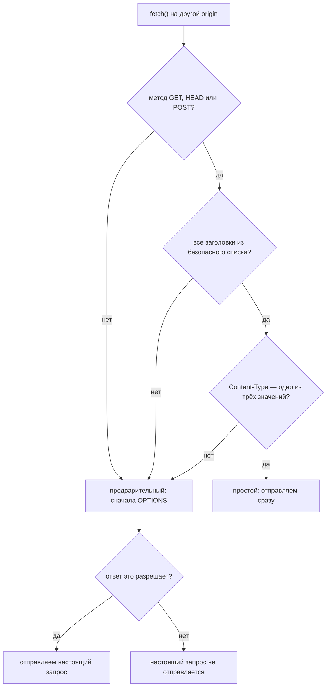
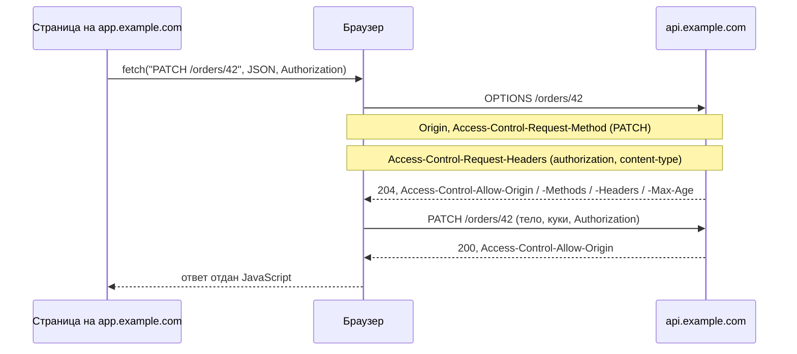

# Что такое предварительные запросы (preflight)

**Предварительный запрос (preflight) — это дополнительный запрос `OPTIONS`,
который браузер отправляет по собственной инициативе перед кросс-доменным
запросом, на который у него ещё нет разрешения.** Он задаёт один вопрос — *можно
ли это отправить?* — и до ответа сервера не отправляет ничего.

Он существует потому, что [CORS](topic:cors) пришлось добавлять в уже работающий
веб. Браузеры не могли начать разрешать произвольные кросс-доменные запросы и не
могли начать блокировать те, что уже работали. Поэтому правило стало таким: если
запрос — это то, что могла бы отправить обычная HTML-форма `<form>`, отправляем
как раньше; если это что-то новое, сначала спрашиваем.

## Точное правило

Запрос **простой** — без предварительного, — когда выполнено *всё* следующее:

- метод — `GET`, `HEAD` или `POST`;
- каждый заголовок, который ставит код, есть в безопасном списке CORS: `Accept`,
  `Accept-Language`, `Content-Language`, `Content-Type` (и ещё пара);
- если `Content-Type` задан, его значение — одно из
  `application/x-www-form-urlencoded`, `multipart/form-data`, `text/plain`.

Нарушьте любой из пунктов — и запрос пойдёт **с предварительной проверкой**. Это
даёт ровно три причины:

| Причина | Пример |
|---|---|
| метод | `DELETE /orders/42`, а также [PUT или PATCH](topic:put-vs-patch) |
| имя заголовка | `Authorization`, `X-Request-Id`, `X-Tenant` |
| значение `Content-Type` | `application/json` |

Два следствия, которые упускают. Во-первых, предварительный запрос бывает и у
**чтения**: обычный `GET` с заголовком трассировки стоит двух обращений по сети.
Во-вторых, `Content-Type` находится в безопасном списке *условно* — решает
значение, а не сам заголовок. Именно поэтому JSON-API идёт с предварительным
запросом, а HTML-форма — нет, и именно поэтому аналитические «маячки» намеренно
отправляют `text/plain`.

## Что на самом деле содержит обмен

Запрос `OPTIONS` браузер строит сам. Ваш код не может его увидеть, изменить или
перехватить.

В сторону сервера:

- `Origin` — кто спрашивает;
- `Access-Control-Request-Method` — метод, которым пойдёт настоящий запрос;
- `Access-Control-Request-Headers` — **имена** несписочных заголовков, которые он
  выставит, в нижнем регистре и отсортированные. Только имена: сервер никогда не
  видит сам токен, он видит слово `authorization`.

И, что важно, чего там **нет**: ни тела запроса, ни кук, ни заголовка
`Authorization`. Предварительный запрос анонимен по своей природе.

В обратную сторону браузер требует:

- статус **2xx** (по договорённости — `204`). `301`, `401` или `500` — это
  провал, а редирект на предварительный запрос не выполняется;
- `Access-Control-Allow-Origin`, подходящий этой странице (предварительный запрос
  тоже обязан пройти проверку origin);
- `Access-Control-Allow-Methods` с нужным методом — кроме `GET`, `HEAD` и `POST`,
  которые принимаются всегда;
- `Access-Control-Allow-Headers` со всеми запрошенными заголовками.

Тело ответа игнорируется полностью.

## Отказ означает, что ничего не выполнилось

Это та фраза, которая отличает заученный ответ от понятого.

- **Простой запрос, заблокирован**: он был отправлен, обработчик отработал,
  строка записана — и только после этого браузер отказался отдать ответ
  JavaScript.
- **Запрос с предварительной проверкой, отказ**: настоящий запрос вообще не
  покинул браузер. Ни один обработчик не выполнился, ничего не изменилось, а в
  логе доступа есть только строка про `OPTIONS`.

То есть у вопроса «произошло ли это?» есть определённый ответ, и лог сервера
показывает, в каком вы случае.

## Кеш предварительных запросов

`Access-Control-Max-Age` — то, что не даёт каждому вызову с JSON стоить двух
обращений по сети. Браузер запоминает ответ; ключ — **origin + URL + метод +
набор заголовков + режим кук**.

Именно ключ и есть практическая ловушка: `POST /orders` и `PUT /orders/42` — это
разные записи, как и `/orders` с `/invoices`. У REST API, где на каждый ресурс
свой путь, попаданий в кеш будет заметно меньше, чем кажется по заголовку.

Ещё браузеры ограничивают срок хранения независимо от того, что вы прислали, —
примерно два часа в Chromium, сутки в Firefox — и сбрасывают кеш при смене сети.
Обратная сторона: после того как вы исправили настройки CORS, браузер может
продолжать пользоваться *старым* разрешением, пока оно не истечёт, — из-за чего
исправление кажется не подействовавшим.

## Ошибка 401, которая не про CORS

Самая частая продакшен-поломка в этой теме — вообще не ошибка в настройках CORS.

Фильтр безопасности, аутентифицирующий каждый запрос, ответит на предварительный
кодом `401` — а тот не несёт ни кук, ни заголовка `Authorization`, поэтому
удовлетворить фильтр не может никогда. Браузер показывает общую ошибку CORS, и
команда полдня правит конфигурацию CORS, которая всё это время была верной.

Лечится порядком, а не политикой: обработка CORS должна идти **до**
аутентификации, а предварительные запросы `OPTIONS` — проходить через цепочку
фильтров. В Spring Security это `http.cors(...)` с зарегистрированным
`CorsConfigurationSource`, который ставит `CorsFilter` перед фильтрами
аутентификации. Всё, что стоит перед приложением — шлюз, ingress, WAF, — должно
делать то же самое; см. [зачем нужен API-шлюз](topic:api-gateway) и
[проектирование схемы безопасности для эндпоинтов](topic:endpoint-security-design).

## Где заканчивается звёздочка

`Access-Control-Allow-Headers: *` выглядит как «разрешено всё». У него две дыры,
и обе прямо записаны в спецификации:

- он **никогда** не покрывает `Authorization`. Этот заголовок всегда нужно
  указывать по имени;
- для запроса с `credentials: 'include'` `*` вообще перестаёт быть подстановочным
  знаком — и в `Allow-Origin`, и в `Allow-Methods`, и в `Allow-Headers` он
  сравнивается буквально, то есть совпадёт только с чем-то, что действительно
  называется `*`.

И то, и другое даёт отказ при настройках, которые читаются как максимально
разрешающие, — потому на них и уходит столько времени отладки.

## Ответ на собеседовании за 60 секунд

> Предварительный запрос — это запрос `OPTIONS`, который браузер отправляет перед
> кросс-доменным вызовом, не являющимся «простым». Простой — это `GET`, `HEAD`
> или `POST` только с заголовками из безопасного списка и с `Content-Type`
> urlencoded, multipart или text/plain, то есть всё, что могла бы отправить и
> HTML-форма. Значит, тело в JSON, заголовок `Authorization` или свой заголовок,
> а также `PUT`/`PATCH`/`DELETE` идут с предварительным запросом. Браузер шлёт
> `Origin`, `Access-Control-Request-Method` и `Access-Control-Request-Headers` —
> только имена заголовков, без тела и без кук — и ему нужен ответ 2xx с
> `Access-Control-Allow-Origin`, `-Allow-Methods` и `-Allow-Headers`,
> покрывающими их. Если такого ответа нет, настоящий запрос не отправляется
> вовсе, и это противоположность заблокированному простому запросу, который
> сервер уже выполнил. `Access-Control-Max-Age` позволяет одному ответу
> обслуживать повторные вызовы; ключ — URL, метод, заголовки и режим кук. А
> классический баг — фильтр безопасности, отвечающий на `OPTIONS` кодом 401:
> предварительные запросы неаутентифицированы по своей природе, поэтому CORS надо
> обрабатывать до аутентификации.

## Почему это важно в продакшене

- **Задержки.** Предварительный запрос удваивает число обращений по сети для
  вызова, и на медленном соединении это ощущается напрямую. Хуже всего первое
  взаимодействие после загрузки страницы, когда ещё ничего не закешировано.
- **Из этого следуют решения по дизайну.** Меньше разных путей, методов и своих
  заголовков — меньше записей в кеше. Перенос значения из своего заголовка в тело
  или в URL может убрать предварительный запрос совсем.
- **Как убрать их вовсе.** Если API отдаётся с того же origin — прокси
  dev-сервера при разработке, путь на шлюзе вроде `/api/*` в продакшене, — то нет
  кросс-доменного вызова, а значит, нет и предварительного запроса. Обычно это
  лучше, чем ослаблять политику; см.
  [как общаются фронтенд и бэкенд](topic:frontend-backend-interaction).
- **Кеши и CDN.** Закешированный ответ на предварительный запрос, отданный
  другому origin, неверен, поэтому `Vary: Origin` важен, как только на пути
  появляется что-либо кеширующее.
- **Единообразие между сервисами.** Разные сервисы, по-разному отвечающие на
  `OPTIONS` одному и тому же фронтенду, — это долгая отладка; настраивайте это
  один раз на краю системы, как и всё
  [общее для организации](topic:sharing-api-endpoints).

## Частые заблуждения

- **«Предварительный запрос — это проверка безопасности».** Это согласование
  разрешения ради *браузера*. Ничто вне браузера его не отправляет: `curl`,
  Postman и вызовы между серверами идут сразу на эндпоинт.
- **«Предварительный запрос отправляет сервер».** Его отправляет браузер, сам, и
  JavaScript страницы не может ни увидеть его, ни предотвратить.
- **«Предварительные запросы бывают только у записи».** У `GET` с одним своим
  заголовком — бывает; у `POST` из формы — нет.
- **«Не сработало, но данные, наверное, сохранились».** При *отказе на
  предварительном запросе* — нет. Настоящий запрос не покидал браузер.
- **«`Access-Control-Allow-Headers: *` разрешает всё».** Не `Authorization`, и
  вообще ничего, как только появляются куки.
- **«Предварительному запросу нужен токен».** Его там быть не должно. Требование
  аутентификации на `OPTIONS` и ломает весь API в браузере.
- **«`Access-Control-Max-Age: 86400` — это один предварительный запрос в
  сутки».** Браузеры ограничивают этот срок, а запись действует для конкретного
  URL, метода и набора заголовков.
- **«Предварительный запрос проверяет сам запрос».** Он проверяет только метод и
  *имена* заголовков. Он ничего не знает ни про тело, ни про параметры пути, ни
  про то, есть ли у вызывающего права, — это по-прежнему целиком задача вашего
  эндпоинта.
