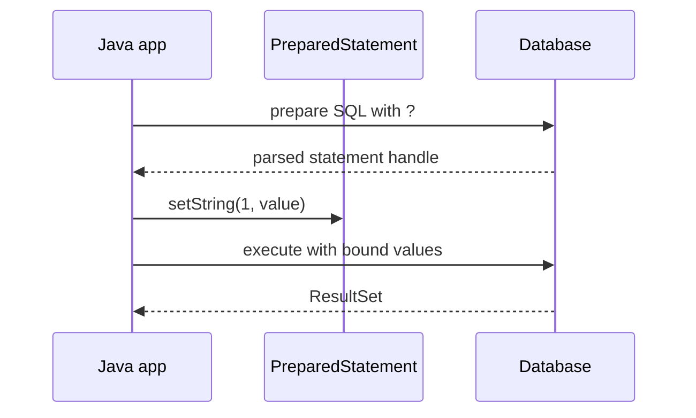
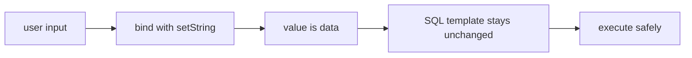

# Prepared Statements in JDBC

## Intuition

A `PreparedStatement` is a SQL template that you send to the database with placeholders like `?`, then bind values separately with methods such as `setLong`, `setString`, and `setTimestamp`. It is like filling a post-office form: the form structure is fixed, and the clerk treats the written fields as data, not as new instructions.

With plain `Statement`, developers often build SQL by concatenating strings. That makes user input part of the command text itself. It is like letting a customer write directly on the kitchen order board, including extra instructions for the cooks, instead of writing into a controlled order field.

```java
String sql = "SELECT id, email FROM users WHERE email = ?";

try (PreparedStatement ps = connection.prepareStatement(sql)) {
    ps.setString(1, emailFromRequest);

    try (ResultSet rs = ps.executeQuery()) {
        while (rs.next()) {
            long id = rs.getLong("id");
            String email = rs.getString("email");
            // map the row
        }
    }
}
```

## How it works



First, the SQL template is prepared. The database or driver can parse the command shape before values arrive. It is like a restaurant preparing the recipe card before choosing today's vegetables.

Second, values are bound by position. `?` placeholders replace literal values, not SQL identifiers or keywords. You can bind `WHERE email = ?`, but not `ORDER BY ?` for a column name. That is like a postal form where you may write the destination address, but you may not redesign the form layout.

Third, the database executes the statement with typed values. `setInt`, `setBigDecimal`, `setTimestamp`, and similar methods preserve intent better than converting everything to a string. It is like handing labeled containers to a kitchen: salt is salt, not a note that happens to spell "salt".

## Why it is safer



SQL injection happens when attacker-controlled text changes the SQL command. `PreparedStatement` blocks the classic form of this bug because the input is transmitted as a value, not spliced into the SQL syntax. It is like a bank teller accepting a deposit amount in a locked field rather than letting the customer edit the teller's procedure manual.

This does not make every dynamic SQL problem disappear. If you concatenate table names, column names, sort directions, or whole `WHERE` fragments, you are again building command text. For those cases, use a whitelist of allowed identifiers or separate query variants. It is like choosing from printed menu items, not accepting a handwritten recipe from a stranger.

## Performance and reuse

A prepared statement can reduce repeated parse and planning work, especially when the same SQL shape is executed many times with different values. Some databases and drivers cache prepared statements, and connection pools may have settings that influence reuse. It is like a post office keeping a common form ready instead of printing a new layout for every parcel.

Do not promise that every single `PreparedStatement` is faster. The exact behavior depends on the JDBC driver, database, server-side prepare threshold, statement cache, and query shape. The safe interview answer is: prepared statements are mainly for correctness and safety; performance reuse is a common benefit, not a universal guarantee. If the query is slow, you still need proper [database indexes](topic:database-indexes), good SQL, and measurement.

## Transactions and resources

`PreparedStatement` does not commit or roll back by itself. It runs inside the current connection's transaction behavior: auto-commit on by default, or an explicit transaction if you disabled auto-commit. It is like a cashier scanning items; the receipt is finalized by the checkout transaction, not by each scan. For transaction guarantees, relate this to [ACID principles](topic:acid-principles).

Always close `PreparedStatement` and `ResultSet`, usually with try-with-resources. In pooled applications, closing JDBC objects returns driver resources and avoids leaks. It is like returning a borrowed clipboard to the service desk so the next clerk can use it.

## 60-second interview answer

`PreparedStatement` is JDBC's way to execute parameterized SQL. I write SQL with `?` placeholders, create the statement with `connection.prepareStatement(sql)`, bind values with typed setters like `setString` or `setLong`, and then call `executeQuery` or `executeUpdate`.

The main difference from `Statement` is that user values are not concatenated into SQL text. They are sent as parameters, so input like `' OR 1=1 --` is treated as a string value, not as SQL syntax. This is the standard defense against SQL injection for values. It can also improve repeated execution because the database or driver may reuse parsed or planned work, but that depends on the database and driver.

Placeholders are for values, not table names, column names, SQL keywords, or sort directions. For dynamic identifiers, I would use a whitelist or separate predefined SQL strings. I would also manage transactions on the `Connection` and close `PreparedStatement` and `ResultSet` with try-with-resources.

## Common misconceptions

- "PreparedStatement means no SQL injection anywhere." Not if you still concatenate unsafe SQL fragments. It is like locking the cash drawer but leaving the office back door open.
- "`?` can replace any part of SQL." It replaces values, not syntax. It is like filling a form field, not changing the form template.
- "PreparedStatement always makes queries faster." It often helps repeated queries, but indexes, query shape, driver caching, and database planning still matter. It is like having a preprinted order form: useful, but it will not fix a slow kitchen.
- "Escaping strings manually is just as good." Manual escaping is fragile and database-specific. Binding parameters is the normal JDBC tool. It is like using a barcode scanner instead of handwriting every product code.
- "PreparedStatement manages transactions." It does not. The `Connection` transaction settings decide commit and rollback. It is like placing items on a counter; checkout rules decide when the purchase is final.
