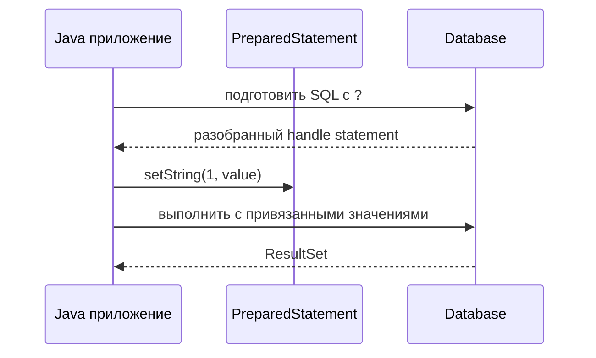

# Prepared Statements в JDBC

## Интуиция

`PreparedStatement` - это SQL-шаблон, который вы отправляете в базу с заполнителями `?`, а затем отдельно привязываете значения методами вроде `setLong`, `setString` и `setTimestamp`. Это похоже на заполнение бланка на почте: структура бланка фиксирована, а сотрудник воспринимает вписанные поля как данные, а не как новые инструкции.

С обычным `Statement` разработчики часто собирают SQL конкатенацией строк. Тогда пользовательский ввод становится частью текста команды. Это похоже на ситуацию, где посетителю разрешили писать прямо на кухонной доске заказов, включая дополнительные указания поварам, вместо контролируемого поля в заказе.

```java
String sql = "SELECT id, email FROM users WHERE email = ?";

try (PreparedStatement ps = connection.prepareStatement(sql)) {
    ps.setString(1, emailFromRequest);

    try (ResultSet rs = ps.executeQuery()) {
        while (rs.next()) {
            long id = rs.getLong("id");
            String email = rs.getString("email");
            // map the row
        }
    }
}
```

## Как это работает



Сначала подготавливается SQL-шаблон. База данных или driver может разобрать форму команды до того, как придут значения. Это похоже на ресторан, где карточку рецепта готовят заранее, а сегодняшние овощи выбирают позже.

Затем значения привязываются по позиции. Заполнители `?` заменяют literal values, а не SQL identifiers или keywords. Можно привязать `WHERE email = ?`, но нельзя использовать `ORDER BY ?` как имя колонки. Это похоже на почтовый бланк: вы можете вписать адрес назначения, но не можете переделать структуру бланка.

После этого база выполняет statement с типизированными значениями. `setInt`, `setBigDecimal`, `setTimestamp` и похожие методы лучше сохраняют смысл, чем превращение всего в строку. Это похоже на кухню, куда передают подписанные контейнеры: соль остается солью, а не запиской со словом "соль".

## Почему это безопаснее


SQL injection возникает, когда текст под контролем атакующего меняет SQL-команду. `PreparedStatement` блокирует классический вариант этой ошибки, потому что ввод передается как значение, а не вставляется в SQL-синтаксис. Это похоже на банк, где сумма вклада принимается в защищенное поле, а клиенту не дают редактировать инструкцию кассира.

Но это не удаляет все проблемы dynamic SQL. Если вы конкатенируете имена таблиц, имена колонок, направления сортировки или целые фрагменты `WHERE`, вы снова строите текст команды. Для таких случаев используйте whitelist разрешенных identifiers или отдельные варианты запросов. Это похоже на выбор из напечатанных пунктов меню, а не на принятие рукописного рецепта от незнакомца.

## Производительность и переиспользование

Prepared statement может уменьшить повторную работу по parse и planning, особенно когда одна и та же форма SQL много раз выполняется с разными значениями. Некоторые базы и drivers кешируют prepared statements, а connection pools могут иметь настройки, влияющие на reuse. Это похоже на почту, где общий бланк держат готовым, а не печатают новую форму для каждой посылки.

Не обещайте, что каждый `PreparedStatement` всегда быстрее. Точное поведение зависит от JDBC driver, database, server-side prepare threshold, statement cache и формы запроса. Безопасный ответ на интервью: prepared statements нужны в первую очередь для correctness и safety; performance reuse - частый плюс, но не универсальная гарантия. Если запрос медленный, все еще нужны правильные [database indexes](topic:database-indexes), хороший SQL и измерения.

## Transactions и ресурсы

`PreparedStatement` сам не делает commit или rollback. Он выполняется в рамках текущего поведения transaction у connection: auto-commit обычно включен по умолчанию, либо используется явная transaction, если вы отключили auto-commit. Это похоже на кассира, который сканирует товары; чек финализируется transaction на кассе, а не каждым сканированием. Гарантии transactions стоит связывать с [ACID principles](topic:acid-principles).

Всегда закрывайте `PreparedStatement` и `ResultSet`, обычно через try-with-resources. В приложениях с pool закрытие JDBC objects возвращает ресурсы driver и помогает избежать leaks. Это похоже на возврат заемного планшета на стойку, чтобы им мог пользоваться следующий сотрудник.

## Ответ за 60 секунд

`PreparedStatement` - это способ JDBC выполнять parameterized SQL. Я пишу SQL с заполнителями `?`, создаю statement через `connection.prepareStatement(sql)`, привязываю значения типизированными setters вроде `setString` или `setLong`, а затем вызываю `executeQuery` или `executeUpdate`.

Главное отличие от `Statement` в том, что пользовательские значения не конкатенируются в SQL text. Они отправляются как parameters, поэтому ввод вроде `' OR 1=1 --` воспринимается как строковое значение, а не как SQL syntax. Это стандартная защита от SQL injection для values. Также это может ускорить повторное выполнение, потому что база или driver могут переиспользовать разобранную или спланированную работу, но это зависит от базы и driver.

Заполнители предназначены для values, а не для имен таблиц, имен колонок, SQL keywords или направлений сортировки. Для dynamic identifiers я бы использовал whitelist или отдельные заранее заданные SQL strings. Также я бы управлял transactions на `Connection` и закрывал `PreparedStatement` и `ResultSet` через try-with-resources.

## Частые заблуждения

- "PreparedStatement означает, что SQL injection невозможен нигде." Нет, если вы все еще конкатенируете небезопасные SQL fragments. Это похоже на закрытый денежный ящик при открытой задней двери офиса.
- "`?` может заменить любую часть SQL." Он заменяет values, а не syntax. Это похоже на заполнение поля формы, а не изменение шаблона формы.
- "PreparedStatement всегда ускоряет запросы." Он часто помогает повторяющимся запросам, но indexes, форма запроса, driver caching и planning в базе все еще важны. Это похоже на заранее напечатанный бланк заказа: полезно, но медленную кухню он не исправит.
- "Ручное escaping строк ничем не хуже." Ручное escaping хрупкое и зависит от базы. Parameter binding - нормальный инструмент JDBC. Это похоже на сканер штрихкодов вместо ручной записи каждого product code.
- "PreparedStatement управляет transactions." Нет. Настройки transaction у `Connection` решают commit и rollback. Это похоже на выкладывание товаров на стойку; правила кассы решают, когда покупка стала окончательной.
