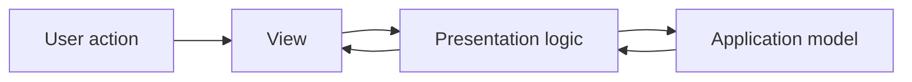
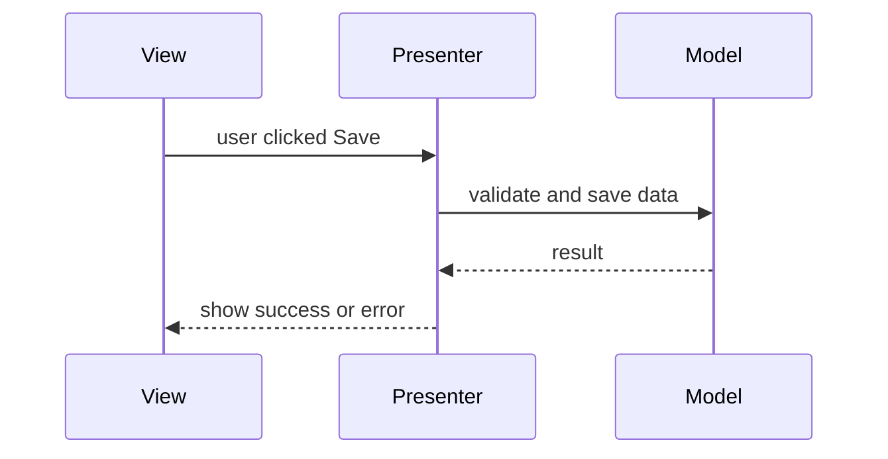
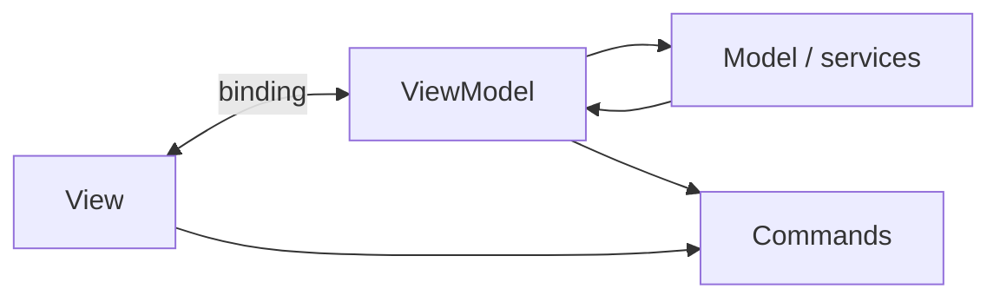

# Presentation Patterns Beyond MVC

MVC is the most famous presentation-layer pattern, but it is not the only way to
organize UI code. The presentation layer usually has three jobs: render data,
handle user actions, and coordinate what the user sees with application state.
The patterns differ in where that coordination lives and how much the view is
allowed to know. Think of a busy post office: customers see the counter, but
sorting, routing, and rules can be handled by different clerks behind it.

## MVP

**Model-View-Presenter (MVP)** moves presentation logic into a Presenter. The View
is usually an interface: it exposes methods such as `showOrders(...)`,
`showError(...)`, or `setLoading(...)`, and forwards user events to the Presenter.
The Presenter asks the Model or services for data, decides what should be shown,
and commands the View. In the post office analogy, the customer-facing clerk does
not decide routing rules; a supervisor tells the clerk what stamp, form, or
message to show.

MVP is useful when you want presentation logic to be tested without a real UI
framework. You can mock the View interface and assert that the Presenter calls the
right methods. The cost is more explicit wiring and more boilerplate interfaces.

## Passive View and Supervising Controller

**Passive View** is a stricter MVP variant: the View contains almost no logic. It
only raises events and exposes simple setters. The Presenter prepares everything,
including formatting and enabled/disabled states. It is like a counter window
that only displays labels printed by the back-office clerk.

**Supervising Controller** is more relaxed: simple binding can stay in the View,
while the Presenter/Controller handles decisions that are not trivial. It is like
a counter clerk who may sort envelopes into obvious trays, but asks a supervisor
for exceptions and policy decisions.

Use Passive View when testability matters more than ceremony. Use Supervising
Controller when the UI framework already has good data binding and moving every
tiny display rule into a Presenter would make the code noisy.

## MVVM

**Model-View-ViewModel (MVVM)** puts presentation state and commands into a
ViewModel. The View binds to ViewModel properties, and the binding mechanism
updates the UI when those properties change. The ViewModel does not usually call
view methods directly. It exposes data such as `customerName`, `canSubmit`, and a
`submitCommand`. The View observes them. This is like an electronic queue board
at the post office: clerks update the board state, and the screen refreshes
itself from that state.

MVVM fits frameworks with strong binding or observable state: WPF, Android
DataBinding, many frontend frameworks, and modern reactive UI styles. It can make
UI state easier to reason about, but you must avoid turning the ViewModel into a
large service layer.

## Presentation Model

**Presentation Model** is close to MVVM: it stores the state and behavior needed
by the screen, independently of concrete widgets. Some authors treat MVVM as a
special case of Presentation Model with binding. In the post office analogy, this
is the prepared work sheet for the counter: current customer number, available
actions, warning messages, and fields that should be visible.

The key idea is that screen state is a model of presentation, not the domain
model itself. That prevents domain objects from collecting UI-only fields like
`selected`, `expanded`, or `buttonDisabled`.

## Page Controller and Front Controller

**Page Controller** gives each page or route its own controller. It is simple and
direct: `/orders` has `OrdersController`, `/profile` has `ProfileController`. It
is like each post-office counter having its own clerk and local checklist.

**Front Controller** routes all requests through one central entry point before
dispatching to handlers. It centralizes cross-cutting work: authentication,
logging, locale selection, error handling, and routing. It is like a reception
desk that checks every visitor before sending them to the right counter. In Java
web applications, the classic example is `DispatcherServlet` in Spring MVC; this
connects naturally to [Spring IoC and Dependency Injection](topic:spring-ioc-di)
because handlers and services are managed by the container.

## PAC and HMVC

**Presentation-Abstraction-Control (PAC)** splits a UI into cooperating agents.
Each agent has its own presentation, abstraction, and control parts. PAC is useful
for complex, independent UI regions, such as dashboards or IDE-like tools. It is
like a large postal center where parcel intake, passport service, and business
mail each have a local counter and local rules, while still coordinating with the
whole building.

**Hierarchical MVC (HMVC)** organizes MVC-like components into a hierarchy. A page
can contain smaller self-contained presentation modules. It is common in large
web screens, portals, and component-based UIs. The analogy is a main post office
with smaller service desks inside it: each desk handles its own flow, but the
whole hall still has one layout and navigation.

## How to compare them in an interview

The best interview answer is not just a list of names. Say what responsibility
moves where:

- **MVP**: Presenter drives the View through an interface.
- **Passive View**: View is deliberately dumb; Presenter owns almost all UI logic.
- **Supervising Controller**: simple binding stays in View; non-trivial decisions
  move out.
- **MVVM**: View binds to ViewModel state and commands.
- **Presentation Model**: screen state is modeled separately from domain state.
- **Page Controller**: one controller per page or route.
- **Front Controller**: one central request entry point dispatches to handlers.
- **PAC / HMVC**: complex UIs are split into nested or cooperating presentation
  units.

This is similar to arranging work in a real post office: the question is not
whether there is a counter, but which clerk owns sorting, routing, validation,
and customer messages.

## 60-second interview answer

> Besides MVC, common presentation-layer patterns include MVP, MVVM,
> Presentation Model, Passive View, Supervising Controller, Page Controller,
> Front Controller, PAC and HMVC. MVP puts presentation decisions into a
> Presenter that talks to a View interface, which is easy to unit-test. MVVM puts
> presentation state and commands into a ViewModel and relies on binding between
> View and ViewModel. Passive View keeps the View almost logic-free, while
> Supervising Controller allows simple binding in the View. Page Controller maps
> one controller to one page or route; Front Controller puts one central entry
> point in front of all requests. PAC and HMVC help split large presentation
> layers into cooperating or hierarchical units. The choice depends on framework
> support, testability needs, UI complexity, and how much indirection the team can
> afford.

## Production relevance

These patterns matter because UI code often becomes the place where domain
logic, validation, formatting, navigation, and infrastructure calls get mixed.
Choosing a presentation pattern gives the team a visible rule for where each kind
of responsibility belongs. Like a post office with clear counters and routing
rules, the system becomes easier to maintain when everyone knows where each task
is handled.

In backend-heavy Java interviews, connect this answer to web frameworks. Spring
MVC uses a Front Controller internally, while your application controllers often
act like Page Controllers or request handlers. In frontend-heavy systems, MVVM or
Presentation Model ideas appear in state containers, view models, and observable
stores. The exact class names vary, but the separation problem is the same.

## Common misconceptions

- "MVC is the only presentation pattern." It is only one family member. Many UI
  architectures tune the same separation differently.
- "MVP and MVVM are the same." They both move logic out of the View, but MVP
  usually has the Presenter command the View, while MVVM relies on binding to
  ViewModel state.
- "Front Controller is just another name for MVC." Front Controller is a request
  routing pattern and can be used inside an MVC framework.
- "A ViewModel is a domain model." A ViewModel is shaped for a screen; the domain
  model is shaped for business rules.
- "More separation is always better." Each layer adds code and indirection. Like
  adding too many counters at a post office, it can slow simple work down.
