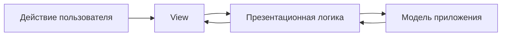
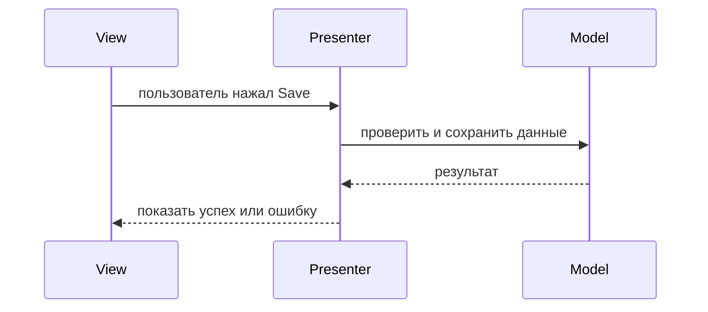
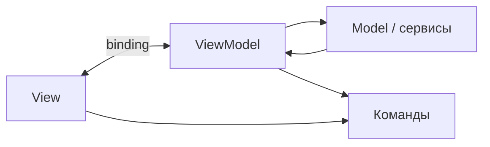

# Паттерны презентационного уровня кроме MVC

MVC — самый известный паттерн презентационного уровня, но это не единственный
способ организовать UI-код. У презентационного уровня обычно три задачи:
отрисовать данные, обработать действия пользователя и согласовать то, что видит
пользователь, с состоянием приложения. Паттерны отличаются тем, где живёт эта
координация и сколько view разрешено знать. Представьте загруженное почтовое
отделение: клиент видит окно, но сортировка, маршрутизация и правила могут быть
разложены между разными сотрудниками за ним.

## MVP

**Model-View-Presenter (MVP)** переносит презентационную логику в Presenter. View
обычно является интерфейсом: она предоставляет методы вроде `showOrders(...)`,
`showError(...)` или `setLoading(...)` и передаёт пользовательские события в
Presenter. Presenter запрашивает данные у Model или сервисов, решает, что нужно
показать, и командует View. В аналогии с почтой сотрудник у окна не решает
правила маршрутизации; руководитель говорит ему, какую марку, форму или
сообщение показать.

MVP полезен, когда презентационную логику нужно тестировать без настоящего
UI-фреймворка. Можно замокать интерфейс View и проверить, что Presenter вызывает
правильные методы. Цена подхода — больше явной связки и больше интерфейсов.

## Passive View и Supervising Controller

**Passive View** — более строгий вариант MVP: во View почти нет логики. Она
только поднимает события и предоставляет простые setter-методы. Presenter
готовит всё, включая форматирование и состояния enabled/disabled. Это похоже на
окно почты, которое просто показывает таблички, напечатанные сотрудником в
служебной зоне.

**Supervising Controller** мягче: простая binding-логика может остаться во View,
а Presenter/Controller занимается решениями, которые не являются тривиальными.
Это как сотрудник у окна, который сам раскладывает очевидные конверты по лоткам,
но зовёт руководителя для исключений и правил.

Используйте Passive View, когда тестируемость важнее церемонии. Используйте
Supervising Controller, когда UI-фреймворк уже хорошо поддерживает data binding и
перенос каждого мелкого правила отображения в Presenter сделал бы код шумным.

## MVVM

**Model-View-ViewModel (MVVM)** помещает презентационное состояние и команды во
ViewModel. View привязывается к свойствам ViewModel, а механизм binding обновляет
UI, когда эти свойства меняются. ViewModel обычно не вызывает методы view
напрямую. Она предоставляет данные вроде `customerName`, `canSubmit` и
`submitCommand`. View наблюдает за ними. Это как электронное табло очереди на
почте: сотрудники меняют состояние табло, а экран сам обновляется из этого
состояния.

MVVM хорошо подходит фреймворкам с сильным binding или observable state: WPF,
Android DataBinding, многим frontend-фреймворкам и современным reactive UI
стилям. Он может упростить понимание UI-состояния, но важно не превратить
ViewModel в большой service layer.

## Presentation Model

**Presentation Model** близок к MVVM: он хранит состояние и поведение, нужные
экрану, независимо от конкретных виджетов. Некоторые авторы считают MVVM
частным случаем Presentation Model с binding. В почтовой аналогии это
подготовленный рабочий лист для окна: текущий номер клиента, доступные действия,
предупреждения и поля, которые должны быть видимы.

Ключевая идея в том, что состояние экрана — это модель презентации, а не сама
domain model. Так domain-объекты не обрастают UI-only полями вроде `selected`,
`expanded` или `buttonDisabled`.

## Page Controller и Front Controller

**Page Controller** даёт каждой странице или route свой controller. Это просто и
прямолинейно: у `/orders` есть `OrdersController`, у `/profile` —
`ProfileController`. Это похоже на то, как у каждого почтового окна есть свой
сотрудник и локальный чек-лист.

**Front Controller** проводит все запросы через одну центральную точку входа
перед dispatch к обработчикам. Он централизует сквозные задачи: authentication,
logging, выбор locale, обработку ошибок и routing. Это как стойка приёма, которая
проверяет каждого посетителя и отправляет его к нужному окну. В Java
web-приложениях классический пример — `DispatcherServlet` в Spring MVC; это
естественно связано со [Spring IoC и Dependency Injection](topic:spring-ioc-di),
потому что handlers и services управляются контейнером.

## PAC и HMVC

**Presentation-Abstraction-Control (PAC)** делит UI на взаимодействующих агентов.
У каждого агента есть свои presentation, abstraction и control части. PAC полезен
для сложных независимых областей UI, например dashboards или IDE-подобных
инструментов. Это как большой почтовый центр, где приём посылок, паспортные
услуги и бизнес-почта имеют своё локальное окно и свои правила, но всё равно
координируются со всем зданием.

**Hierarchical MVC (HMVC)** организует MVC-подобные компоненты в иерархию.
Страница может содержать меньшие самодостаточные презентационные модули. Это
часто встречается в больших web-экранах, порталах и component-based UI. Аналогия
— главное почтовое отделение с небольшими сервисными стойками внутри: каждая
стойка ведёт свой поток, но весь зал всё равно имеет общую раскладку и навигацию.

## Как сравнивать их на собеседовании

Лучший ответ на собеседовании — не просто список названий. Скажите, какая
ответственность куда перемещается:

- **MVP**: Presenter управляет View через интерфейс.
- **Passive View**: View намеренно простая; Presenter владеет почти всей UI-логикой.
- **Supervising Controller**: простая binding-логика остаётся во View; нетривиальные
  решения выносятся наружу.
- **MVVM**: View привязывается к состоянию и командам ViewModel.
- **Presentation Model**: состояние экрана моделируется отдельно от domain state.
- **Page Controller**: один controller на страницу или route.
- **Front Controller**: одна центральная точка входа dispatch-ит запросы к handlers.
- **PAC / HMVC**: сложные UI делятся на вложенные или взаимодействующие
  презентационные части.

Это похоже на организацию работы в реальном почтовом отделении: вопрос не в том,
есть ли окно, а в том, какой сотрудник отвечает за сортировку, маршрутизацию,
валидацию и сообщения клиенту.

## Ответ на собеседовании за 60 секунд

> Кроме MVC, часто называют MVP, MVVM, Presentation Model, Passive View,
> Supervising Controller, Page Controller, Front Controller, PAC и HMVC. MVP
> переносит презентационные решения в Presenter, который общается с View через
> интерфейс, поэтому его удобно unit-тестировать. MVVM переносит презентационное
> состояние и команды во ViewModel и опирается на binding между View и ViewModel.
> Passive View оставляет View почти без логики, а Supervising Controller разрешает
> простой binding во View. Page Controller связывает один controller с одной
> страницей или route; Front Controller ставит одну центральную точку входа перед
> всеми запросами. PAC и HMVC помогают делить большой презентационный слой на
> взаимодействующие или иерархические части. Выбор зависит от поддержки
> фреймворка, требований к тестируемости, сложности UI и того, сколько
> косвенности команда готова поддерживать.

## Значение в production

Эти паттерны важны, потому что UI-код часто становится местом, где смешиваются
domain logic, validation, formatting, navigation и инфраструктурные вызовы.
Выбранный презентационный паттерн даёт команде видимое правило, где должна жить
каждая ответственность. Как почтовое отделение с понятными окнами и правилами
маршрутизации, система проще поддерживается, когда всем ясно, где выполняется
каждая задача.

В Java-собеседованиях с backend-уклоном свяжите ответ с web-фреймворками. Spring
MVC внутри использует Front Controller, а application controllers часто ведут
себя как Page Controllers или request handlers. В frontend-heavy системах идеи
MVVM или Presentation Model видны в state containers, view models и observable
stores. Конкретные имена классов меняются, но задача разделения остаётся той же.

## Частые заблуждения

- «MVC — единственный презентационный паттерн.» Это только один представитель
  семейства. Многие UI-архитектуры настраивают то же разделение по-разному.
- «MVP и MVVM — одно и то же.» Оба выносят логику из View, но в MVP Presenter
  обычно командует View, а MVVM опирается на binding к состоянию ViewModel.
- «Front Controller — просто другое название MVC.» Front Controller — паттерн
  маршрутизации запросов, и он может использоваться внутри MVC-фреймворка.
- «ViewModel — это domain model.» ViewModel формируется под экран; domain model
  формируется под бизнес-правила.
- «Чем больше разделения, тем лучше.» Каждый слой добавляет код и косвенность.
  Как лишние окна на почте, он может замедлить простую работу.
