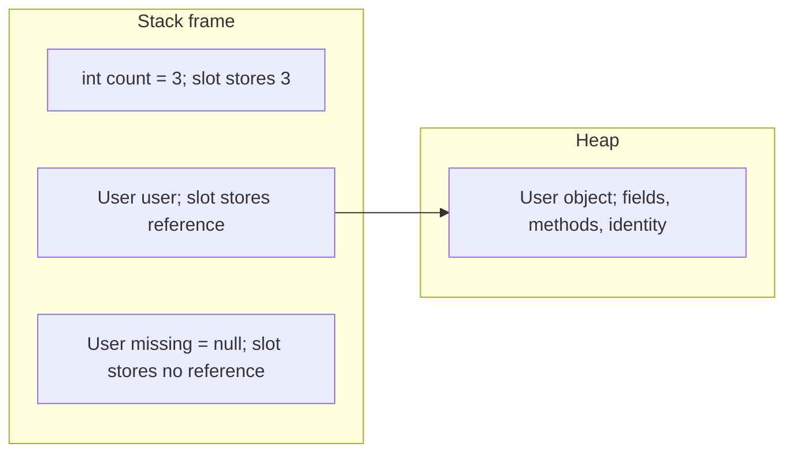
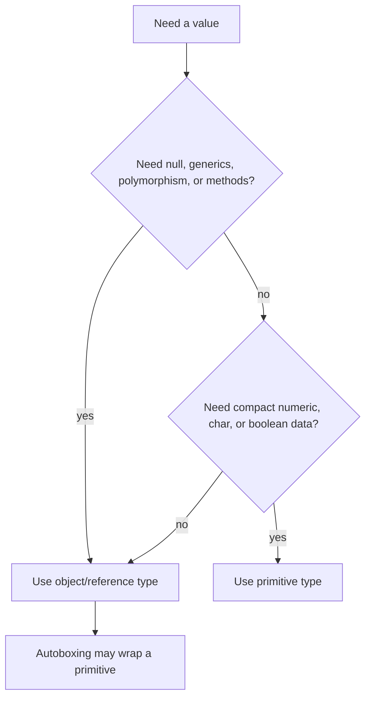

# Primitive vs Object Types

Java has two broad families of values: **primitive types** and **object/reference types**. A primitive variable stores the value itself. An object variable stores a reference to an object. In a kitchen analogy, a primitive slot is a jar with rice already inside it; an object slot is a label that tells you which shelf holds the full container.

Primitive types are `byte`, `short`, `int`, `long`, `float`, `double`, `char`, and `boolean`. They are not objects: they have no identity, no fields, no methods of their own, and cannot be `null`. Like a traffic light showing red or green directly, the value is the thing you read.

Object/reference types include classes (`String`, `Integer`, `Order`), arrays, enums, interfaces, and records. The variable holds a reference; the object itself lives elsewhere, normally on the heap. Like a post office pickup slip, the paper in your hand is not the package, but it tells you where the package is.

For the deeper storage picture, compare this topic with [what a variable stores](topic:variable-storage), [where reference types are stored](topic:reference-types-storage), and [JVM memory areas](topic:jvm-memory-areas).

## Copying and Assignment

When you assign one primitive to another, Java copies the value. After `int b = a`, `a` and `b` are separate slots. Changing `b` does not change `a`. In kitchen terms, you poured a measured cup into a second bowl; changing the second bowl does not change the first.

When you assign one object variable to another, Java copies the reference, not the object. After `Order copy = original`, both variables can point to the same heap object. If the object is mutable, a change through one reference is visible through the other. In a post office analogy, two pickup slips can point to the same package.

Reassigning a reference changes only the variable. `order = new Order()` makes `order` point to a new object; it does not rewrite every other reference to the old object. Like changing the address on one delivery note, it does not change the notes already held by other people.

## null, Defaults, and Wrappers

A reference variable can be `null`, meaning it points to no object. A primitive cannot be `null`, because its slot must contain a valid primitive value. The kitchen version: a shelf label can be blank, but a measuring cup of rice is either some amount of rice, not "no cup".

Default values follow the same rule: fields of primitive type default to `0`, `0.0`, `false`, or `'\u0000`; fields of reference type default to `null`. Local variables have no default and must be definitely assigned before use. In traffic terms, a parked car field may get a default gear, but a note you write inside a method must be filled in before you can read it.

Wrappers such as `Integer`, `Long`, `Double`, `Boolean`, and `Character` are object types that wrap primitive values. They are needed for APIs that require objects, especially generics and collections such as `List<Integer>`; see [ArrayList internals](topic:arraylist-internals) for the storage side. The real-world analogy is putting a loose coin into an envelope so the post office can sort it like other packages.

Autoboxing converts a primitive to its wrapper when Java needs an object; unboxing reads the primitive value back. This is convenient but not free: it can allocate objects, trigger `NullPointerException` during unboxing from `null`, and make `==` confusing. Like a kitchen helper automatically bagging and unbagging ingredients, it saves typing but you still pay for the bagging step.

## Comparison

For primitives, `==` compares the actual values: `5 == 5` is true. Like comparing two ticket numbers printed on paper, the number itself decides.

For object references, `==` compares identity: do both variables reference the exact same object? It does not ask whether the objects contain equal data. Use `equals` for logical equality when the class implements it correctly. This matters a lot for `String`; see [String immutability](topic:string-immutability) for related traps. The analogy: two envelopes may contain the same form, but `==` asks whether they are the same envelope.

## 60-Second Interview Answer

Primitive types in Java are the eight built-in value types: `byte`, `short`, `int`, `long`, `float`, `double`, `char`, and `boolean`. A primitive variable stores the value directly and cannot be `null`.

Object types are reference types: classes, arrays, enums, interfaces, records, and wrappers like `Integer`. A variable of an object type stores a reference to an object, or `null`; the object itself has identity, fields, and methods and normally lives on the heap.

Assignment copies the variable value in both cases. For primitives, that copied value is the actual number/boolean/char. For object variables, that copied value is the reference, so two variables can refer to the same object. Wrappers and autoboxing bridge primitives into object-only APIs such as generics, but they add null, identity, allocation, and comparison traps.

## Production Relevance

Primitives are usually smaller and faster for raw numeric or boolean data. They avoid object allocation and cannot throw `NullPointerException` by being null. In a busy kitchen, using a direct measuring cup is cheaper than packaging every spoonful in a box.

Object types are necessary when you need `null`, polymorphism, methods, mutable state, identity, or generics. In a delivery workflow, a package can carry labels, history, and behavior; a plain number cannot.

Use wrappers intentionally in APIs and collections, but watch for accidental unboxing. `Integer count = null; int n = count;` compiles and fails at runtime. This is like a traffic counter expecting a number but receiving an empty envelope.

## Common Misconceptions

- "Objects are passed by reference." Java is always pass-by-value. With objects, the copied value is the reference.
- "Integer and int are basically the same." They can convert automatically, but `Integer` can be `null`, has object identity, and may allocate.
- "`==` compares objects by content." It compares primitive values or reference identity. Use `equals` for object content.
- "A primitive lives only on the stack." Local primitive variables often map to stack slots or registers, but primitive fields live inside their containing object. The reliable interview answer is about what the variable stores, not a promise about a physical location after JVM optimization.
- "null is a special primitive value." `null` is the absence of an object reference; primitives do not have it.
