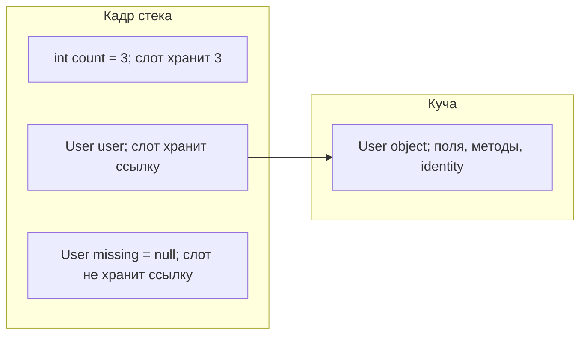
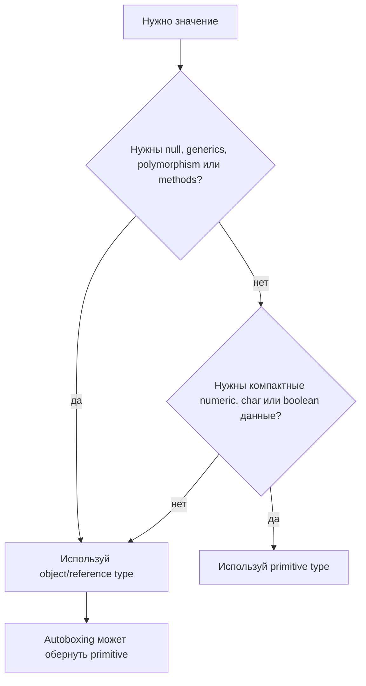

# Примитивные и объектные типы

В Java есть две большие семьи значений: **примитивные типы** и **объектные/ссылочные типы**. Переменная примитивного типа хранит само значение. Переменная объектного типа хранит ссылку на объект. В кухонной аналогии слот примитива - это банка, в которой уже лежит рис; слот объекта - это этикетка, которая говорит, на какой полке стоит полный контейнер.

Примитивные типы - это `byte`, `short`, `int`, `long`, `float`, `double`, `char` и `boolean`. Они не являются объектами: у них нет identity, полей, собственных методов, и они не могут быть `null`. Как светофор, который прямо показывает красный или зелёный, значение - это то, что ты читаешь.

Объектные/ссылочные типы включают классы (`String`, `Integer`, `Order`), массивы, enums, interfaces и records. Переменная хранит ссылку; сам объект живёт в другом месте, обычно в куче. Как почтовая квитанция на выдачу, бумага в руке не является посылкой, но говорит, где лежит посылка.

Для более глубокой картины хранения сравни эту тему с [тем, что хранит переменная](topic:variable-storage), [тем, где хранятся ссылочные типы](topic:reference-types-storage), и [областями памяти JVM](topic:jvm-memory-areas).

## Копирование и присваивание

Когда ты присваиваешь один примитив другому, Java копирует значение. После `int b = a` переменные `a` и `b` находятся в отдельных слотах. Изменение `b` не меняет `a`. На кухне это похоже на то, как ты отмерил чашку крупы во вторую миску: изменение второй миски не меняет первую.

Когда ты присваиваешь одну объектную переменную другой, Java копирует ссылку, а не объект. После `Order copy = original` обе переменные могут указывать на один объект в куче. Если объект изменяемый, изменение через одну ссылку видно через другую. В почтовой аналогии две квитанции могут указывать на одну и ту же посылку.

Переприсваивание ссылки меняет только переменную. `order = new Order()` заставляет `order` указывать на новый объект; это не переписывает все другие ссылки на старый объект. Как смена адреса в одной накладной: она не меняет накладные, которые уже есть у других людей.

## null, значения по умолчанию и wrappers

Ссылочная переменная может быть `null`, то есть не указывать ни на какой объект. Примитив не может быть `null`, потому что его слот должен содержать корректное примитивное значение. Кухонная версия: этикетка на полке может быть пустой, но мерный стакан риса содержит какое-то количество риса, а не "нет стакана".

Значения по умолчанию следуют тому же правилу: поля примитивных типов получают `0`, `0.0`, `false` или `'\u0000`; поля ссылочных типов получают `null`. У локальных переменных нет значения по умолчанию, их нужно явно присвоить перед чтением. В терминах дорожного движения поле припаркованной машины может получить передачу по умолчанию, но записку, которую ты пишешь внутри метода, нужно заполнить до чтения.

Wrappers вроде `Integer`, `Long`, `Double`, `Boolean` и `Character` - это объектные типы, которые оборачивают примитивные значения. Они нужны для API, которым требуются объекты, особенно для generics и коллекций вроде `List<Integer>`; сторону хранения смотри в [устройстве ArrayList](topic:arraylist-internals). Аналогия из жизни: положить монету в конверт, чтобы почта могла сортировать её как остальные посылки.

Autoboxing преобразует примитив в wrapper, когда Java нужен объект; unboxing читает примитивное значение обратно. Это удобно, но не бесплатно: могут появиться объекты, `NullPointerException` при unboxing из `null`, и путаница с `==`. Как кухонный помощник, который автоматически пакует и распаковывает ингредиенты: он экономит набор текста, но упаковка всё равно стоит усилий.

## Сравнение

Для примитивов `==` сравнивает сами значения: `5 == 5` истинно. Это как сравнить два номера талона, напечатанные на бумаге: решает само число.

Для объектных ссылок `==` сравнивает identity: указывают ли обе переменные на ровно тот же объект? Он не спрашивает, равны ли данные внутри объектов. Для логического равенства используй `equals`, если класс реализует его корректно. Это особенно важно для `String`; связанные ловушки смотри в [String immutability](topic:string-immutability). Аналогия: два конверта могут содержать одинаковую форму, но `==` спрашивает, один ли это конверт.

## Ответ за 60 секунд

Примитивные типы в Java - это восемь встроенных value types: `byte`, `short`, `int`, `long`, `float`, `double`, `char` и `boolean`. Переменная примитивного типа хранит значение напрямую и не может быть `null`.

Объектные типы - это ссылочные типы: classes, arrays, enums, interfaces, records и wrappers вроде `Integer`. Переменная объектного типа хранит ссылку на объект или `null`; сам объект имеет identity, поля и методы и обычно живёт в куче.

Присваивание в обоих случаях копирует значение переменной. Для примитивов копируемое значение - это само число/boolean/char. Для объектных переменных копируемое значение - это ссылка, поэтому две переменные могут ссылаться на один объект. Wrappers и autoboxing соединяют примитивы с API, где нужны объекты, например с generics, но добавляют ловушки с null, identity, allocation и comparison.

## Зачем это в production

Примитивы обычно компактнее и быстрее для сырых числовых или boolean-данных. Они не требуют выделения объекта и не могут упасть с `NullPointerException` из-за собственного null. На занятой кухне прямой мерный стакан дешевле, чем упаковывать каждую ложку в коробку.

Объектные типы нужны, когда требуются `null`, polymorphism, methods, mutable state, identity или generics. В процессе доставки посылка может иметь ярлыки, историю и поведение; обычное число - нет.

Используй wrappers осознанно в API и коллекциях, но следи за случайным unboxing. `Integer count = null; int n = count;` компилируется и падает во время выполнения. Это как дорожный счётчик, который ждёт число, но получает пустой конверт.

## Частые заблуждения

- "Objects are passed by reference." Java всегда передаёт аргументы по значению. Для объектов копируемое значение - это ссылка.
- "Integer и int в целом одно и то же." Они могут автоматически преобразовываться, но `Integer` может быть `null`, имеет object identity и может требовать allocation.
- "`==` сравнивает объекты по содержимому." Он сравнивает значения примитивов или identity ссылок. Для содержимого объектов используй `equals`.
- "Примитив живёт только на стеке." Локальные primitive variables часто попадают в stack slots или registers, но primitive fields живут внутри своего объекта. Надёжный ответ на собеседовании - что хранит переменная, а не обещание о физическом месте после оптимизаций JVM.
- "null - это специальное примитивное значение." `null` - это отсутствие object reference; у примитивов его нет.
