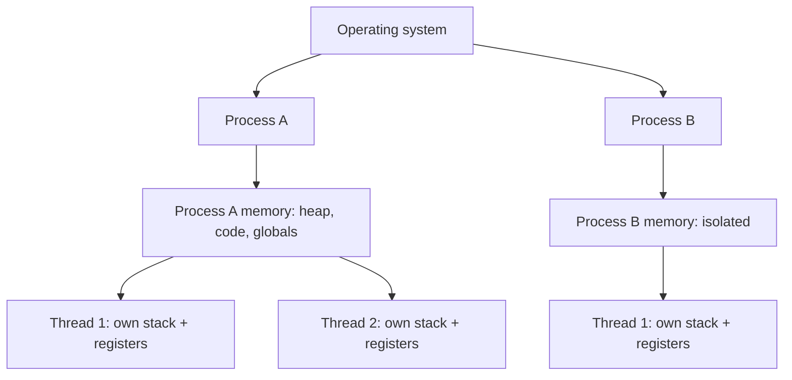
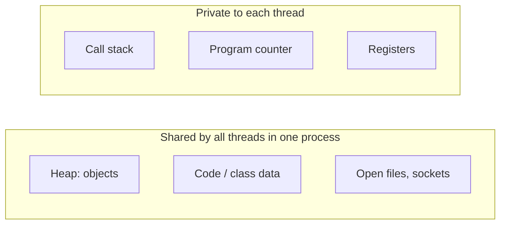

# Process vs Thread

A **process** is a running instance of a program with its own private memory,
handed out and protected by the operating system. A **thread** is a single line
of execution *inside* a process; a process always has at least one thread (the
"main" thread) and can spawn more. All threads of one process **share that
process's memory**; each also keeps a small private slice of its own.

> 🎮 Think of a **process** as a launched game world — its own save file, its own
> loaded map and inventory, sealed off from every other world. A **thread** is one
> co-op player acting inside that world. Two players in the same session share the
> same loot chest and map; two separate game servers share nothing.

## Memory: shared vs private

This is the heart of the difference. Inside one process, threads share the
[heap](topic:jvm-memory-areas) (all objects), the code, and open resources like
files and sockets. What each thread keeps to itself is tiny: its own **call
stack** (local variables and method frames), its **program counter**, and its
**registers**. Processes share *nothing* by default — the OS gives each its own
address space, so a pointer in one process is meaningless in another.

> 🎮 Every co-op player has their **own hotbar and position** (the private stack),
> but they all reach into the **same shared stash** (the heap). Separate game
> servers each keep their own stash that nobody else can touch.

Because a JVM is one process, all its threads share one heap while each gets its
own stack — see [how many heaps and stacks a JVM has](topic:jvm-heaps-stacks-count).

## Isolation and the failure model

Shared memory cuts both ways. If one thread corrupts shared state or throws an
uncaught error that the process can't survive, it can bring down **the whole
process and every thread in it**. Processes are isolated: if one crashes, the
others keep running, because the OS never let them touch each other's memory.

> 🎮 If one co-op player triggers a fatal bug, the **whole game session crashes**
> for everyone in it. But if one game *server* goes down, the other servers keep
> hosting their own matches — they were never sharing a world.

This is exactly why threads sharing memory is *risky*: two threads writing the
same variable without coordination is a data race. Avoiding that is the whole
subject of [Java multithreading](topic:java-multithreading) and
[avoiding race conditions](topic:race-condition-avoidance).

## Cost: creation and switching

Creating a process is expensive — the OS must build a fresh address space, load
the program, and set up its resources. Creating a thread is cheap: it reuses the
existing process, allocating little more than a new stack. Switching between
threads of the same process is also cheaper than switching between processes,
because the memory map does not have to be swapped — though it is never free (see
[context switch](topic:context-switch)).

> 🎮 Booting a whole new game server (process) is a slow, heavy launch. Adding
> another co-op player (thread) to a session already running is nearly instant —
> they just drop into the existing world.

## Communication

Threads communicate through **shared memory**: one writes an object on the heap,
another reads it — fast, but it demands synchronization to be correct. Processes
cannot read each other's memory, so they must use explicit **inter-process
communication (IPC)**: pipes, sockets, files, or shared-memory segments the OS
grants on purpose.

> 🎮 Party members just drop loot into the shared stash for each other (shared
> memory). Two different servers have to **trade over the network / an auction
> house** — a deliberate channel, not a shared bag.

## 60-second interview answer

> A process is an isolated instance of a running program with its own memory
> address space; a thread is a unit of execution inside a process. A process has
> at least one thread and can have many, and all threads of a process share its
> heap, code and open resources, while each thread has its own stack, program
> counter and registers. The key trade-offs follow from that sharing: threads are
> cheap to create and switch between and communicate directly through shared
> memory, but that makes them prone to data races and means one bad thread can
> crash the whole process. Processes are isolated and robust — one crashing
> doesn't affect others — but heavier to create and they must communicate through
> IPC. In Java, the JVM is one process and `Thread` objects are its threads.

## Common misconceptions

- ❌ "A thread is just a lightweight process." — They differ *in kind*, not only
  weight: threads share the process's memory, processes do not share memory.
- ❌ "Each thread has its own heap." — No. Threads share one heap; only the
  **stack** (and PC/registers) is per-thread. That shared heap is why coordination
  is needed.
- ❌ "More threads always means faster." — Threads share cores and contend for
  locks; past a point, context-switching and contention make it *slower*.
- ❌ "Threads are isolated like processes." — They are not. An uncaught fatal
  error or corrupted shared state in one thread can take down the entire process.
- ❌ "A program is always one thread." — Even a simple program runs on the `main`
  thread plus JVM background threads (GC, JIT); a process is never zero threads.
