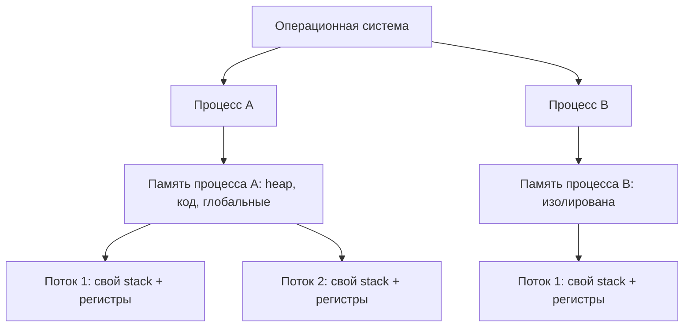
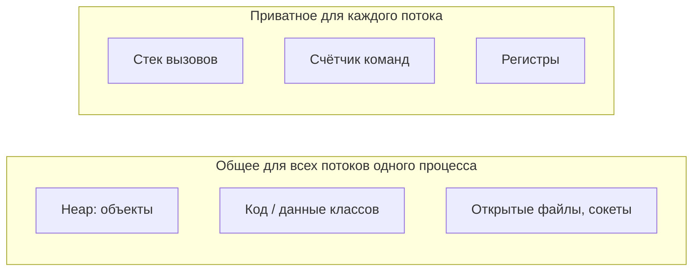

# Процесс против потока

**Процесс** — это запущенный экземпляр программы со своей приватной памятью,
которую выдаёт и защищает операционная система. **Поток** — это одна линия
исполнения *внутри* процесса; у процесса всегда есть хотя бы один поток
(«главный», main) и он может породить ещё. Все потоки одного процесса **разделяют
память этого процесса**; при этом у каждого есть и небольшой свой кусочек.

> 🎮 Представь **процесс** как запущенный игровой мир — со своим сейвом, своей
> загруженной картой и инвентарём, наглухо отделённый от других миров. **Поток** —
> это один co-op игрок, действующий внутри этого мира. Два игрока в одной сессии
> делят один сундук с лутом и одну карту; два отдельных сервера не делят ничего.

## Память: общая против приватной

Это — суть различия. Внутри одного процесса потоки разделяют
[heap](topic:jvm-memory-areas) (все объекты), код и открытые ресурсы вроде файлов
и сокетов. То, что каждый поток держит только для себя, крохотно: свой **стек
вызовов** (локальные переменные и кадры методов), свой **счётчик команд** (program
counter) и свои **регистры**. Процессы по умолчанию не разделяют *ничего* — ОС
даёт каждому своё адресное пространство, поэтому указатель одного процесса
бессмыслен в другом.

> 🎮 У каждого co-op игрока **свой хотбар и своя позиция** (приватный стек), но все
> они лезут в **один общий сундук** (heap). Отдельные игровые серверы держат каждый
> свой сундук, к которому чужие не дотянутся.

Поскольку JVM — это один процесс, все его потоки разделяют одну heap, а стек у
каждого свой — см. [сколько heap и stack у JVM](topic:jvm-heaps-stacks-count).

## Изоляция и модель сбоев

Общая память работает в обе стороны. Если один поток портит общее состояние или
бросает необработанную ошибку, которую процесс не переживает, он может обрушить
**весь процесс и все потоки в нём**. Процессы изолированы: если один падает,
остальные продолжают работать, потому что ОС никогда не давала им трогать чужую
память.

> 🎮 Если один co-op игрок ловит фатальный баг, **вся игровая сессия падает** для
> всех в ней. Но если падает один игровой *сервер*, остальные серверы продолжают
> хостить свои матчи — они и не делили мир.

Именно поэтому разделение памяти потоками *рискованно*: два потока, пишущие в одну
переменную без координации, — это гонка данных (data race). Как этого избегать —
об этом вся [многопоточность в Java](topic:java-multithreading) и
[как избегать race condition](topic:race-condition-avoidance).

## Стоимость: создание и переключение

Создать процесс дорого — ОС должна построить новое адресное пространство,
загрузить программу и настроить её ресурсы. Создать поток дёшево: он переиспользует
существующий процесс, выделяя чуть больше, чем новый стек. Переключение между
потоками одного процесса тоже дешевле, чем между процессами, потому что карту
памяти менять не нужно — хотя оно никогда не бесплатно (см.
[context switch](topic:context-switch)).

> 🎮 Поднять целый новый игровой сервер (процесс) — медленный, тяжёлый запуск.
> Добавить ещё одного co-op игрока (поток) в уже идущую сессию почти мгновенно — он
> просто заходит в уже существующий мир.

## Общение

Потоки общаются через **общую память**: один пишет объект в heap, другой читает —
быстро, но для корректности нужна синхронизация. Процессы не могут читать чужую
память, поэтому вынуждены использовать явное **межпроцессное взаимодействие (IPC)**:
пайпы, сокеты, файлы или сегменты разделяемой памяти, которые ОС выдаёт намеренно.

> 🎮 Тиммейты просто скидывают лут в общий сундук друг для друга (общая память). А
> два разных сервера вынуждены **торговать по сети / через аукцион** — намеренный
> канал, а не общая сумка.

## Ответ за 60 секунд

> Процесс — это изолированный экземпляр запущенной программы со своим адресным
> пространством памяти; поток — это единица исполнения внутри процесса. У процесса
> есть хотя бы один поток и может быть много, и все потоки процесса разделяют его
> heap, код и открытые ресурсы, тогда как у каждого потока свой стек, счётчик команд
> и регистры. Главные компромиссы следуют из этого разделения: потоки дёшевы в
> создании и переключении и общаются напрямую через общую память, но из-за этого
> подвержены гонкам данных, и один плохой поток может обрушить весь процесс.
> Процессы изолированы и надёжны — падение одного не затрагивает других, — но
> тяжелее в создании и вынуждены общаться через IPC. В Java JVM — это один процесс,
> а объекты `Thread` — его потоки.

## Частые заблуждения

- ❌ «Поток — это просто лёгкий процесс». — Они различаются *по сути*, а не только
  по весу: потоки разделяют память процесса, процессы память не разделяют.
- ❌ «У каждого потока своя heap». — Нет. Потоки разделяют одну heap; своим у
  каждого является только **стек** (и PC/регистры). Именно из-за общей heap и нужна
  координация.
- ❌ «Больше потоков — всегда быстрее». — Потоки делят ядра и конкурируют за
  блокировки; после некоторого порога переключения контекста и конкуренция делают
  работу *медленнее*.
- ❌ «Потоки изолированы, как процессы». — Нет. Необработанная фатальная ошибка или
  испорченное общее состояние в одном потоке могут положить весь процесс.
- ❌ «Программа — это всегда один поток». — Даже простая программа работает на потоке
  `main` плюс фоновые потоки JVM (GC, JIT); процесс никогда не имеет ноль потоков.
