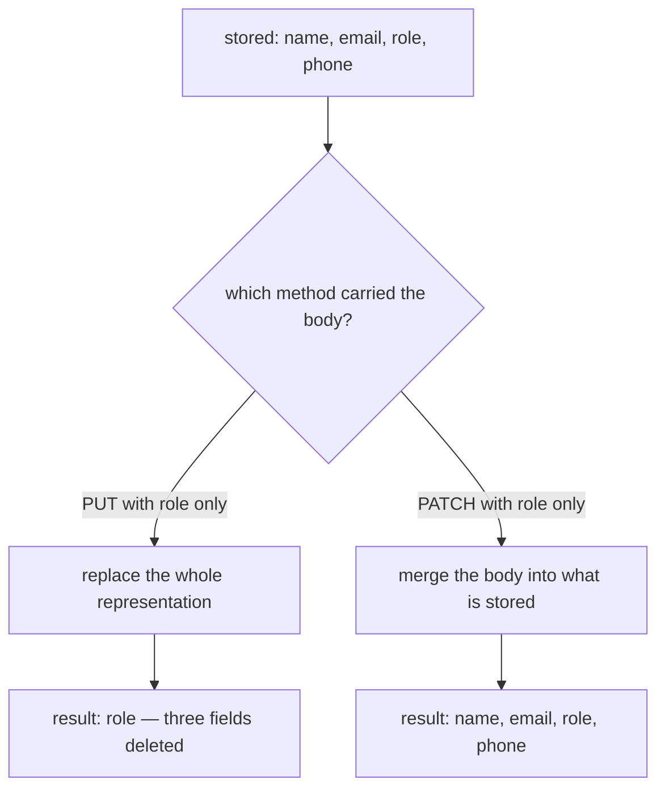
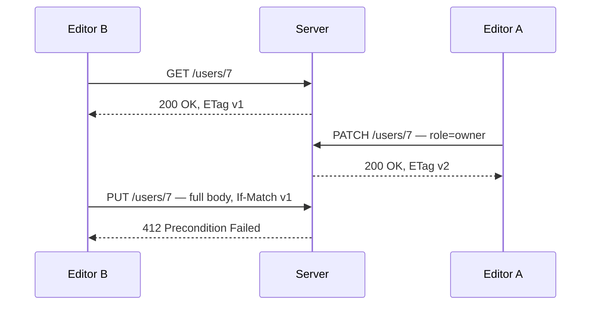
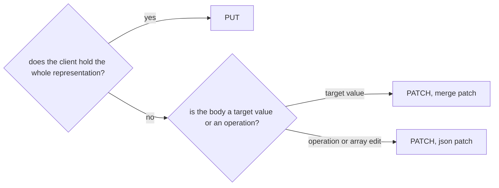

# PUT vs PATCH

Both methods change a resource that already exists. The difference is not "big
update vs small update" — it is **what the body means**.

- **PUT** carries the representation you want the URL to hold. *"After this
  request, `/users/7` should be exactly this."*
- **PATCH** carries a description of the change. *"Whatever `/users/7` is right
  now, apply this to it."*

Everything else follows from that one sentence.

## The consequence people get bitten by

If PUT means "the resource should be exactly this", then a field your body did
not mention is **not** left alone — it is not part of the resource you just
described, so it goes away.



The server answers `200 OK` either way. Nothing looks wrong until someone
notices the phone numbers are missing.

## What each method promises

|  | PUT | PATCH |
|---|---|---|
| Body | the complete representation | only the change |
| Untouched fields | wiped | kept |
| Safe (read-only) | no | no |
| Idempotent | **required** | **not required** |
| Can create a missing resource | yes (`201 Created`) | no (`404 Not Found`) |
| Content type | the resource's own media type | a *patch* format |

**Idempotent** means one call and N identical calls leave the same state. It
says nothing about the response body or status code — a repeat may legitimately
answer `201` the first time and `200` after.

PUT is idempotent because the body is a target state: applying "be exactly this"
twice lands in the same place. PATCH *may* be idempotent — `{"role":"admin"}` as
a merge patch is — but nothing requires it. The classic counter-example is a
JSON Patch operation:

```json
[{ "op": "add", "path": "/tags/-", "value": "beta" }]
```

Run that twice and `tags` contains `beta` twice. The method did not change; the
*meaning of the body* did.

## PATCH bodies are a format, not free-form JSON

`PATCH` in the HTTP spec only says "the body is a set of instructions". The two
standard formats:

- **JSON Merge Patch** (`application/merge-patch+json`) — looks like the
  resource, but only the members you list are applied. An explicit `null`
  **removes** the member. Which is exactly why merge patch cannot store a null
  value: `{"phone": null}` always means *delete*, never *set to null*.
- **JSON Patch** (`application/json-patch+json`) — an array of named operations
  (`add`, `remove`, `replace`, `move`, `copy`, `test`). More verbose, but it can
  express "set this to null", target array positions, and carry a `test`
  precondition.

Sending a partial body as plain `application/json` is what most APIs actually
do. It works because both sides agreed off-spec what it means — but that
agreement is the reason the same endpoint behaves differently in every service
you integrate with.

## Concurrency: PATCH is narrower, not safer

Two people editing the same record is where the difference stops being academic.
A form that reloads the whole object and saves it back with PUT will revert
anything that changed while the form was open — a **lost update**. PATCH only
carries the fields that were actually edited, so the collision window is
smaller, but two people editing the *same* field still overwrite each other.

The real fix is a precondition, not a method:



That is [optimistic locking](topic:optimistic-vs-pessimistic-locking) carried in
HTTP headers: the client sends the `ETag` it read, and the server refuses the
write if the resource has moved on.

## Choosing one



In practice: expose PUT when a client legitimately owns the whole object (config
documents, upserts at a client-chosen id, replacing a file). Expose PATCH for
edit-one-field screens. Exposing both is fine and common. And when a change is
really a *business action* rather than a field edit — approve, cancel, change
salary — a named command endpoint is usually clearer than either; see
[Employee API: Commands](topic:employee-api-commands) and
[REST and separation of concerns](topic:employee-api-rest-cqrs).

## The 60-second interview answer

> PUT replaces the resource with the representation in the body — it is "make
> this URL hold exactly this". PATCH sends only the change and the server merges
> it, so fields the body does not mention keep their values. Because PUT
> describes the final state it is idempotent and can create a resource that does
> not exist yet, returning `201`; PATCH describes a change, so it is not
> guaranteed to be idempotent — a JSON Patch `add` to an array applied twice
> appends twice — and it returns `404` when there is nothing to patch. PATCH
> bodies use a patch format: JSON Merge Patch, where an explicit `null` deletes
> the member, or JSON Patch, an array of named operations. The trap in real code
> is sending a partial body with PUT: the server takes it literally and the
> fields you omitted are deleted, with a cheerful `200 OK`.

## Why it matters in production

- **A partial PUT is a silent delete.** It usually reaches production because
  the endpoint was tested with a body built from a fresh `GET`, and the mobile
  client sends a smaller one.
- **Retries.** A gateway or client that retries on timeout is safe against PUT
  by definition. It is not safe against an arbitrary PATCH, which is why
  write endpoints that can be retried need an explicit identity —
  see [avoiding duplicate sales](topic:duplicate-sale-prevention) and
  [registering sales over an unreliable connection](topic:sales-api-unreliable-connection).
- **Validation.** A PUT body can be validated as a whole object. A PATCH body
  cannot: "required field missing" is meaningless when the body is a delta, so
  validation has to run against the *merged result*, not the request.
- **Auditing.** A PATCH request log tells you what changed. A PUT log tells you
  the whole object, and you have to diff it to find out.

## Common misconceptions

- **"PATCH is just PUT for partial updates."** The name of the method is what
  tells the server how to read the body. Sending a partial body with PUT does
  not make it a partial update — it makes it a smaller resource.
- **"PUT is idempotent, so my endpoint is."** Only if the handler really
  implements replacement. `PUT /users/7` that appends a row to an audit table
  each time is still fine (the resource is the same), but a handler that
  increments a counter *in the resource* has broken the contract of the method.
- **"PATCH is never idempotent."** Most PATCH endpoints in the wild are — a merge
  patch of concrete values repeats safely. The point is that HTTP does not
  *promise* it, so intermediaries and retry logic may not assume it.
- **"Idempotent means the same response."** It means the same resulting state.
  Status codes, `ETag`s and timestamps may differ between the calls.
- **"`{"phone": null}` sets the phone to null."** In merge patch it deletes the
  member. Use JSON Patch when the difference matters.
- **"PATCH is safe to send without reading first."** It is safe with respect to
  fields you did not name, not with respect to the field you did — two clients
  patching the same field still race. Use `If-Match`.
- **"Use PUT because it is more RESTful."** Neither is more RESTful. Use the one
  whose meaning matches the body your client can actually produce.
