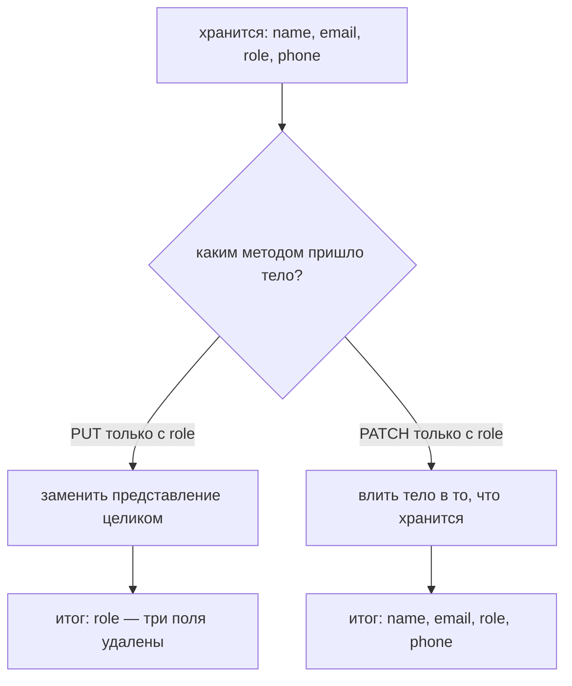
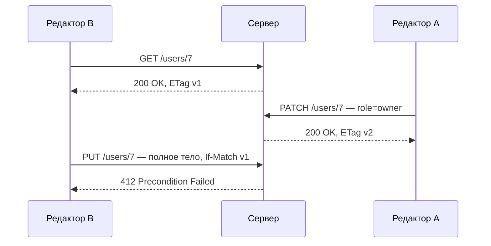
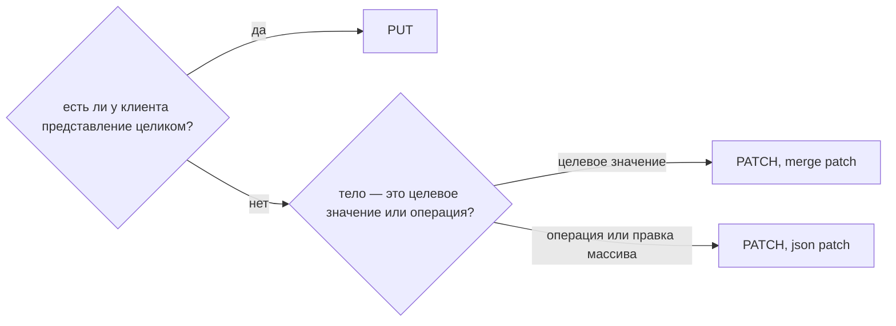

# PUT против PATCH

Оба метода изменяют уже существующий ресурс. Разница не в «большом обновлении
против маленького» — она в том, **что означает тело запроса**.

- **PUT** несёт представление, которое должно лежать по этому URL. *«После этого
  запроса `/users/7` должен быть ровно таким».*
- **PATCH** несёт описание изменения. *«Каким бы ни был `/users/7` сейчас,
  примени к нему вот это».*

Всё остальное вытекает из этой одной фразы.

## Следствие, на котором обжигаются

Если PUT означает «ресурс должен быть ровно таким», то поле, о котором тело не
упомянуло, **не** остаётся прежним: оно не входит в описанное вами
представление, а значит, исчезает.



Сервер в обоих случаях отвечает `200 OK`. Всё выглядит нормально, пока кто-нибудь
не заметит, что телефоны пропали.

## Что обещает каждый метод

|  | PUT | PATCH |
|---|---|---|
| Тело | полное представление | только изменение |
| Неупомянутые поля | стираются | сохраняются |
| Безопасный (только чтение) | нет | нет |
| Идемпотентный | **обязан быть** | **не обязан** |
| Может создать отсутствующий ресурс | да (`201 Created`) | нет (`404 Not Found`) |
| Content-Type | собственный media type ресурса | формат *патча* |

**Идемпотентность** означает, что один вызов и N одинаковых вызовов оставляют
одно и то же состояние. Про тело ответа и код состояния она не говорит ничего:
повтор вполне может ответить `201` в первый раз и `200` после.

PUT идемпотентен, потому что тело — это целевое состояние: применить «будь ровно
таким» дважды — оказаться в том же месте. PATCH *может* быть идемпотентным —
`{"role":"admin"}` как merge patch им является, — но ничто этого не требует.
Классический контрпример — операция JSON Patch:

```json
[{ "op": "add", "path": "/tags/-", "value": "beta" }]
```

Выполните её дважды — и в `tags` окажется два `beta`. Метод не изменился;
изменился *смысл тела*.

## Тело PATCH — это формат, а не произвольный JSON

Спецификация HTTP говорит про `PATCH` только то, что тело — это набор
инструкций. Два стандартных формата:

- **JSON Merge Patch** (`application/merge-patch+json`) — выглядит как ресурс,
  но применяются только перечисленные поля. Явный `null` **удаляет** поле.
  Именно поэтому merge patch не может сохранить значение null: `{"phone": null}`
  всегда означает *удалить*, а не *записать null*.
- **JSON Patch** (`application/json-patch+json`) — массив именованных операций
  (`add`, `remove`, `replace`, `move`, `copy`, `test`). Многословнее, зато умеет
  выразить «поставь сюда null», обратиться к позиции в массиве и нести
  предусловие `test`.

Отправлять частичное тело как обычный `application/json` — то, что делает
большинство API на практике. Это работает, потому что обе стороны договорились
о смысле вне спецификации, — но именно из-за такой договорённости один и тот же
эндпоинт ведёт себя по-разному в каждом сервисе, с которым вы интегрируетесь.

## Конкурентность: PATCH уже, но не безопаснее

Двое, редактирующих одну запись, — момент, когда разница перестаёт быть
теоретической. Форма, которая перечитывает объект целиком и сохраняет его через
PUT, откатит всё, что изменилось, пока она была открыта, — это **потеря
обновления**. PATCH несёт только реально отредактированные поля, поэтому окно
столкновения меньше, но двое, правящих *одно и то же* поле, всё равно затрут
друг друга.

Настоящее решение — предусловие, а не выбор метода:



Это [оптимистичная блокировка](topic:optimistic-vs-pessimistic-locking),
перенесённая в заголовки HTTP: клиент отправляет прочитанный `ETag`, а сервер
отклоняет запись, если ресурс с тех пор ушёл вперёд.

## Как выбрать



На практике: открывайте PUT там, где клиент действительно владеет объектом
целиком (конфигурационные документы, upsert по выбранному клиентом id, замена
файла). Открывайте PATCH для экранов «поменять одно поле». Открыть оба —
нормально и распространено. А когда изменение на самом деле является *бизнес-
действием*, а не правкой поля — согласовать, отменить, изменить зарплату, —
именованный командный эндпоинт обычно яснее, чем любой из них; см.
[API сотрудника: команды](topic:employee-api-commands) и
[REST и разделение ответственности](topic:employee-api-rest-cqrs).

## Ответ на собеседовании за 60 секунд

> PUT заменяет ресурс представлением из тела — это «сделай так, чтобы по этому
> URL лежало именно это». PATCH отправляет только изменение, и сервер вливает
> его в хранимое, поэтому поля, о которых тело не упомянуло, сохраняют свои
> значения. Поскольку PUT описывает конечное состояние, он идемпотентен и может
> создать ещё не существующий ресурс, вернув `201`; PATCH описывает изменение,
> поэтому идемпотентным быть не обязан — операция `add` в массив из JSON Patch,
> применённая дважды, добавит дважды, — и возвращает `404`, когда патчить
> нечего. Тело PATCH использует формат патча: JSON Merge Patch, где явный `null`
> удаляет поле, или JSON Patch — массив именованных операций. Ловушка в реальном
> коде — отправить частичное тело методом PUT: сервер понимает его буквально, и
> пропущенные поля удаляются, причём с бодрым `200 OK`.

## Почему это важно в продакшене

- **Частичный PUT — это тихое удаление.** Обычно оно доезжает до продакшена
  потому, что эндпоинт тестировали телом, собранным из свежего `GET`, а
  мобильный клиент отправляет тело поменьше.
- **Повторы.** Шлюз или клиент, повторяющий запрос по таймауту, безопасен для
  PUT по определению. Для произвольного PATCH — нет; поэтому эндпоинтам записи,
  которые могут быть повторены, нужна явная идентичность — см.
  [как избежать дублей при регистрации продаж](topic:duplicate-sale-prevention) и
  [регистрацию продаж по ненадёжной связи](topic:sales-api-unreliable-connection).
- **Валидация.** Тело PUT можно проверить как целый объект. Тело PATCH — нет:
  «обязательное поле отсутствует» бессмысленно, когда тело является дельтой,
  поэтому проверять нужно *результат слияния*, а не запрос.
- **Аудит.** Лог PATCH-запросов показывает, что именно изменилось. Лог
  PUT-запросов показывает объект целиком, и чтобы понять изменение, его
  приходится сравнивать с предыдущим.

## Частые заблуждения

- **«PATCH — это просто PUT для частичных обновлений».** Именно метод говорит
  серверу, как читать тело. Частичное тело в PUT не превращает его в частичное
  обновление — оно превращает ресурс в более короткий.
- **«PUT идемпотентен, значит и мой эндпоинт идемпотентен».** Только если
  обработчик действительно реализует замену. `PUT /users/7`, каждый раз
  дописывающий строку в таблицу аудита, всё ещё в порядке (ресурс тот же), а вот
  обработчик, увеличивающий счётчик *внутри ресурса*, контракт метода нарушил.
- **«PATCH никогда не идемпотентен».** Большинство PATCH-эндпоинтов в жизни
  идемпотентны: merge patch с конкретными значениями повторяется безопасно. Суть
  в том, что HTTP этого не *обещает*, поэтому промежуточные узлы и логика
  повторов не вправе на это рассчитывать.
- **«Идемпотентность — это одинаковый ответ».** Это одинаковое итоговое
  состояние. Коды состояния, `ETag` и метки времени между вызовами могут
  различаться.
- **«`{"phone": null}` записывает в phone значение null».** В merge patch это
  удаляет поле. Когда разница важна, нужен JSON Patch.
- **«PATCH можно слать, не читая ресурс».** Он безопасен относительно полей,
  которые вы не назвали, но не относительно того, которое назвали: двое,
  патчащих одно поле, всё равно гонятся. Используйте `If-Match`.
- **«Берите PUT, он более RESTful».** Ни один из них не «более RESTful».
  Берите тот, чей смысл совпадает с телом, которое ваш клиент реально может
  собрать.
