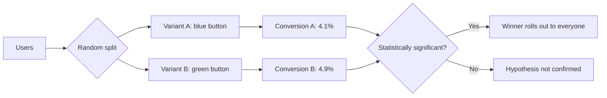

# Alpha, Beta and A/B Testing

Three terms that come up in almost every QA interview — and that even
experienced candidates keep mixing up. All three are about "validation with
real people", but they solve different problems: **alpha** and **beta** are
pre-release testing stages, while **A/B** is a product experiment that
measures user behaviour rather than hunting for bugs. If you can cleanly
separate the three, half of the "what did you do on your project" question is
already answered.

## Alpha Testing

**Alpha testing** is the final stage of internal verification, performed
**inside the company** before any external user ever sees the product. It is
done by employees: the QA team, developers, and sometimes internal "real"
users from other departments (dogfooding — the company uses its own product).

Key characteristics:

- performed in a controlled environment — a test bench or internal setup,
  often right next to the development team;
- the product is still "raw": instability, open defects and unfinished
  features are expected;
- bugs are fixed fast — a tester can walk over to a developer and show the
  problem on the spot;
- the goal is to catch critical defects before the product leaves the company.

**60-second interview answer:** "Alpha testing is internal testing done before
the product goes out: employees (QA, developers) run it in a controlled
environment on an early, still-rough version. The goal is to find serious bugs
before any external user gets access."

## Beta Testing

**Beta testing** is validation by **real users outside the company** in their
own environments: their devices, their data, their usage scenarios. It happens
after a successful alpha and before the general release.

Key characteristics:

- performed by external users: a limited invited group (closed beta) or anyone
  who wants in (open beta);
- uncontrolled environment — real devices, networks, locales and real data;
- feedback comes through crash reports, forms and analytics rather than direct
  contact with a developer;
- the goal is to test the product "in the wild": real scenarios, load,
  usability, compatibility — and to collect user opinions before release.

Typical examples: beta channels in Google Play and TestFlight on iOS, "early
access" on Steam, pre-release builds of games and browsers.

**Common follow-up questions:** "How does closed beta differ from open
beta?", "How do you collect feedback from beta users?", "What do you do if
beta reveals a critical bug one day before release?"

## Alpha vs Beta: the differences in one table

| Criterion | Alpha | Beta |
|---|---|---|
| Who tests | Company employees (QA, developers) | Real external users |
| Where | Controlled environment inside the company | Users' real devices and environments |
| When | Earlier, on a raw version | Later, on an almost-ready version |
| Feedback | Instant, directly to the team | Via reports, forms, analytics |
| Goal | Catch critical defects before going public | Validate in real conditions + user opinions |

**Trap:** candidates often say "beta means everything is already done". No: a
beta version still contains bugs, and that's fine — the point is that the
product is stable enough not to ruin the experience for external users.

## A/B Testing

**A/B testing** is **not bug hunting** — it is a product experiment: users are
randomly split into two (or more) groups, each group is shown a different
variant of the UI or a feature, and metrics are compared to see which variant
drives the target action better.

The classic interview example: the effect of **button color** on **purchase
conversion**. Group A sees a blue "Buy" button, group B sees a green one.
After enough impressions the conversions are compared: if variant B is
statistically significantly better, the green variant is rolled out to
everyone.

Important properties:

- change **one factor at a time** (otherwise you can't tell what caused the
  effect); testing several factors at once is called multivariate testing;
- results are judged by metrics: conversion, CTR, retention, revenue;
- conclusions are only drawn with statistical significance — a small sample
  proves nothing;
- A/B tests are usually owned by product/marketing/analytics; QA mainly makes
  sure the experiment itself doesn't break the product (correct traffic
  splitting, feature flags, rollback).

**60-second interview answer:** "A/B testing is an experiment where the
audience is randomly split into groups and shown different variants, so
metrics can pick the better one. Example: we change the color of the 'Buy'
button and check which variant gives a higher purchase conversion. It's about
product decisions, not about finding defects."

## How Not to Mix Up All Three

- **Alpha and beta** are stages of the testing lifecycle: they look for
  defects and verify release readiness. Alpha is inside the company, beta is
  outside.
- **A/B** runs parallel variants on the live product: it picks which variant
  performs better on metrics. Bugs may be caught along the way, but that is
  not the goal.

Where these practices sit in the overall release flow and how they relate to
other testing stages is covered in more detail in the topic
[Testing Stages and Requirements](topic:qa-testing-stages-requirements).
