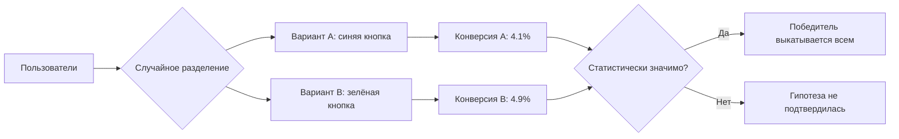

# Альфа-, бета- и A/B-тестирование

Три термина, которые постоянно спрашивают на собеседованиях на QA и постоянно
путают даже опытные кандидаты. Все три — про «проверку на живых людях», но
решают они разные задачи: **альфа** и **бета** — этапы тестирования продукта
перед релизом, а **A/B** — продуктовый эксперимент, который измеряет поведение
пользователей, а не ищет баги. Если уметь чётко развести их по полочкам,
половина вопроса «а чем вы занимались на проекте» уже снята.

## Альфа-тестирование

**Альфа-тестирование** — финальный этап внутренней проверки продукта, который
проводится **внутри компании** до того, как продукт увидит хоть один внешний
пользователь. Его выполняют сотрудники: QA-команда, разработчики, иногда —
внутренние «живые» пользователи из других отделов (dogfooding — компания сама
пользуется своим продуктом).

Ключевые признаки:

- проводится в контролируемом окружении — тестовый стенд или внутренняя среда,
  часто рядом с командой разработки;
- продукт ещё «сырой»: возможны нестабильность, незакрытые дефекты, недоделанные
  фичи;
- баги фиксируются быстро — тестировщик может прийти к разработчику и показать
  проблему прямо на машине;
- цель — поймать критические дефекты до того, как продукт покинет компанию.

**Ответ на собесе за 60 секунд:** «Альфа-тестирование — это внутреннее
тестирование перед выпуском наружу: его делают сотрудники компании (QA,
разработчики) в контролируемом окружении на ещё сырой версии продукта. Задача —
найти серьёзные баги до выхода к внешним пользователям».

## Бета-тестирование

**Бета-тестирование** — проверка продукта **реальными пользователями вне
компании** в их собственных окружениях: на их устройствах, их данных, их
сценариях использования. Оно идёт после успешной альфы и до общего релиза.

Ключевые признаки:

- исполнители — внешние пользователи: ограниченная группа приглашённых
  (closed beta) или все желающие (open beta);
- окружение неконтролируемое — реальные устройства, сети, локали, реальные
  данные;
- обратная связь собирается через краш-репорты, формы, аналитику, а не через
  прямой контакт с разработчиком;
- цель — проверить продукт «в дикой природе»: реальные сценарии, нагрузка,
  юзабилити, совместимость, — и собрать мнения пользователей до релиза.

Типичные примеры: beta-каналы в Google Play и TestFlight для iOS, «ранний
доступ» в Steam, предрелизные сборки игр и браузеров.

**Типовые follow-up вопросы:** «Чем closed beta отличается от open beta?»,
«Как собирать обратную связь от бета-пользователей?», «Что делать, если бета
показала критичный баг за день до релиза?»

## Альфа vs бета: различия в одну таблицу

| Критерий | Альфа | Бета |
|---|---|---|
| Кто тестирует | Сотрудники компании (QA, разработчики) | Реальные внешние пользователи |
| Где | Контролируемое окружение внутри компании | Реальные устройства и среды пользователей |
| Когда | Раньше, на сырой версии | Позже, на почти готовой версии |
| Обратная связь | Мгновенная, напрямую команде | Через репорты, формы, аналитику |
| Цель | Найти критические дефекты до выхода наружу | Проверка в реальных условиях + мнение пользователей |

**Ловушка:** кандидаты часто говорят «бета — это когда уже всё готово». Нет:
бета-версия тоже содержит баги, и это нормально — вопрос в том, что продукт
достаточно стабилен, чтобы не отравить впечатление внешним пользователям.

## A/B-тестирование

**A/B-тестирование** — это **не поиск багов**, а продуктовый эксперимент:
пользователей случайно делят на две (или больше) группы, каждой показывают
свой вариант интерфейса или фичи, и сравнивают метрики — какой вариант лучше
работает на целевое действие.

Классический пример из собеседований: влияние **цвета кнопки** на **конверсию
в покупку**. Группе A показывают синюю кнопку «Купить», группе B — зелёную.
Через достаточное число показов сравнивают конверсию: если у варианта B она
статистически значимо выше — зелёный вариант выкатывают всем.

Важные свойства:

- меняется **один фактор за раз** (иначе непонятно, что повлияло); для
  нескольких факторов сразу существует многовариантное (multivariate)
  тестирование;
- результат оценивают по метрикам: конверсия, CTR, retention, выручка;
- выводы делают только при статистической значимости — маленькая выборка
  ничего не доказывает;
- владельцы A/B-тестов — обычно продукт/маркетинг/аналитика; QA здесь скорее
  следит, чтобы сам эксперимент не сломал продукт (корректное разделение
  трафика, фича-флаги, откат).

**Ответ на собесе за 60 секунд:** «A/B-тестирование — это эксперимент, где
аудиторию случайно делят на группы и показывают разные варианты, чтобы по
метрикам выбрать лучший. Пример: меняем цвет кнопки "Купить" и смотрим, какой
вариант даёт большую конверсию в покупку. Это про продуктовые решения, а не
про поиск дефектов».

## Как не перепутать все три

- **Альфа и бета** — этапы жизненного цикла тестирования: ищут дефекты и
  проверяют готовность к релизу. Альфа — внутри компании, бета — снаружи.
- **A/B** — параллельно работающие варианты на живом продукте: выбирают, какой
  вариант лучше по метрикам. Баги тут ловят попутно, но это не цель.

Место этих практик в общем потоке релиза и их связь с другими этапами
тестирования подробнее разобраны в теме [Этапы тестирования и требования](topic:qa-testing-stages-requirements).
